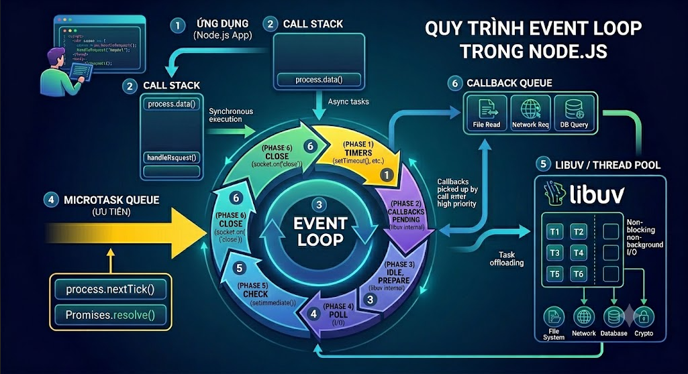

# 📘 Lesson 01 – Kiến thức nền cho NestJS RESTful API

> **Mục tiêu buổi học**
> Sau bài này, người học sẽ:
>
> * Hiểu **Backend là gì** và vai trò của Backend Developer
> * Hiểu **Node.js** hoạt động như thế nào (Event Loop, Non-blocking I/O)
> * Nắm vững **JavaScript ES6+** cần thiết cho NestJS
> * Nắm vững **TypeScript cơ bản** – ngôn ngữ chính của NestJS
> * Phân biệt **NPM, Yarn, PNPM** và biết cách dùng Package.json

---

## 1️⃣ Backend là gì?

### 1.1 Kiến trúc tổng thể của Web Application

Một ứng dụng web hiện đại gồm 3 tầng chính:

```
┌─────────────────┐        HTTP Request         ┌─────────────────┐
│    Frontend     │  ─────────────────────────► │    Backend      │
│  (Browser/App)  │ ◄─────────────────────────  │    (Server)     │
└─────────────────┘        HTTP Response         └────────┬────────┘
   HTML/CSS/JS                                            │
   React/Vue/Angular                                      │ SQL / ORM
                                                 ┌────────▼────────┐
                                                 │    Database     │
                                                 │ PostgreSQL/     │
                                                 │ MongoDB/Redis   │
                                                 └─────────────────┘
```

📌 **Frontend** (Client-side):
* Chạy trên trình duyệt hoặc mobile app
* Hiển thị giao diện cho người dùng
* Giao tiếp với Backend qua HTTP/API

📌 **Backend** (Server-side):
* Chạy trên server, **không hiển thị trực tiếp** với người dùng
* Xử lý toàn bộ business logic
* Kết nối và thao tác với database

📌 **Database**:
* Lưu trữ dữ liệu lâu dài
* Trả dữ liệu theo yêu cầu của Backend

---

### 1.2 Backend làm gì?

| Nhiệm vụ | Ví dụ cụ thể |
| -------- | ------------ |
| Nhận & xử lý request | `POST /auth/login` – kiểm tra thông tin đăng nhập |
| Business logic | Tính phí vận chuyển, kiểm tra tồn kho |
| Truy xuất database | Lấy danh sách sản phẩm từ PostgreSQL |
| Authentication | Tạo và xác thực JWT token |
| Authorization | Kiểm tra quyền truy cập dữ liệu |
| Trả response (JSON) | `{ "data": [...], "statusCode": 200 }` |

📌 **Ví dụ luồng đăng nhập:**

```
Client                    Backend                   Database
  │                          │                          │
  │  POST /auth/login        │                          │
  │  { email, password }     │                          │
  │─────────────────────────►│                          │
  │                          │  SELECT * FROM users     │
  │                          │  WHERE email = ?         │
  │                          │─────────────────────────►│
  │                          │◄─────────────────────────│
  │                          │  (user record)           │
  │                          │                          │
  │                          │  bcrypt.compare(pw)      │
  │                          │  → sign JWT token        │
  │◄─────────────────────────│                          │
  │  200 { accessToken }     │                          │
```

---

### 1.3 So sánh Frontend vs Backend

| Tiêu chí | Frontend | Backend |
| -------- | -------- | ------- |
| Chạy ở đâu | Trình duyệt | Server |
| Ngôn ngữ phổ biến | HTML/CSS/JS, React, Vue | Node.js, Java, Python, Go |
| Người dùng thấy được | ✅ | ❌ |
| Xử lý dữ liệu | Hiển thị | Lưu trữ, xử lý, bảo mật |
| Giao tiếp | Gọi API | Kết nối Database, Services |

---

### 1.4 Các thành phần của một Backend hiện đại

```
┌─────────────────────────────────────────────┐
│                  Backend Layer               │
│                                             │
│  ┌──────────┐  ┌──────────┐  ┌──────────┐  │
│  │  API     │  │  Auth    │  │  Queue   │  │
│  │ (NestJS) │  │  Server  │  │ (BullMQ) │  │
│  └──────────┘  └──────────┘  └──────────┘  │
│                                             │
│  ┌──────────┐  ┌──────────┐  ┌──────────┐  │
│  │ Database │  │  Cache   │  │  Storage │  │
│  │(Postgres)│  │  (Redis) │  │  (S3)    │  │
│  └──────────┘  └──────────┘  └──────────┘  │
└─────────────────────────────────────────────┘
```

---

### 1.5 Vai trò của Backend Developer

* Thiết kế và xây dựng **RESTful API**
* Thiết kế **schema database**, viết migrations
* Triển khai **Authentication & Authorization**
* Tối ưu **hiệu suất truy vấn** (indexing, caching)
* Đảm bảo **bảo mật** ứng dụng (validation, SQL injection prevention...)
* **Deploy** lên server/cloud (Docker, PM2, CI/CD)

👉 **NestJS là framework Node.js hiện đại, kiến trúc rõ ràng, được thiết kế cho backend production-ready**

---

## 2️⃣ Node.js là gì?

### 2.1 Khái niệm Node.js

**Node.js** là một **môi trường thực thi JavaScript phía server (Server-side JavaScript Runtime)**, được xây dựng trên **V8 JavaScript Engine** của Google Chrome.

📌 Trước khi Node.js ra đời:

* JavaScript **chỉ chạy trong trình duyệt**
* Backend thường dùng:

  * PHP
  * Java (Spring)
  * .NET
  * Python

📌 Node.js cho phép:

* Viết **backend bằng JavaScript**
* Xây dựng **server xử lý HTTP request**
* Giao tiếp database, file system, network

📌 Về mặt kiến trúc:

* Node.js **không phải là framework**
* Node.js là **runtime + API hệ thống**

👉 **NestJS là một framework chạy trên Node.js**


---

### 2.2 Node.js hoạt động như thế nào?


Nếu như các ứng dụng web truyền thống, các request tạo ra một luồng xử lý yêu cầu mới và chiếm RAM của hệ thống thì việc tài nguyên của hệ thống sẽ được sử dụng không hiệu quả. Chính vì lẽ đó giải pháp mà Node js đưa ra là sử dụng luồng đơn (Single-Threaded), kết hợp với non-blocking I/O để thực thi các request, cho phép hỗ trợ hàng chục ngàn kết nối đồng thời.


---

### 2.3 Kiến trúc Event Loop 

#### 2.3.1 Vấn đề của mô hình truyền thống (Thread-per-request)

Trong các backend truyền thống:

* Mỗi request → tạo một thread
* Thread xử lý toàn bộ logic
* Khi số lượng request tăng:

  * Tốn RAM
  * Tốn CPU context switching
  * Dễ quá tải

📌 Đây là vấn đề lớn với hệ thống:

* Chat
* API nhiều client
* Real-time

---

#### 2.3.2 Mô hình Event Loop của Node.js

Node.js sử dụng mô hình:

> **Single-threaded + Event Loop + Asynchronous I/O**

📌 Thành phần chính:

* Call Stack
* Event Loop
* Callback Queue
* Background Thread Pool (libuv)

📊 Luồng hoạt động:

1. JavaScript chạy trên **1 thread chính**
2. Gặp tác vụ I/O (DB, file, HTTP):

   * Gửi sang background
3. Khi tác vụ hoàn tất:

   * Callback được đưa vào queue
4. Event Loop kiểm tra:

   * Call Stack rỗng → lấy callback xử lý


📌 Ý nghĩa:

* **Không block server**
* Xử lý hàng nghìn request đồng thời
* Hiệu quả với I/O-bound task




**Giải thích:**

Quy trình hoạt động của Event Loop trong Node.js được diễn ra tuần tự theo các bước cực kỳ logic như sau:

---

##### 1. Khởi chạy Ứng dụng (1 - Application)

Mã nguồn JavaScript của bạn bắt đầu được nạp và chạy. Luồng chính (Main Thread) sẽ quét qua các dòng code từ trên xuống dưới.

##### 2. Thực thi đồng bộ tại Call Stack (2)

Các hàm đồng bộ (Synchronous) được đưa vào **Call Stack** để thực thi ngay lập tức theo cơ chế cái nào vào sau thì ra trước.

* Nếu gặp tác vụ nhẹ, nó xử lý xong và xóa khỏi Stack.
* Nếu gặp các tác vụ bất đồng bộ nặng (như đọc file, gọi API, truy vấn DB), Node.js sẽ **giao việc (Task offloading)** xuống tầng dưới và không bắt luồng chính phải đợi.

##### 3. Trái tim điều phối: Event Loop (3)

**Event Loop** chính là chiếc vòng xoay trung tâm quản lý toàn bộ vòng đời của các tác vụ bất đồng bộ. Nó chạy liên tục qua 6 pha (Phase) ổn định được đánh số từ **1 đến 6 màu vàng/trắng bên trong vòng tròn**:

* **Phase 1 (Timers):** Chạy các hàm hẹn giờ như `setTimeout()` và `setInterval()`.
* **Phase 2 & 3 (Pending, Idle/Prepare):** Các pha xử lý nội bộ của thư viện Libuv.
* **Phase 4 (Poll):** Pha quan trọng nhất, nơi đón nhận các sự kiện I/O mới từ hệ thống.
* **Phase 5 (Check):** Chạy các hàm cài đặt bởi `setImmediate()`.
* **Phase 6 (Close):** Xử lý dọn dẹp các kết nối bị đóng (như tắt kết nối mạng).

##### 4. Kiểm tra hàng đợi ưu tiên (4 - Microtask Queue)

Đây là "làn đường ưu tiên đặc biệt". Bất cứ khi nào **Call Stack (2)** trống, hoặc **Event Loop (3)** chuẩn bị chuyển từ pha này sang pha khác, Node.js sẽ ngay lập tức check **Microtask Queue**.

* Toàn bộ các callback nằm trong `process.nextTick()` và `Promises.resolve()` tại đây sẽ được "vét" sạch và đẩy lên Call Stack để chạy trước, chặn đầu tất cả các hàng đợi khác.

##### 5. Xử lý đa luồng ngầm tại Libuv / Thread Pool (5)

Các tác vụ bất đồng bộ nặng sau khi bị đẩy xuống từ bước 2 sẽ được hệ thống đa luồng của **Libuv** (gồm các Thread từ T1 đến T6) xử lý ngầm ở phần cứng (như đọc ổ đĩa, kết nối Internet, truy cập Database, xử lý mã hóa Crypto). Điều này giúp luồng chính của Node.js không bao giờ bị nghẽn (Non-blocking I/O).

##### 6. Xếp hàng chờ thực thi (6 - Callback Queue)

Sau khi các luồng ở **Thread Pool (5)** hoàn thành xong nhiệm vụ (ví dụ: đã đọc xong file), kết quả và hàm phản hồi (Callback) của chúng sẽ được đẩy vào **Callback Queue** để xếp hàng.

Khi **Event Loop (3)** quay đến pha tương ứng (ví dụ: Phase 4 Poll), nó sẽ nhặt các callback đang nằm chờ ở Callback Queue này, kiểm tra xem Call Stack có trống không, rồi đẩy ngược lên **Call Stack (2)** để luồng chính thực thi nốt đoạn code xử lý kết quả cho người dùng.

---

#### 2.3.3 Code ví dụ về Event Loop

```js
const fs = require('fs');

console.log('--- 1. START (Call Stack chạy đồng bộ) ---');

// 1. Timers Phase (Phase 1 của Event Loop)
setTimeout(() => {
    console.log('--- 6. setTimeout 0ms (Event Loop - Phase 1: Timers) ---');
}, 0);

// 2. Check Phase (Phase 5 của Event Loop)
setImmediate(() => {
    console.log('--- 7. setImmediate (Event Loop - Phase 5: Check) ---');
});

// 3. Microtask Queue (Ưu tiên cao - Chạy ngay khi Call Stack trống)
Promise.resolve().then(() => {
    console.log('--- 4. Promise.resolve (Microtask Queue) ---');
});

process.nextTick(() => {
    console.log('--- 3. process.nextTick (Microtask Queue - Ưu tiên tuyệt đối) ---');
});

// 4. I/O Polling (Phase 4) & Thread Pool (Thành phần số 5 & 6)
// Đọc file thử nghiệm (tác vụ bất đồng bộ nặng)
fs.readFile(__filename, () => {
    console.log('\n--- Đang ở trong I/O Callback (Phase 4: Poll) ---');
    
    // Khi đang ở trong Pha Poll, nếu ta đăng ký tiếp setTimeout và setImmediate:
    setTimeout(() => {
        console.log('--- 9. setTimeout bên trong I/O (Chờ đến vòng lặp sau) ---');
    }, 0);

    setImmediate(() => {
        console.log('--- 8. setImmediate bên trong I/O (Chạy ngay ở Phase 5 tiếp theo) ---');
    });
});

console.log('--- 2. END (Call Stack chạy đồng bộ xong) ---');

```

Khi bạn chạy đoạn code trên, kết quả trả về sẽ luôn tuân theo quy trình tuần tự của sơ đồ:

```
--- 1. START (Call Stack chạy đồng bộ) ---
--- 2. END (Call Stack chạy đồng bộ xong) ---
--- 3. process.nextTick (Microtask Queue - Ưu tiên tuyệt đối) ---
--- 4. Promise.resolve (Microtask Queue) ---
--- 6. setTimeout 0ms (Event Loop - Phase 1: Timers) ---
--- 7. setImmediate (Event Loop - Phase 5: Check) ---

--- Đang ở trong I/O Callback (Phase 4: Poll) ---
--- 8. setImmediate bên trong I/O (Chạy ngay ở Phase 5 tiếp theo) ---
--- 9. setTimeout bên trong I/O (Chờ đến vòng lặp sau) ---
```

Dưới đây là ví dụ mã nguồn mô tả đầy đủ cách các thành phần trong sơ đồ trên (Call Stack, Microtask Queue, Event Loop các Phase) tranh chấp thứ tự thực thi với nhau.

Bạn có thể chạy đoạn code này bằng Node.js để thấy trực tiếp kết quả:

```javascript
const fs = require('fs');

console.log('--- 1. START (Call Stack chạy đồng bộ) ---');

// 1. Timers Phase (Phase 1 của Event Loop)
setTimeout(() => {
    console.log('--- 6. setTimeout 0ms (Event Loop - Phase 1: Timers) ---');
}, 0);

// 2. Check Phase (Phase 5 của Event Loop)
setImmediate(() => {
    console.log('--- 7. setImmediate (Event Loop - Phase 5: Check) ---');
});

// 3. Microtask Queue (Ưu tiên cao - Chạy ngay khi Call Stack trống)
Promise.resolve().then(() => {
    console.log('--- 4. Promise.resolve (Microtask Queue) ---');
});

process.nextTick(() => {
    console.log('--- 3. process.nextTick (Microtask Queue - Ưu tiên tuyệt đối) ---');
});

// 4. I/O Polling (Phase 4) & Thread Pool (Thành phần số 5 & 6)
// Đọc file thử nghiệm (tác vụ bất đồng bộ nặng)
fs.readFile(__filename, () => {
    console.log('\n--- Đang ở trong I/O Callback (Phase 4: Poll) ---');
    
    // Khi đang ở trong Pha Poll, nếu ta đăng ký tiếp setTimeout và setImmediate:
    setTimeout(() => {
        console.log('--- 9. setTimeout bên trong I/O (Chờ đến vòng lặp sau) ---');
    }, 0);

    setImmediate(() => {
        console.log('--- 8. setImmediate bên trong I/O (Chạy ngay ở Phase 5 tiếp theo) ---');
    });
});

console.log('--- 2. END (Call Stack chạy đồng bộ xong) ---');

```

---

## Giải thích thứ tự in ra màn hình (Kết quả thực tế)

Khi bạn chạy đoạn code trên, kết quả trả về sẽ luôn tuân theo quy trình tuần tự của sơ đồ:

```text
--- 1. START (Call Stack chạy đồng bộ) ---
--- 2. END (Call Stack chạy đồng bộ xong) ---
--- 3. process.nextTick (Microtask Queue - Ưu tiên tuyệt đối) ---
--- 4. Promise.resolve (Microtask Queue) ---
--- 6. setTimeout 0ms (Event Loop - Phase 1: Timers) ---
--- 7. setImmediate (Event Loop - Phase 5: Check) ---

--- Đang ở trong I/O Callback (Phase 4: Poll) ---
--- 8. setImmediate bên trong I/O (Chạy ngay ở Phase 5 tiếp theo) ---
--- 9. setTimeout bên trong I/O (Chờ đến vòng lặp sau) ---

```

---

 Phân tích 3 trường hợp thực thi cụ thể trong Code:

**Trường hợp 1: Đồng bộ (Call Stack) luôn đi trước**

* `START` và `END` được in ra đầu tiên. Lý do: Chúng là mã nguồn đồng bộ thuần túy, được nạp thẳng vào **Call Stack (2)** và chạy ngay lập tức, không cần đợi Event Loop.

**Trường hợp 2: Cuộc chiến ở Làn đường ưu tiên (Microtask Queue)**

* Sau khi `END` in xong (tức là Call Stack trống), Node.js chưa thèm ngó tới Event Loop ngay mà sẽ "vét" sạch **Microtask Queue (4)**.
* Trong Microtask, `process.nextTick()` có đặc quyền tối cao, luôn được ưu tiên chạy trước cả `Promise.resolve()`. Vì vậy số 3 in ra trước số 4.

**Trường hợp 3: Sự khác biệt giữa `setTimeout` và `setImmediate`**

* **Ở luồng ngoài cùng:** `setTimeout(0ms)` và `setImmediate()` có thứ tự chạy phụ thuộc vào hiệu năng máy tại thời điểm đó (đôi khi setTimeout chạy trước, đôi khi ngược lại).
* **Ở BÊN TRONG một I/O Callback (`fs.readFile`):** * Lúc này Event Loop đang dừng ở **Phase 4 (Poll)** để xử lý hàm đọc file.
* Ngay sau Phase 4 sẽ là **Phase 5 (Check)**. Do `setImmediate()` đăng ký callback cho Phase 5, nên nó sẽ **chạy ngay lập tức** sau khi hàm đọc file kết thúc.
* Trong khi đó, `setTimeout()` phải đợi Event Loop quay hết một vòng, trở lại **Phase 1 (Timers)** ở vòng lặp (Tick) tiếp theo mới được thực thi. Vì vậy, số 8 luôn luôn in trước số 9.

---

### 2.3 Event-driven Programming

**Event-driven** là mô hình lập trình trong đó:

> Chương trình phản ứng lại các **sự kiện (event)** thay vì chạy tuần tự từ trên xuống.

📌 Ví dụ các event:

* HTTP request đến server
* Database query hoàn tất
* File được đọc xong
* User gửi message

📌 Trong Node.js:

* Mọi thứ đều là event
* HTTP server = event listener

```js
server.on('request', (req, res) => {
  res.end('Hello');
});
```

📌 Khi:

* Client gửi request
* Event `request` được phát
* Callback được gọi

👉 NestJS **xây dựng toàn bộ framework xoay quanh event-driven**

---

### 2.4 Non-blocking I/O

#### 2.4.1 Blocking I/O là gì?

Blocking I/O là khi:

* Một tác vụ I/O **chặn luồng xử lý chính**
* Các request khác **phải chờ**

📌 Ví dụ:

```ts
const fs = require("fs");

console.log("Start");

const data = fs.readFileSync("file.txt", "utf8"); // Blocking - Node.js phải chờ file đọc xong.
console.log(data); // Chỉ thực hiện sau khi đọc file xong.

console.log("End");
```

**Kết quả:**

```
Start
<nội dung file.txt>
End
```

**Giải thích**: Trong ví dụ này, `fs.readFileSync` là một tác vụ **blocking**. Node.js sẽ phải đợi file được đọc xong trước khi tiếp tục chạy các dòng mã sau đó. Do đó, `console.log('End')` chỉ được in ra sau khi file đã được đọc.


---

#### 2.4.2 Non-blocking I/O là gì?

Non-blocking I/O cho phép:

* Gửi tác vụ I/O đi xử lý
* Tiếp tục xử lý request khác

```ts
const fs = require("fs");

console.log("Start");

fs.readFile("file.txt", "utf8", (err, data) => {
  if (err) throw err;
  console.log(data); // Chỉ in ra sau khi file đọc xong (callback).
});

console.log("End");
```


**Kết quả:**

```
Start
End
<nội dung file.txt>
```

**Giải thích**: Ở đây, `fs.readFile` là một tác vụ **non-blocking**. Node.js không đợi file được đọc xong để chạy `console.log('End')`. Thay vào đó, nó tiếp tục thực thi mã, và sau khi file được đọc xong, callback sẽ được gọi để in nội dung file ra. Do đó, bạn thấy `End` được in trước khi nội dung file xuất hiện.


📌 Node.js được thiết kế **non-blocking từ gốc**

👉 Đây là lý do Node.js phù hợp để làm API

---

🔶 Sự khác biệt chính giữa Blocking và Non-blocking

- **Blocking**: Node.js **đợi** tác vụ hoàn thành trước khi xử lý tiếp. Điều này làm gián đoạn event loop và chặn các tác vụ khác.
  - Ví dụ: `fs.readFileSync`, `http.requestSync`.
- **Non-blocking**: Node.js **không đợi** mà tiếp tục xử lý các tác vụ khác. Sau khi tác vụ hoàn thành, nó sẽ thực thi một callback.
  - Ví dụ: `fs.readFile`, `http.request`.

---

### 2.5 Ưu điểm và nhược điểm của Node.js 

#### ✅ Ưu điểm

* Hiệu suất cao với I/O
* Một ngôn ngữ cho cả frontend & backend
* Ecosystem npm rất lớn
* Phù hợp REST API, Microservices

#### ❌ Nhược điểm

* Không phù hợp cho CPU-bound task (AI, xử lý ảnh nặng)
* Dễ viết code khó bảo trì nếu không có structure
* Cần framework (NestJS) để tổ chức tốt

👉 **NestJS ra đời để giải quyết nhược điểm này**

---

### 2.6 Built-in Modules trong Node.js

Node.js cung cấp sẵn **API truy cập hệ thống**:

| Module   | Vai trò                |
| -------- | ---------------------- |
| `http`   | Tạo HTTP server        |
| `fs`     | Đọc/ghi file           |
| `path`   | Xử lý đường dẫn        |
| `events` | Hệ thống event         |
| `crypto` | Hash, mã hóa           |
| `os`     | Thông tin hệ điều hành |

👉 NestJS **bọc lại** những API này theo hướng OOP

---

## 3️⃣ JavaScript ES6+ 

Xem thêm tại đây: https://www.w3schools.com/nodejs/nodejs_es6.asp

### 3.1 `let` và `const` – Quản lý scope

📌 ES6 giới thiệu **block scope**

* `var`: function scope (dễ bug)
* `let`, `const`: block scope

```ts
if (true) {
  let x = 10;
}
// x không tồn tại ở đây
```

👉 Giúp code an toàn, dễ dự đoán

---

### 3.2 Arrow Function & Lexical `this`

Arrow function:

* Không có `this` riêng
* Kế thừa `this` từ scope cha

```ts
const fn = () => {
  console.log(this);
};
```

👉 Quan trọng khi dùng callback, decorator trong NestJS

---

### 3.3 Destructuring Assignment

Destructuring giúp:

* Truy cập dữ liệu ngắn gọn
* Tăng tính rõ ràng

```ts
const { body } = req;
```

👉 NestJS dùng rất nhiều khi làm controller

---

### 3.4 Spread & Rest Operator

📌 Spread (`...`):

```ts
// Clone object
const userCopy = { ...user };

// Merge objects
const merged = { ...defaults, ...overrides };
```

📌 Rest (`...`):

```ts
// Gom nhiều tham số
function log(first: string, ...rest: string[]) {
  console.log(first, rest);
}
```

👉 Quan trọng khi xử lý DTO, payload trong NestJS

---

### 3.5 Template Literals

Template literals cho phép nhúng biểu thức vào chuỗi với cú pháp rõ ràng hơn.

```ts
const name = 'Tomy';
const age = 25;

// Cách cũ (string concatenation)
const msg1 = 'Hello ' + name + ', age: ' + age;

// Template literals (ES6+)
const msg2 = `Hello ${name}, age: ${age}`;
```

📌 Hỗ trợ **multiline string**:

```ts
const query = `
  SELECT *
  FROM users
  WHERE id = ${userId}
`;
```

👉 Dùng nhiều khi tạo SQL query, log message, email template trong NestJS

---

### 3.6 Promise & Async/Await

Đây là kiến thức **quan trọng nhất** khi làm việc với NestJS, vì hầu hết các tác vụ (database, HTTP, file I/O) đều **bất đồng bộ**.

#### 3.6.1 Promise là gì?

Promise đại diện cho một **giá trị chưa có ngay** – sẽ có sau khi tác vụ bất đồng bộ hoàn thành.

```ts
// Trạng thái của Promise
// pending  → đang xử lý
// fulfilled → thành công (resolve)
// rejected  → thất bại (reject)

function fetchUser(id: number): Promise<User> {
  return new Promise((resolve, reject) => {
    db.query('SELECT * FROM users WHERE id = ?', [id], (err, result) => {
      if (err) reject(err);
      else resolve(result[0]);
    });
  });
}
```

#### 3.6.2 Async/Await

`async/await` là cú pháp giúp viết code bất đồng bộ **như đồng bộ**, dễ đọc hơn Promise chain.

```ts
// ❌ Callback hell (khó đọc)
getUser(id, (user) => {
  getOrders(user.id, (orders) => {
    sendEmail(user.email, orders, () => {
      console.log('Done');
    });
  });
});

// ✅ Async/Await (dễ đọc)
async function processUser(id: number) {
  const user = await getUser(id);
  const orders = await getOrders(user.id);
  await sendEmail(user.email, orders);
  console.log('Done');
}
```

📌 **Xử lý lỗi với try/catch:**

```ts
async function createBook(dto: CreateBookDto) {
  try {
    const book = await this.bookRepository.save(dto);
    return book;
  } catch (error) {
    throw new InternalServerErrorException('Lưu dữ liệu thất bại');
  }
}
```

👉 **Toàn bộ Service trong NestJS đều dùng async/await** khi thao tác database

---

### 3.7 Optional Chaining & Nullish Coalescing

#### 3.7.1 Optional Chaining (`?.`)

Truy cập property an toàn – **không bị lỗi** nếu object là `null` hoặc `undefined`.

```ts
// ❌ Dễ bị lỗi TypeError
const city = user.address.city;

// ✅ An toàn
const city = user?.address?.city;
// Nếu address là null/undefined → trả về undefined (không throw lỗi)
```

#### 3.7.2 Nullish Coalescing (`??`)

Trả về giá trị mặc định khi giá trị là `null` hoặc `undefined` (khác với `||` – không bị ảnh hưởng bởi `0` hay `''`).

```ts
const limit = query.limit ?? 10;  // Nếu limit là null/undefined → dùng 10
const name = user.name ?? 'Anonymous';
```

📌 So sánh:

```ts
const a = 0 || 'default';   // → 'default' (0 bị coi là falsy)
const b = 0 ?? 'default';   // → 0         (chỉ null/undefined mới dùng default)
```

👉 Thường dùng trong NestJS khi đọc config, query params, optional DTO fields

---

### 3.8 Array Methods (map, filter, reduce)

Các phương thức array là nền tảng xử lý dữ liệu trong backend.

```ts
const users = [
  { id: 1, name: 'Alice', age: 25, active: true },
  { id: 2, name: 'Bob',   age: 17, active: false },
  { id: 3, name: 'Carol', age: 30, active: true },
];

// map: chuyển đổi từng phần tử → trả về array mới
const names = users.map(u => u.name);
// → ['Alice', 'Bob', 'Carol']

// filter: lọc phần tử thỏa điều kiện
const adults = users.filter(u => u.age >= 18 && u.active);
// → [{ id: 1, ... }, { id: 3, ... }]

// reduce: gộp array thành một giá trị duy nhất
const totalAge = users.reduce((sum, u) => sum + u.age, 0);
// → 72
```

👉 Dùng nhiều khi transform dữ liệu từ database trước khi trả về response

---


## 5️⃣ NPM vs Yarn vs PNPM

### 5.1 Package Manager là gì?

**Package Manager** là công cụ giúp:

* **Cài đặt** thư viện bên ngoài (dependencies)
* **Quản lý phiên bản** thư viện
* **Chạy scripts** (build, test, dev server)
* **Khóa phiên bản** với lockfile

📌 Khi tạo một dự án NestJS:

```bash
pnpm install @nestjs/core @nestjs/common
```

→ Package manager sẽ:
1. Tải package từ npmjs.com
2. Lưu vào `node_modules/`
3. Ghi lại vào `package.json` và lockfile

---

### 5.2 So sánh NPM vs Yarn vs PNPM

| Tiêu chí | NPM | Yarn | PNPM |
| -------- | --- | ---- | ---- |
| Phát triển bởi | Node.js team | Meta (Facebook) | Community |
| Tốc độ cài đặt | Trung bình | Nhanh | **Nhanh nhất** |
| Dung lượng disk | Nhiều | Nhiều | **Ít nhất** (dùng hard links) |
| Lockfile | `package-lock.json` | `yarn.lock` | `pnpm-lock.yaml` |
| Cài kèm Node.js | ✅ | ❌ | ❌ |
| Strict dependencies | ❌ | ❌ | ✅ |

📌 **PNPM tiết kiệm disk như thế nào?**

* NPM/Yarn: mỗi project có bản copy riêng của package trong `node_modules`
* PNPM: tất cả package được lưu **một lần** trong global store, các project dùng **hard link** → tiết kiệm GB dung lượng

---

### 5.3 Lệnh cơ bản

| Tác vụ | NPM | Yarn | PNPM |
| ------ | --- | ---- | ---- |
| Cài đặt tất cả | `npm install` | `yarn` | `pnpm install` |
| Thêm package | `npm install pkg` | `yarn add pkg` | `pnpm add pkg` |
| Thêm devDependency | `npm install -D pkg` | `yarn add -D pkg` | `pnpm add -D pkg` |
| Xóa package | `npm uninstall pkg` | `yarn remove pkg` | `pnpm remove pkg` |
| Chạy script | `npm run dev` | `yarn dev` | `pnpm dev` |
| Xem outdated | `npm outdated` | `yarn outdated` | `pnpm outdated` |

---

### 5.4 Cài đặt PNPM

```bash
# Cài PNPM qua npm
npm install -g pnpm

# Kiểm tra phiên bản
pnpm --version
```

👉 **Khóa học này dùng PNPM** – tất cả dự án NestJS sẽ được khởi tạo bằng PNPM

---

## 6️⃣ Package.json & Dependency Management

### 6.1 Package.json là gì?

`package.json` là **file định nghĩa dự án Node.js**. Nó chứa:

* Metadata của dự án (name, version, description)
* Danh sách **dependencies**
* Các **scripts** để chạy dự án
* Cấu hình engine (yêu cầu Node.js version)

📌 **Ví dụ package.json của một dự án NestJS:**

```json
{
  "name": "my-nestjs-api",
  "version": "1.0.0",
  "description": "RESTful API với NestJS",
  "scripts": {
    "start":       "node dist/main",
    "start:dev":   "nest start --watch",
    "start:prod":  "node dist/main",
    "build":       "nest build",
    "test":        "jest",
    "test:e2e":    "jest --config ./test/jest-e2e.json",
    "lint":        "eslint \"{src,apps,libs,test}/**/*.ts\""
  },
  "dependencies": {
    "@nestjs/common":   "^10.0.0",
    "@nestjs/core":     "^10.0.0",
    "@nestjs/platform-express": "^10.0.0",
    "reflect-metadata": "^0.1.13",
    "rxjs":             "^7.8.0"
  },
  "devDependencies": {
    "@nestjs/cli":      "^10.0.0",
    "@nestjs/testing":  "^10.0.0",
    "@types/node":      "^20.0.0",
    "typescript":       "^5.0.0",
    "jest":             "^29.0.0"
  },
  "engines": {
    "node": ">=18.0.0"
  }
}
```

---

### 6.2 dependencies vs devDependencies

| | `dependencies` | `devDependencies` |
|-|---------------|-------------------|
| Là gì | Package cần khi **chạy production** | Package chỉ cần khi **phát triển** |
| Ví dụ | `@nestjs/core`, `typeorm`, `bcrypt` | `jest`, `eslint`, `typescript`, `@types/*` |
| Khi `npm install --production` | ✅ Được cài | ❌ Bị bỏ qua |

📌 **Quy tắc:**
* Thư viện runtime → `dependencies`
* Tool build, test, lint → `devDependencies`

---

### 6.3 Semantic Versioning (SemVer)

Phiên bản package theo format: **`MAJOR.MINOR.PATCH`**

| Phần | Ý nghĩa | Ví dụ |
| ---- | ------- | ----- |
| MAJOR | Breaking changes – không tương thích | `10.0.0 → 11.0.0` |
| MINOR | Tính năng mới – tương thích ngược | `10.0.0 → 10.1.0` |
| PATCH | Bug fixes – tương thích ngược | `10.0.0 → 10.0.1` |

📌 **Ký hiệu version range:**

```
"@nestjs/core": "^10.3.0"   // Caret: >=10.3.0 <11.0.0  (tương thích minor/patch)
"rxjs":         "~7.8.1"    // Tilde: >=7.8.1 <7.9.0    (chỉ tương thích patch)
"typescript":   "5.3.2"      // Chính xác version này
```

---

### 6.4 Lockfile – Tại sao quan trọng?

Lockfile ghi lại **chính xác phiên bản** của mọi package (kể cả dependencies của dependencies).

📌 **Tại sao cần lockfile?**

Không có lockfile:
* Dev A chạy `pnpm install` → cài `express@4.18.0`
* Dev B chạy `pnpm install` 2 tuần sau → cài `express@4.18.2`
* → **Khác nhau!** Có thể gây bug môi trường

Có lockfile (`pnpm-lock.yaml`):
* Mọi người cài **đúng cùng phiên bản** → consistent environment

👉 **Luôn commit lockfile vào git** – không thêm vào `.gitignore`

