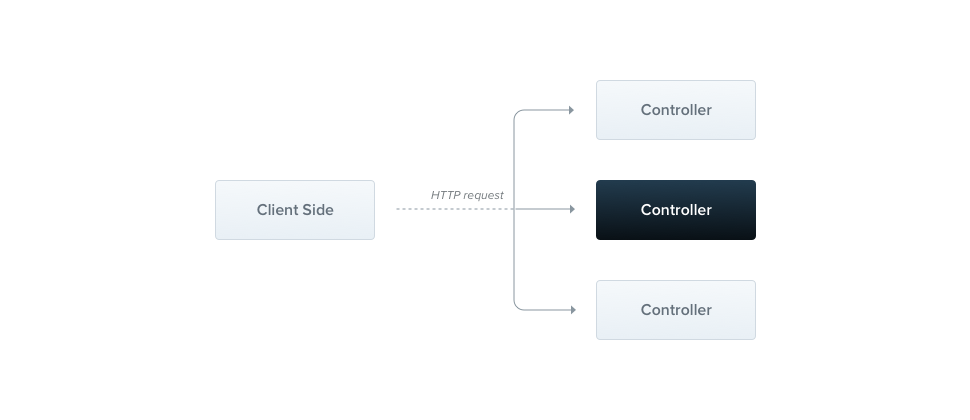

# Lesson 03 - Tạo một RESTful API với NestJS

> Mục tiêu bài học:
>
> - Hiểu khái niệm RESTful API và các nguyên tắc thiết kế
> - Tạo một RESTful API đơn giản với NestJS
> - Sử dụng Modules, Controllers, Services trong NestJS
> - Quản lý phiên bản API (API Versioning)

## 1. Giới thiệu về RESTful API

### 1.1 REST là gì?

**REST** (Representational State Transfer) là một phong cách kiến trúc phần mềm cho việc thiết kế các dịch vụ web. REST không phải là một giao thức hay tiêu chuẩn, mà là một tập hợp các nguyên tắc thiết kế.

**RESTful API** là một API được thiết kế theo các nguyên tắc của REST, cho phép các ứng dụng client giao tiếp với server thông qua giao thức HTTP.

**Ví dụ thực tế:**
Hãy tưởng tượng bạn đang xây dựng một ứng dụng quản lý thư viện sách:

- Bạn muốn xem danh sách sách → Gọi API GET `/books`
- Bạn muốn thêm sách mới → Gọi API POST `/books`
- Bạn muốn xem chi tiết một cuốn sách → Gọi API GET `/books/1`
- Bạn muốn cập nhật thông tin sách → Gọi API PUT `/books/1`
- Bạn muốn xóa sách → Gọi API DELETE `/books/1`

### 1.2 Nguyên tắc thiết kế RESTful API

#### Nguyên tắc 1: Client-Server Architecture

Client và Server tách biệt hoàn toàn, giao tiếp qua HTTP.

```
Client (React, Angular, Mobile App) ←→ Server (NestJS API)
```

#### Nguyên tắc 2: Stateless (Không lưu trạng thái)

Mỗi request từ client phải chứa đầy đủ thông tin cần thiết. Server không lưu trữ context của client giữa các request.

**Ví dụ:**

```typescript
// ❌ SAI - Server lưu trạng thái
GET /next-page  // Server phải nhớ user đang ở trang nào

// ✅ ĐÚNG - Client gửi đầy đủ thông tin
GET /books?page=2&limit=10  // Mỗi request độc lập
```

#### Nguyên tắc 3: Cacheable

Response có thể được cache để cải thiện hiệu năng.

#### Nguyên tắc 4: Uniform Interface

Giao diện thống nhất, dễ hiểu và dự đoán.

#### Nguyên tắc 5: Layered System

Hệ thống có thể có nhiều tầng (load balancer, cache, API gateway...).

### 1.3 HTTP Methods

| Method | Mục đích | Ví dụ |
|--------|----------|-------|
| **GET** | Lấy dữ liệu (Read) | `GET /users` - Lấy danh sách users |
| **POST** | Tạo mới (Create) | `POST /users` - Tạo user mới |
| **PUT** | Cập nhật toàn bộ (Update) | `PUT /users/1` - Cập nhật user có id=1 |
| **PATCH** | Cập nhật một phần | `PATCH /users/1` - Cập nhật một số field |
| **DELETE** | Xóa (Delete) | `DELETE /users/1` - Xóa user có id=1 |

**Ví dụ chi tiết:**

```typescript
// GET - Lấy dữ liệu (không thay đổi dữ liệu trên server)
GET /api/products          // Lấy tất cả sản phẩm
GET /api/products/5        // Lấy sản phẩm có id = 5
GET /api/products?category=laptop&price_max=1000

// POST - Tạo mới (gửi dữ liệu trong body)
POST /api/products
Body: {
  "name": "Laptop Dell XPS 13",
  "price": 25000000,
  "category": "laptop"
}

// PUT - Cập nhật toàn bộ
PUT /api/products/5
Body: {
  "name": "Laptop Dell XPS 13 Updated",
  "price": 24000000,
  "category": "laptop",
  "description": "Mô tả mới"
}

// PATCH - Cập nhật một phần
PATCH /api/products/5
Body: {
  "price": 23000000  // Chỉ cập nhật giá
}

// DELETE - Xóa
DELETE /api/products/5
```

### 1.4 Status Codes phổ biến

#### 2xx - Success (Thành công)

- **200 OK**: Request thành công
- **201 Created**: Tạo mới thành công (dùng cho POST)
- **204 No Content**: Thành công nhưng không trả về dữ liệu (dùng cho DELETE)

#### 4xx - Client Error (Lỗi từ phía client)

- **400 Bad Request**: Dữ liệu gửi lên không hợp lệ
- **401 Unauthorized**: Chưa đăng nhập
- **403 Forbidden**: Không có quyền truy cập
- **404 Not Found**: Không tìm thấy resource

#### 5xx - Server Error (Lỗi từ phía server)

- **500 Internal Server Error**: Lỗi server
- **503 Service Unavailable**: Server tạm thời không khả dụng

**Ví dụ thực tế:**

```typescript
// Tạo sản phẩm thành công → 201 Created
POST /api/products
Response: 201 Created
{
  "id": 10,
  "name": "Laptop",
  "price": 25000000
}

// Lấy sản phẩm không tồn tại → 404 Not Found
GET /api/products/999
Response: 404 Not Found
{
  "message": "Product not found"
}

// Gửi dữ liệu không hợp lệ → 400 Bad Request
POST /api/products
Body: { "name": "" }  // Tên rỗng
Response: 400 Bad Request
{
  "message": "Name is required"
}
```

### 1.5 Resource-based URL

URL nên đại diện cho **danh từ (resource)**, không phải động từ (action).

```typescript
// ✅ ĐÚNG - Sử dụng danh từ
GET    /api/books           // Lấy danh sách sách
POST   /api/books           // Tạo sách mới
GET    /api/books/1         // Lấy sách có id=1
PUT    /api/books/1         // Cập nhật sách có id=1
DELETE /api/books/1         // Xóa sách có id=1

// ❌ SAI - Sử dụng động từ
GET    /api/getAllBooks
POST   /api/createBook
GET    /api/getBookById/1
POST   /api/updateBook/1
POST   /api/deleteBook/1
```

**Quy tắc đặt tên URL:**

1. Sử dụng danh từ số nhiều: `/users`, `/products`
2. Sử dụng dấu gạch ngang (-) thay vì dấu gạch dưới (_): `/product-categories`
3. Viết thường: `/users` không phải `/Users`
4. Không kết thúc bằng dấu `/`: `/users` không phải `/users/`

---

## 2. Modules và Mục đích sử dụng

### 2.1 Module là gì?

**Module** trong NestJS là một class được đánh dấu bằng decorator `@Module()`. Module giúp tổ chức code thành các khối chức năng liên quan, dễ quản lý và tái sử dụng.

**Ví dụ thực tế:**
Trong ứng dụng quản lý thư viện, bạn có thể có:

- `BooksModule` - Quản lý sách
- `UsersModule` - Quản lý người dùng
- `AuthModule` - Xác thực
- `OrdersModule` - Quản lý đơn mượn/trả sách

### 2.2 Root Module vs Feature Module

#### Root Module (App Module)

Module gốc của ứng dụng, nơi import tất cả các module khác.

```typescript
// src/app.module.ts
import { Module } from '@nestjs/common';
import { BooksModule } from './books/books.module';
import { UsersModule } from './users/users.module';
import { AuthModule } from './auth/auth.module';

@Module({
  imports: [
    BooksModule,    // Import feature modules
    UsersModule,
    AuthModule,
  ],
})
export class AppModule {}
```

#### Feature Module

Module chức năng, tập trung vào một domain cụ thể.

```typescript
// src/books/books.module.ts
import { Module } from '@nestjs/common';
import { BooksController } from './books.controller';
import { BooksService } from './books.service';

@Module({
  controllers: [BooksController],
  providers: [BooksService],
  exports: [BooksService],  // Cho phép module khác sử dụng
})
export class BooksModule {}
```

### 2.3 @Module Decorator

Decorator `@Module()` nhận một object với các thuộc tính:

```typescript
@Module({
  imports: [],      // Các module khác mà module này cần
  controllers: [],  // Các controller của module
  providers: [],    // Các service/provider của module
  exports: [],      // Các provider muốn chia sẻ với module khác
})
```

**Ví dụ chi tiết:**

```typescript
// src/books/books.module.ts
import { Module } from '@nestjs/common';
import { BooksController } from './books.controller';
import { BooksService } from './books.service';
import { DatabaseModule } from '../database/database.module';

@Module({
  imports: [
    DatabaseModule,  // Module này cần DatabaseModule để kết nối DB
  ],
  controllers: [
    BooksController,  // Controller xử lý HTTP requests
  ],
  providers: [
    BooksService,     // Service chứa business logic
  ],
  exports: [
    BooksService,     // Cho phép module khác inject BooksService
  ],
})
export class BooksModule {}
```

**Giải thích:**

- **imports**: Import `DatabaseModule` để sử dụng các service kết nối database
- **controllers**: Đăng ký `BooksController` để xử lý các HTTP request liên quan đến books
- **providers**: Đăng ký `BooksService` để NestJS có thể inject nó vào controller
- **exports**: Export `BooksService` để module khác (ví dụ `OrdersModule`) có thể sử dụng

### 2.4 Tổ chức Modules trong dự án lớn

Trong các dự án NestJS lớn, việc tổ chức modules là rất quan trọng để duy trì tính dễ quản lý và tái sử dụng. Một số nguyên tắc tốt:

1. **Tách biệt theo domain**: Mỗi module nên tập trung vào một domain cụ thể (ví dụ: `UsersModule`, `ProductsModule`, `OrdersModule`).
2. **Sử dụng Feature Modules**: Tạo các feature modules để nhóm các controller, service, DTO liên quan.
3. **Root Module**: Chỉ chứa các module chính và cấu hình chung.
4. **Submodules**: Trong các feature module lớn, có thể chia nhỏ thành submodules nếu cần thiết.

Ví dụ cấu trúc thư mục:

```src/
src/
├── app.module.ts          // Root Module
├── books/
│   ├── books.module.ts    // Feature Module cho Books
│   ├── books.controller.ts
│   ├── books.service.ts
│   └── dto/
├── users/
│   ├── users.module.ts    // Feature Module cho Users
│   ├── users.controller.ts
│   ├── users.service.ts
│   └── dto/
├── auth/
│   ├── auth.module.ts     // Feature Module cho Auth
│   ├── auth.controller.ts
│   ├── auth.service.ts
│   └── strategies/
└── database/
    ├── database.module.ts  // Module kết nối Database
    └── database.service.ts
```

### 2.5 Nâng cao về Modules

- Custom providers
- Asynchronous providers
- Dynamic modules
- Injection scopes
- Circular dependency
- Module reference
- Lazy-loading modules

Xem chi tiết [NestJS Fundamentals](./NestJS-Fundamentals.md)

---

## 3. Controller

### 3.1 Controller là gì?

**Controller** chịu trách nhiệm xử lý các **HTTP requests** từ client và trả về **HTTP responses**.



**Nhiệm vụ của Controller:**

- Nhận request từ client
- Validate dữ liệu đầu vào (cơ bản)
- Gọi service để xử lý business logic
- Trả response về client

Ví dụ:

```typescript
// src/books/books.controller.ts
import { Controller, Get, Post, Body, Param, Delete, Put } from '@nestjs/common';
import { BooksService } from './books.service';
import { CreateBookDto } from './dto/create-book.dto';
import { UpdateBookDto } from './dto/update-book.dto';

@Controller('books')  // Base URL: /books
export class BooksController {
  constructor(private readonly booksService: BooksService) {}

  // GET /books
  @Get()
  findAll() {
    return this.booksService.findAll();
  }

  // GET /books/:id
  @Get(':id')
  findOne(@Param('id') id: string) {
    return this.booksService.findOne(+id);
  }

  // POST /books
  @Post()
  create(@Body() createBookDto: CreateBookDto) {
    return this.booksService.create(createBookDto);
  }

  // PUT /books/:id
  @Put(':id')
  update(@Param('id') id: string, @Body() updateBookDto: UpdateBookDto) {
    return this.booksService.update(+id, updateBookDto);
  }

  // DELETE /books/:id
  @Delete(':id')
  remove(@Param('id') id: string) {
    return this.booksService.remove(+id);
  }
}
```

### 3.2 Routing trong NestJS

#### 3.2.1 Decorators cho HTTP Methods

```typescript
@Get()      // GET request
@Post()     // POST request
@Put()      // PUT request
@Patch()    // PATCH request
@Delete()   // DELETE request
@Options()  // OPTIONS request
@Head()     // HEAD request
@All()      // Tất cả methods
```

#### 3.2.2 Request Object

Nếu bạn cần lấy thông tin từ request, bạn có thể inject `Request` object từ `express` hoặc `fastify` tùy theo Flatform bạn sử dụng.

```typescript
import { Request } from 'express';
// Hoặc import { FastifyRequest } from 'fastify';

@Controller('books')
export class BooksController {
  @Get()
  findAll(@Req() req: Request) {
    console.log(req.headers);
    return this.booksService.findAll();
  }
}
```

Bảng dưới đây liệt kê các decorators phổ biến để lấy dữ liệu từ request:

| Decorator      | Mục đích                          |
|----------------|-----------------------------------|
| `@Param()`     | Lấy route parameters              |
| `@Query()`     | Lấy query parameters              |
| `@Body()`      | Lấy request body                  |
| `@Headers()`   | Lấy headers từ request            |
| `@Request, @Req()`       | Lấy toàn bộ request object        |
| `@Response, @Res()`       | Lấy toàn bộ response object       |
| `@Session()`    | Lấy session object (nếu dùng session) |
| `@Ip()`        | Lấy địa chỉ IP của client         |
| `@HostParam()`  | Lấy host parameters (nếu dùng host-based routing) |
| `@Cookies()`   | Lấy cookies từ request            |
| `@UploadedFile()` | Lấy file đã upload (khi dùng file upload) |
| `@UploadedFiles()` | Lấy nhiều file đã upload          |
|

Xem tài liệu chính thức: [Request Objects](https://docs.nestjs.com/controllers#request-object)

#### 3.2.2 Route Parameters

Sử dụng `@Param()` để lấy các tham số từ URL.

```typescript
@Controller('books')
export class BooksController {
  // GET /books/123
  @Get(':id')
  findOne(@Param('id') id: string) {
    return `Book with id: ${id}`;
  }

  // GET /books/author/123
  @Get('author/:authorId')
  findByAuthor(@Param('authorId') authorId: string) {
    return `Books by author: ${authorId}`;
  }

  // GET /books/123/reviews/456
  @Get(':bookId/reviews/:reviewId')
  findReview(
    @Param('bookId') bookId: string,
    @Param('reviewId') reviewId: string,
  ) {
    return `Review ${reviewId} of book ${bookId}`;
  }
}
```

#### 3.2.3 Query Parameters

Sử dụng `@Query()` để lấy các tham số từ query string.

```typescript
@Controller('books')
export class BooksController {
  // GET /books?category=fiction&minPrice=100&maxPrice=500
  @Get()
  findAll(
    @Query('category') category?: string,
    @Query('minPrice') minPrice?: number,
    @Query('maxPrice') maxPrice?: number,
  ) {
    return this.booksService.findAll({ category, minPrice, maxPrice });
  }

  // Hoặc sử dụng DTO
  @Get()
  findAllWithDto(@Query() query: FilterBooksDto) {
    return this.booksService.findAll(query);
  }
}
```

#### 3.2.4 Request Body

Sử dụng `@Body()` để lấy dữ liệu từ body của request (thường dùng cho POST, PUT, PATCH).

```typescript
@Controller('books')
export class BooksController {
  // POST /books
  @Post()
  create(@Body() createBookDto: CreateBookDto) {
    return this.booksService.create(createBookDto);
  }

  // Lấy một field cụ thể từ body
  @Post('quick')
  quickCreate(@Body('title') title: string) {
    return this.booksService.quickCreate(title);
  }
}
```

#### 3.2.5 Headers

Sử dụng `@Headers()` để lấy các header từ request.

```typescript
@Controller('books')
export class BooksController {
  @Get()
  findAll(@Headers('authorization') auth: string) {
    console.log('Authorization:', auth);
    return this.booksService.findAll();
  }
}
```

#### 3.2.6 Response Status Code

Sử dụng `@HttpCode()` để tùy chỉnh mã trạng thái HTTP trả về.

```typescript
import { HttpCode, HttpStatus } from '@nestjs/common';

@Controller('books')
export class BooksController {
  @Post()
  @HttpCode(HttpStatus.CREATED)  // 201
  create(@Body() createBookDto: CreateBookDto) {
    return this.booksService.create(createBookDto);
  }

  @Delete(':id')
  @HttpCode(HttpStatus.NO_CONTENT)  // 204
  remove(@Param('id') id: string) {
    return this.booksService.remove(+id);
  }
}
```

**Ví dụ tổng hợp:**

```typescript
// src/books/books.controller.ts
import {
  Controller,
  Get,
  Post,
  Put,
  Delete,
  Body,
  Param,
  Query,
  HttpCode,
  HttpStatus,
} from '@nestjs/common';
import { BooksService } from './books.service';
import { CreateBookDto } from './dto/create-book.dto';
import { UpdateBookDto } from './dto/update-book.dto';
import { FilterBooksDto } from './dto/filter-books.dto';

@Controller('api/books')  // Base URL: /api/books
export class BooksController {
  constructor(private readonly booksService: BooksService) {}

  /**
   * Lấy danh sách sách với filter
   * GET /api/books?category=fiction&minPrice=100&page=1&limit=10
   */
  @Get()
  findAll(@Query() filterDto: FilterBooksDto) {
    return this.booksService.findAll(filterDto);
  }

  /**
   * Lấy chi tiết một cuốn sách
   * GET /api/books/123
   */
  @Get(':id')
  findOne(@Param('id') id: string) {
    return this.booksService.findOne(+id);
  }

  /**
   * Tạo sách mới
   * POST /api/books
   */
  @Post()
  @HttpCode(HttpStatus.CREATED)
  create(@Body() createBookDto: CreateBookDto) {
    return this.booksService.create(createBookDto);
  }

  /**
   * Cập nhật sách
   * PUT /api/books/123
   */
  @Put(':id')
  update(
    @Param('id') id: string,
    @Body() updateBookDto: UpdateBookDto,
  ) {
    return this.booksService.update(+id, updateBookDto);
  }

  /**
   * Xóa sách
   * DELETE /api/books/123
   */
  @Delete(':id')
  @HttpCode(HttpStatus.NO_CONTENT)
  remove(@Param('id') id: string) {
    return this.booksService.remove(+id);
  }

  /**
   * Lấy sách theo tác giả
   * GET /api/books/author/456
   */
  @Get('author/:authorId')
  findByAuthor(@Param('authorId') authorId: string) {
    return this.booksService.findByAuthor(+authorId);
  }
}
```

---

## 4. Service & Provider

### 4.1 Service là gì?

**Service** là nơi chứa **business logic** của ứng dụng. Service thực hiện các tác vụ như:

- Xử lý dữ liệu
- Gọi database
- Gọi API bên ngoài
- Tính toán, validate phức tạp

**Tại sao tách Service ra khỏi Controller?**

- **Separation of Concerns**: Controller lo việc HTTP, Service lo business logic
- **Reusability**: Service có thể được sử dụng bởi nhiều controller
- **Testability**: Dễ dàng test service độc lập
- **Maintainability**: Code dễ bảo trì hơn

**Ví dụ:**

```typescript
// src/books/books.service.ts
import { Injectable, NotFoundException } from '@nestjs/common';
import { CreateBookDto } from './dto/create-book.dto';
import { UpdateBookDto } from './dto/update-book.dto';

// Interface cho Book
interface Book {
  id: number;
  title: string;
  author: string;
  price: number;
  category: string;
  publishedYear: number;
}

@Injectable()
export class BooksService {
  // Giả lập database bằng array
  private books: Book[] = [
    {
      id: 1,
      title: 'Clean Code',
      author: 'Robert C. Martin',
      price: 350000,
      category: 'Programming',
      publishedYear: 2008,
    },
    {
      id: 2,
      title: 'The Pragmatic Programmer',
      author: 'Andrew Hunt',
      price: 400000,
      category: 'Programming',
      publishedYear: 1999,
    },
  ];

  private currentId = 3;

  /**
   * Lấy tất cả sách với filter tùy chọn
   */
  findAll(filter?: { category?: string; minPrice?: number; maxPrice?: number }) {
    let result = [...this.books];

    if (filter?.category) {
      result = result.filter(
        book => book.category.toLowerCase() === filter.category.toLowerCase()
      );
    }

    if (filter?.minPrice) {
      result = result.filter(book => book.price >= filter.minPrice);
    }

    if (filter?.maxPrice) {
      result = result.filter(book => book.price <= filter.maxPrice);
    }

    return {
      data: result,
      total: result.length,
    };
  }

  /**
   * Lấy một cuốn sách theo ID
   */
  findOne(id: number): Book {
    const book = this.books.find(b => b.id === id);
    
    if (!book) {
      throw new NotFoundException(`Book with ID ${id} not found`);
    }
    
    return book;
  }

  /**
   * Tạo sách mới
   */
  create(createBookDto: CreateBookDto): Book {
    const newBook: Book = {
      id: this.currentId++,
      ...createBookDto,
    };

    this.books.push(newBook);
    
    return newBook;
  }

  /**
   * Cập nhật sách
   */
  update(id: number, updateBookDto: UpdateBookDto): Book {
    const bookIndex = this.books.findIndex(b => b.id === id);

    if (bookIndex === -1) {
      throw new NotFoundException(`Book with ID ${id} not found`);
    }

    this.books[bookIndex] = {
      ...this.books[bookIndex],
      ...updateBookDto,
    };

    return this.books[bookIndex];
  }

  /**
   * Xóa sách
   */
  remove(id: number): void {
    const bookIndex = this.books.findIndex(b => b.id === id);

    if (bookIndex === -1) {
      throw new NotFoundException(`Book with ID ${id} not found`);
    }

    this.books.splice(bookIndex, 1);
  }

  /**
   * Tìm sách theo tác giả
   */
  findByAuthor(authorId: number) {
    // Giả lập tìm theo tác giả
    return this.books.filter(book => book.author.includes('Martin'));
  }
}
```

### 4.2 Provider là gì?

**Provider** là một khái niệm rộng hơn trong NestJS. Bất kỳ class nào có thể được **inject** vào class khác đều là provider.

**Các loại Provider phổ biến:**

- Service
- Repository
- Factory
- Helper

**Tất cả đều được đánh dấu bằng `@Injectable()`**

```typescript
// Service Provider
@Injectable()
export class BooksService {}

// Repository Provider
@Injectable()
export class BooksRepository {}

// Helper Provider
@Injectable()
export class EmailService {}
```

### 4.3 Injectable Decorator

`@Injectable()` cho phép class được **inject** vào các class khác thông qua **Dependency Injection**.

```typescript
import { Injectable } from '@nestjs/common';

@Injectable()
export class BooksService {
  // Service code...
}
```

### 4.4 Inject Service vào Controller

NestJS sử dụng **Constructor Injection** để inject dependencies.

```typescript
// src/books/books.controller.ts
import { Controller, Get } from '@nestjs/common';
import { BooksService } from './books.service';

@Controller('books')
export class BooksController {
  // Inject BooksService vào controller
  constructor(private readonly booksService: BooksService) {}
  
  @Get()
  findAll() {
    // Sử dụng service đã được inject
    return this.booksService.findAll();
  }
}
```

**Giải thích:**

```typescript
constructor(private readonly booksService: BooksService) {}
```

- `private`: Tạo property private cho class
- `readonly`: Không thể thay đổi sau khi khởi tạo
- `booksService`: Tên biến
- `BooksService`: Type (NestJS dùng type này để inject đúng service)

**Tương đương với:**

```typescript
private readonly booksService: BooksService;

constructor(booksService: BooksService) {
  this.booksService = booksService;
}
```

**Ví dụ inject nhiều service:**

```typescript
@Controller('orders')
export class OrdersController {
  constructor(
    private readonly ordersService: OrdersService,
    private readonly booksService: BooksService,
    private readonly usersService: UsersService,
    private readonly emailService: EmailService,
  ) {}

  @Post()
  async createOrder(@Body() createOrderDto: CreateOrderDto) {
    // Sử dụng nhiều service
    const book = await this.booksService.findOne(createOrderDto.bookId);
    const user = await this.usersService.findOne(createOrderDto.userId);
    const order = await this.ordersService.create(createOrderDto);
    await this.emailService.sendOrderConfirmation(user.email, order);
    
    return order;
  }
}
```

### 4.5 DTOs (Data Transfer Objects)

DTOs định nghĩa cấu trúc dữ liệu được truyền qua network.

```typescript
// src/books/dto/create-book.dto.ts
export class CreateBookDto {
  title: string;
  author: string;
  price: number;
  category: string;
  publishedYear: number;
}

// src/books/dto/update-book.dto.ts
export class UpdateBookDto {
  title?: string;
  author?: string;
  price?: number;
  category?: string;
  publishedYear?: number;
}

// src/books/dto/filter-books.dto.ts
export class FilterBooksDto {
  category?: string;
  minPrice?: number;
  maxPrice?: number;
  page?: number;
  limit?: number;
}
```

---

## 5. Quản lý phiên bản API (API Versioning)

### 5.1 Tại sao cần versioning cho API?

**Vấn đề:**
Khi bạn phát triển API, đôi khi cần thay đổi cấu trúc response hoặc cách hoạt động. Nhưng nếu thay đổi trực tiếp, các ứng dụng client đang dùng phiên bản cũ sẽ bị lỗi.

**Ví dụ thực tế:**

```typescript
// API v1 - Response cũ
GET /api/users/1
{
  "id": 1,
  "name": "John Doe",
  "email": "john@example.com"
}

// API v2 - Response mới (tách name thành firstName và lastName)
GET /api/v2/users/1
{
  "id": 1,
  "firstName": "John",
  "lastName": "Doe",
  "email": "john@example.com",
  "avatar": "https://..." // Thêm field mới
}
```

**Lợi ích của versioning:**

- Client cũ vẫn hoạt động bình thường với v1
- Client mới có thể sử dụng v2 với tính năng mới
- Có thời gian để migrate dần dần
- Không làm gián đoạn service

### 5.2 Cấu hình Versioning trong NestJS

#### Bước 1: Enable versioning trong `main.ts`

```typescript
// src/main.ts
import { NestFactory } from '@nestjs/core';
import { VersioningType } from '@nestjs/common';
import { AppModule } from './app.module';

async function bootstrap() {
  const app = await NestFactory.create(AppModule);

  // Enable API Versioning
  app.enableVersioning({
    type: VersioningType.URI,  // Sử dụng URI versioning
    defaultVersion: '1',        // Version mặc định
  });

  await app.listen(3000);
}
bootstrap();
```

### 5.3 Các chiến lược Versioning

#### 5.3.1 URI Versioning (Phổ biến nhất)

Version được đặt trong URL.

```typescript
// src/main.ts
app.enableVersioning({
  type: VersioningType.URI,
});
```

**Sử dụng trong Controller:**

```typescript
// src/users/users.controller.ts
import { Controller, Get, Version } from '@nestjs/common';

@Controller('users')
export class UsersController {
  // Version 1: GET /v1/users
  @Version('1')
  @Get()
  findAllV1() {
    return [
      { id: 1, name: 'John Doe', email: 'john@example.com' },
    ];
  }

  // Version 2: GET /v2/users
  @Version('2')
  @Get()
  findAllV2() {
    return [
      {
        id: 1,
        firstName: 'John',
        lastName: 'Doe',
        email: 'john@example.com',
        avatar: 'https://...',
      },
    ];
  }

  // Hỗ trợ nhiều version cho cùng một endpoint
  @Version(['1', '2'])
  @Get(':id')
  findOne() {
    return { id: 1, name: 'John Doe' };
  }
}
```

**Ví dụ chi tiết:**

```typescript
// src/books/books.controller.v1.ts
import { Controller, Get, Post, Body, Version } from '@nestjs/common';
import { BooksService } from './books.service';

@Controller('books')
export class BooksControllerV1 {
  constructor(private readonly booksService: BooksService) {}

  @Version('1')
  @Get()
  findAll() {
    // V1: Response
    return this.booksService.findAll();
  }

  @Version('1')
  @Post()
  create(@Body() createBookDto: any) {
    return this.booksService.create(createBookDto);
  }
}

// src/books/books.controller.v2.ts
import { Controller, Get, Post, Body, Query, Version } from '@nestjs/common';
import { BooksService } from './books.service';

@Controller('books')
export class BooksControllerV2 {
  constructor(private readonly booksService: BooksService) {}

  @Version('2')
  @Get()
  findAll(@Query() query: any) {
    // V2: Hỗ trợ pagination và filter nâng cao
    return {
      data: this.booksService.findAll(query),
      pagination: {
        page: query.page || 1,
        limit: query.limit || 10,
        total: 100,
      },
      meta: {
        version: '2.0',
        timestamp: new Date(),
      },
    };
  }

  @Version('2')
  @Post()
  create(@Body() createBookDto: any) {
    // V2: Validate chặt chẽ hơn, thêm metadata
    const book = this.booksService.create(createBookDto);
    return {
      data: book,
      meta: {
        created: true,
        version: '2.0',
      },
    };
  }
}
```

#### 5.3.2 Header Versioning

Version được truyền qua HTTP Header.

```typescript
// src/main.ts
app.enableVersioning({
  type: VersioningType.HEADER,
  header: 'X-API-Version',  // Tên header
});
```

**Sử dụng:**

```typescript
@Controller('books')
export class BooksController {
  @Version('1')
  @Get()
  findAllV1() {
    return 'Books V1';
  }

  @Version('2')
  @Get()
  findAllV2() {
    return 'Books V2';
  }
}

// Client gọi API:
// GET /books
// Header: X-API-Version: 1
```

#### 5.3.3 Media Type Versioning

Version được chỉ định trong `Accept` header.

```typescript
// src/main.ts
app.enableVersioning({
  type: VersioningType.MEDIA_TYPE,
  key: 'v=',
});

// Client gọi:
// GET /books
// Header: Accept: application/json;v=1
```

#### 5.3.4 Custom Versioning

Tự định nghĩa cách xác định version.

```typescript
app.enableVersioning({
  type: VersioningType.CUSTOM,
  extractor: (request) => {
    // Lấy version từ query parameter
    return request.query['api-version'] || '1';
  },
});

// Client gọi:
// GET /books?api-version=2
```

### 5.4 Best Practices cho API Versioning

#### 1. Đặt version ở controller level

- Cách 1: Đặt version cho từng method

```typescript
//src/books/books.controller.ts
@Controller('books')
export class BooksController {
  @Version('1')
  @Get()
  findAllV1() {}

  @Version('2')
  @Get()
  findAllV2() {}
}
```

- Cách 2: Tạo controller riêng cho mỗi version (Recommended)

```typescript
// src/books/controllers/books.controller.v1.ts
@Controller({ path: 'books', version: '1' })
export class BooksControllerV1 {
  @Get()
  findAll() {}
}
// src/books/controllers/books.controller.v2.ts
@Controller({ path: 'books', version: '2' })
export class BooksControllerV2 {
  @Get()
  findAll() {}
}
```

#### 2. Sử dụng DTO riêng cho mỗi version

```typescript
// src/books/dto/v1/create-book.dto.ts
export class CreateBookDtoV1 {
  title: string;
  author: string;
  price: number;
}

// src/books/dto/v2/create-book.dto.ts
export class CreateBookDtoV2 {
  title: string;
  authorId: number;  // Thay đổi: dùng authorId thay vì author string
  price: number;
  isbn: string;      // Thêm field mới
}
```

#### 3. Deprecate version cũ một cách rõ ràng

```typescript
@Controller({ path: 'books', version: '1' })
export class BooksControllerV1 {
  @Get()
  @Header('X-API-Warn', 'This version is deprecated. Please use v2')
  findAll() {
    return this.booksService.findAll();
  }
}
```

### 5.5 Ví dụ hoàn chỉnh

```typescript
// src/main.ts
import { NestFactory } from '@nestjs/core';
import { VersioningType, ValidationPipe } from '@nestjs/common';
import { AppModule } from './app.module';

async function bootstrap() {
  const app = await NestFactory.create(AppModule);

  // Global prefix
  app.setGlobalPrefix('api');

  // Enable versioning
  app.enableVersioning({
    type: VersioningType.URI,
    defaultVersion: '1',
    prefix: 'v',  // Prefix cho version: /api/v1/books
  });

  // Global validation
  app.useGlobalPipes(new ValidationPipe());

  await app.listen(3000);
  console.log('Application is running on: http://localhost:3000');
}
bootstrap();
```

```typescript
// src/books/books.module.ts
import { Module } from '@nestjs/common';
import { BooksService } from './books.service';
import { BooksControllerV1 } from './controllers/books.controller.v1';
import { BooksControllerV2 } from './controllers/books.controller.v2';

@Module({
  controllers: [BooksControllerV1, BooksControllerV2],
  providers: [BooksService],
  exports: [BooksService],
})
export class BooksModule {}
```

```typescript
// src/books/controllers/books.controller.v1.ts
import { Controller, Get, Post, Body, Param } from '@nestjs/common';
import { BooksService } from '../books.service';
import { CreateBookDtoV1 } from '../dto/v1/create-book.dto';

@Controller({ path: 'books', version: '1' })
export class BooksControllerV1 {
  constructor(private readonly booksService: BooksService) {}

  @Get()
  findAll() {
    return this.booksService.findAll();
  }

  @Get(':id')
  findOne(@Param('id') id: string) {
    return this.booksService.findOne(+id);
  }

  @Post()
  create(@Body() createBookDto: CreateBookDtoV1) {
    return this.booksService.create(createBookDto);
  }
}
```

```typescript
// src/books/controllers/books.controller.v2.ts
import { Controller, Get, Post, Body, Param, Query } from '@nestjs/common';
import { BooksService } from '../books.service';
import { CreateBookDtoV2 } from '../dto/v2/create-book.dto';
import { FilterBooksDtoV2 } from '../dto/v2/filter-books.dto';

@Controller({ path: 'books', version: '2' })
export class BooksControllerV2 {
  constructor(private readonly booksService: BooksService) {}

  @Get()
  findAll(@Query() filterDto: FilterBooksDtoV2) {
    const books = this.booksService.findAll(filterDto);
    
    return {
      data: books,
      pagination: {
        page: filterDto.page || 1,
        limit: filterDto.limit || 10,
        total: books.length,
      },
      meta: {
        version: '2.0',
        timestamp: new Date().toISOString(),
      },
    };
  }

  @Get(':id')
  findOne(@Param('id') id: string) {
    const book = this.booksService.findOne(+id);
    
    return {
      data: book,
      meta: {
        version: '2.0',
      },
    };
  }

  @Post()
  create(@Body() createBookDto: CreateBookDtoV2) {
    const book = this.booksService.createV2(createBookDto);
    
    return {
      data: book,
      meta: {
        created: true,
        version: '2.0',
      },
    };
  }
}
```
