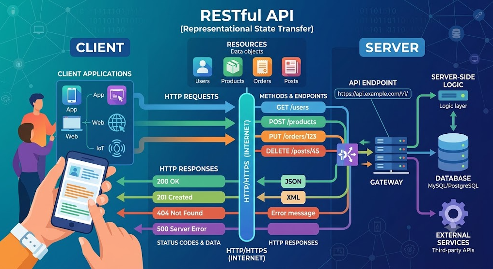
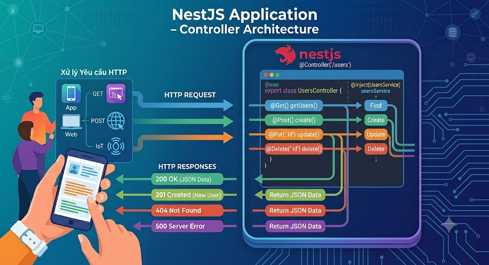

# Lesson 04 - Tạo một RESTful API với NestJS - Phần 1

> Mục tiêu bài học:
>
> - Hiểu khái niệm RESTful API và các nguyên tắc thiết kế
> - Tạo một RESTful API đơn giản với NestJS
> - Sử dụng Modules, Controllers, Services trong NestJS
> - Quản lý phiên bản API (API Versioning)

## 1. Giới thiệu về RESTful API

### 1.1 REST là gì?

**REST** (Representational State Transfer) là một phong cách kiến trúc phần mềm cho việc thiết kế các dịch vụ web. REST không phải là một giao thức hay tiêu chuẩn, mà là một tập hợp các nguyên tắc thiết kế.

### 1.2 RESTful API ?

**RESTful API** là một API được thiết kế theo các nguyên tắc của REST, cho phép các ứng dụng client giao tiếp với server thông qua giao thức HTTP.



**Ví dụ thực tế:**
Hãy tưởng tượng bạn đang xây dựng một ứng dụng quản lý thư viện sách:

- Bạn muốn xem danh sách sách → Gọi API GET `/books`
- Bạn muốn thêm sách mới → Gọi API POST `/books`
- Bạn muốn xem chi tiết một cuốn sách → Gọi API GET `/books/1`
- Bạn muốn cập nhật thông tin sách → Gọi API PUT `/books/1`
- Bạn muốn xóa sách → Gọi API DELETE `/books/1`


### 1.3 Resource ?

Trong REST, mọi thứ được xem là **resource** (tài nguyên), ví dụ:

* users
* products
* categories
* orders


**Mỗi resource sẽ có **URL riêng****

Ví dụ:

```
GET /api/products
GET /api/products/10
POST /api/products
PUT /api/products/10
DELETE /api/products/10
```

**Các HTTP Method thường dùng**

| Method | Ý nghĩa           | Ví dụ                  |
| ------ | ----------------- | ---------------------- |
| GET    | Lấy dữ liệu       | Lấy danh sách sản phẩm |
| POST   | Tạo mới           | Tạo sản phẩm mới       |
| PUT    | Cập nhật toàn bộ  | Update sản phẩm        |
| PATCH  | Cập nhật một phần | Update giá sản phẩm    |
| DELETE | Xóa               | Xóa sản phẩm           |


**Endpoint** là URL đại diện cho một resource cụ thể.

Ví dụ: Endpoint `/api/products` đại diện cho resource "products". Mỗi HTTP method sẽ thực hiện một hành động khác nhau trên resource đó.


### 1.4 Nguyên tắc thiết kế RESTful API

#### Nguyên tắc 1: Client-Server Architecture

Client và Server tách biệt hoàn toàn, giao tiếp qua HTTP.

```
Client (React, Angular, Mobile App) ←→ Server (NestJS API)
```

#### Nguyên tắc 2: Stateless (Không lưu trạng thái)

Mỗi request từ client phải chứa đầy đủ thông tin cần thiết. Server không lưu trữ context của client giữa các request.

**Ví dụ:**

```typescript
// ❌ SAI - Server lưu trạng thái
GET /next-page  // Server phải nhớ user đang ở trang nào

// ✅ ĐÚNG - Client gửi đầy đủ thông tin
GET /books?page=2&limit=10  // Mỗi request độc lập
```

#### Nguyên tắc 3: Cacheable

Response có thể được cache để cải thiện hiệu năng.

Ví dụ:

```typescript
// ✅ ĐÚNG - Cho phép cache
GET /products
Cache-Control: max-age=3600  // Cache trong 1 giờ
// ❌ SAI - Không cho phép cache
GET /products
Cache-Control: no-cache
```


#### Nguyên tắc 4: Uniform Interface

Giao diện thống nhất, dễ hiểu và dự đoán.

Ví dụ:

```typescript
// ✅ ĐÚNG - Giao diện thống nhất
GET /users          // Lấy danh sách users
POST /users         // Tạo user mới
GET /users/1        // Lấy user có id=1
PUT /users/1        // Cập nhật user có id=1
DELETE /users/1     // Xóa user có id=1
// ❌ SAI - Giao diện không thống nhất
GET /getAllUsers
POST /createUser
GET /getUserById/1
POST /updateUser/1
POST /deleteUser/1
```

#### Nguyên tắc 5: Layered System

Hệ thống có thể có nhiều tầng (load balancer, cache, API gateway...).

```
Client ←→ API Gateway ←→ Load Balancer ←→ Server
```


### 1.5 HTTP Methods

| Method | Mục đích | Ví dụ |
|--------|----------|-------|
| **GET** | Lấy dữ liệu (Read) | `GET /users` - Lấy danh sách users |
| **POST** | Tạo mới (Create) | `POST /users` - Tạo user mới |
| **PUT** | Cập nhật toàn bộ (Update) | `PUT /users/1` - Cập nhật user có id=1 |
| **PATCH** | Cập nhật một phần | `PATCH /users/1` - Cập nhật một số field |
| **DELETE** | Xóa (Delete) | `DELETE /users/1` - Xóa user có id=1 |

**Ví dụ chi tiết:**

```typescript
// GET - Lấy dữ liệu (không thay đổi dữ liệu trên server)
GET /api/products          // Lấy tất cả sản phẩm
GET /api/products/5        // Lấy sản phẩm có id = 5
GET /api/products?category=laptop&price_max=1000

// POST - Tạo mới (gửi dữ liệu trong body)
POST /api/products
Body: {
  "name": "Laptop Dell XPS 13",
  "price": 25000000,
  "category": "laptop"
}

// PUT - Cập nhật toàn bộ
PUT /api/products/5
Body: {
  "name": "Laptop Dell XPS 13 Updated",
  "price": 24000000,
  "category": "laptop",
  "description": "Mô tả mới"
}

// PATCH - Cập nhật một phần
PATCH /api/products/5
Body: {
  "price": 23000000  // Chỉ cập nhật giá
}

// DELETE - Xóa
DELETE /api/products/5
```


### 1.6 Status Codes phổ biến

#### 2xx - Success (Thành công)

- **200 OK**: Request thành công
- **201 Created**: Tạo mới thành công (dùng cho POST)
- **204 No Content**: Thành công nhưng không trả về dữ liệu (dùng cho DELETE)

#### 4xx - Client Error (Lỗi từ phía client)

- **400 Bad Request**: Dữ liệu gửi lên không hợp lệ
- **401 Unauthorized**: Chưa đăng nhập
- **403 Forbidden**: Không có quyền truy cập
- **404 Not Found**: Không tìm thấy resource

#### 5xx - Server Error (Lỗi từ phía server)

- **500 Internal Server Error**: Lỗi server
- **503 Service Unavailable**: Server tạm thời không khả dụng

**Ví dụ thực tế:**

```typescript
// Tạo sản phẩm thành công → 201 Created
POST /api/products
Response: 201 Created
{
  "id": 10,
  "name": "Laptop",
  "price": 25000000
}

// Lấy sản phẩm không tồn tại → 404 Not Found
GET /api/products/999
Response: 404 Not Found
{
  "message": "Product not found"
}

// Gửi dữ liệu không hợp lệ → 400 Bad Request
POST /api/products
Body: { "name": "" }  // Tên rỗng
Response: 400 Bad Request
{
  "message": "Name is required"
}
```

### 1.7 Resource-based URL

URL nên đại diện cho **danh từ (resource)**, không phải động từ (action).

```typescript
// ✅ ĐÚNG - Sử dụng danh từ
GET    /api/books           // Lấy danh sách sách
POST   /api/books           // Tạo sách mới
GET    /api/books/1         // Lấy sách có id=1
PUT    /api/books/1         // Cập nhật sách có id=1
DELETE /api/books/1         // Xóa sách có id=1

// ❌ SAI - Sử dụng động từ
GET    /api/getAllBooks
POST   /api/createBook
GET    /api/getBookById/1
POST   /api/updateBook/1
POST   /api/deleteBook/1
```

**Quy tắc đặt tên URL:**

1. Sử dụng danh từ số nhiều: `/users`, `/products`
2. Sử dụng dấu gạch ngang (-) thay vì dấu gạch dưới (_): `/product-categories`
3. Viết thường: `/users` không phải `/Users`
4. Không kết thúc bằng dấu `/`: `/users` không phải `/users/`

---


## 3. Controller

### 3.1 Controller là gì?

**Controller** chịu trách nhiệm xử lý các **HTTP requests** từ client và trả về **HTTP responses**.



**Nhiệm vụ của Controller:**

- Nhận request từ client
- Validate dữ liệu đầu vào (cơ bản)
- Gọi service để xử lý business logic
- Trả response về client

Ví dụ:

```typescript
// src/books/books.controller.ts
import { Controller, Get, Post, Body, Param, Delete, Put } from '@nestjs/common';
import { BooksService } from './books.service';
import { CreateBookDto } from './dto/create-book.dto';
import { UpdateBookDto } from './dto/update-book.dto';

@Controller('books')  // Base URL: /books
export class BooksController {
  constructor(private readonly booksService: BooksService) {}

  // GET /books
  @Get()
  findAll() {
    return this.booksService.findAll();
  }

  // GET /books/:id
  @Get(':id')
  findOne(@Param('id') id: string) {
    return this.booksService.findOne(+id);
  }

  // POST /books
  @Post()
  create(@Body() createBookDto: CreateBookDto) {
    return this.booksService.create(createBookDto);
  }

  // PUT /books/:id
  @Put(':id')
  update(@Param('id') id: string, @Body() updateBookDto: UpdateBookDto) {
    return this.booksService.update(+id, updateBookDto);
  }

  // DELETE /books/:id
  @Delete(':id')
  remove(@Param('id') id: string) {
    return this.booksService.remove(+id);
  }
}
```


**Controller CLI**

Bạn có thể sử dụng Nest CLI để tạo controller nhanh chóng:

```bash
nest generate controller modules/books
```


### 3.2 Routing trong NestJS

Routing là quá trình xác định cách ứng dụng phản hồi các yêu cầu từ client dựa trên URL và HTTP method.
Nó khác biệt với cách làm trên Express.js, NestJS sử dụng **decorators** để định nghĩa routes một cách rõ ràng và dễ hiểu.
Bạn không cần phải tạo nhưng file routes riêng biệt như trong Express, mà chỉ cần sử dụng decorators ngay trong controller.

#### 3.2.1 Decorators cho HTTP Methods

```typescript
@Get()      // GET request
@Post()     // POST request
@Put()      // PUT request
@Patch()    // PATCH request
@Delete()   // DELETE request
@Options()  // OPTIONS request
@Head()     // HEAD request
@All()      // Tất cả methods
```

#### 3.2.2 Request Object

Nếu bạn cần lấy thông tin từ request, bạn có thể inject `Request` object từ `express` hoặc `fastify` tùy theo Flatform bạn sử dụng.

```typescript
import { Request } from 'express';
// Hoặc import { FastifyRequest } from 'fastify';

@Controller('books')
export class BooksController {
  @Get()
  findAll(@Req() req: Request) {
    console.log(req.headers);
    return this.booksService.findAll();
  }
}
```

Bảng dưới đây liệt kê các decorators phổ biến để lấy dữ liệu từ request:

| Decorator      | Mục đích                          |
|----------------|-----------------------------------|
| `@Param()`     | Lấy route parameters              |
| `@Query()`     | Lấy query parameters              |
| `@Body()`      | Lấy request body                  |
| `@Headers()`   | Lấy headers từ request            |
| `@Request, @Req()`       | Lấy toàn bộ request object        |
| `@Response, @Res()`       | Lấy toàn bộ response object       |
| `@Session()`    | Lấy session object (nếu dùng session) |
| `@Ip()`        | Lấy địa chỉ IP của client         |
| `@HostParam()`  | Lấy host parameters (nếu dùng host-based routing) |
| `@Cookies()`   | Lấy cookies từ request            |
| `@UploadedFile()` | Lấy file đã upload (khi dùng file upload) |
| `@UploadedFiles()` | Lấy nhiều file đã upload          |
|

Xem tài liệu chính thức: [Request Objects](https://docs.nestjs.com/controllers#request-object)

#### 3.2.2 Route Parameters

Sử dụng `@Param()` để lấy các tham số từ URL.

```typescript
@Controller('books')
export class BooksController {
  // GET /books/123
  @Get(':id')
  findOne(@Param('id') id: string) {
    return `Book with id: ${id}`;
  }

  // GET /books/author/123
  @Get('author/:authorId')
  findByAuthor(@Param('authorId') authorId: string) {
    return `Books by author: ${authorId}`;
  }

  // GET /books/123/reviews/456
  @Get(':bookId/reviews/:reviewId')
  findReview(
    @Param('bookId') bookId: string,
    @Param('reviewId') reviewId: string,
  ) {
    return `Review ${reviewId} of book ${bookId}`;
  }
}
```

#### 3.2.3 Query Parameters

Sử dụng `@Query()` để lấy các tham số từ query string.

```typescript
@Controller('books')
export class BooksController {
  // GET /books?category=fiction&minPrice=100&maxPrice=500
  @Get()
  findAll(
    @Query('category') category?: string,
    @Query('minPrice') minPrice?: number,
    @Query('maxPrice') maxPrice?: number,
  ) {
    return this.booksService.findAll({ category, minPrice, maxPrice });
  }

  // Hoặc sử dụng DTO
  @Get()
  findAllWithDto(@Query() query: FilterBooksDto) {
    return this.booksService.findAll(query);
  }
}
```

#### 3.2.4 Request Body

Sử dụng `@Body()` để lấy dữ liệu từ body của request (thường dùng cho POST, PUT, PATCH).

```typescript
@Controller('books')
export class BooksController {
  // POST /books
  @Post()
  create(@Body() createBookDto: CreateBookDto) {
    return this.booksService.create(createBookDto);
  }

  // Lấy một field cụ thể từ body
  @Post('quick')
  quickCreate(@Body('title') title: string) {
    return this.booksService.quickCreate(title);
  }
}
```

#### 3.2.5 Headers

Sử dụng `@Headers()` để lấy các header từ request.

```typescript
@Controller('books')
export class BooksController {
  @Get()
  findAll(@Headers('authorization') auth: string) {
    console.log('Authorization:', auth);
    return this.booksService.findAll();
  }
}
```

### 3.3 Response trong NestJS

### 3.3.1 Response Object

Response object được inject bằng `@Res()` để tùy chỉnh response trả về.

```typescript
import { Response } from 'express'; // Với Express
@Controller('books')
export class BooksController {
  @Get()
  findAll(@Res() res: Response) {
    const books = this.booksService.findAll();
    return res.status(200).json(books);
  }
}
```

Với `fastify`, bạn import `FastifyReply`:

```typescript
import { FastifyReply } from 'fastify';
@Controller('books')
export class BooksController {
  @Get()
  findAll(@Res() res: FastifyReply) {
    const books = this.booksService.findAll();
    return res.status(200).send(books);
  }
}
```


#### 3.3.2 Response Status Code

Sử dụng `@HttpCode()` để tùy chỉnh mã trạng thái HTTP trả về.

```typescript
import { HttpCode, HttpStatus } from '@nestjs/common';

@Controller('books')
export class BooksController {
  @Post()
  @HttpCode(HttpStatus.CREATED)  // 201
  create(@Body() createBookDto: CreateBookDto) {
    return this.booksService.create(createBookDto);
  }

  @Delete(':id')
  @HttpCode(HttpStatus.NO_CONTENT)  // 204
  remove(@Param('id') id: string) {
    return this.booksService.remove(+id);
  }
}
```

### 3.3.3 Response Headers

Response headers có thể được thiết lập bằng cách sử dụng `@Header()` hoặc trực tiếp trên response object.

```typescript
@Controller('books')
export class BooksController {
  @Get()
  // Thiết lập header trực tiếp
  @Header('Cache-Control', 'max-age=3600') // Cache trong 1 giờ
  findAll() {
    return this.booksService.findAll();
  }

  @Get(':id')
  findOne(@Param('id') id: string, @Res() res: Response) {
    const book = this.booksService.findOne(+id);
    // Thiết lập header tùy chỉnh
    res.setHeader('X-Book-Id', id);
    // cookie in response
    res.cookie('lastViewedBook', id, { httpOnly: true, maxAge: 3600000 }); // 1 hour
    return res.status(200).json(book);
  }
}
```


### 3.3.4 Response Body

Là cách thức trả dữ liệu về client, thường là JSON. NestJS tự động serialize object thành JSON khi trả về.

```typescript
@Controller('books')
export class BooksController {
  @Get()
  findAll() {
    return this.booksService.findAll(); // Trả về JSON
  }

  @Get(':id')
  findOne(@Param('id') id: string) {
    const book = this.booksService.findOne(+id);
    if (!book) {
      throw new NotFoundException(`Book with id ${id} not found`);
    }
    return book; // Trả về JSON
  }
}
```

## 4. Ví dụ hoàn chỉnh về Controller trong NestJS

```typescript
// src/books/books.controller.ts
import {
  Controller,
  Get,
  Post,
  Put,
  Delete,
  Body,
  Param,
  Query,
  HttpCode,
  HttpStatus,
} from '@nestjs/common';
import { BooksService } from './books.service';
import { CreateBookDto } from './dto/create-book.dto';
import { UpdateBookDto } from './dto/update-book.dto';
import { FilterBooksDto } from './dto/filter-books.dto';

@Controller('api/books')  // Base URL: /api/books
export class BooksController {
  constructor(private readonly booksService: BooksService) {}

  /**
   * Lấy danh sách sách với filter
   * GET /api/books?category=fiction&minPrice=100&page=1&limit=10
   */
  @Get()
  findAll(@Query() filterDto: FilterBooksDto) {
    return this.booksService.findAll(filterDto);
  }

  /**
   * Lấy chi tiết một cuốn sách
   * GET /api/books/123
   */
  @Get(':id')
  findOne(@Param('id') id: string) {
    return this.booksService.findOne(+id);
  }

  /**
   * Tạo sách mới
   * POST /api/books
   */
  @Post()
  @HttpCode(HttpStatus.CREATED)
  create(@Body() createBookDto: CreateBookDto) {
    return this.booksService.create(createBookDto);
  }

  /**
   * Cập nhật sách
   * PUT /api/books/123
   */
  @Put(':id')
  update(
    @Param('id') id: string,
    @Body() updateBookDto: UpdateBookDto,
  ) {
    return this.booksService.update(+id, updateBookDto);
  }

  /**
   * Xóa sách
   * DELETE /api/books/123
   */
  @Delete(':id')
  @HttpCode(HttpStatus.NO_CONTENT)
  remove(@Param('id') id: string) {
    return this.booksService.remove(+id);
  }

  /**
   * Lấy sách theo tác giả
   * GET /api/books/author/456
   */
  @Get('author/:authorId')
  findByAuthor(@Param('authorId') authorId: string) {
    return this.booksService.findByAuthor(+authorId);
  }
}
```


---


## 5. Quản lý phiên bản API (API Versioning)

### 5.1 Tại sao cần versioning cho API?

**Vấn đề:**
Khi bạn phát triển API, đôi khi cần thay đổi cấu trúc response hoặc cách hoạt động. Nhưng nếu thay đổi trực tiếp, các ứng dụng client đang dùng phiên bản cũ sẽ bị lỗi.

**Ví dụ thực tế:**

```typescript
// API v1 - Response cũ
GET /api/users/1
{
  "id": 1,
  "name": "John Doe",
  "email": "john@example.com"
}

// API v2 - Response mới (tách name thành firstName và lastName)
GET /api/v2/users/1
{
  "id": 1,
  "firstName": "John",
  "lastName": "Doe",
  "email": "john@example.com",
  "avatar": "https://..." // Thêm field mới
}
```

**Lợi ích của versioning:**

- Client cũ vẫn hoạt động bình thường với v1
- Client mới có thể sử dụng v2 với tính năng mới
- Có thời gian để migrate dần dần
- Không làm gián đoạn service

### 5.2 Cấu hình Versioning trong NestJS

#### Bước 1: Enable versioning trong `main.ts`

```typescript
// src/main.ts
import { NestFactory } from '@nestjs/core';
import { VersioningType } from '@nestjs/common';
import { AppModule } from './app.module';

async function bootstrap() {
  const app = await NestFactory.create(AppModule);

  // Enable API Versioning
  app.enableVersioning({
    type: VersioningType.URI,  // Sử dụng URI versioning
    defaultVersion: '1',        // Version mặc định
  });

  await app.listen(3000);
}
bootstrap();
```

### 5.3 Các chiến lược Versioning

#### 5.3.1 URI Versioning (Phổ biến nhất)

Version được đặt trong URL.

```typescript
// src/main.ts
app.enableVersioning({
  type: VersioningType.URI,
});
```

**Sử dụng trong Controller:**

```typescript
// src/users/users.controller.ts
import { Controller, Get, Version } from '@nestjs/common';

@Controller('users')
export class UsersController {
  // Version 1: GET /v1/users
  @Version('1')
  @Get()
  findAllV1() {
    return [
      { id: 1, name: 'John Doe', email: 'john@example.com' },
    ];
  }

  // Version 2: GET /v2/users
  @Version('2')
  @Get()
  findAllV2() {
    return [
      {
        id: 1,
        firstName: 'John',
        lastName: 'Doe',
        email: 'john@example.com',
        avatar: 'https://...',
      },
    ];
  }

  // Hỗ trợ nhiều version cho cùng một endpoint
  @Version(['1', '2'])
  @Get(':id')
  findOne() {
    return { id: 1, name: 'John Doe' };
  }
}
```

**Ví dụ chi tiết:**

```typescript
// src/books/books.controller.v1.ts
import { Controller, Get, Post, Body, Version } from '@nestjs/common';
import { BooksService } from './books.service';

@Controller('books')
export class BooksControllerV1 {
  constructor(private readonly booksService: BooksService) {}

  @Version('1')
  @Get()
  findAll() {
    // V1: Response
    return this.booksService.findAll();
  }

  @Version('1')
  @Post()
  create(@Body() createBookDto: any) {
    return this.booksService.create(createBookDto);
  }
}

// src/books/books.controller.v2.ts
import { Controller, Get, Post, Body, Query, Version } from '@nestjs/common';
import { BooksService } from './books.service';

@Controller('books')
export class BooksControllerV2 {
  constructor(private readonly booksService: BooksService) {}

  @Version('2')
  @Get()
  findAll(@Query() query: any) {
    // V2: Hỗ trợ pagination và filter nâng cao
    return {
      data: this.booksService.findAll(query),
      pagination: {
        page: query.page || 1,
        limit: query.limit || 10,
        total: 100,
      },
      meta: {
        version: '2.0',
        timestamp: new Date(),
      },
    };
  }

  @Version('2')
  @Post()
  create(@Body() createBookDto: any) {
    // V2: Validate chặt chẽ hơn, thêm metadata
    const book = this.booksService.create(createBookDto);
    return {
      data: book,
      meta: {
        created: true,
        version: '2.0',
      },
    };
  }
}
```

#### 5.3.2 Header Versioning

Version được truyền qua HTTP Header.

```typescript
// src/main.ts
app.enableVersioning({
  type: VersioningType.HEADER,
  header: 'X-API-Version',  // Tên header
});
```

**Sử dụng:**

```typescript
@Controller('books')
export class BooksController {
  @Version('1')
  @Get()
  findAllV1() {
    return 'Books V1';
  }

  @Version('2')
  @Get()
  findAllV2() {
    return 'Books V2';
  }
}

// Client gọi API:
// GET /books
// Header: X-API-Version: 1
```

#### 5.3.3 Media Type Versioning

Version được chỉ định trong `Accept` header.

```typescript
// src/main.ts
app.enableVersioning({
  type: VersioningType.MEDIA_TYPE,
  key: 'v=',
});

// Client gọi:
// GET /books
// Header: Accept: application/json;v=1
```

#### 5.3.4 Custom Versioning

Tự định nghĩa cách xác định version.

```typescript
app.enableVersioning({
  type: VersioningType.CUSTOM,
  extractor: (request) => {
    // Lấy version từ query parameter
    return request.query['api-version'] || '1';
  },
});

// Client gọi:
// GET /books?api-version=2
```

### 5.4 Best Practices cho API Versioning

#### 1. Đặt version ở controller level

- Cách 1: Đặt version cho từng method

```typescript
//src/books/books.controller.ts
@Controller('books')
export class BooksController {
  @Version('1')
  @Get()
  findAllV1() {}

  @Version('2')
  @Get()
  findAllV2() {}
}
```

- Cách 2: Tạo controller riêng cho mỗi version (Recommended)

```typescript
// src/books/controllers/books.controller.v1.ts
@Controller({ path: 'books', version: '1' })
export class BooksControllerV1 {
  @Get()
  findAll() {}
}
// src/books/controllers/books.controller.v2.ts
@Controller({ path: 'books', version: '2' })
export class BooksControllerV2 {
  @Get()
  findAll() {}
}
```

#### 2. Sử dụng DTO riêng cho mỗi version

```typescript
// src/books/dto/v1/create-book.dto.ts
export class CreateBookDtoV1 {
  title: string;
  author: string;
  price: number;
}

// src/books/dto/v2/create-book.dto.ts
export class CreateBookDtoV2 {
  title: string;
  authorId: number;  // Thay đổi: dùng authorId thay vì author string
  price: number;
  isbn: string;      // Thêm field mới
}
```

#### 3. Deprecate version cũ một cách rõ ràng

```typescript
@Controller({ path: 'books', version: '1' })
export class BooksControllerV1 {
  @Get()
  @Header('X-API-Warn', 'This version is deprecated. Please use v2')
  findAll() {
    return this.booksService.findAll();
  }
}
```

### 5.5 Ví dụ hoàn chỉnh

```typescript
// src/main.ts
import { NestFactory } from '@nestjs/core';
import { VersioningType, ValidationPipe } from '@nestjs/common';
import { AppModule } from './app.module';

async function bootstrap() {
  const app = await NestFactory.create(AppModule);

  // Global prefix
  app.setGlobalPrefix('api');

  // Enable versioning
  app.enableVersioning({
    type: VersioningType.URI,
    defaultVersion: '1',
    prefix: 'v',  // Prefix cho version: /api/v1/books
  });

  // Global validation
  app.useGlobalPipes(new ValidationPipe());

  await app.listen(3000);
  console.log('Application is running on: http://localhost:3000');
}
bootstrap();
```

```typescript
// src/books/books.module.ts
import { Module } from '@nestjs/common';
import { BooksService } from './books.service';
import { BooksControllerV1 } from './controllers/books.controller.v1';
import { BooksControllerV2 } from './controllers/books.controller.v2';

@Module({
  controllers: [BooksControllerV1, BooksControllerV2],
  providers: [BooksService],
  exports: [BooksService],
})
export class BooksModule {}
```

```typescript
// src/books/controllers/books.controller.v1.ts
import { Controller, Get, Post, Body, Param } from '@nestjs/common';
import { BooksService } from '../books.service';
import { CreateBookDtoV1 } from '../dto/v1/create-book.dto';

@Controller({ path: 'books', version: '1' })
export class BooksControllerV1 {
  constructor(private readonly booksService: BooksService) {}

  @Get()
  findAll() {
    return this.booksService.findAll();
  }

  @Get(':id')
  findOne(@Param('id') id: string) {
    return this.booksService.findOne(+id);
  }

  @Post()
  create(@Body() createBookDto: CreateBookDtoV1) {
    return this.booksService.create(createBookDto);
  }
}
```

```typescript
// src/books/controllers/books.controller.v2.ts
import { Controller, Get, Post, Body, Param, Query } from '@nestjs/common';
import { BooksService } from '../books.service';
import { CreateBookDtoV2 } from '../dto/v2/create-book.dto';
import { FilterBooksDtoV2 } from '../dto/v2/filter-books.dto';

@Controller({ path: 'books', version: '2' })
export class BooksControllerV2 {
  constructor(private readonly booksService: BooksService) {}

  @Get()
  findAll(@Query() filterDto: FilterBooksDtoV2) {
    const books = this.booksService.findAll(filterDto);
    
    return {
      data: books,
      pagination: {
        page: filterDto.page || 1,
        limit: filterDto.limit || 10,
        total: books.length,
      },
      meta: {
        version: '2.0',
        timestamp: new Date().toISOString(),
      },
    };
  }

  @Get(':id')
  findOne(@Param('id') id: string) {
    const book = this.booksService.findOne(+id);
    
    return {
      data: book,
      meta: {
        version: '2.0',
      },
    };
  }

  @Post()
  create(@Body() createBookDto: CreateBookDtoV2) {
    const book = this.booksService.createV2(createBookDto);
    
    return {
      data: book,
      meta: {
        created: true,
        version: '2.0',
      },
    };
  }
}
```

## 6. NestJS CLI

Một số lệnh NestJS CLI phổ biến:

### 🔹 6.1. Core (quan trọng nhất – dùng hàng ngày)

```bash
nest g module <name>        # mo
nest g controller <name>    # co
nest g service <name>       # s
nest g resource <name>      # res (CRUD full)
```

👉 Đây là 4 lệnh bạn dùng nhiều nhất khi build REST API

---

### 🔹 6.2. Request lifecycle (xử lý request nâng cao)

```bash
nest g middleware <name>    # mi
nest g guard <name>         # gu
nest g interceptor <name>   # itc
nest g pipe <name>          # pi
nest g filter <name>        # f
```

👉 Mapping với flow request:

```
Middleware → Guard → Interceptor → Pipe → Controller → Service
                              ↓
                          Filter (catch error)
```

---

### 🔹 6.3. Code structure / reusable

```bash
nest g class <name>         # cl
nest g interface <name>     # itf
nest g provider <name>      # pr
nest g decorator <name>     # d
```

👉 Dùng khi:

* Tạo util class
* Custom decorator (`@CurrentUser`)
* Abstraction (interface)

---

### 🔹 6.4. Realtime / GraphQL

```bash
nest g gateway <name>       # ga (WebSocket)
nest g resolver <name>      # r  (GraphQL)
```

---

### 🔹 6.5. Project / Architecture

```bash
nest g application <name>   # application
nest g sub-app <name>       # app (monorepo)
nest g library <name>       # lib
nest g configuration <name> # config
```

👉 Dùng khi:

* Monorepo
* Microservices
* Shared library

---

### 🔹 6.6. Ví dụ

#### ✅ CRUD API cơ bản:

```bash
nest g resource users
# Không tạo file test
nest g resource products --no-spec
```

#### ✅ Tách tay theo clean architecture:

```bash
nest g module users
nest g controller users
nest g service users
```

#### ✅ Advanced:

```bash
nest g guard auth
nest g interceptor logging
nest g pipe validation
```

