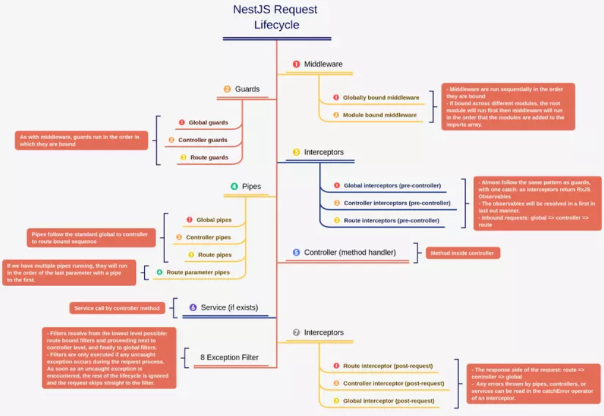

# Lesson 04 - Request Lifecycle and Data Flow

## Mục tiêu bài học

- Hiểu về vòng đời của một request trong NestJS
- Tìm hiểu về Validation và Transformation với DTO
- Quản lý lỗi và Serialization trong NestJS
- Chuẩn hóa Responses
- Hiểu về Execution Context và Metadata với Decorators

---

## 1. Lifecycle trong NestJS

### 1.1. Vòng đời của một Request

Khi một request đến NestJS application, nó sẽ đi qua các bước sau theo thứ tự:

```
Incoming Request
    ↓
1. Middleware
    ↓
2. Guards
    ↓
3. Interceptors (before)
    ↓
4. Pipes
    ↓
5. Controller/Route Handler
    ↓
6. Service (Business Logic)
    ↓
7. Interceptors (after)
    ↓
8. Exception Filters
    ↓
Outgoing Response
```



**Giải thích chi tiết từng bước:**

- **Middleware**: Xử lý trước khi request đến router (logging, CORS, authentication setup)
- **Guards**: Kiểm tra quyền truy cập, xác thực (authentication/authorization)
- **Interceptors (before)**: Biến đổi request, thêm logic trước khi xử lý
- **Pipes**: Validate và transform dữ liệu đầu vào
- **Controller**: Nhận request và gọi service
- **Service**: Xử lý business logic
- **Interceptors (after)**: Biến đổi response, thêm logic sau khi xử lý
- **Exception Filters**: Bắt và xử lý lỗi

### 1.2. Ví dụ minh họa Request Lifecycle

Dưới đây là ví dụ minh họa về cách các thành phần trong `lifecycle` hoạt động cùng nhau.
Để bạn nắm được `Data Flow` và thứ tự thực thi của từng thành phần.

**Tạo Middleware để log thông tin request:**

```typescript
// src/common/middleware/logger.middleware.ts
import { Injectable, NestMiddleware, Logger } from '@nestjs/common';
import { Request, Response, NextFunction } from 'express';

@Injectable()
export class LoggerMiddleware implements NestMiddleware {
  private logger = new Logger('HTTP');

  use(req: Request, res: Response, next: NextFunction) {
    const { method, originalUrl } = req;
    const startTime = Date.now();

    console.log('1. Middleware: Logging request');

    res.on('finish', () => {
      const { statusCode } = res;
      const responseTime = Date.now() - startTime;
      this.logger.log(
        `${method} ${originalUrl} ${statusCode} - ${responseTime}ms`
      );
    });

    next();
  }
}
```

**Đăng ký Middleware trong Module:**

```typescript
// src/app.module.ts
import { Module, NestModule, MiddlewareConsumer } from '@nestjs/common';
import { LoggerMiddleware } from './common/middleware/logger.middleware';
import { BooksModule } from './books/books.module';

@Module({
  imports: [BooksModule],
})
export class AppModule implements NestModule {
  configure(consumer: MiddlewareConsumer) {
    consumer
      .apply(LoggerMiddleware)
      .forRoutes('*'); // Áp dụng cho tất cả routes
  }
}
```

**Tạo Guard để kiểm tra authentication:**

```typescript
// src/common/guards/auth.guard.ts
import { Injectable, CanActivate, ExecutionContext, UnauthorizedException } from '@nestjs/common';
import { Observable } from 'rxjs';

@Injectable()
export class AuthGuard implements CanActivate {
  canActivate(
    context: ExecutionContext,
  ): boolean | Promise<boolean> | Observable<boolean> {
    console.log('2. Guard: Checking authentication');
    
    const request = context.switchToHttp().getRequest();
    return this.validateRequest(request);
  }

  private validateRequest(request: any): boolean {
    // Kiểm tra token hoặc session
    const token = request.headers.authorization;
    
    if (!token) {
      throw new UnauthorizedException('No authorization token provided');
    }
    
    // Giả lập validate token
    if (!token.startsWith('Bearer ')) {
      throw new UnauthorizedException('Invalid token format');
    }
    
    return true;
  }
}
```

**Tạo Interceptor để log và transform response:**

```typescript
// src/common/interceptors/logging.interceptor.ts
import {
  Injectable,
  NestInterceptor,
  ExecutionContext,
  CallHandler,
} from '@nestjs/common';
import { Observable } from 'rxjs';
import { tap } from 'rxjs/operators';

@Injectable()
export class LoggingInterceptor implements NestInterceptor {
  intercept(context: ExecutionContext, next: CallHandler): Observable<any> {
    console.log('3. Interceptor (before): Before handling request');
    const now = Date.now();

    return next.handle().pipe(
      tap(() => {
        console.log(`7. Interceptor (after): After handling request - ${Date.now() - now}ms`);
      })
    );
  }
}
```

**Sử dụng trong Controller:**

```typescript
// src/books/books.controller.ts
import { Controller, Get, UseGuards, UseInterceptors } from '@nestjs/common';
import { BooksService } from './books.service';
import { AuthGuard } from '../common/guards/auth.guard';
import { LoggingInterceptor } from '../common/interceptors/logging.interceptor';

@Controller('books')
@UseGuards(AuthGuard)
@UseInterceptors(LoggingInterceptor)
export class BooksController {
  constructor(private readonly booksService: BooksService) {}

  @Get()
  findAll() {
    console.log('5. Controller: Handling request');
    return this.booksService.findAll();
  }
}
```

**Flow khi gọi API:**

```
GET /books
Header: Authorization: Bearer token123

Console output:
1. Middleware: Logging request
2. Guard: Checking authentication
3. Interceptor (before): Before handling request
4. Pipe: Validating and transforming data (nếu có)
5. Controller: Handling request
6. Service: Processing business logic
7. Interceptor (after): After handling request - 15ms
HTTP GET /books 200 - 15ms
```

### 1.3. Lifecycle Events

Xem chi tiết [Lifecycle Events trong NestJS](./lifecycle-event.md)

NestJS cung cấp các lifecycle hooks cho modules, services, và controllers:

```typescript
// src/books/books.service.ts
import { Injectable, OnModuleInit, OnModuleDestroy } from '@nestjs/common';

@Injectable()
export class BooksService implements OnModuleInit, OnModuleDestroy {
  private books = [];

  // Được gọi khi module được khởi tạo
  onModuleInit() {
    console.log('BooksService initialized');
    // Khởi tạo dữ liệu, kết nối database, etc.
    this.loadInitialData();
  }

  // Được gọi khi module bị hủy
  onModuleDestroy() {
    console.log('BooksService destroyed');
    // Cleanup: đóng kết nối, giải phóng resources
    this.cleanup();
  }

  private loadInitialData() {
    this.books = [
      { id: 1, title: 'Clean Code', description: 'A handbook of agile software craftsmanship', pages: 464, genres: ['Programming', 'Software Engineering'] },
      { id: 2, title: 'The Pragmatic Programmer', description: 'Your journey to mastery', pages: 352, genres: ['Programming'] },
    ];
  }

  private cleanup() {
    this.books = [];
  }

  findAll() {
    console.log('6. Service: Processing business logic');
    return this.books;
  }
}
```

**Các Lifecycle Hooks:**

| Hook | Mô tả | Thời điểm gọi |
|------|-------|---------------|
| `onModuleInit()` | Được gọi sau khi dependencies đã được resolved | Khởi tạo module |
| `onApplicationBootstrap()` | Được gọi sau khi tất cả modules đã init | App sẵn sàng |
| `onModuleDestroy()` | Được gọi trước khi module bị destroy | Cleanup trước khi tắt |
| `beforeApplicationShutdown()` | Được gọi trước khi app shutdown | Trước shutdown |
| `onApplicationShutdown()` | Được gọi khi app shutdown | Trong quá trình shutdown |

Tài liệu chính thức: [Lifecycle Events](https://docs.nestjs.com/fundamentals/lifecycle-events)

### 1.4. Tổng quan các thành phần trong Lifecycle

#### 1.4.1 Middleware

**Middleware là gì?**

Middleware là các hàm được thực thi trước khi request đến controller. Chúng có thể thao tác với request và response objects, hoặc kết thúc chuỗi request-response.

**Cách tạo một Middleware**

Dưới đây là ví dụ về một Middleware đơn giản để log thông tin request:

```typescript
import { Injectable, NestMiddleware } from '@nestjs/common';
import { Request, Response, NextFunction } from 'express';
@Injectable()
export class LoggerMiddleware implements NestMiddleware {
  use(req: Request, res: Response, next: NextFunction) {
    console.log(`Request... ${req.method} ${req.originalUrl}`);
    next();
  }
}
```

**Khi nào sử dụng Middleware?**

- Logging requests
- Xử lý CORS
- Xác thực (authentication setup)
- Thêm headers chung

#### 1.4.2 Guards

**Guard là gì?**

Guard là các lớp dùng để xác định xem một request có được phép truy cập vào route hay không. Chúng thường được sử dụng cho mục đích xác thực và phân quyền.

**Cách tạo một Guard**

Dưới đây là ví dụ về một Guard đơn giản để kiểm tra authentication:

```typescript
import { Injectable, CanActivate, ExecutionContext } from '@nestjs/common';
import { Observable } from 'rxjs';
@Injectable()
export class AuthGuard implements CanActivate {
  canActivate(
    context: ExecutionContext,
  ): boolean | Promise<boolean> | Observable<boolean> {
    const request = context.switchToHttp().getRequest();
    return this.validateRequest(request);
  }
  private validateRequest(request: any): boolean {
    const token = request.headers.authorization;
    return !!token; // Giả lập kiểm tra token
  }
}
```

**Khi nào sử dụng Guard?**

- Xác thực (Authentication)
- Phân quyền (Authorization)

#### 1.4.3 Interceptors

**Interceptor là gì?**

Interceptor là các lớp dùng để can thiệp vào quá trình xử lý request-response. Chúng có thể biến đổi dữ liệu, thêm logic trước và sau khi controller xử lý request.

**Cách tạo một Interceptor**

```typescript
import {
  Injectable,
  NestInterceptor,
  ExecutionContext,
  CallHandler,
} from '@nestjs/common';
import { Observable } from 'rxjs';
import { tap } from 'rxjs/operators';
@Injectable()
export class LoggingInterceptor implements NestInterceptor {
  intercept(context: ExecutionContext, next: CallHandler): Observable<any> {
    console.log('Before handling request');
    const now = Date.now();
    return next.handle().pipe(
      tap(() => console.log(`After handling request... ${Date.now() - now}ms`)),
    );
  }
}
```

**Khi nào sử dụng Interceptor?**

Bạn sử dụng Interceptor khi cần cần can thiệp vào quá trình xử lý request-response, ví dụ:

- Logging
- Transforming response data
- Caching
- Measuring execution time

### 1.5. So sánh Middleware vs Guard vs Interceptor (Khi nào dùng cái nào?)

- **Middleware**:
  - Chạy sớm nhất trong vòng đời request
  - Không có Dependency Injection mạnh mẽ
  - Phù hợp cho logging, CORS, request parsing

- **Guard**:
  - Quyết định có cho request đi tiếp hay không (authorization)
  - Có Dependency Injection đầy đủ
  - Phù hợp cho authentication và authorization

- **Interceptor**:
  - Biến đổi request/response
  - Có Dependency Injection đầy đủ
  - Phù hợp cho logging, transform, caching, exception handling

---

## 2. Validation và Transformation với DTO

### 2.1. DTO (Data Transfer Object) là gì?

**DTO** là một design pattern dùng để định nghĩa cấu trúc dữ liệu được truyền giữa các layers của ứng dụng. Trong NestJS, DTO giúp:

- Định nghĩa schema cho dữ liệu đầu vào/đầu ra
- Validate dữ liệu tự động
- Transform dữ liệu (type conversion)
- Tạo documentation tự động (với Swagger)
- Type safety với TypeScript

**Tại sao cần DTO?**

Không có DTO:

```typescript
@Post()
create(@Body() body: any) {
  // body có thể là bất cứ thứ gì
  // Không có type safety
  // Không có validation
  // Dễ gây lỗi
  return this.booksService.create(body);
}
```

Có DTO:

```typescript
@Post()
create(@Body() createBookDto: CreateBookDto) {
  // createBookDto đã được validate
  // Type-safe
  // IDE có autocomplete
  return this.booksService.create(createBookDto);
}
```

### 2.2. Class-validator và class-transformer

**Cài đặt:**

```bash
npm install class-validator class-transformer
```

**class-validator**: Thư viện để validate dữ liệu dựa trên decorators
**class-transformer**: Thư viện để transform plain objects thành class instances

**Các decorators phổ biến:**

| Decorator | Mục đích | Ví dụ |
|-----------|----------|-------|
| `@IsString()` | Validate là string | `@IsString() title: string;` |
| `@IsNumber()` | Validate là number | `@IsNumber() pages: number;` |
| `@IsInt()` | Validate là integer | `@IsInt() age: number;` |
| `@IsEmail()` | Validate email | `@IsEmail() email: string;` |
| `@IsNotEmpty()` | Không được rỗng | `@IsNotEmpty() title: string;` |
| `@IsOptional()` | Field tùy chọn | `@IsOptional() description?: string;` |
| `@MinLength(n)` | Độ dài tối thiểu | `@MinLength(3) title: string;` |
| `@MaxLength(n)` | Độ dài tối đa | `@MaxLength(100) title: string;` |
| `@Min(n)` | Giá trị tối thiểu | `@Min(1) pages: number;` |
| `@Max(n)` | Giá trị tối đa | `@Max(10000) pages: number;` |
| `@IsArray()` | Validate là array | `@IsArray() genres: string[];` |
| `@ArrayMinSize(n)` | Array size tối thiểu | `@ArrayMinSize(1) genres: string[];` |
| `@ValidateNested()` | Validate nested object | `@ValidateNested() author: AuthorDto;` |

### 2.3. Tạo DTO với Validation

Ví dụ về DTO cho entity "Book":

**CreateBookDto:**

```typescript
// src/books/dto/create-book.dto.ts
import {
  IsString,
  IsNotEmpty,
  MinLength,
  MaxLength,
  IsInt,
  Min,
  Max,
  IsArray,
  ArrayMinSize,
  IsOptional,
} from 'class-validator';

export class CreateBookDto {
  @IsString({ message: 'Tên sách phải là chuỗi ký tự' })
  @IsNotEmpty({ message: 'Tên sách không được để trống' })
  @MinLength(3, { message: 'Tên sách phải có ít nhất 3 ký tự' })
  @MaxLength(100, { message: 'Tên sách không được vượt quá 100 ký tự' })
  title: string;

  @IsString({ message: 'Mô tả phải là chuỗi ký tự' })
  @IsNotEmpty({ message: 'Mô tả không được để trống' })
  @MinLength(10, { message: 'Mô tả phải có ít nhất 10 ký tự' })
  @MaxLength(500, { message: 'Mô tả không được vượt quá 500 ký tự' })
  description: string;

  @IsInt({ message: 'Số trang phải là số nguyên' })
  @Min(1, { message: 'Số trang phải lớn hơn hoặc bằng 1' })
  @Max(10000, { message: 'Số trang phải nhỏ hơn hoặc bằng 10000' })
  pages: number;

  @IsArray({ message: 'Thể loại phải là một mảng' })
  @ArrayMinSize(1, { message: 'Sách phải có ít nhất 1 thể loại' })
  @IsString({ each: true, message: 'Mỗi thể loại phải là chuỗi ký tự' })
  genres: string[];

  @IsString({ message: 'ISBN phải là chuỗi ký tự' })
  @IsOptional()
  isbn?: string;

  @IsInt({ message: 'Năm xuất bản phải là số nguyên' })
  @Min(1000, { message: 'Năm xuất bản không hợp lệ' })
  @Max(new Date().getFullYear(), { message: 'Năm xuất bản không được lớn hơn năm hiện tại' })
  @IsOptional()
  publishedYear?: number;
}
```

**UpdateBookDto:**

```typescript
// src/books/dto/update-book.dto.ts
import { PartialType } from '@nestjs/mapped-types';
import { CreateBookDto } from './create-book.dto';

// PartialType tự động làm tất cả các fields trở thành optional
export class UpdateBookDto extends PartialType(CreateBookDto) {}

// Tương đương với:
// export class UpdateBookDto {
//   @IsOptional()
//   @IsString()
//   @MinLength(3)
//   @MaxLength(100)
//   title?: string;
//
//   @IsOptional()
//   @IsString()
//   @MinLength(10)
//   @MaxLength(500)
//   description?: string;
//   
//   // ... các fields khác
// }
```

**FilterBooksDto:**

```typescript
// src/books/dto/filter-books.dto.ts
import { IsOptional, IsString, IsInt, Min, Max } from 'class-validator';
import { Type } from 'class-transformer';

export class FilterBooksDto {
  @IsOptional()
  @IsString()
  genre?: string;

  @IsOptional()
  @Type(() => Number)
  @IsInt()
  @Min(1)
  minPages?: number;

  @IsOptional()
  @Type(() => Number)
  @IsInt()
  @Max(10000)
  maxPages?: number;

  @IsOptional()
  @Type(() => Number)
  @IsInt()
  @Min(1)
  page?: number = 1;

  @IsOptional()
  @Type(() => Number)
  @IsInt()
  @Min(1)
  @Max(100)
  limit?: number = 10;
}
```

### 2.4. Sử dụng ValidationPipe

Muốn kích hoạt validation tự động, ta sử dụng `ValidationPipe` của NestJS và cấu hình trong `main.ts`.

**Global ValidationPipe - Áp dụng cho toàn bộ ứng dụng:**

```typescript
// src/main.ts
import { ValidationPipe } from '@nestjs/common';
import { NestFactory } from '@nestjs/core';
import { AppModule } from './app.module';

async function bootstrap() {
  const app = await NestFactory.create(AppModule);

  // Cấu hình ValidationPipe global
  app.useGlobalPipes(
    new ValidationPipe({
      // Tự động loại bỏ các properties không có trong DTO
      whitelist: true,
      
      // Throw error nếu có property không hợp lệ
      forbidNonWhitelisted: true,
      
      // Tự động transform payload thành DTO instance
      transform: true,
      
      // Tự động convert types (string -> number)
      transformOptions: {
        enableImplicitConversion: true,
      },
      
      // Hiển thị error messages (set true trong production để ẩn)
      disableErrorMessages: false,
      
      // Cấu hình validation error response
      validationError: {
        target: false, // Không include target object trong error
        value: false,  // Không include value trong error
      },
    })
  );

  await app.listen(3000);
}
bootstrap();
```

**Các options quan trọng của ValidationPipe:**

| Option | Mặc định | Mô tả |
|--------|----------|-------|
| `whitelist` | false | Tự động xóa properties không có trong DTO |
| `forbidNonWhitelisted` | false | Throw error nếu có property không hợp lệ |
| `transform` | false | Transform payload thành DTO instance |
| `transformOptions` | {} | Options cho class-transformer |
| `disableErrorMessages` | false | Ẩn error messages (dùng cho production) |
| `skipMissingProperties` | false | Bỏ qua validation cho undefined fields |
| `skipNullProperties` | false | Bỏ qua validation cho null fields |
| `skipUndefinedProperties` | false | Bỏ qua validation cho undefined fields |

**Ví dụ về whitelist và forbidNonWhitelisted:**

```typescript
// CreateBookDto chỉ có: title, description, pages, genres

// Request body:
{
  "title": "Clean Code",
  "description": "A handbook...",
  "pages": 464,
  "genres": ["Programming"],
  "extraField": "This should not be here",
  "anotherField": 123
}

// Với whitelist: true, forbidNonWhitelisted: false
// => extraField và anotherField sẽ bị loại bỏ im lặng

// Với whitelist: true, forbidNonWhitelisted: true
// => Throw BadRequestException: "property extraField should not exist"
```

**Controller-level hoặc Route-level ValidationPipe:**

```typescript
// src/books/books.controller.ts
import { 
  Controller, 
  Post, 
  Body, 
  UsePipes, 
  ValidationPipe 
} from '@nestjs/common';
import { CreateBookDto } from './dto/create-book.dto';

@Controller('books')
export class BooksController {
  // Áp dụng cho một route cụ thể
  @Post()
  @UsePipes(new ValidationPipe({ transform: true }))
  create(@Body() createBookDto: CreateBookDto) {
    console.log(createBookDto instanceof CreateBookDto); // true
    return { message: 'Book created', data: createBookDto };
  }

  // Áp dụng cho một parameter cụ thể
  @Post('alternative')
  createAlternative(
    @Body(new ValidationPipe({ transform: true })) 
    createBookDto: CreateBookDto
  ) {
    return { message: 'Book created', data: createBookDto };
  }
}
```

**Ví dụ validation thực tế:**

```typescript
// src/books/books.controller.ts
import { 
  Controller, 
  Get, 
  Post, 
  Put, 
  Delete,
  Body, 
  Param, 
  Query,
  ParseIntPipe,
  HttpCode,
  HttpStatus,
} from '@nestjs/common';
import { BooksService } from './books.service';
import { CreateBookDto } from './dto/create-book.dto';
import { UpdateBookDto } from './dto/update-book.dto';
import { FilterBooksDto } from './dto/filter-books.dto';

@Controller('books')
export class BooksController {
  constructor(private readonly booksService: BooksService) {}

  @Get()
  findAll(@Query() filterDto: FilterBooksDto) {
    console.log('4. Pipe: Validating and transforming query params');
    // filterDto đã được validate và transform
    return this.booksService.findAll(filterDto);
  }

  @Get(':id')
  findOne(@Param('id', ParseIntPipe) id: number) {
    // ParseIntPipe tự động convert string -> number và validate
    console.log(typeof id); // number
    return this.booksService.findOne(id);
  }

  @Post()
  @HttpCode(HttpStatus.CREATED)
  create(@Body() createBookDto: CreateBookDto) {
    console.log('4. Pipe: Validating and transforming body');
    // createBookDto đã được validate
    return this.booksService.create(createBookDto);
  }

  @Put(':id')
  update(
    @Param('id', ParseIntPipe) id: number,
    @Body() updateBookDto: UpdateBookDto,
  ) {
    return this.booksService.update(id, updateBookDto);
  }

  @Delete(':id')
  @HttpCode(HttpStatus.NO_CONTENT)
  remove(@Param('id', ParseIntPipe) id: number) {
    return this.booksService.remove(id);
  }
}
```

**Test validation:**

Xem tại file REST Client [test-validation-book.http](./test-validation-book.http)

### 2.5. Custom Validation Pipe

### 2.5.1 **Pipe là gì?**

Pipe là một class có chức năng xử lý dữ liệu đầu vào (input data) trước khi nó được truyền đến controller. Pipe có thể thực hiện các nhiệm vụ như:

- Validate dữ liệu
- Transform dữ liệu (chuyển đổi kiểu dữ liệu)

> Xem tài liệu chính thức về [Pipes trong NestJS](https://docs.nestjs.com/pipes)

### 2.5.2 Cách sử dụng Built-in Pipes

NestJS cung cấp một số built-in pipes phổ biến như:

- `ValidationPipe`: Dùng để validate dữ liệu dựa trên DTO và class-validator
- `ParseIntPipe`: Chuyển đổi chuỗi thành số nguyên và validate

**Sử dụng ParseIntPipe:**

```typescript
@Get(':id')
findOne(@Param('id', ParseIntPipe) id: number) {
  console.log(typeof id); // number
  return this.booksService.findOne(id);
}
```

### 2.5.1 Tạo Custom Pipes

Xem chi tiết [Custom Pipes trong NestJS](./custom-pipe.md)

---

## 3. Error Handling

### 3.1. Tại sao cần quản lý lỗi?

- Cung cấp phản hồi rõ ràng và nhất quán cho client
- Giúp debug và theo dõi lỗi dễ dàng hơn
- Bảo vệ ứng dụng khỏi các lỗi không mong muốn
- Cải thiện trải nghiệm người dùng
- Dễ dàng mở rộng và bảo trì mã nguồn
- Tăng tính chuyên nghiệp của ứng dụng
- Tuân thủ các tiêu chuẩn API
- Giảm thiểu rủi ro bảo mật
- Hỗ trợ logging và monitoring hiệu quả
- Giúp phát hiện và xử lý lỗi kịp thời
- Tăng độ tin cậy của hệ thống
- Hỗ trợ phát triển theo hướng test-driven development (TDD)

### 3.2. Quản lý lỗi trong NestJS

NestJS cung cấp các built-in exceptions:

```typescript
import {
  BadRequestException,
  UnauthorizedException,
  ForbiddenException,
  NotFoundException,
  ConflictException,
  InternalServerErrorException,
  HttpException,
  HttpStatus,
} from '@nestjs/common';
```

**Sử dụng trong Service:**

```typescript
// src/books/books.service.ts
import { Injectable, NotFoundException, ConflictException } from '@nestjs/common';
import { CreateBookDto } from './dto/create-book.dto';
import { UpdateBookDto } from './dto/update-book.dto';
import { FilterBooksDto } from './dto/filter-books.dto';

interface Book {
  id: number;
  title: string;
  description: string;
  pages: number;
  genres: string[];
  isbn?: string;
  publishedYear?: number;
  createdAt: Date;
  updatedAt: Date;
}

@Injectable()
export class BooksService {
  private books: Book[] = [];
  private currentId = 1;

  findAll(filterDto?: FilterBooksDto) {
    let result = [...this.books];

    // Filter by genre
    if (filterDto?.genre) {
      result = result.filter(book =>
        book.genres.some(g => g.toLowerCase() === filterDto.genre.toLowerCase())
      );
    }

    // Filter by pages range
    if (filterDto?.minPages) {
      result = result.filter(book => book.pages >= filterDto.minPages);
    }

    if (filterDto?.maxPages) {
      result = result.filter(book => book.pages <= filterDto.maxPages);
    }

    // Pagination
    const page = filterDto?.page || 1;
    const limit = filterDto?.limit || 10;
    const startIndex = (page - 1) * limit;
    const endIndex = startIndex + limit;

    const paginatedResult = result.slice(startIndex, endIndex);

    return {
      data: paginatedResult,
      meta: {
        page,
        limit,
        total: result.length,
        totalPages: Math.ceil(result.length / limit),
      },
    };
  }

  findOne(id: number): Book {
    const book = this.books.find(b => b.id === id);

    if (!book) {
      throw new NotFoundException(`Không tìm thấy sách với ID ${id}`);
    }

    return book;
  }

  create(createBookDto: CreateBookDto): Book {
    // Kiểm tra ISBN trùng
    if (createBookDto.isbn) {
      const existingBook = this.books.find(b => b.isbn === createBookDto.isbn);
      if (existingBook) {
        throw new ConflictException(`ISBN ${createBookDto.isbn} đã tồn tại`);
      }
    }

    const newBook: Book = {
      id: this.currentId++,
      ...createBookDto,
      createdAt: new Date(),
      updatedAt: new Date(),
    };

    this.books.push(newBook);
    return newBook;
  }

  update(id: number, updateBookDto: UpdateBookDto): Book {
    const bookIndex = this.books.findIndex(b => b.id === id);

    if (bookIndex === -1) {
      throw new NotFoundException(`Không tìm thấy sách với ID ${id}`);
    }

    // Kiểm tra ISBN trùng (nếu update ISBN)
    if (updateBookDto.isbn) {
      const existingBook = this.books.find(
        b => b.isbn === updateBookDto.isbn && b.id !== id
      );
      if (existingBook) {
        throw new ConflictException(`ISBN ${updateBookDto.isbn} đã tồn tại`);
      }
    }

    this.books[bookIndex] = {
      ...this.books[bookIndex],
      ...updateBookDto,
      updatedAt: new Date(),
    };

    return this.books[bookIndex];
  }

  remove(id: number): void {
    const bookIndex = this.books.findIndex(b => b.id === id);

    if (bookIndex === -1) {
      throw new NotFoundException(`Không tìm thấy sách với ID ${id}`);
    }

    this.books.splice(bookIndex, 1);
  }
}
```

**Custom HttpException:**

```typescript
// src/common/exceptions/custom.exception.ts
import { HttpException, HttpStatus } from '@nestjs/common';

export class BookNotFoundException extends HttpException {
  constructor(bookId: number) {
    super(
      {
        statusCode: HttpStatus.NOT_FOUND,
        message: `Không tìm thấy sách với ID ${bookId}`,
        error: 'Book Not Found',
        timestamp: new Date().toISOString(),
      },
      HttpStatus.NOT_FOUND,
    );
  }
}

export class DuplicateISBNException extends HttpException {
  constructor(isbn: string) {
    super(
      {
        statusCode: HttpStatus.CONFLICT,
        message: `ISBN ${isbn} đã tồn tại trong hệ thống`,
        error: 'Duplicate ISBN',
        timestamp: new Date().toISOString(),
      },
      HttpStatus.CONFLICT,
    );
  }
}
```

### 3.2. Exception Filters

**Exception Filters là gì?**

Exception Filters là các class dùng để bắt và xử lý exceptions trong ứng dụng NestJS. Chúng cho phép bạn tùy chỉnh cách thức trả về lỗi cho client, bao gồm định dạng response, logging lỗi, và các hành động khác khi có lỗi xảy ra.

**Built-in Exception Filter:**

NestJS tự động xử lý exceptions và trả về response với format:

```json
{
  "statusCode": 404,
  "message": "Không tìm thấy sách với ID 1",
  "error": "Not Found"
}
```

**Custom Exception Filter:**

```typescript
// src/common/filters/http-exception.filter.ts
import {
  ExceptionFilter,
  Catch,
  ArgumentsHost,
  HttpException,
  HttpStatus,
  Logger,
} from '@nestjs/common';
import { Request, Response } from 'express';

@Catch(HttpException)
export class HttpExceptionFilter implements ExceptionFilter {
  private readonly logger = new Logger(HttpExceptionFilter.name);

  catch(exception: HttpException, host: ArgumentsHost) {
    const ctx = host.switchToHttp();
    const response = ctx.getResponse<Response>();
    const request = ctx.getRequest<Request>();
    const status = exception.getStatus();
    const exceptionResponse = exception.getResponse();

    const errorResponse = {
      success: false,
      statusCode: status,
      timestamp: new Date().toISOString(),
      path: request.url,
      method: request.method,
      message:
        typeof exceptionResponse === 'string'
          ? exceptionResponse
          : (exceptionResponse as any).message || 'Internal server error',
      error:
        typeof exceptionResponse === 'object'
          ? (exceptionResponse as any).error
          : exception.name,
    };

    // Log error
    this.logger.error(
      `${request.method} ${request.url}`,
      JSON.stringify(errorResponse),
      exception.stack,
    );

    response.status(status).json(errorResponse);
  }
}
```

**All Exceptions Filter:**

```typescript
// src/common/filters/all-exceptions.filter.ts
import {
  ExceptionFilter,
  Catch,
  ArgumentsHost,
  HttpException,
  HttpStatus,
  Logger,
} from '@nestjs/common';
import { Request, Response } from 'express';

@Catch()
export class AllExceptionsFilter implements ExceptionFilter {
  private readonly logger = new Logger(AllExceptionsFilter.name);

  catch(exception: unknown, host: ArgumentsHost) {
    const ctx = host.switchToHttp();
    const response = ctx.getResponse<Response>();
    const request = ctx.getRequest<Request>();

    let status = HttpStatus.INTERNAL_SERVER_ERROR;
    let message = 'Internal server error';

    if (exception instanceof HttpException) {
      status = exception.getStatus();
      const exceptionResponse = exception.getResponse();
      message =
        typeof exceptionResponse === 'string'
          ? exceptionResponse
          : (exceptionResponse as any).message;
    } else if (exception instanceof Error) {
      message = exception.message;
    }

    const errorResponse = {
      success: false,
      statusCode: status,
      timestamp: new Date().toISOString(),
      path: request.url,
      method: request.method,
      message,
    };

    this.logger.error(
      `${request.method} ${request.url}`,
      exception instanceof Error ? exception.stack : JSON.stringify(exception),
    );

    response.status(status).json(errorResponse);
  }
}
```

**Áp dụng Exception Filter:**

Ta có thể áp dụng Exception Filters ở nhiều cấp độ khác nhau: global, controller, hoặc method.

**Global filter:**

```typescript
// src/main.ts - Global filter
import { AllExceptionsFilter } from './common/filters/all-exceptions.filter';

async function bootstrap() {
  const app = await NestFactory.create(AppModule);

  app.useGlobalFilters(new AllExceptionsFilter());

  await app.listen(3000);
}
```

**Controller-level và Method-level filter:**

```typescript
// Controller-level filter
import { UseFilters } from '@nestjs/common';
import { HttpExceptionFilter } from './filters/http-exception.filter';

@Controller('books')
@UseFilters(HttpExceptionFilter)
export class BooksController {
  // ...
}

// Method-level filter
@Post()
@UseFilters(HttpExceptionFilter)
create(@Body() createBookDto: CreateBookDto) {
  // ...
}
```

> 📃 Xem thêm tại [Custom Exception Filters trong NestJS](./custom-exception-filter.md)

---


## 4. Handling Responses

Khi xây dựng API, việc quản lý requests và responses một cách nhất quán và có cấu trúc là rất quan trọng. Điều này giúp cải thiện trải nghiệm người dùng, dễ dàng mở rộng và bảo trì mã nguồn.

### 4.1. Vấn đề cân giải quyết

Khi một dự án có **nhiều endpoints**, **nhiều người** phát triển, việc đảm bảo rằng tất cả responses đều có cấu trúc giống nhau có thể trở nên khó khăn. Một số vấn đề phổ biến bao gồm:

- **Inconsistent Response Formats:** Các endpoints trả về các cấu trúc response
khác nhau, gây khó khăn cho client khi xử lý dữ liệu.
- **Lack of Metadata:** Thiếu thông tin bổ sung như status codes, messages, timestamps, pagination info.
- **Error Handling:** Không có cách chuẩn để trả về lỗi, dẫn đến việc client không thể xử lý lỗi một cách hiệu quả.

Ví dụ về response không nhất quán:

Endpoint A trả về:

```json
{
  "id": 1,
  "title": "Clean Code",
  "description": "A handbook...",
  "pages": 464,
  "genres": ["Programming"]
}
```

Trong khi Endpoint B trả về:

```json
{
  "data": {
    "id": 2,
    "title": "The Pragmatic Programmer",
    "description": "Your journey to mastery...",
    "pages": 352,
    "genres": ["Programming"]
  },
  "message": "Book retrieved successfully"
}
```

Điều này gây khó khăn cho client khi phải xử lý các định dạng khác nhau.

=> Giải pháp là áp dụng một **response format chuẩn** cho tất cả các endpoints, bao gồm các thông tin như status code, message, data, và metadata khác nếu cần thiết.

### 4.2. Transform Response

`Interceptor` trong NestJS cho phép bạn can thiệp vào quá trình xử lý request-response. Bạn có thể sử dụng interceptor để **transform** response từ controller trước khi gửi về client, đảm bảo rằng tất cả responses đều tuân theo một cấu trúc nhất quán.

**Sử dụng Interceptor để transform response:**

```typescript
// src/common/interceptors/transform.interceptor.ts
import {
  Injectable,
  NestInterceptor,
  ExecutionContext,
  CallHandler,
} from '@nestjs/common';
import { Observable } from 'rxjs';
import { map } from 'rxjs/operators';

export interface Response<T> {
  success: boolean;
  statusCode: number;
  message: string;
  data: T;
  timestamp: string;
}

@Injectable()
export class TransformInterceptor<T>
  implements NestInterceptor<T, Response<T>>
{
  intercept(
    context: ExecutionContext,
    next: CallHandler,
  ): Observable<Response<T>> {
    const ctx = context.switchToHttp();
    const response = ctx.getResponse();

    return next.handle().pipe(
      map((data) => ({
        success: true,
        statusCode: response.statusCode,
        message: data?.message || 'Request successful',
        data: data?.data || data,
        timestamp: new Date().toISOString(),
      })),
    );
  }
}
```

**Áp dụng global:**

Giúp đảm bảo tất cả responses đều được transform.

```typescript
// src/main.ts
import { TransformInterceptor } from './common/interceptors/transform.interceptor';

app.useGlobalInterceptors(new TransformInterceptor());
```

**Response trước khi transform:**

```json
{
  "id": 1,
  "title": "Clean Code",
  "description": "A handbook...",
  "pages": 464,
  "genres": ["Programming"]
}
```

**Response sau khi transform:**

```json
{
  "success": true,
  "statusCode": 200,
  "message": "Request successful",
  "data": {
    "id": 1,
    "title": "Clean Code",
    "description": "A handbook...",
    "pages": 464,
    "genres": ["Programming"]
  },
  "timestamp": "2024-01-20T10:30:00.000Z"
}
```

### 4.3. Custom Response Format

Trên đây là format response chung. Tuy nhiên, trong nhiều trường hợp, bạn muốn có các định dạng response tùy chỉnh hơn theo rule riêng của dự án.

Bạn có thể tạo các **Response DTOs** để định nghĩa cấu trúc response cho từng trường hợp cụ thể như:

**Tạo Response DTO:**

```typescript
// src/common/dto/response.dto.ts
export class PaginationMeta {
  page: number;
  limit: number;
  total: number;
  totalPages: number;
  hasNextPage: boolean;
  hasPreviousPage: boolean;
}

export class PaginatedResponseDto<T> {
  success: boolean;
  data: T[];
  meta: PaginationMeta;
  message?: string;
  timestamp: string;

  constructor(
    data: T[],
    page: number,
    limit: number,
    total: number,
    message?: string,
  ) {
    this.success = true;
    this.data = data;
    this.message = message || 'Success';
    this.timestamp = new Date().toISOString();

    const totalPages = Math.ceil(total / limit);

    this.meta = {
      page,
      limit,
      total,
      totalPages,
      hasNextPage: page < totalPages,
      hasPreviousPage: page > 1,
    };
  }
}

export class ApiResponseDto<T> {
  success: boolean;
  data: T;
  message?: string;
  timestamp: string;

  constructor(data: T, message?: string) {
    this.success = true;
    this.data = data;
    this.message = message || 'Success';
    this.timestamp = new Date().toISOString();
  }
}
```

**BookService trả về dữ liệu:**

```typescript
// src/books/books.service.ts
// Giả sử phương thức findAll trả về dữ liệu với pagination
findAll(filterDto?: FilterBooksDto) {
  // ...logic lọc và phân trang
  return {
    data: paginatedResult,
    meta: {
      page,
      limit,
      total: result.length,
      totalPages: Math.ceil(result.length / limit),
    },
  };
}
```

**Sử dụng trong Book Controller:**

```typescript
// src/books/books.controller.ts
import { PaginatedResponseDto, ApiResponseDto } from '../common/dto/response.dto';
import { BookEntity } from './entities/book.entity';

@Controller('books')
export class BooksController {
  constructor(private readonly booksService: BooksService) {}

  @Get()
  findAll(@Query() filterDto: FilterBooksDto) {
    const result = this.booksService.findAll(filterDto);

    const books = result.data.map(book => new BookEntity(book));

    return new PaginatedResponseDto(
      books,
      result.meta.page,
      result.meta.limit,
      result.meta.total,
      'Lấy danh sách sách thành công',
    );
  }

  @Get(':id')
  findOne(@Param('id', ParseIntPipe) id: number) {
    const book = this.booksService.findOne(id);
    return new ApiResponseDto(
      new BookEntity(book),
      'Lấy thông tin sách thành công',
    );
  }

  @Post()
  @HttpCode(HttpStatus.CREATED)
  create(@Body() createBookDto: CreateBookDto) {
    const book = this.booksService.create(createBookDto);
    return new ApiResponseDto(
      new BookEntity(book),
      'Tạo sách mới thành công',
    );
  }

  @Put(':id')
  update(
    @Param('id', ParseIntPipe) id: number,
    @Body() updateBookDto: UpdateBookDto,
  ) {
    const book = this.booksService.update(id, updateBookDto);
    return new ApiResponseDto(
      new BookEntity(book),
      'Cập nhật sách thành công',
    );
  }

  @Delete(':id')
  @HttpCode(HttpStatus.NO_CONTENT)
  remove(@Param('id', ParseIntPipe) id: number) {
    this.booksService.remove(id);
  }
}
```

**Response mẫu cho GET /books:**

```json
{
  "success": true,
  "data": [
    {
      "id": 1,
      "title": "Clean Code",
      "description": "A handbook of agile software craftsmanship",
      "pages": 464,
      "genres": ["Programming", "Software Engineering"],
      "createdAt": "2024-01-20T10:00:00.000Z",
      "updatedAt": "2024-01-20T10:00:00.000Z",
      "summary": "Clean Code - 464 trang"
    },
    {
      "id": 2,
      "title": "The Pragmatic Programmer",
      "description": "Your journey to mastery",
      "pages": 352,
      "genres": ["Programming"],
      "createdAt": "2024-01-20T10:05:00.000Z",
      "updatedAt": "2024-01-20T10:05:00.000Z",
      "summary": "The Pragmatic Programmer - 352 trang"
    }
  ],
  "meta": {
    "page": 1,
    "limit": 10,
    "total": 2,
    "totalPages": 1,
    "hasNextPage": false,
    "hasPreviousPage": false
  },
  "message": "Lấy danh sách sách thành công",
  "timestamp": "2024-01-20T10:30:00.000Z"
}
```

---

### 4.4. Best Practices cho Response Handling

- **Consistency is Key:** Đảm bảo tất cả endpoints trả về response theo cùng một cấu trúc.
- **Use DTOs for Responses:** Sử dụng Data Transfer Objects (DTOs) để định nghĩa cấu trúc response rõ ràng và `chỉ trả về những fields cần thiết`.
- **Leverage Interceptors:** Sử dụng interceptors để tự động transform responses.
- **Include Metadata:** Cung cấp thông tin bổ sung như pagination, timestamps để hỗ trợ client.
- **Handle Errors Gracefully:** Sử dụng exception filters để trả về lỗi một cách nhất quán và có cấu trúc.
- **Only Expose Necessary Data:** Sử dụng serialization để `loại bỏ các fields nhạy cảm` khỏi response.

Ví dụ khi bạn cần trả về thông tin chi tiết của một cuốn sách thì cần tạo một `Response DTO` riêng:

```typescript
// src/books/dto/book-detail-response.dto.ts
import { Exclude, Expose, Transform } from 'class-transformer';
@Exclude()
export class BookDetailResponseDto {
  @Expose()
  id: number;

  @Expose()
  title: string;

  @Expose()
  description: string;

  @Expose()
  pages: number;

  @Expose()
  genres: string[];

  @Expose()
  isbn?: string;

  @Expose()
  publishedYear?: number;

  @Expose()
  @Transform(({ value }) => value.toISOString())
  createdAt: Date;

  @Expose()
  @Transform(({ value }) => value.toISOString())
  updatedAt: Date;

  @Expose()
  get summary(): string {
    return `${this.title} - ${this.pages} trang`;
  }

  @Expose()
  additionalInfo: string; // Thông tin chi tiết bổ sung

  constructor(partial: Partial<BookDetailResponseDto>) {
    Object.assign(this, partial);
  }
}
```

Vì trên UI bạn cần hiển thị thêm thông tin chi tiết về sách, nên bạn tạo một DTO riêng để phục vụ cho mục đích này.

Còn trên UI về Quản lý Danh Sách Books bạn chỉ cần hiển thị các thông tin cơ bản, nên bạn sử dụng `Response DTO` riêng cho mục đích đó.

```typescript
// src/books/dto/book-list-response.dto.ts
import { Exclude, Expose, Transform } from 'class-transformer';
@Exclude()
export class BookListResponseDto {
  @Expose()
  id: number;

  @Expose()
  title: string;

  @Expose()
  @Transform(({ value }) => value.toISOString())
  createdAt: Date;

  @Expose()
  @Transform(({ value }) => value.toISOString())
  updatedAt: Date;

  constructor(partial: Partial<BookListResponseDto>) {
    Object.assign(this, partial);
  }
}
```

chuyển qua bài 9 phần nội dung dưới đây.

## 5. Execution Context và Metadata với Decorators

### 5.1. Execution Context là gì?

**ExecutionContext** là một wrapper object chứa thông tin về request hiện tại. Nó cung cấp các methods để truy cập:

- HTTP Request/Response objects
- WebSocket connections
- GraphQL contexts
- RPC messages

```typescript
export interface ExecutionContext extends ArgumentsHost {
  getClass<T = any>(): Type<T>;
  getHandler(): Function;
}

export interface ArgumentsHost {
  getArgs<T extends Array<any> = any[]>(): T;
  getArgByIndex<T = any>(index: number): T;
  switchToRpc(): RpcArgumentsHost;
  switchToHttp(): HttpArgumentsHost;
  switchToWs(): WsArgumentsHost;
  getType<TContext extends string = ContextType>(): TContext;
}
```

### 5.2. Sử dụng Execution Context trong Guards

**RolesGuard với Metadata:**

```typescript
// src/common/decorators/roles.decorator.ts
import { SetMetadata } from '@nestjs/common';

export const ROLES_KEY = 'roles';
export const Roles = (...roles: string[]) => SetMetadata(ROLES_KEY, roles);

// src/common/guards/roles.guard.ts
import { Injectable, CanActivate, ExecutionContext } from '@nestjs/common';
import { Reflector } from '@nestjs/core';
import { ROLES_KEY } from '../decorators/roles.decorator';

@Injectable()
export class RolesGuard implements CanActivate {
  constructor(private reflector: Reflector) {}

  canActivate(context: ExecutionContext): boolean {
    // Lấy metadata từ handler và class
    const requiredRoles = this.reflector.getAllAndOverride<string[]>(
      ROLES_KEY,
      [context.getHandler(), context.getClass()],
    );

    if (!requiredRoles) {
      return true;
    }

    // Lấy request object
    const request = context.switchToHttp().getRequest();
    const user = request.user;

    // Kiểm tra roles
    return requiredRoles.some((role) => user?.roles?.includes(role));
  }
}

// Sử dụng
@Controller('books')
@UseGuards(RolesGuard)
export class BooksController {
  @Get('admin')
  @Roles('admin')
  getAdminBooks() {
    return 'Admin books';
  }

  @Delete(':id')
  @Roles('admin', 'moderator')
  remove(@Param('id') id: number) {
    return this.booksService.remove(id);
  }
}
```

### 5.3. Sử dụng Execution Context trong Interceptors

**Timeout Interceptor:**

```typescript
// src/common/interceptors/timeout.interceptor.ts
import {
  Injectable,
  NestInterceptor,
  ExecutionContext,
  CallHandler,
  RequestTimeoutException,
} from '@nestjs/common';
import { Observable, throwError, TimeoutError } from 'rxjs';
import { catchError, timeout } from 'rxjs/operators';

@Injectable()
export class TimeoutInterceptor implements NestInterceptor {
  intercept(context: ExecutionContext, next: CallHandler): Observable<any> {
    const request = context.switchToHttp().getRequest();
    const timeoutValue = request.headers['x-timeout'] || 5000;

    return next.handle().pipe(
      timeout(timeoutValue),
      catchError((err) => {
        if (err instanceof TimeoutError) {
          return throwError(
            () => new RequestTimeoutException('Request timeout'),
          );
        }
        return throwError(() => err);
      }),
    );
  }
}
```

### 5.4. Metadata và Custom Decorators

**Metadata** là dữ liệu bổ sung gắn vào class, method, hoặc parameter. NestJS sử dụng `reflect-metadata` để lưu trữ và truy xuất metadata.

**Public Decorator:**

```typescript
// src/common/decorators/public.decorator.ts
import { SetMetadata } from '@nestjs/common';

export const IS_PUBLIC_KEY = 'isPublic';
export const Public = () => SetMetadata(IS_PUBLIC_KEY, true);

// src/common/guards/jwt-auth.guard.ts
import { Injectable, CanActivate, ExecutionContext } from '@nestjs/common';
import { Reflector } from '@nestjs/core';
import { IS_PUBLIC_KEY } from '../decorators/public.decorator';

@Injectable()
export class JwtAuthGuard implements CanActivate {
  constructor(private reflector: Reflector) {}

  canActivate(context: ExecutionContext): boolean {
    // Check if route is public
    const isPublic = this.reflector.getAllAndOverride<boolean>(
      IS_PUBLIC_KEY,
      [context.getHandler(), context.getClass()],
    );

    if (isPublic) {
      return true;
    }

    // Proceed with JWT validation
    const request = context.switchToHttp().getRequest();
    // ... validation logic
    return true;
  }
}

// Sử dụng
@Controller('books')
@UseGuards(JwtAuthGuard)
export class BooksController {
  @Public()
  @Get()
  findAll() {
    // Route này không cần authentication
    return this.booksService.findAll();
  }

  @Get(':id')
  findOne(@Param('id') id: number) {
    // Route này cần authentication
    return this.booksService.findOne(id);
  }
}
```

### 5.5. Tạo Custom Decorators để lấy thông tin từ Request

**@User() Decorator:**

```typescript
// src/common/decorators/user.decorator.ts
import { createParamDecorator, ExecutionContext } from '@nestjs/common';

export const User = createParamDecorator(
  (data: string, ctx: ExecutionContext) => {
    const request = ctx.switchToHttp().getRequest();
    const user = request.user;

    // Nếu có data, return field cụ thể
    return data ? user?.[data] : user;
  },
);

// Sử dụng
@Controller('profile')
export class ProfileController {
  @Get()
  getProfile(@User() user: any) {
    return user; // Toàn bộ user object
  }

  @Get('id')
  getUserId(@User('id') userId: number) {
    return { userId }; // Chỉ lấy id
  }

  @Get('email')
  getUserEmail(@User('email') email: string) {
    return { email }; // Chỉ lấy email
  }
}
```

**@CurrentUser() với validation:**

```typescript
// src/common/decorators/current-user.decorator.ts
import {
  createParamDecorator,
  ExecutionContext,
  UnauthorizedException,
} from '@nestjs/common';

export const CurrentUser = createParamDecorator(
  (data: unknown, ctx: ExecutionContext) => {
    const request = ctx.switchToHttp().getRequest();
    const user = request.user;

    if (!user) {
      throw new UnauthorizedException('User not authenticated');
    }

    return user;
  },
);
```

**@Ip() Decorator:**

```typescript
// src/common/decorators/ip.decorator.ts
import { createParamDecorator, ExecutionContext } from '@nestjs/common';

export const Ip = createParamDecorator(
  (data: unknown, ctx: ExecutionContext) => {
    const request = ctx.switchToHttp().getRequest();
    return request.ip || request.connection.remoteAddress;
  },
);

// Sử dụng
@Post('login')
login(@Body() loginDto: LoginDto, @Ip() ip: string) {
  console.log(`Login attempt from IP: ${ip}`);
  return this.authService.login(loginDto, ip);
}
```

**@Cookies() Decorator:**

```typescript
// src/common/decorators/cookies.decorator.ts
import { createParamDecorator, ExecutionContext } from '@nestjs/common';

export const Cookies = createParamDecorator(
  (data: string, ctx: ExecutionContext) => {
    const request = ctx.switchToHttp().getRequest();
    return data ? request.cookies?.[data] : request.cookies;
  },
);

// Sử dụng
@Get()
findAll(@Cookies('sessionId') sessionId: string) {
  return { sessionId };
}
```

### 5.6. Kết hợp nhiều Decorators

```typescript
// src/books/books.controller.ts
import { Controller, Get, Post, UseGuards } from '@nestjs/common';
import { Public } from '../common/decorators/public.decorator';
import { Roles } from '../common/decorators/roles.decorator';
import { CurrentUser } from '../common/decorators/current-user.decorator';
import { Ip } from '../common/decorators/ip.decorator';
import { JwtAuthGuard } from '../common/guards/jwt-auth.guard';
import { RolesGuard } from '../common/guards/roles.guard';

@Controller('books')
@UseGuards(JwtAuthGuard, RolesGuard)
export class BooksController {
  constructor(private readonly booksService: BooksService) {}

  @Public() // Route này không cần authentication
  @Get()
  findAll() {
    return this.booksService.findAll();
  }

  @Get('my-books')
  getMyBooks(@CurrentUser() user: any) {
    // Route này cần authentication
    return this.booksService.findByUserId(user.id);
  }

  @Post()
  @Roles('admin', 'author') // Chỉ admin và author mới tạo được sách
  create(
    @Body() createBookDto: CreateBookDto,
    @CurrentUser() user: any,
    @Ip() ip: string,
  ) {
    console.log(`User ${user.id} creating book from IP: ${ip}`);
    return this.booksService.create(createBookDto);
  }

  @Delete(':id')
  @Roles('admin') // Chỉ admin mới xóa được sách
  remove(
    @Param('id', ParseIntPipe) id: number,
    @CurrentUser('id') userId: number,
  ) {
    console.log(`Admin ${userId} deleting book ${id}`);
    return this.booksService.remove(id);
  }
}
```
