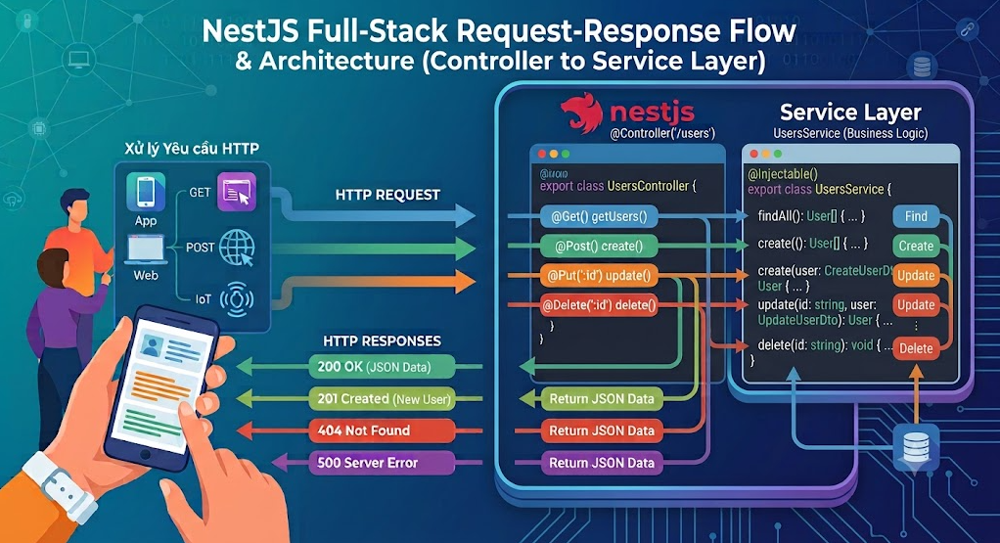

# Lesson 05: Build RESTful API với NestJS - Part 2


## 5. Service & Provider

### 5.1 Service là gì?

**Service** là nơi chứa **business logic** của ứng dụng. Service thực hiện các tác vụ như:

- Xử lý dữ liệu
- Gọi database
- Gọi API bên ngoài
- Tính toán, validate phức tạp



**Tại sao tách Service ra khỏi Controller?**

- **Separation of Concerns**: Controller lo việc HTTP, Service lo business logic
- **Reusability**: Service có thể được sử dụng bởi nhiều controller
- **Testability**: Dễ dàng test service độc lập
- **Maintainability**: Code dễ bảo trì hơn

**Ví dụ:**

```typescript
// src/books/books.service.ts
import { Injectable, NotFoundException } from '@nestjs/common';
import { CreateBookDto } from './dto/create-book.dto';
import { UpdateBookDto } from './dto/update-book.dto';

// Interface cho Book
interface Book {
  id: number;
  title: string;
  author: string;
  price: number;
  category: string;
  publishedYear: number;
}

@Injectable()
export class BooksService {
  // Giả lập database bằng array
  private books: Book[] = [
    {
      id: 1,
      title: 'Clean Code',
      author: 'Robert C. Martin',
      price: 350000,
      category: 'Programming',
      publishedYear: 2008,
    },
    {
      id: 2,
      title: 'The Pragmatic Programmer',
      author: 'Andrew Hunt',
      price: 400000,
      category: 'Programming',
      publishedYear: 1999,
    },
  ];

  private currentId = 3;

  /**
   * Lấy tất cả sách với filter tùy chọn
   */
  findAll(filter?: { category?: string; minPrice?: number; maxPrice?: number }) {
    let result = [...this.books];

    if (filter?.category) {
      result = result.filter(
        book => book.category.toLowerCase() === filter.category.toLowerCase()
      );
    }

    if (filter?.minPrice) {
      result = result.filter(book => book.price >= filter.minPrice);
    }

    if (filter?.maxPrice) {
      result = result.filter(book => book.price <= filter.maxPrice);
    }

    return {
      data: result,
      total: result.length,
    };
  }

  /**
   * Lấy một cuốn sách theo ID
   */
  findOne(id: number): Book {
    const book = this.books.find(b => b.id === id);
    
    if (!book) {
      throw new NotFoundException(`Book with ID ${id} not found`);
    }
    
    return book;
  }

  /**
   * Tạo sách mới
   */
  create(createBookDto: CreateBookDto): Book {
    const newBook: Book = {
      id: this.currentId++,
      ...createBookDto,
    };

    this.books.push(newBook);
    
    return newBook;
  }

  /**
   * Cập nhật sách
   */
  update(id: number, updateBookDto: UpdateBookDto): Book {
    const bookIndex = this.books.findIndex(b => b.id === id);

    if (bookIndex === -1) {
      throw new NotFoundException(`Book with ID ${id} not found`);
    }

    this.books[bookIndex] = {
      ...this.books[bookIndex],
      ...updateBookDto,
    };

    return this.books[bookIndex];
  }

  /**
   * Xóa sách
   */
  remove(id: number): void {
    const bookIndex = this.books.findIndex(b => b.id === id);

    if (bookIndex === -1) {
      throw new NotFoundException(`Book with ID ${id} not found`);
    }

    this.books.splice(bookIndex, 1);
  }

  /**
   * Tìm sách theo tác giả
   */
  findByAuthor(authorId: number) {
    // Giả lập tìm theo tác giả
    return this.books.filter(book => book.author.includes('Martin'));
  }
}
```

Bạn có thể sử dụng Nest CLI để tạo service nhanh chóng:

```bash
nest generate service modules/books
```

### 5.2 Provider là gì?

**Provider** là một khái niệm rộng hơn trong NestJS. Bất kỳ class nào có thể được **inject** vào class khác đều là provider.

**Các loại Provider phổ biến:**

- Service
- Repository
- Factory
- Helper

**Tất cả đều được đánh dấu bằng `@Injectable()`**

```typescript
// Service Provider
@Injectable()
export class BooksService {}

// Repository Provider
@Injectable()
export class BooksRepository {}

// Helper Provider
@Injectable()
export class StringHelper {}
```

### 5.3 Injectable Decorator

`@Injectable()` cho phép class được **inject** vào các class khác thông qua **Dependency Injection**.

```typescript
import { Injectable } from '@nestjs/common';

@Injectable()
export class BooksService {
  // Service code...
}
```

### 5.4 Inject Service vào Controller

NestJS sử dụng **Constructor Injection** để inject dependencies.

```typescript
// src/books/books.controller.ts
import { Controller, Get } from '@nestjs/common';
import { BooksService } from './books.service';

@Controller('books')
export class BooksController {
  // Inject BooksService vào controller
  constructor(private readonly booksService: BooksService) {}
  
  @Get()
  findAll() {
    // Sử dụng service đã được inject
    return this.booksService.findAll();
  }
}
```

**Giải thích:**

```typescript
constructor(private readonly booksService: BooksService) {}
```

- `private`: Tạo property private cho class
- `readonly`: Không thể thay đổi sau khi khởi tạo
- `booksService`: Tên biến
- `BooksService`: Type (NestJS dùng type này để inject đúng service)

**Tương đương với:**

```typescript
private readonly booksService: BooksService;

constructor(booksService: BooksService) {
  this.booksService = booksService;
}
```

**Ví dụ inject nhiều service:**

```typescript
@Controller('orders')
export class OrdersController {
  constructor(
    private readonly ordersService: OrdersService,
    private readonly booksService: BooksService,
    private readonly usersService: UsersService,
    private readonly emailService: EmailService,
  ) {}

  @Post()
  async createOrder(@Body() createOrderDto: CreateOrderDto) {
    // Sử dụng nhiều service
    const book = await this.booksService.findOne(createOrderDto.bookId);
    const user = await this.usersService.findOne(createOrderDto.userId);
    const order = await this.ordersService.create(createOrderDto);
    await this.emailService.sendOrderConfirmation(user.email, order);
    
    return order;
  }
}
```


---


## 6. Modules và Mục đích sử dụng

### 6.1 Module là gì?

**Module** trong NestJS là một class được đánh dấu bằng decorator `@Module()`. Module giúp tổ chức code thành các khối chức năng liên quan, dễ quản lý và tái sử dụng.


Ví dụ minh họa `BooksModule`:

```typescript
// src/books/books.module.ts
import { Module } from '@nestjs/common';
import { BooksController } from './books.controller';
import { BooksService } from './books.service';

@Module({
  controllers: [BooksController],
  providers: [BooksService],
})
export class BooksModule {}
```


**Ví dụ thực tế:**
Trong ứng dụng quản lý thư viện, bạn có thể có:

- `BooksModule` - Quản lý sách
- `UsersModule` - Quản lý người dùng
- `AuthModule` - Xác thực
- `OrdersModule` - Quản lý đơn mượn/trả sách

### 6.2 Root Module vs Feature Module

#### Root Module (App Module)

Module gốc của ứng dụng, nơi import tất cả các module khác.

```typescript
// src/app.module.ts
import { Module } from '@nestjs/common';
import { BooksModule } from './books/books.module';
import { UsersModule } from './users/users.module';
import { AuthModule } from './auth/auth.module';

@Module({
  imports: [
    BooksModule,    // Import feature modules
    UsersModule,
    AuthModule,
  ],
})
export class AppModule {}
```

#### Feature Module

Module chức năng, tập trung vào một domain cụ thể. `Domain` = lĩnh vực nghiệp vụ (business domain) mà hệ thống hoặc module đang giải quyết.

```typescript
// src/books/books.module.ts
import { Module } from '@nestjs/common';
import { BooksController } from './books.controller';
import { BooksService } from './books.service';

@Module({
  controllers: [BooksController],
  providers: [BooksService],
  exports: [BooksService],  // Cho phép module khác sử dụng
})
export class BooksModule {}
```

### 6.3 @Module Decorator

Decorator `@Module()` nhận một object với các thuộc tính:

```typescript
@Module({
  imports: [],      // Các module khác mà module này cần
  controllers: [],  // Các controller của module
  providers: [],    // Các service/provider của module
  exports: [],      // Các provider muốn chia sẻ với module khác
})
```

**Ví dụ chi tiết:**

```typescript
// src/books/books.module.ts
import { Module } from '@nestjs/common';
import { BooksController } from './books.controller';
import { BooksService } from './books.service';
import { DatabaseModule } from '../database/database.module';

@Module({
  imports: [
    DatabaseModule,  // Module này cần DatabaseModule để kết nối DB
  ],
  controllers: [
    BooksController,  // Controller xử lý HTTP requests
  ],
  providers: [
    BooksService,     // Service chứa business logic
  ],
  exports: [
    BooksService,     // Cho phép module khác inject BooksService
  ],
})
export class BooksModule {}
```

**Giải thích:**

- **imports**: Import `DatabaseModule` để sử dụng các service kết nối database
- **controllers**: Đăng ký `BooksController` để xử lý các HTTP request liên quan đến books
- **providers**: Đăng ký `BooksService` để NestJS có thể inject nó vào controller
- **exports**: Export `BooksService` để module khác (ví dụ `OrdersModule`) có thể sử dụng

### 6.4 Tổ chức Modules trong dự án lớn

Trong các dự án NestJS lớn, việc tổ chức modules là rất quan trọng để duy trì tính dễ quản lý và tái sử dụng. Một số nguyên tắc tốt:

1. **Tách biệt theo domain**: Mỗi module nên tập trung vào một domain cụ thể (ví dụ: `UsersModule`, `ProductsModule`, `OrdersModule`).
6. **Sử dụng Feature Modules**: Tạo các feature modules để nhóm các controller, service, DTO liên quan.
3. **Root Module**: Chỉ chứa các module chính và cấu hình chung.
5. **Submodules**: Trong các feature module lớn, có thể chia nhỏ thành submodules nếu cần thiết.

Ví dụ cấu trúc thư mục:

```
src/
├── app.module.ts          // Root Module
├── books/
│   ├── books.module.ts    // Feature Module cho Books
│   ├── books.controller.ts
│   ├── books.service.ts
│   └── dto/
├── users/
│   ├── users.module.ts    // Feature Module cho Users
│   ├── users.controller.ts
│   ├── users.service.ts
│   └── dto/
├── auth/
│   ├── auth.module.ts     // Feature Module cho Auth
│   ├── auth.controller.ts
│   ├── auth.service.ts
│   └── strategies/
└── database/
    ├── database.module.ts  // Module kết nối Database
    └── database.service.ts
```

### 6.5 Nâng cao về Modules

- Custom providers
- Asynchronous providers
- Dynamic modules
- Injection scopes
- Circular dependency
- Module reference
- Lazy-loading modules

Xem chi tiết [NestJS Fundamentals](./NestJS-Fundamentals.md)


### 6.6 Module CLI

Bạn có thể sử dụng Nest CLI để tạo module nhanh chóng:

```bash
nest generate module modules/books
```

hoặc tự tạo thủ công theo cấu trúc đề xuất ở trên.

