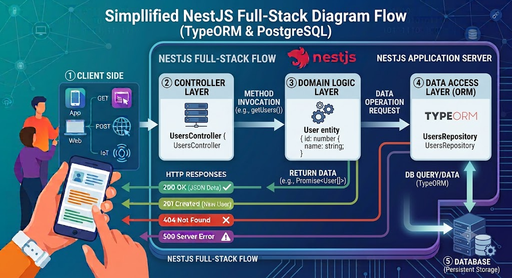

# Lesson 06 - Kết nối Database

## Mục tiêu bài học

- Hiểu vai trò của database trong ứng dụng
- Hiểu khái niệm ORM và lợi ích của nó
- Tìm hiểu về TypeORM và cách tích hợp với NestJS
- Kết nối và cấu hình PostgreSQL database
- Làm việc với Entity và Repository pattern
- Thực hiện các thao tác CRUD cơ bản
- Hiểu sự khác biệt giữa Entity và DTO Response
- Áp dụng Data Mapper Pattern
- Cấu hình multi database connection

---

## 1. Database trong Backend Application



### 1.1. Vai trò của database

Database là thành phần quan trọng trong hầu hết các ứng dụng backend. Nó đóng vai trò như một nơi lưu trữ dữ liệu có cấu trúc, cho phép:

- **Lưu trữ**: Giữ dữ liệu một cách bền vững, ngay cả khi ứng dụng tắt
- **Truy vấn**: Cho phép truy xuất dữ liệu một cách hiệu quả thông qua các câu lệnh SQL hoặc ORM
- **Quản lý quan hệ**: Lưu trữ và quản lý các mối quan hệ giữa các thực thể (entities)
- **Bảo mật**: Cung cấp các cơ chế bảo mật để kiểm soát truy cập dữ liệu
- **Tính toàn vẹn**: Đảm bảo dữ liệu luôn nhất quán và chính xác thông qua các ràng buộc (constraints)
- **Hiệu suất**: Tối ưu hóa truy vấn và lưu trữ để đảm bảo ứng dụng hoạt động nhanh chóng
- **Scalability**: Hỗ trợ mở rộng khi lượng dữ liệu và người dùng tăng lên
- **Backup và Recovery**: Cung cấp các công cụ để sao lưu và khôi phục dữ liệu khi cần thiết

### 1.2. Các loại database phổ biến

- **Relational Databases (RDBMS)**: MySQL, PostgreSQL, SQL Server, Oracle
- **NoSQL Databases**: MongoDB, Cassandra, Redis


## 2. ORM là gì?

### 2.1. Khái niệm về ORM

**ORM** (Object-Relational Mapping) là một kỹ thuật lập trình cho phép bạn **ánh xạ** (mapping) giữa:

- **Objects** trong code (class, instance)
- **Tables** trong relational database (bảng, cột, hàng)

**Ví dụ đơn giản:**

Thay vì viết SQL:

```sql
SELECT * FROM books WHERE id = 1;
INSERT INTO books (title, description, pages) VALUES ('Clean Code', 'A handbook...', 464);
```

Bạn có thể làm việc với objects:

```typescript
// Lấy sách
const book = await bookRepository.findOne({ where: { id: 1 } });

// Tạo sách mới
const newBook = bookRepository.create({
  title: 'Clean Code',
  description: 'A handbook...',
  pages: 464
});
await bookRepository.save(newBook);
```

### 2.2. ORM giải quyết vấn đề gì?

ORM giúp giải quyết nhiều vấn đề khi làm việc với database:

**Vấn đề 1: SQL Injection**

Không dùng ORM (dễ bị SQL Injection):

```typescript
// ❌ NGUY HIỂM
const userId = request.params.id; // "1 OR 1=1"
const query = `SELECT * FROM users WHERE id = ${userId}`;
// SQL: SELECT * FROM users WHERE id = 1 OR 1=1
// Trả về tất cả users!
```

Dùng ORM (an toàn):

```typescript
// ✅ AN TOÀN
const user = await userRepository.findOne({ 
  where: { id: userId } 
});
// ORM tự động escape và validate
```

**Vấn đề 2: Code lặp lại nhiều**

Không dùng ORM:

```typescript
// Phải viết SQL cho mọi thao tác
const createUser = async (data) => {
  const query = `INSERT INTO users (name, email) VALUES (?, ?)`;
  return await db.execute(query, [data.name, data.email]);
};

const updateUser = async (id, data) => {
  const query = `UPDATE users SET name = ?, email = ? WHERE id = ?`;
  return await db.execute(query, [data.name, data.email, id]);
};

const deleteUser = async (id) => {
  const query = `DELETE FROM users WHERE id = ?`;
  return await db.execute(query, [id]);
};
```

Dùng ORM:

```typescript
// ORM cung cấp sẵn methods
await userRepository.save(userData);
await userRepository.update(id, userData);
await userRepository.delete(id);
```

**Vấn đề 3: Database-specific syntax**

Cùng một thao tác nhưng SQL khác nhau giữa các loại DBMS:

```typescript
// PostgreSQL
SELECT * FROM users LIMIT 10 OFFSET 20;

// MySQL
SELECT * FROM users LIMIT 20, 10;

// SQL Server
SELECT * FROM users ORDER BY id OFFSET 20 ROWS FETCH NEXT 10 ROWS ONLY;
```

Với ORM - cùng một syntax.

Nó giống như  một `abstraction layer` tự điều chỉnh cho từng database:

```typescript
userRepository.find({ 
  skip: 20, 
  take: 10 
});
```

**Vấn đề 4: Khó maintain và refactor**

```typescript
// Nếu đổi tên column từ 'full_name' sang 'name'
// Không dùng ORM: phải tìm và sửa tất cả SQL queries trong code

// Dùng ORM: chỉ cần sửa trong Entity definition
@Entity()
class User {
  @Column({ name: 'full_name' }) // Mapping column name
  name: string;
}
```

### 2.3. ORM và SQL truyền thống

**So sánh:**

| Tiêu chí | SQL truyền thống | ORM |
|----------|------------------|-----|
| **Cú pháp** | SQL queries | Object methods |
| **Type Safety** | Không | Có (với TypeScript) |
| **SQL Injection** | Dễ bị nếu không cẩn thận | Tự động prevent |
| **Database Migration** | Phải tự viết | Tools hỗ trợ |
| **Quan hệ (Relations)** | Phải tự JOIN | Tự động load |
| **Performance** | Tối ưu hơn nếu viết tốt | Có thể chậm hơn một chút |
| **Learning Curve** | Cần biết SQL | Cần học ORM |

**Khi nào dùng SQL thuần?**

- Query phức tạp, cần tối ưu cao
- Reporting, analytics
- Bulk operations lớn
- Stored procedures

**Khi nào dùng ORM?**

- CRUD operations thông thường
- Application với nhiều business logic
- Cần type safety và maintainability
- Team lớn, cần consistent code style

---

## 3. Giới thiệu TypeORM / Prisma

### 3.1. Tổng quan về TypeORM

**TypeORM** là một ORM được viết bằng TypeScript, hỗ trợ nhiều databases:

- PostgreSQL
- MySQL / MariaDB
- SQLite
- Microsoft SQL Server
- Oracle
- MongoDB (partial support)

> Trang chủ TypeORM: [https://typeorm.io/docs/getting-started](https://typeorm.io/docs/getting-started)

**Đặc điểm:**

- Sử dụng **Decorators** để define entities
- Hỗ trợ **Active Record** và **Data Mapper** patterns
- Migration system mạnh mẽ
- Query Builder linh hoạt
- Tích hợp tốt với NestJS

**Ví dụ Entity với TypeORM:**

```typescript
import { Entity, PrimaryGeneratedColumn, Column } from 'typeorm';

@Entity('books')
export class Book {
  @PrimaryGeneratedColumn()
  id: number;

  @Column()
  title: string;

  @Column()
  description: string;

  @Column()
  pages: number;
}
```

### 3.2. Tổng quan về Prisma

**Prisma** là một modern ORM với approach khác:

- Schema được định nghĩa trong file `.prisma`
- Type-safe client được generate tự động
- Migration system đơn giản
- Prisma Studio (GUI tool)

> Trang chủ Prisma ORM: [https://www.prisma.io/orm](https://www.prisma.io/orm)

**Ví dụ Schema với Prisma:**

```prisma
model Book {
  id          Int      @id @default(autoincrement())
  title       String
  description String
  pages       Int
  createdAt   DateTime @default(now())
  updatedAt   DateTime @updatedAt
}
```

### 3.3. So sánh TypeORM và Prisma

| Tiêu chí | TypeORM | Prisma |
|----------|---------|--------|
| **Schema Definition** | Decorators trong code | Schema file (.prisma) |
| **Type Generation** | Manual | Auto-generated |
| **Learning Curve** | Trung bình | Dễ hơn |
| **Migration** | Mạnh, linh hoạt | Đơn giản hơn |
| **Query Builder** | Có | Không (dùng API) |
| **Raw SQL** | Dễ dàng | Khó hơn |
| **Relations** | Flexible | Declarative, dễ hiểu |
| **Performance** | Tốt | Tốt hơn một chút |
| **Community** | Lớn hơn | Đang phát triển nhanh |
| **NestJS Integration** | Native support | Cần setup thêm |

**TypeORM:**

```typescript
// Query với TypeORM
const books = await bookRepository
  .createQueryBuilder('book')
  .where('book.pages > :pages', { pages: 300 })
  .orderBy('book.title', 'ASC')
  .getMany();
```

**Prisma:**

```typescript
// Query với Prisma
const books = await prisma.book.findMany({
  where: {
    pages: { gt: 300 }
  },
  orderBy: {
    title: 'asc'
  }
});
```

### 3.4. Lý do chọn TypeORM trong bài học này

1. **Native NestJS Integration**: TypeORM có module chính thức từ NestJS
2. **Decorators**: Nhất quán với NestJS style
3. **Flexible**: Hỗ trợ cả Active Record và Data Mapper patterns
4. **Raw SQL**: Dễ dàng khi cần performance cao
5. **Community**: Tài liệu và community support phong phú
6. **Learning**: Học TypeORM giúp hiểu sâu về ORM patterns

> **Lưu ý**: Cả TypeORM và Prisma đều là lựa chọn tốt. Chọn tool nào phụ thuộc vào requirements của dự án.

---

## 4. Cấu hình kết nối database (PostgreSQL)

Xem tài liệu chính thức về [TypeORM trong NestJS](https://docs.nestjs.com/recipes/sql-typeorm)

### 4.1. Cài đặt package cần thiết

```bash
# Cài đặt TypeORM và PostgreSQL driver
npm install @nestjs/typeorm typeorm pg
```

**Packages:**

- `@nestjs/typeorm`: NestJS wrapper cho TypeORM
- `typeorm`: ORM library
- `pg`: PostgreSQL driver

### 4.2. Cấu hình .env

Thêm các biến môi trường kết nối database vào trong file `.env`:

```bash
# .env
# Database Configuration
DB_TYPE=postgres
DB_HOST=localhost
DB_PORT=5432
DB_USERNAME=postgres
DB_PASSWORD=your_password
DB_DATABASE=bookstore_db
DB_SYNCHRONIZE=true  # Chỉ dùng trong development, KHÔNG dùng trong production
DB_LOGGING=true

# Application Configuration
PORT=3000
NODE_ENV=development
```

**Giải thích:**

- `DB_TYPE`: Loại database (postgres, mysql, sqlite...)
- `DB_HOST`: Địa chỉ database server
- `DB_PORT`: Port của database (PostgreSQL default: 5432, MySQL: 3306)
- `DB_USERNAME`: Username để connect
- `DB_PASSWORD`: Password
- `DB_DATABASE`: Tên database
- `DB_SYNCHRONIZE`: Tự động sync schema (⚠️ chỉ dev, KHÔNG production)
- `DB_LOGGING`: Log SQL queries

**⚠️ Quan trọng về DB_SYNCHRONIZE:**

```typescript
// ✅ Development
DB_SYNCHRONIZE=true  // Tự động tạo/update tables

// ❌ Production
DB_SYNCHRONIZE=false // PHẢI dùng migrations
```

Tại sao không dùng synchronize trong production?

- Có thể mất dữ liệu khi alter table
- Không có version control cho schema changes
- Không rollback được nếu có lỗi
- Performance issues khi app khởi động

### 4.3. Cấu hình kết nối trong ứng dụng NestJS

#### Bước 1: Tạo database configuration file

- Cách Bình thường [database.config.ts](./database.config.ts)
- Sử dụng Joi validate [database-joi.config.ts](./database-joi.config.ts)

Giải thích file cấu hình:

- `type`: Loại database (postgres, mysql...)
- `host`, `port`, `username`, `password`, `database`: Thông tin kết nối
- `entities`: Đường dẫn đến các entity files
- `synchronize`: Tự động sync schema (chỉ dev)
- `logging`: Bật log SQL queries
- `ssl`: Cấu hình SSL nếu cần, nếu dùng trong production với cloud DB
- `extra`: Các options bổ sung cho driver.

#### Bước 2: Import ConfigModule và TypeOrmModule trong AppModule

```typescript
// src/app.module.ts
import { Module } from '@nestjs/common';
import { ConfigModule, ConfigService } from '@nestjs/config';
import { TypeOrmModule } from '@nestjs/typeorm';
import databaseConfig from './config/database.config';
import { BooksModule } from './books/books.module';

@Module({
  imports: [
    // Config Module - Load environment variables
    ConfigModule.forRoot({
      isGlobal: true, // Làm cho ConfigService available ở mọi nơi
      load: [databaseConfig], // Load database configuration
      envFilePath: '.env',
      //validation options
      validationOptions: {
        allowUnknown: true, // Cho phép env variables không được define trong schema
        abortEarly: false,  // Validate tất cả fields, không dừng ở error đầu tiên
      },
    }),

    // TypeORM Module - Database connection
    TypeOrmModule.forRootAsync({
      imports: [ConfigModule],
      inject: [ConfigService],
      useFactory: (configService: ConfigService) => ({
        ...configService.get('database'),
      }),
    }),

    // Feature Modules
    BooksModule,
  ],
})
export class AppModule {}
```

**Giải thích:**

**ConfigModule.forRoot():**

- `isGlobal: true`: ConfigService có thể inject ở mọi module mà không cần import
- `load: [databaseConfig]`: Load configuration từ file
- `envFilePath: '.env'`: Đường dẫn đến file environment

**TypeOrmModule.forRootAsync():**

- Async configuration cho phép inject dependencies
- `useFactory`: Function trả về TypeORM options
- Sử dụng ConfigService để lấy database config

#### Bước 3: Cấu hình TypeOrmModule trong Feature Module

Ví dụ bạn muôn sử dụng Book entity trong BooksModule:

```typescript
// src/books/books.module.ts
import { Module } from '@nestjs/common';
import { TypeOrmModule } from '@nestjs/typeorm';
import { BooksController } from './books.controller';
import { BooksService } from './books.service';
import { Book } from './entities/book.entity';

@Module({
  imports: [
    // Đăng ký entities cho module này
    TypeOrmModule.forFeature([Book]),
  ],
  controllers: [BooksController],
  providers: [BooksService],
  exports: [BooksService], // Export nếu module khác cần dùng
})
export class BooksModule {}
```

**TypeOrmModule.forFeature([Book]):**

- Đăng ký Book entity cho module này
- Tạo Repository cho Book entity
- Repository có thể inject vào services

Trong BooksService:

```typescript
import { Injectable } from '@nestjs/common';
import { InjectRepository } from '@nestjs/typeorm';
import { Repository } from 'typeorm';
import { Book } from './entities/book.entity';
@Injectable()
export class BooksService {
  constructor(
    @InjectRepository(Book)
    private readonly bookRepository: Repository<Book>,
  ) {}
  // Ví dụ method lấy tất cả sách
  getAllBooks() {
    return this.bookRepository.find();
  }
}
```

**@InjectRepository(Book):**

- Decorator để inject Book Repository
- TypeORM tự động tạo Repository từ Entity
- `Repository<Book>` là type của repository

Qua `repository`, bạn có thể thực hiện các thao tác truy vấn trên Book entity.

### 4.4. Database module trong NestJS: forRoot và forFeature

**Database module là gì?**

Database module (TypeOrmModule trong trường hợp này) là một module đặc biệt trong NestJS dùng để cấu hình và quản lý kết nối đến database cũng như đăng ký các entities và repositories.

Có hai phương thức chính để cấu hình database module:

**forRoot() - Global Database Connection:**

```typescript
// Chỉ gọi 1 lần trong AppModule
TypeOrmModule.forRoot({
  type: 'postgres',
  host: 'localhost',
  // ... other options
  entities: [__dirname + '/**/*.entity{.ts,.js}'],
})
```

**Chức năng:**

- Thiết lập connection đến database
- Load tất cả entities
- Tạo DataSource (connection pool)
- Chỉ gọi 1 lần trong root module (AppModule)

**forFeature() - Feature-specific Repositories:**

```typescript
// Gọi trong mỗi feature module
TypeOrmModule.forFeature([Book, Author, Category])
```

**Chức năng:**

- Đăng ký entities cụ thể cho module
- Tạo repositories cho các entities
- Repositories có thể inject vào services trong module đó
- Gọi trong mỗi feature module cần sử dụng entities

**Ví dụ flow:**

Khi bạn cần sử dụng Book và Author entities trong ứng dụng, bạn cần làm theo sau:

```typescript
// 1. AppModule - forRoot()
@Module({
  imports: [
    TypeOrmModule.forRoot({ /* config */ }),
    //Đăng ký các feature modules vào AppModule
    BooksModule,
    AuthorsModule,
  ],
})
export class AppModule {}

// 2. BooksModule - forFeature()
@Module({
  imports: [
    TypeOrmModule.forFeature([Book]), // Sử dụng Book entity cho BooksModule
  ],
  // ...
})
export class BooksModule {}

// 3. AuthorsModule - forFeature()
@Module({
  imports: [
    TypeOrmModule.forFeature([Author]), // Sử dụng Author entity cho AuthorsModule
  ],
  // ...
})
export class AuthorsModule {}
```

---

## 5. Entity & Repository

### 5.1. Entity là gì?

**Entity** là một class đại diện cho một **table** trong database. Mỗi instance của Entity tương ứng với một **row** trong table.

> Xem tài liệu chính thức về [Entities](https://typeorm.io/entities)

**Ví dụ trực quan:**

```
Database Table: books
+----+-------------+------------------+-------+
| id | title       | description      | pages |
+----+-------------+------------------+-------+
| 1  | Clean Code  | A handbook...    | 464   |
| 2  | Pragmatic   | Your journey...  | 352   |
+----+-------------+------------------+-------+

↓ Ánh xạ thành ↓

Entity Class: Book
class Book {
  id: 1
  title: 'Clean Code'
  description: 'A handbook...'
  pages: 464
}
```

### 5.2. Column, Primary Key, Data Types

Khi tạo một Entity, bạn sẽ sử dụng các **decorators** để định nghĩa các column, primary key, và kiểu dữ liệu.

**Tạo Book Entity:**

```typescript
// src/books/entities/book.entity.ts
import {
  Entity,
  PrimaryGeneratedColumn,
  Column,
  CreateDateColumn,
  UpdateDateColumn,
} from 'typeorm';

@Entity('books') // Tên table trong database
export class Book {
  @PrimaryGeneratedColumn()
  id: number;

  @Column({ type: 'varchar', length: 255 })
  title: string;

  @Column({ type: 'text' })
  description: string;

  @Column({ type: 'int' })
  pages: number;

  @Column('simple-array', { nullable: true })
  genres: string[];

  @Column({ type: 'varchar', length: 20, nullable: true, unique: true })
  isbn: string;

  @Column({ type: 'int', nullable: true })
  publishedYear: number;

  @CreateDateColumn()
  createdAt: Date;

  @UpdateDateColumn()
  updatedAt: Date;
}
```

**Giải thích các decorators:**

**@Entity('books'):**

- Đánh dấu class là một entity
- `'books'` là tên table trong database
- Nếu không truyền tên, TypeORM sẽ dùng tên class (lowercase)

**@PrimaryGeneratedColumn():**

- Primary key tự động tăng (auto-increment)
- Tương đương SQL: `id SERIAL PRIMARY KEY` (PostgreSQL) hoặc `id INT AUTO_INCREMENT PRIMARY KEY` (MySQL)

**@Column():**

- Đánh dấu property là một column
- Có thể config type, length, nullable, default, unique...

**@CreateDateColumn():**

- Tự động set thời gian khi record được tạo
- Type: `timestamp with time zone`

**@UpdateDateColumn():**

- Tự động update thời gian khi record được cập nhật

**Column Options:**

```typescript
@Column({
  type: 'varchar',      // Kiểu dữ liệu
  length: 255,          // Độ dài (cho string)
  nullable: true,       // Có thể null không
  unique: true,         // Giá trị unique
  default: 'default',   // Giá trị mặc định
  name: 'column_name',  // Tên column trong DB (nếu khác property name)
  comment: 'Comment',   // Comment trong DB
})
propertyName: string;
```

- Xem chi tiết về [Column Options](https://typeorm.io/docs/entity/entities#column-options)

**Data Types phổ biến:**

| TypeScript Type | TypeORM Type | PostgreSQL Type | MySQL Type |
|----------------|--------------|-----------------|------------|
| `string` | `varchar` | `varchar(n)` | `VARCHAR(n)` |
| `string` | `text` | `text` | `TEXT` |
| `number` | `int` | `integer` | `INT` |
| `number` | `bigint` | `bigint` | `BIGINT` |
| `number` | `decimal` | `decimal(p,s)` | `DECIMAL(p,s)` |
| `boolean` | `boolean` | `boolean` | `TINYINT(1)` |
| `Date` | `timestamp` | `timestamp` | `DATETIME` |
| `Date` | `date` | `date` | `DATE` |
| `object` | `json` | `json` | `JSON` |
| `string[]` | `simple-array` | `text` | `TEXT` |

- Xem chi tiết về [TypeORM Column Types](https://typeorm.io/docs/entity/entities#column-types)

**Ví dụ đầy đủ các column types:**

```typescript
@Entity()
export class Example {
  @PrimaryGeneratedColumn('uuid') // UUID instead of auto-increment
  id: string;

  @Column('varchar', { length: 100 })
  name: string;

  @Column('text')
  longText: string;

  @Column('int')
  intNumber: number;

  @Column('decimal', { precision: 10, scale: 2 })
  price: number; // 12345678.90

  @Column('boolean', { default: true })
  isActive: boolean;

  @Column('json')
  metadata: object;

  @Column('simple-array')
  tags: string[]; // Lưu dưới dạng "tag1,tag2,tag3"

  @Column('timestamp', { default: () => 'CURRENT_TIMESTAMP' })
  timestamp: Date;

  @Column({ type: 'enum', enum: ['admin', 'user', 'guest'], default: 'user' })
  role: string;
}
```

### 5.3. Repository Pattern

**Repository** là một pattern cung cấp một abstraction layer để truy cập database. Trong TypeORM, Repository là class chứa các methods để thao tác với entities.

**Repository cung cấp sẵn các methods:**

```typescript
// Finding
find()              // Lấy tất cả
findOne()           // Lấy 1 record
findOneBy()         // Lấy 1 record theo điều kiện
findAndCount()      // Lấy data + count
findBy()            // Lấy theo điều kiện

// Creating
create()            // Tạo entity instance
save()              // Lưu vào database

// Updating
update()            // Update theo điều kiện
save()              // Cũng dùng để update

// Deleting
delete()            // Xóa theo điều kiện
remove()            // Xóa entity instance
softDelete()        // Soft delete (đánh dấu deleted)

// Others
count()             // Đếm
exist()             // Kiểm tra tồn tại
createQueryBuilder() // Tạo complex queries
```

- Xem thêm chi tiết về [Find Options](https://typeorm.io/docs/working-with-entity-manager/find-options)
- Xem thêm chi tiết về [Repository API](https://typeorm.io/docs/working-with-entity-manager/repository-api)

--

## 6. Validation và Transformation với DTO

### 6.1. Validation là gì ?

**Validation** là quá trình kiểm tra dữ liệu đầu vào để đảm bảo rằng nó đáp ứng các yêu cầu nhất định trước khi được xử lý hoặc lưu vào database. Validation giúp:

- Bảo vệ ứng dụng khỏi dữ liệu không hợp lệ hoặc độc hại
- Cải thiện trải nghiệm người dùng bằng cách cung cấp feedback rõ ràng
- Đảm bảo tính toàn vẹn của dữ liệu
- Giảm thiểu lỗi và bugs trong ứng dụng
- Tăng cường bảo mật bằng cách ngăn chặn các cuộc tấn công như SQL Injection, XSS, v.v.

### 6.2. DTO (Data Transfer Object) là gì?

**DTO (Data Transfer Object)** là một design pattern được sử dụng để truyền dữ liệu giữa các layer khác nhau của ứng dụng. DTO giúp tách biệt giữa dữ liệu trong database và dữ liệu được truyền qua API.

**DTO** là một design pattern dùng để định nghĩa cấu trúc dữ liệu được truyền giữa các layers của ứng dụng. Trong NestJS, DTO giúp:

- Định nghĩa schema cho dữ liệu đầu vào/đầu ra
- Validate dữ liệu tự động
- Transform dữ liệu (type conversion)
- Tạo documentation tự động (với Swagger)
- Type safety với TypeScript


**Tại sao cần DTO?**

Không có DTO:

```typescript
@Post()
create(@Body() body: any) {
  // body có thể là bất cứ thứ gì
  // Không có type safety
  // Không có validation
  // Dễ gây lỗi
  return this.booksService.create(body);
}
```

Có DTO:

```typescript
@Post()
create(@Body() createBookDto: CreateBookDto) {
  // createBookDto đã được validate
  // Type-safe
  // IDE có autocomplete
  return this.booksService.create(createBookDto);
}
```

### 6.3. Validation với class-validator và class-transformer


**Bước 1: Cài đặt thư viện:**

```bash
npm install class-validator class-transformer
```

**class-validator**: Thư viện để validate dữ liệu dựa trên decorators
**class-transformer**: Thư viện để transform plain objects thành class instances

**Các decorators phổ biến:**

| Decorator | Mục đích | Ví dụ |
|-----------|----------|-------|
| `@IsString()` | Validate là string | `@IsString() title: string;` |
| `@IsNumber()` | Validate là number | `@IsNumber() pages: number;` |
| `@IsInt()` | Validate là integer | `@IsInt() age: number;` |
| `@IsEmail()` | Validate email | `@IsEmail() email: string;` |
| `@IsNotEmpty()` | Không được rỗng | `@IsNotEmpty() title: string;` |
| `@IsOptional()` | Field tùy chọn | `@IsOptional() description?: string;` |
| `@MinLength(n)` | Độ dài tối thiểu | `@MinLength(3) title: string;` |
| `@MaxLength(n)` | Độ dài tối đa | `@MaxLength(100) title: string;` |
| `@Min(n)` | Giá trị tối thiểu | `@Min(1) pages: number;` |
| `@Max(n)` | Giá trị tối đa | `@Max(10000) pages: number;` |
| `@IsArray()` | Validate là array | `@IsArray() genres: string[];` |
| `@ArrayMinSize(n)` | Array size tối thiểu | `@ArrayMinSize(1) genres: string[];` |
| `@ValidateNested()` | Validate nested object | `@ValidateNested() author: AuthorDto;` |


**Bước 2: Tạo DTO:**

**Ví dụ DTO với validation entity "Book":**

**CreateBookDto:**

```typescript
// src/books/dto/create-book.dto.ts
import {
  IsString,
  IsNotEmpty,
  MinLength,
  MaxLength,
  IsInt,
  Min,
  Max,
  IsArray,
  ArrayMinSize,
  IsOptional,
} from 'class-validator';

export class CreateBookDto {
  @IsString({ message: 'Tên sách phải là chuỗi ký tự' })
  @IsNotEmpty({ message: 'Tên sách không được để trống' })
  @MinLength(3, { message: 'Tên sách phải có ít nhất 3 ký tự' })
  @MaxLength(100, { message: 'Tên sách không được vượt quá 100 ký tự' })
  title: string;

  @IsString({ message: 'Mô tả phải là chuỗi ký tự' })
  @IsNotEmpty({ message: 'Mô tả không được để trống' })
  @MinLength(10, { message: 'Mô tả phải có ít nhất 10 ký tự' })
  @MaxLength(500, { message: 'Mô tả không được vượt quá 500 ký tự' })
  description: string;

  @IsInt({ message: 'Số trang phải là số nguyên' })
  @Min(1, { message: 'Số trang phải lớn hơn hoặc bằng 1' })
  @Max(10000, { message: 'Số trang phải nhỏ hơn hoặc bằng 10000' })
  pages: number;

  @IsArray({ message: 'Thể loại phải là một mảng' })
  @ArrayMinSize(1, { message: 'Sách phải có ít nhất 1 thể loại' })
  @IsString({ each: true, message: 'Mỗi thể loại phải là chuỗi ký tự' })
  genres: string[];

  @IsString({ message: 'ISBN phải là chuỗi ký tự' })
  @IsOptional()
  isbn?: string;

  @IsInt({ message: 'Năm xuất bản phải là số nguyên' })
  @Min(1000, { message: 'Năm xuất bản không hợp lệ' })
  @Max(new Date().getFullYear(), { message: 'Năm xuất bản không được lớn hơn năm hiện tại' })
  @IsOptional()
  publishedYear?: number;
}
```

**UpdateBookDto:**

```typescript
// src/books/dto/update-book.dto.ts
import { PartialType } from '@nestjs/mapped-types';
import { CreateBookDto } from './create-book.dto';

// PartialType tự động làm tất cả các fields trở thành optional
export class UpdateBookDto extends PartialType(CreateBookDto) {}

// Tương đương với:
// export class UpdateBookDto {
//   @IsOptional()
//   @IsString()
//   @MinLength(3)
//   @MaxLength(100)
//   title?: string;
//
//   @IsOptional()
//   @IsString()
//   @MinLength(10)
//   @MaxLength(500)
//   description?: string;
//   
//   // ... các fields khác
// }
```

**FilterBooksDto:**

```typescript
// src/books/dto/filter-books.dto.ts
import { IsOptional, IsString, IsInt, Min, Max } from 'class-validator';
import { Type } from 'class-transformer';

export class FilterBooksDto {
  @IsOptional()
  @IsString()
  genre?: string;

  @IsOptional()
  @Type(() => Number)
  @IsInt()
  @Min(1)
  minPages?: number;

  @IsOptional()
  @Type(() => Number)
  @IsInt()
  @Max(10000)
  maxPages?: number;

  @IsOptional()
  @Type(() => Number)
  @IsInt()
  @Min(1)
  page?: number = 1;

  @IsOptional()
  @Type(() => Number)
  @IsInt()
  @Min(1)
  @Max(100)
  limit?: number = 10;
}
```

**Bước 3: Cấu hình Pipe:**


Muốn kích hoạt validation tự động, ta sử dụng `ValidationPipe` của NestJS và cấu hình trong `main.ts`.

**Global ValidationPipe - Áp dụng cho toàn bộ ứng dụng:**

```typescript
// src/main.ts
import { ValidationPipe } from '@nestjs/common';
import { NestFactory } from '@nestjs/core';
import { AppModule } from './app.module';

async function bootstrap() {
  const app = await NestFactory.create(AppModule);

  // Cấu hình ValidationPipe global
  app.useGlobalPipes(
    new ValidationPipe({
      // Tự động loại bỏ các properties không có trong DTO
      whitelist: true,
      
      // Throw error nếu có property không hợp lệ
      forbidNonWhitelisted: true,
      
      // Tự động transform payload thành DTO instance
      transform: true,
      
      // Tự động convert types (string -> number)
      transformOptions: {
        enableImplicitConversion: true,
      },
      
      // Hiển thị error messages (set true trong production để ẩn)
      disableErrorMessages: false,
      
      // Cấu hình validation error response
      validationError: {
        target: false, // Không include target object trong error
        value: false,  // Không include value trong error
      },
    })
  );

  await app.listen(3000);
}
bootstrap();
```

**Các options quan trọng của ValidationPipe:**

| Option | Mặc định | Mô tả |
|--------|----------|-------|
| `whitelist` | false | Tự động xóa properties không có trong DTO |
| `forbidNonWhitelisted` | false | Throw error nếu có property không hợp lệ |
| `transform` | false | Transform payload thành DTO instance |
| `transformOptions` | {} | Options cho class-transformer |
| `disableErrorMessages` | false | Ẩn error messages (dùng cho production) |
| `skipMissingProperties` | false | Bỏ qua validation cho undefined fields |
| `skipNullProperties` | false | Bỏ qua validation cho null fields |
| `skipUndefinedProperties` | false | Bỏ qua validation cho undefined fields |

**Ví dụ về whitelist và forbidNonWhitelisted:**

```typescript
// CreateBookDto chỉ có: title, description, pages, genres

// Request body:
{
  "title": "Clean Code",
  "description": "A handbook...",
  "pages": 464,
  "genres": ["Programming"],
  "extraField": "This should not be here",
  "anotherField": 123
}

// Với whitelist: true, forbidNonWhitelisted: false
// => extraField và anotherField sẽ bị loại bỏ im lặng

// Với whitelist: true, forbidNonWhitelisted: true
// => Throw BadRequestException: "property extraField should not exist"
```

**Controller-level hoặc Route-level ValidationPipe:**

```typescript
// src/books/books.controller.ts
import { 
  Controller, 
  Post, 
  Body, 
  UsePipes, 
  ValidationPipe 
} from '@nestjs/common';
import { CreateBookDto } from './dto/create-book.dto';

@Controller('books')
export class BooksController {
  // Áp dụng cho một route cụ thể
  @Post()
  @UsePipes(new ValidationPipe({ transform: true }))
  create(@Body() createBookDto: CreateBookDto) {
    console.log(createBookDto instanceof CreateBookDto); // true
    return { message: 'Book created', data: createBookDto };
  }

  // Áp dụng cho một parameter cụ thể
  @Post('alternative')
  createAlternative(
    @Body(new ValidationPipe({ transform: true })) 
    createBookDto: CreateBookDto
  ) {
    return { message: 'Book created', data: createBookDto };
  }
}
```

**Ví dụ validation thực tế:**

```typescript
// src/books/books.controller.ts
import { 
  Controller, 
  Get, 
  Post, 
  Put, 
  Delete,
  Body, 
  Param, 
  Query,
  ParseIntPipe,
  HttpCode,
  HttpStatus,
} from '@nestjs/common';
import { BooksService } from './books.service';
import { CreateBookDto } from './dto/create-book.dto';
import { UpdateBookDto } from './dto/update-book.dto';
import { FilterBooksDto } from './dto/filter-books.dto';

@Controller('books')
export class BooksController {
  constructor(private readonly booksService: BooksService) {}

  @Get()
  findAll(@Query() filterDto: FilterBooksDto) {
    console.log('4. Pipe: Validating and transforming query params');
    // filterDto đã được validate và transform
    return this.booksService.findAll(filterDto);
  }

  @Get(':id')
  findOne(@Param('id', ParseIntPipe) id: number) {
    // ParseIntPipe tự động convert string -> number và validate
    console.log(typeof id); // number
    return this.booksService.findOne(id);
  }

  @Post()
  @HttpCode(HttpStatus.CREATED)
  create(@Body() createBookDto: CreateBookDto) {
    console.log('4. Pipe: Validating and transforming body');
    // createBookDto đã được validate
    return this.booksService.create(createBookDto);
  }

  @Put(':id')
  update(
    @Param('id', ParseIntPipe) id: number,
    @Body() updateBookDto: UpdateBookDto,
  ) {
    return this.booksService.update(id, updateBookDto);
  }

  @Delete(':id')
  @HttpCode(HttpStatus.NO_CONTENT)
  remove(@Param('id', ParseIntPipe) id: number) {
    return this.booksService.remove(id);
  }
}
```

**Test validation:**

Xem tại file REST Client [test-validation-book.http](./test-validation-book.http)


### 6.4. Sự khác biệt giữa DTO Response và Entity

**Entity:**

- Đại diện cho database table
- Chứa tất cả columns, including sensitive data
- Có decorators của TypeORM
- Map trực tiếp với database schema

**DTO Response:**

- Đại diện cho data được trả về client
- Chỉ chứa data cần thiết
- Không có decorators của TypeORM
- Có thể chứa computed fields

**Ví dụ so sánh:**

```typescript
// Entity - Tất cả fields trong database
@Entity()
export class Book {
  @PrimaryGeneratedColumn()
  id: number;

  @Column()
  title: string;

  @Column()
  description: string;

  @Column()
  pages: number;

  @Column()
  internalNotes: string; // Field nội bộ, không nên trả về client

  @Column()
  cost: number; // Giá vốn, sensitive

  @Column()
  price: number; // Giá bán

  @CreateDateColumn()
  createdAt: Date;

  @UpdateDateColumn()
  updatedAt: Date;

  @Column({ nullable: true })
  deletedAt: Date; // Soft delete
}

// DTO Response - Chỉ data cần thiết cho client
export class BookResponseDto {
  id: number;
  title: string;
  description: string;
  pages: number;
  price: number; // Không có cost
  createdAt: Date;
  // Không có internalNotes, updatedAt, deletedAt

  // Computed field
  summary: string;
}
```


### 6.5. Tại sao không nên trả về Entity trực tiếp từ Controller

**1. Security - Lộ sensitive data:**

```typescript
// ❌ SAI - Trả về Entity
@Get(':id')
async findOne(@Param('id') id: number) {
  return await this.booksService.findOne(id);
}

// Response:
{
  "id": 1,
  "title": "Clean Code",
  "price": 250000,
  "cost": 150000,           // ❌ Lộ giá vốn
  "internalNotes": "...",   // ❌ Lộ notes nội bộ
  "deletedAt": null
}

// ✅ ĐÚNG - Trả về DTO
@Get(':id')
async findOne(@Param('id') id: number) {
  const book = await this.booksService.findOne(id);
  return new BookResponseDto(book);
}

// Response:
{
  "id": 1,
  "title": "Clean Code",
  "price": 250000,
  "summary": "Clean Code - 464 trang"
}
```

**2. Over-fetching - Trả về data không cần thiết:**

```typescript
// Entity có nhiều fields
@Entity()
export class Book {
  // ... 20+ columns
  @Column('text')
  longDescription: string; // 10,000 characters

  @Column('json')
  metadata: object; // Large object
}

// Client chỉ cần title và id
// Nhưng Entity trả về tất cả -> Waste bandwidth
```

**3. Coupling - Gắn chặt API với Database:**

```typescript
// Nếu thay đổi database schema
@Entity()
export class Book {
  @Column()
  book_title: string; // Đổi từ 'title' sang 'book_title'
}

// API response cũng thay đổi -> Breaking change cho clients
// Với DTO, có thể map lại mà không ảnh hưởng API
```

**4. Lack of flexibility - Không linh hoạt:**

```typescript
// Muốn thêm computed field
// Entity không thể có business logic phức tạp
// DTO có thể:

export class BookResponseDto {
  id: number;
  title: string;
  price: number;

  // Computed fields
  priceFormatted: string; // "250,000 VNĐ"
  isNew: boolean;         // createdAt < 30 days
  rating: number;         // Tính từ reviews
  summary: string;        // title + pages
}
```

**5. Version Control - Khó maintain versions:**

```typescript
// API v1 cần format này
// API v2 cần format khác
// Với Entity: Khó quản lý
// Với DTO: Dễ dàng

export class BookResponseDtoV1 {
  id: number;
  title: string;
}

export class BookResponseDtoV2 {
  id: number;
  title: string;
  description: string;
  author: AuthorDto; // Thêm relation
}
```

---

## 7. Thực hành CRUD cơ bản

`CURD` là viết tắt của các thao tác cơ bản với dữ liệu. Sau đây là cách implement CRUD operations cho Book entity sử dụng BookRepository.

Giúp bạn hiểu rõ hơn về cách sử dụng Repository để thực hiện các thao tác với database.

### 7.1. Tạo Entity

Chúng ta đã tạo Book Entity ở phần trước. Bây giờ implement CRUD operations.

### 7.2. Sử dụng Repository để thực hiện các thao tác CRUD

**Complete BooksService với CRUD:**

```typescript
// src/books/books.service.ts
import { 
  Injectable, 
  NotFoundException, 
  ConflictException,
  BadRequestException 
} from '@nestjs/common';
import { InjectRepository } from '@nestjs/typeorm';
import { Repository, Like, Between, In } from 'typeorm';
import { Book } from './entities/book.entity';
import { CreateBookDto } from './dto/create-book.dto';
import { UpdateBookDto } from './dto/update-book.dto';
import { FilterBooksDto } from './dto/filter-books.dto';

@Injectable()
export class BooksService {
  constructor(
    @InjectRepository(Book)
    private readonly bookRepository: Repository<Book>,
  ) {}

  /**
   * CREATE - Tạo sách mới
   */
  async create(createBookDto: CreateBookDto): Promise<Book> {
    // Kiểm tra ISBN trùng lặp
    if (createBookDto.isbn) {
      const existingBook = await this.bookRepository.findOne({
        where: { isbn: createBookDto.isbn },
      });

      if (existingBook) {
        throw new ConflictException(`ISBN ${createBookDto.isbn} đã tồn tại`);
      }
    }

    // Tạo entity instance từ DTO
    const book = this.bookRepository.create(createBookDto);

    // Lưu vào database
    return await this.bookRepository.save(book);
  }

  /**
   * READ - Lấy tất cả sách
   */
  async findAll() {
    const books = await this.bookRepository.find({
      order: {
        createdAt: 'DESC',
      },
    });

    return books;
  }

  /**
   * READ - Lấy một sách theo ID
   */
  async findOne(id: number): Promise<Book> {
    const book = await this.bookRepository.findOne({
      where: { id },
    });

    if (!book) {
      throw new NotFoundException(`Không tìm thấy sách với ID ${id}`);
    }

    return book;
  }

  /**
   * READ - Lấy sách theo ISBN
   */
  async findByISBN(isbn: string): Promise<Book> {
    const book = await this.bookRepository.findOne({
      where: { isbn },
    });

    if (!book) {
      throw new NotFoundException(`Không tìm thấy sách với ISBN ${isbn}`);
    }

    return book;
  }

  /**
   * UPDATE - Cập nhật sách
   */
  async update(id: number, updateBookDto: UpdateBookDto): Promise<Book> {
    // Kiểm tra sách tồn tại
    const book = await this.findOne(id);

    // Kiểm tra ISBN trùng lặp (nếu update ISBN)
    if (updateBookDto.isbn && updateBookDto.isbn !== book.isbn) {
      const existingBook = await this.bookRepository.findOne({
        where: { isbn: updateBookDto.isbn },
      });

      if (existingBook) {
        throw new ConflictException(`ISBN ${updateBookDto.isbn} đã tồn tại`);
      }
    }

    // Merge update data vào entity
    Object.assign(book, updateBookDto);

    // Save (TypeORM tự động biết đây là update)
    return await this.bookRepository.save(book);
  }

  /**
   * DELETE - Xóa sách
   */
  async remove(id: number): Promise<void> {
    const result = await this.bookRepository.delete(id);

    if (result.affected === 0) {
      throw new NotFoundException(`Không tìm thấy sách với ID ${id}`);
    }
  }

  /**
   * Các methods bổ sung
   */

  // Đếm số lượng sách
  async count(): Promise<number> {
    return await this.bookRepository.count();
  }

  // Kiểm tra sách tồn tại
  async exists(id: number): Promise<boolean> {
    return await this.bookRepository.exist({ where: { id } });
  }

  // Bulk create
  async createMany(createBookDtos: CreateBookDto[]): Promise<Book[]> {
    const books = this.bookRepository.create(createBookDtos);
    return await this.bookRepository.save(books);
  }

  // Soft delete (nếu có deletedAt column)
  async softRemove(id: number): Promise<void> {
    const result = await this.bookRepository.softDelete(id);

    if (result.affected === 0) {
      throw new NotFoundException(`Không tìm thấy sách với ID ${id}`);
    }
  }
}
```

**Giải thích các Repository methods:**

**1. create() - Tạo entity instance:**

```typescript
const book = this.bookRepository.create(createBookDto);
// Chỉ tạo object, CHƯA save vào DB
```

**2. save() - Lưu vào database:**

```typescript
await this.bookRepository.save(book);
// INSERT nếu chưa có id
// UPDATE nếu đã có id
```

**3. findOne() - Tìm một record:**

```typescript
const book = await this.bookRepository.findOne({
  where: { id: 1 },
  // relations: ['author'], // Load relations
  // select: ['id', 'title'], // Select specific columns
});
```

**4. find() - Tìm nhiều records:**

```typescript
const books = await this.bookRepository.find({
  where: { pages: Between(100, 500) },
  order: { title: 'ASC' },
  skip: 0,
  take: 10,
});
```

**5. delete() - Xóa theo điều kiện:**

```typescript
await this.bookRepository.delete({ id: 1 });
await this.bookRepository.delete([1, 2, 3]);
```

**6. update() - Update theo điều kiện:**

```typescript
await this.bookRepository.update(
  { id: 1 },
  { title: 'New Title' }
);
```

**7. createQueryBuilder() - Complex queries:**

```typescript
const books = await this.bookRepository
  .createQueryBuilder('book')
  .where('book.pages > :pages', { pages: 300 })
  .andWhere('book.title LIKE :title', { title: '%Code%' })
  .orderBy('book.createdAt', 'DESC')
  .getMany();
```

**Where operators:**

```typescript
import { Like, Between, In, MoreThan, LessThan, Not, IsNull } from 'typeorm';

// LIKE
{ title: Like('%Clean%') }

// BETWEEN
{ pages: Between(100, 500) }

// IN
{ id: In([1, 2, 3]) }

// Comparison
{ pages: MoreThan(300) }
{ pages: LessThan(500) }

// NOT
{ id: Not(1) }

// NULL
{ deletedAt: IsNull() }

// Multiple conditions
{ 
  pages: MoreThan(300),
  title: Like('%Code%')
}
```

**Tích hợp BookService vào BookController**

```typescript
// src/books/books.controller.ts
import {
  Controller,
  Get,
  Post,
  Put,
  Delete,
  Body,
  Param,
  Query,
  ParseIntPipe,
  HttpCode,
  HttpStatus,
} from '@nestjs/common';
import { BooksService } from './books.service';
import { CreateBookDto } from './dto/create-book.dto';
import { UpdateBookDto } from './dto/update-book.dto';
import { FilterBooksDto } from './dto/filter-books.dto';
import { ApiResponseDto, PaginatedResponseDto } from '../common/dto/response.dto';

@Controller('books')
export class BooksController {
  constructor(private readonly booksService: BooksService) {}

  @Post()
  @HttpCode(HttpStatus.CREATED)
  async create(@Body() createBookDto: CreateBookDto) {
    const book = await this.booksService.create(createBookDto);
    return new ApiResponseDto(book, 'Tạo sách mới thành công');
  }

  @Get()
  async findAll(@Query() filterDto: FilterBooksDto) {
    const result = await this.booksService.findAll(filterDto);
    return new PaginatedResponseDto(
      result.data,
      result.meta.page,
      result.meta.limit,
      result.meta.total,
      'Lấy danh sách sách thành công',
    );
  }

  @Get(':id')
  async findOne(@Param('id', ParseIntPipe) id: number) {
    const book = await this.booksService.findOne(id);
    return new ApiResponseDto(book, 'Lấy thông tin sách thành công');
  }

  @Put(':id')
  async update(
    @Param('id', ParseIntPipe) id: number,
    @Body() updateBookDto: UpdateBookDto,
  ) {
    const book = await this.booksService.update(id, updateBookDto);
    return new ApiResponseDto(book, 'Cập nhật sách thành công');
  }

  @Delete(':id')
  @HttpCode(HttpStatus.NO_CONTENT)
  async remove(@Param('id', ParseIntPipe) id: number) {
    await this.booksService.remove(id);
  }
}
```

---


## 8. Giải pháp Response

Có nhiều cách để giải quyết vấn đề trả về response an toàn và hiệu quả trong đó có 3 cách phổ biến:

### 8.1. Serialization

#### 8.1.1 **Serialization là gì?**

**Serialization** là quá trình chuyển đổi objects thành format phù hợp để gửi qua network (thường là JSON).

```pgsql
Class instance (UserEntity, DTO, object) 
        ↓
JSON (response)
```

Trong quá trình này NestJS serialization giúp:

- Loại bỏ các fields nhạy cảm (password, tokens)
- Transform dữ liệu trước khi gửi response
- Đổi tên fields
- Định dạng response theo chuẩn

➡️ Toàn bộ quá trình đó gọi là **serialization**.

> 📃 Xem tài liệu chính thức về [Serialization trong NestJS](https://docs.nestjs.com/techniques/serialization)

#### 8.2.2. Ví dụ chưa sử dụng Serialization với NestJS

```typescript
class Book {
  id: number;
  title: string;
  description: string;
  pages: number;
  genres: string[];
  isbn?: string;
  publishedYear?: number;
  createdAt: Date;
  updatedAt: Date;
  internalCode: string; // Field nhạy cảm không muốn expose
}
```

Kết quả trả về khi gọi API:

```json
{
  "id": 1,
  "title": "Clean Code",
  "description": "A handbook...",
  "pages": 464,
  "genres": ["Programming"],
  "isbn": "978-0132350884",
  "publishedYear": 2008,
  "createdAt": "2024-01-20T10:30:00.000Z",
  "updatedAt": "2024-01-20T10:30:00.000Z",
  "internalCode": "XYZ123" // Field nhạy cảm bị lộ
}
```

❌ Rất nguy hiểm → lộ thông tin nhạy cảm!

#### 8.2.3. Serialization trong NestJS hoạt động thế nào?

NestJS sử dụng thư viện `class-transformer` để hỗ trợ serialization thông qua decorators như `@Expose()`, `@Exclude()`, và `@Transform()`.

👉 Khi bạn bật ở cấp độ global:

```typescript
// src/main.ts
import { ClassSerializerInterceptor } from '@nestjs/common';
import { Reflector } from '@nestjs/core';

async function bootstrap() {
  const app = await NestFactory.create(AppModule);

  app.useGlobalInterceptors(
    new ClassSerializerInterceptor(app.get(Reflector))
  );

  await app.listen(3000);
}
```

hoặc dùng tại controller hoặc method:

```typescript
// src/books/books.controller.ts
import { ClassSerializerInterceptor, UseInterceptors } from '@nestjs/common';
import { BookEntity } from './entities/book.entity';

@Controller('books')
export class BooksController {
  constructor(private readonly booksService: BooksService) {}

  @Get(':id')
  //Sử dụng tại mỗi method
  @UseInterceptors(ClassSerializerInterceptor)
  findOne(@Param('id', ParseIntPipe) id: number) {
    const book = this.booksService.findOne(id);
    return new BookEntity(book);
  }

  @Get()
  findAll(@Query() filterDto: FilterBooksDto) {
    const result = this.booksService.findAll(filterDto);
    return {
      ...result,
      data: result.data.map(book => new BookEntity(book)),
    };
  }
}
```

trong controller hoặc method, NestJS sẽ tự động áp dụng serialization cho các object trả về từ controller.

NestJS sẽ:

1. Lấy object bạn `return` từ controller
2. Nếu đó là **class instance**
3. Chạy qua **class-transformer**
4. Áp dụng các decorator:

   - `@Exclude()`
   - `@Expose()`
   - `@Transform()`
5. Trả JSON đã được “lọc & biến đổi”

**Entity class với class-transformer:**

```typescript
// src/books/entities/book.entity.ts
import { Exclude, Expose, Transform } from 'class-transformer';

@Exclude() // Loại bỏ tất cả fields mặc định
export class BookEntity {
  //Các fields được expose
  @Expose()
  id: number;

  @Expose()
  title: string;

  @Expose()
  description: string;

  @Expose()
  pages: number;

  @Expose()
  genres: string[];

  @Expose()
  isbn?: string;

  @Expose()
  publishedYear?: number;

  @Expose()
  @Transform(({ value }) => value.toISOString())
  createdAt: Date;

  @Expose()
  @Transform(({ value }) => value.toISOString())
  updatedAt: Date;

  // Computed property
  @Expose()
  get summary(): string {
    return `${this.title} - ${this.pages} trang`;
  }

  constructor(partial: Partial<BookEntity>) {
    Object.assign(this, partial);
  }
}
```

**Response sau khi sử dụng Serialization:**

```json
{
  "id": 1,
  "title": "Clean Code",
  "description": "A handbook...",
  "pages": 464,
  "genres": ["Programming"],
  "isbn": "978-0132350884",
  "publishedYear": 2008,
  "createdAt": "2024-01-20T10:30:00.000Z",
  "updatedAt": "2024-01-20T10:30:00.000Z",
  "summary": "Clean Code - 464 trang"
}
```

**Lưu ý:** Chỉ những fields được đánh dấu với `@Expose()` mới xuất hiện trong response. Field `internalCode` đã bị loại bỏ hoàn toàn.

#### 8.2.4. Vấn đề lớn: Object thường là plain object, không phải class instance

Giả sử bạn có query DB:

```typescript
const book = await this.bookRepository.findOne(id);
return book;
```

Kết quả `book` là:

```json
{
  "id": 1,
  "title": "Clean Code",
  "description": "A handbook...",
  "pages": 464,
  "genres": ["Programming"],
  "isbn": "978-0132350884",
  "publishedYear": 2008,
  "createdAt": "2024-01-20T10:30:00.000Z",
  "updatedAt": "2024-01-20T10:30:00.000Z",
  "internalCode": "XYZ123"
}
```

👉 Đây thường là một `plain object`, KHÔNG phải instance của `BookEntity`!

❌ ==> Khiến cho `@Exclude()` **KHÔNG hoạt động** như mong muốn.

#### 8.2.5. Giải pháp: Luôn trả về class instance từ controller

Follow chuẩn trong NestJS:

```scss
DB result (plain object)
        ↓
plainToInstance()
        ↓
ClassSerializerInterceptor
        ↓
JSON response an toàn
```

**Sử dụng plainToInstance từ class-transformer:**

Trong service:

```typescript
import { BookEntity } from './entities/book.entity';
import { plainToInstance } from 'class-transformer';

const book = await this.bookRepository.findOne(id);
return plainToInstance(BookEntity, book);
```

Trong controller:

```typescript
@Get(':id')
findOne(@Param('id', ParseIntPipe) id: number) {
  return this.booksService.findOne(id);
}
```

### 8.2. Sử dụng DTO Response thay vì Entity

Ví dụ về DTO Response cho Book:

```typescript
// src/books/dto/book-response.dto.ts
export class BookResponseDto {
  id: number;
  title: string;
  description: string;
  pages: number;
  genres: string[];
  isbn?: string;
  publishedYear?: number;
  createdAt: Date;

  // Computed fields
  summary: string; // title + pages
  isNew: boolean;  // createdAt < 30 days
}
```

Sử dụng DTO trong Controller:

```typescript
// src/books/books.controller.ts
import { BookResponseDto } from './dto/book-response.dto';
@Get(':id')

@Controller('books')
export class BooksController {
  constructor(private readonly booksService: BooksService) {}

  @Get(':id')
  async findOne(@Param('id', ParseIntPipe) id: number) {
    const book = await this.booksService.findOne(id);
    
    // Map Entity to DTO
    const bookDto = new BookResponseDto();
    bookDto.id = book.id;
    bookDto.title = book.title;
    bookDto.description = book.description;
    bookDto.pages = book.pages;
    bookDto.genres = book.genres;
    bookDto.isbn = book.isbn;
    bookDto.publishedYear = book.publishedYear;
    bookDto.createdAt = book.createdAt;

    // Custom bổ sung thêm các fileds khác
    bookDto.summary = `${book.title} - ${book.pages} trang`;
    bookDto.isNew = this.isBookNew(book.createdAt);

    return new ApiResponseDto(bookDto, 'Lấy thông tin sách thành công');
  }

  //Các route khác...
}

```

Ngoài cách trên, bạn có thể sử dụng `Data Mapper Pattern` như phần sau để tách biệt logic mapping giữa Entity và DTO.

---

### 8.3 Data Mapper Pattern

#### 8.3.1. Giới thiệu Data Mapper Pattern

**Data Mapper Pattern** là một pattern tách biệt:

- **Domain logic** (business logic)
- **Database logic** (persistence logic)

**Trong context NestJS + TypeORM:**

- **Entity** = Database representation
- **Domain Model / DTO** = Business representation
- **Mapper** = Convert giữa Entity và DTO

**Ví dụ:**

```
Database (Entity)  ←→  Mapper  ←→  Business Logic (DTO)
     Book Entity          BookMapper      BookResponseDto
```

#### 8.3.2. Lợi ích của việc sử dụng Data Mapper Pattern

**1. Separation of Concerns:**

```typescript
// Entity - Chỉ lo database
@Entity()
export class Book {
  @PrimaryGeneratedColumn()
  id: number;

  @Column()
  title: string;
}

// DTO - Chỉ lo business logic
export class BookResponseDto {
  id: number;
  title: string;
  titleUppercase: string; // Computed
}

// Mapper - Convert giữa 2 thứ
export class BookMapper {
  static toResponseDto(entity: Book): BookResponseDto {
    return {
      id: entity.id,
      title: entity.title,
      titleUppercase: entity.title.toUpperCase(),
    };
  }
}
```

**2. Flexibility:**

```typescript
// Dễ dàng thay đổi response format mà không động đến Entity
export class BookMapper {
  static toResponseDto(entity: Book, includeDetails: boolean): BookResponseDto {
    const dto = {
      id: entity.id,
      title: entity.title,
    };

    if (includeDetails) {
      dto.description = entity.description;
      dto.pages = entity.pages;
    }

    return dto;
  }
}
```

**3. Testability:**

```typescript
// Dễ test Mapper riêng biệt
describe('BookMapper', () => {
  it('should map entity to dto', () => {
    const entity = new Book();
    entity.id = 1;
    entity.title = 'Clean Code';

    const dto = BookMapper.toResponseDto(entity);

    expect(dto.id).toBe(1);
    expect(dto.titleUppercase).toBe('CLEAN CODE');
  });
});
```

**4. Reusability:**

```typescript
// Một Entity có thể map thành nhiều DTOs
export class BookMapper {
  static toResponseDto(entity: Book): BookResponseDto { }
  static toListItemDto(entity: Book): BookListItemDto { }
  static toDetailDto(entity: Book): BookDetailDto { }
  static toAdminDto(entity: Book): BookAdminDto { }
}
```

#### 8.3.3. Cách triển khai Data Mapper Pattern với NestJS

**Bước 1: Tạo Response DTOs:**

```typescript
// src/books/dto/book-response.dto.ts
/**
 * Mục đích: Định nghĩa cấu trúc dữ liệu trả về cho client
 * cho Book chi tiết
 */
export class BookResponseDto {
  id: number;
  title: string;
  description: string;
  pages: number;
  genres: string[];
  isbn?: string;
  publishedYear?: number;
  createdAt: Date;
  
  // Computed fields
  summary: string;
  isNew: boolean;
}

// src/books/dto/book-list-item.dto.ts
/** 
 * Mục đích: Định nghĩa cấu trúc dữ liệu cho danh sách Book
 */
export class BookListItemDto {
  id: number;
  title: string;
  pages: number;
  summary: string;
}
```

**Bước 2: Tạo Mapper:**

```typescript
// src/books/mappers/book.mapper.ts
import { Book } from '../entities/book.entity';
import { BookResponseDto } from '../dto/book-response.dto';
import { BookListItemDto } from '../dto/book-list-item.dto';

export class BookMapper {
  /**
   * Map Entity to Response DTO
   */
  static toResponseDto(entity: Book): BookResponseDto {
    const dto = new BookResponseDto();
    
    dto.id = entity.id;
    dto.title = entity.title;
    dto.description = entity.description;
    dto.pages = entity.pages;
    dto.genres = entity.genres;
    dto.isbn = entity.isbn;
    dto.publishedYear = entity.publishedYear;
    dto.createdAt = entity.createdAt;
    
    // Computed fields
    dto.summary = `${entity.title} - ${entity.pages} trang`;
    dto.isNew = this.isBookNew(entity.createdAt);
    
    return dto;
  }

  /**
   * Map Entity to List Item DTO
   */
  static toListItemDto(entity: Book): BookListItemDto {
    return {
      id: entity.id,
      title: entity.title,
      pages: entity.pages,
      summary: `${entity.title} - ${entity.pages} trang`,
    };
  }

  /**
   * Map array of Entities to array of DTOs
   */
  static toResponseDtoList(entities: Book[]): BookResponseDto[] {
    return entities.map(entity => this.toResponseDto(entity));
  }

  static toListItemDtoList(entities: Book[]): BookListItemDto[] {
    return entities.map(entity => this.toListItemDto(entity));
  }

  /**
   * Private helper methods
   */
  private static isBookNew(createdAt: Date): boolean {
    const thirtyDaysAgo = new Date();
    thirtyDaysAgo.setDate(thirtyDaysAgo.getDate() - 30);
    return createdAt > thirtyDaysAgo;
  }
}
```

**Bước 3: Sử dụng Mapper trong Service:**

```typescript
// src/books/books.service.ts
import { BookMapper } from './mappers/book.mapper';

@Injectable()
export class BooksService {
  constructor(
    @InjectRepository(Book)
    private readonly bookRepository: Repository<Book>,
  ) {}

  // async findAll(filterDto: FilterBooksDto) {
  //   const { page = 1, limit = 10 } = filterDto;

  //   const [entities, total] = await this.bookRepository.findAndCount({
  //     skip: (page - 1) * limit,
  //     take: limit,
  //     order: { createdAt: 'DESC' },
  //   });

  //   // Map entities to DTOs
  //   const books = BookMapper.toListItemDtoList(entities);

  //   return {
  //     data: books,
  //     meta: {
  //       page,
  //       limit,
  //       total,
  //       totalPages: Math.ceil(total / limit),
  //     },
  //   };
  // }

  //simple version
  async findAll() {
    const entities = await this.bookRepository.find({
      order: { createdAt: 'DESC' },
    });
    // Map entities to DTOs
    const books = BookMapper.toListItemDtoList(entities);

    return books;
  }

  async findOne(id: number): Promise<BookResponseDto> {
    const entity = await this.bookRepository.findOne({
      where: { id },
    });

    if (!entity) {
      throw new NotFoundException(`Không tìm thấy sách với ID ${id}`);
    }

    // Map entity to DTO
    return BookMapper.toResponseDto(entity);
  }

  async create(createBookDto: CreateBookDto): Promise<BookResponseDto> {
    const entity = this.bookRepository.create(createBookDto);
    const savedEntity = await this.bookRepository.save(entity);
    
    // Map saved entity to DTO
    return BookMapper.toResponseDto(savedEntity);
  }

  async update(id: number, updateBookDto: UpdateBookDto): Promise<BookResponseDto> {
    const entity = await this.bookRepository.findOne({ where: { id } });

    if (!entity) {
      throw new NotFoundException(`Không tìm thấy sách với ID ${id}`);
    }

    Object.assign(entity, updateBookDto);
    const updatedEntity = await this.bookRepository.save(entity);
    
    // Map updated entity to DTO
    return BookMapper.toResponseDto(updatedEntity);
  }
}
```

**Bước 4: Controller trả về DTOs:**

```typescript
// src/books/books.controller.ts
@Controller('books')
export class BooksController {
  constructor(private readonly booksService: BooksService) {}

  @Get()
  async findAll(@Query() filterDto: FilterBooksDto) {
    // Service đã return DTOs
    return await this.booksService.findAll(filterDto);
  }

  @Get(':id')
  async findOne(@Param('id', ParseIntPipe) id: number) {
    // Service đã return DTO
    return await this.booksService.findOne(id);
  }

  @Post()
  @HttpCode(HttpStatus.CREATED)
  async create(@Body() createBookDto: CreateBookDto) {
    // Service đã return DTO
    return await this.booksService.create(createBookDto);
  }
}
```

#### 7.3.4. Ví dụ minh họa sử dụng Data Mapper Pattern

**Advanced Mapper với Relations:**

```typescript
// Giả sử Book có relation với Author
@Entity()
export class Book {
  @PrimaryGeneratedColumn()
  id: number;

  @Column()
  title: string;

  @ManyToOne(() => Author)
  author: Author;

  @OneToMany(() => Review, review => review.book)
  reviews: Review[];
}

// Response DTO với nested data
export class BookDetailDto {
  id: number;
  title: string;
  author: {
    id: number;
    name: string;
  };
  averageRating: number;
  totalReviews: number;
}

// Mapper xử lý relations
export class BookMapper {
  static toDetailDto(entity: Book): BookDetailDto {
    return {
      id: entity.id,
      title: entity.title,
      author: entity.author ? {
        id: entity.author.id,
        name: entity.author.name,
      } : null,
      averageRating: this.calculateAverageRating(entity.reviews),
      totalReviews: entity.reviews?.length || 0,
    };
  }

  private static calculateAverageRating(reviews: Review[]): number {
    if (!reviews || reviews.length === 0) return 0;
    
    const total = reviews.reduce((sum, review) => sum + review.rating, 0);
    return Math.round((total / reviews.length) * 10) / 10;
  }
}
```

**Mapper với conditional logic:**

```typescript
export class BookMapper {
  /**
   * Map với options khác nhau cho different user roles
   */
  static toDto(
    entity: Book,
    options: {
      includeAuthor?: boolean;
      includeReviews?: boolean;
      includeSensitiveData?: boolean;
    } = {}
  ) {
    const dto: any = {
      id: entity.id,
      title: entity.title,
      description: entity.description,
    };

    if (options.includeAuthor && entity.author) {
      dto.author = {
        id: entity.author.id,
        name: entity.author.name,
      };
    }

    if (options.includeReviews && entity.reviews) {
      dto.reviews = entity.reviews.map(r => ({
        id: r.id,
        rating: r.rating,
        comment: r.comment,
      }));
    }

    if (options.includeSensitiveData) {
      dto.cost = entity.cost;
      dto.internalNotes = entity.internalNotes;
    }

    return dto;
  }
}

// Sử dụng
// For regular users
const userDto = BookMapper.toDto(book, { includeAuthor: true });

// For admin
const adminDto = BookMapper.toDto(book, { 
  includeAuthor: true,
  includeReviews: true,
  includeSensitiveData: true
});
```

---

## 9. Best Practices

### 9.1. Entity Design

✅ **DO:**

```typescript
@Entity('books')
export class Book {
  @PrimaryGeneratedColumn()
  id: number;

  @Column({ length: 255 })
  title: string;

  @CreateDateColumn()
  createdAt: Date;

  @UpdateDateColumn()
  updatedAt: Date;

  @Index() // Index cho queries thường xuyên
  @Column()
  isbn: string;
}
```

❌ **DON'T:**

```typescript
@Entity()
export class book { // Lowercase class name
  @Column() // Không specify type, length
  title;

  // Không có timestamps
}
```

### 9.2. Repository Usage

✅ **DO:**

```typescript
// Sử dụng transactions cho multiple operations
async createBookWithAuthor(data: any) {
  const queryRunner = this.dataSource.createQueryRunner();
  await queryRunner.connect();
  await queryRunner.startTransaction();

  try {
    const author = await queryRunner.manager.save(Author, data.author);
    const book = await queryRunner.manager.save(Book, {
      ...data.book,
      authorId: author.id
    });

    await queryRunner.commitTransaction();
    return book;
  } catch (err) {
    await queryRunner.rollbackTransaction();
    throw err;
  } finally {
    await queryRunner.release();
  }
}
```

❌ **DON'T:**

```typescript
// Không dùng transaction cho related operations
async createBookWithAuthor(data: any) {
  const author = await this.authorRepository.save(data.author);
  const book = await this.bookRepository.save({
    ...data.book,
    authorId: author.id
  });
  // Nếu save book fail, author đã được tạo -> Inconsistent data
  return book;
}
```

### 9.3. Performance Tips

**1. Sử dụng select cụ thể:**

```typescript
// ✅ Chỉ lấy fields cần thiết
const books = await this.bookRepository.find({
  select: ['id', 'title', 'pages'],
});

// ❌ Lấy tất cả fields
const books = await this.bookRepository.find();
```

**2. Eager loading cho relations:**

```typescript
// ✅ Load relation trong 1 query
const books = await this.bookRepository.find({
  relations: ['author'],
});

// ❌ N+1 query problem
const books = await this.bookRepository.find();
for (const book of books) {
  book.author = await this.authorRepository.findOne(book.authorId);
}
```

**3. Pagination:**

```typescript
// ✅ Always paginate
const [books, total] = await this.bookRepository.findAndCount({
  skip: (page - 1) * limit,
  take: limit,
});

// ❌ Load tất cả
const books = await this.bookRepository.find();
```

### 9.4. Security

**1. Không expose sensitive fields:**

```typescript
// ✅ Sử dụng DTO Response
return BookMapper.toResponseDto(book);

// ❌ Trả về Entity trực tiếp
return book; // Có thể lộ sensitive data
```

**2. Validate input:**

```typescript
// ✅ Sử dụng DTO với validation
async create(@Body() createBookDto: CreateBookDto) {
  return await this.booksService.create(createBookDto);
}

// ❌ Không validate
async create(@Body() data: any) {
  return await this.bookRepository.save(data);
}
```


