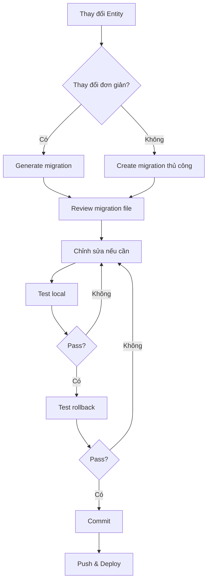

# Lesson 08 - Database Migration and Seeding

## 1. Migration là gì? Tại sao cần dùng migration thay vì synchronize: true?

### 1.1. Khái niệm Migration

**Migration** là một cơ chế quản lý phiên bản (version control) cho cơ sở dữ liệu. Mỗi migration là một file chứa các thay đổi schema của database theo thời gian, tương tự như Git quản lý code.

**Migration hoạt động như thế nào?**
- Mỗi migration có 2 phương thức chính:
  - `up()`: Thực hiện thay đổi (tạo bảng, thêm cột, thêm index...)
  - `down()`: Hoàn tác thay đổi (rollback)

**Ví dụ minh họa:**
```typescript
import { MigrationInterface, QueryRunner, Table } from "typeorm";

export class CreateUserTable1700000000000 implements MigrationInterface {
    public async up(queryRunner: QueryRunner): Promise<void> {
        await queryRunner.createTable(
            new Table({
                name: "users",
                columns: [
                    {
                        name: "id",
                        type: "int",
                        isPrimary: true,
                        isGenerated: true,
                        generationStrategy: "increment"
                    },
                    {
                        name: "email",
                        type: "varchar",
                        isUnique: true
                    },
                    {
                        name: "password",
                        type: "varchar"
                    }
                ]
            })
        );
    }

    public async down(queryRunner: QueryRunner): Promise<void> {
        await queryRunner.dropTable("users");
    }
}
```

### 1.2. So sánh synchronize: true vs Migration

#### **synchronize: true** (Chỉ dùng cho Development)

```typescript
// ormconfig.ts hoặc app.module.ts
TypeOrmModule.forRoot({
  type: 'postgres',
  host: 'localhost',
  port: 5432,
  username: 'postgres',
  password: 'password',
  database: 'mydb',
  entities: [__dirname + '/**/*.entity{.ts,.js}'],
  synchronize: true, // ⚠️ NGUY HIỂM cho production!
})
```

**Cách hoạt động:**
- TypeORM tự động đồng bộ schema từ Entity xuống database
- Mỗi lần start app, TypeORM so sánh Entity với DB và tự động tạo/sửa/xóa bảng/cột

**Ưu điểm:**
- ✅ Nhanh chóng, tiện lợi khi develop
- ✅ Không cần viết migration thủ công
- ✅ Phù hợp cho prototype, POC

**Nhược điểm:**
- ❌ Không kiểm soát được thay đổi
- ❌ Không có lịch sử thay đổi schema
- ❌ Có thể mất dữ liệu
- ❌ Không thể rollback
- ❌ Khó debug khi có lỗi

#### **Migration** (Dùng cho Staging/Production)

```typescript
TypeOrmModule.forRoot({
  type: 'postgres',
  host: 'localhost',
  port: 5432,
  username: 'postgres',
  password: 'password',
  database: 'mydb',
  entities: [__dirname + '/**/*.entity{.ts,.js}'],
  migrations: [__dirname + '/migrations/**/*{.ts,.js}'],
  migrationsRun: true, // Tự động chạy migration khi start app
  synchronize: false, // ✅ BẮT BUỘC false cho production
})
```

**Ưu điểm:**
- ✅ Kiểm soát hoàn toàn mọi thay đổi
- ✅ Version control (lưu trong Git)
- ✅ Có thể rollback
- ✅ Review được trước khi apply
- ✅ An toàn cho production
- ✅ Hỗ trợ team collaboration

**Nhược điểm:**
- ❌ Phải viết migration thủ công hoặc generate
- ❌ Cần học cách sử dụng
- ❌ Mất thời gian hơn

### 1.3. Rủi ro khi dùng synchronize: true ở Production

#### **Ví dụ 1: Đổi tên column - MẤT DỮ LIỆU**

```typescript
// Trước đó
@Entity()
export class User {
  @Column()
  username: string;
}

// Sau khi đổi tên property
@Entity()
export class User {
  @Column()
  fullName: string; // Đổi từ username -> fullName
}
```

**Điều gì xảy ra với `synchronize: true`?**
1. TypeORM thấy column `username` không còn trong Entity
2. TypeORM **XÓA** column `username` (và toàn bộ dữ liệu trong đó)
3. TypeORM **TẠO MỚI** column `fullName` (rỗng, không có data)

**Kết quả:** ⚠️ **MẤT TOÀN BỘ DỮ LIỆU** của user!

**Cách làm đúng với Migration:**
```typescript
export class RenameUsernameToFullName1700000000000 implements MigrationInterface {
    public async up(queryRunner: QueryRunner): Promise<void> {
        await queryRunner.renameColumn("users", "username", "fullName");
        // Dữ liệu được giữ nguyên!
    }

    public async down(queryRunner: QueryRunner): Promise<void> {
        await queryRunner.renameColumn("users", "fullName", "username");
    }
}
```

#### **Ví dụ 2: Xóa Entity - XÓA LUÔN BẢNG**

```typescript
// Bạn comment hoặc xóa file entity
// @Entity()
// export class ProductLog {
//   @PrimaryGeneratedColumn()
//   id: number;
//   
//   @Column()
//   action: string;
// }
```

**Điều gì xảy ra?**
- Synchronize thấy không còn Entity `ProductLog`
- **XÓA LUÔN** bảng `product_logs` khỏi database
- ⚠️ Mất toàn bộ log lịch sử!

#### **Ví dụ 3: Thêm relation - Conflict & Lỗi**

```typescript
@Entity()
export class Post {
  @PrimaryGeneratedColumn()
  id: number;

  @ManyToOne(() => User, user => user.posts)
  author: User; // Thêm relation mới
}
```

**Vấn đề:**
- Nếu bảng `posts` đã có dữ liệu
- TypeORM thêm foreign key constraint
- **LỖI**: Các posts cũ không có `authorId` → vi phạm constraint
- App crash khi start!

**Cách đúng với Migration:**
```typescript
export class AddAuthorToPosts1700000000000 implements MigrationInterface {
    public async up(queryRunner: QueryRunner): Promise<void> {
        // 1. Thêm column nullable trước
        await queryRunner.addColumn("posts", new TableColumn({
            name: "authorId",
            type: "int",
            isNullable: true
        }));

        // 2. Migrate dữ liệu cũ (gán authorId mặc định)
        await queryRunner.query(`
            UPDATE posts SET authorId = 1 WHERE authorId IS NULL
        `);

        // 3. Đổi thành NOT NULL
        await queryRunner.changeColumn("posts", "authorId", new TableColumn({
            name: "authorId",
            type: "int",
            isNullable: false
        }));

        // 4. Thêm foreign key
        await queryRunner.createForeignKey("posts", new TableForeignKey({
            columnNames: ["authorId"],
            referencedTableName: "users",
            referencedColumnNames: ["id"],
            onDelete: "CASCADE"
        }));
    }

    public async down(queryRunner: QueryRunner): Promise<void> {
        const table = await queryRunner.getTable("posts");
        const foreignKey = table.foreignKeys.find(fk => fk.columnNames.indexOf("authorId") !== -1);
        await queryRunner.dropForeignKey("posts", foreignKey);
        await queryRunner.dropColumn("posts", "authorId");
    }
}
```

### 1.4. Best Practice về synchronize

```typescript
// config/database.config.ts
export const getDatabaseConfig = () => ({
  type: 'postgres' as const,
  host: process.env.DB_HOST,
  port: parseInt(process.env.DB_PORT),
  username: process.env.DB_USERNAME,
  password: process.env.DB_PASSWORD,
  database: process.env.DB_NAME,
  entities: [__dirname + '/../**/*.entity{.ts,.js}'],
  migrations: [__dirname + '/../migrations/**/*{.ts,.js}'],
  
  // ✅ Quy tắc vàng:
  synchronize: process.env.NODE_ENV === 'development', // Chỉ true ở dev
  migrationsRun: process.env.NODE_ENV !== 'development', // Chỉ true ở staging/prod
  
  // Logging để debug
  logging: process.env.NODE_ENV === 'development',
});
```

**Tóm tắt:**
- ✅ **Development**: `synchronize: true` - Tiện lợi, nhanh
- ✅ **Staging/Production**: `synchronize: false` + Migration - An toàn, kiểm soát
- ⚠️ **KHÔNG BAO GIỜ** dùng `synchronize: true` ở production!

---

## 2. Cấu hình TypeORM để hỗ trợ Migration trong NestJS

### 2.1. Cài đặt Dependencies

```bash
# Cài TypeORM và driver PostgreSQL
npm install --save @nestjs/typeorm typeorm pg

# Cài ts-node để chạy TypeScript CLI
npm install --save-dev ts-node

# KHÔNG cần cài typeorm global nữa (2025-2026)
# Dùng npx để chạy CLI
```

### 2.2. Tạo file Data Source cho Migration

TypeORM CLI cần một **data source** riêng để chạy migration (tách biệt với NestJS config).

**Tạo file `src/data-source.ts`:**

```typescript
import { DataSource, DataSourceOptions } from 'typeorm';
import { config } from 'dotenv';

// Load biến môi trường
config();

export const dataSourceOptions: DataSourceOptions = {
  type: 'postgres',
  host: process.env.DB_HOST || 'localhost',
  port: parseInt(process.env.DB_PORT) || 5432,
  username: process.env.DB_USERNAME || 'postgres',
  password: process.env.DB_PASSWORD || 'password',
  database: process.env.DB_NAME || 'nestjs_db',
  
  // Đường dẫn entities (dùng .ts cho CLI)
  entities: ['src/**/*.entity.ts'],
  
  // ✅ QUAN TRỌNG: Đường dẫn migrations
  migrations: ['src/migrations/*.ts'],
  
  // Tên bảng lưu lịch sử migration (tùy chọn)
  migrationsTableName: 'migrations_history',
  
  // KHÔNG dùng synchronize
  synchronize: false,
  
  // Logging để debug
  logging: process.env.NODE_ENV === 'development',
};

// Export DataSource để CLI sử dụng
const dataSource = new DataSource(dataSourceOptions);
export default dataSource;
```

**Giải thích:**
- `entities`: Dùng `*.ts` vì CLI chạy trực tiếp từ source code
- `migrations`: Folder chứa migration files
- `migrationsTableName`: Tên bảng lưu migration history (mặc định: `migrations`)
- Export `dataSource` để TypeORM CLI sử dụng

### 2.3. Cấu hình TypeORM Module trong NestJS

**File `src/app.module.ts`:**

```typescript
import { Module } from '@nestjs/common';
import { TypeOrmModule } from '@nestjs/typeorm';
import { ConfigModule, ConfigService } from '@nestjs/config';
import { dataSourceOptions } from './data-source';

@Module({
  imports: [
    ConfigModule.forRoot({
      isGlobal: true,
    }),
    
    // Cách 1: Dùng lại config từ data-source.ts
    TypeOrmModule.forRoot({
      ...dataSourceOptions,
      // Override cho runtime (dùng .js sau khi build)
      entities: [__dirname + '/**/*.entity{.ts,.js}'],
      migrations: [__dirname + '/migrations/*{.ts,.js}'],
      autoLoadEntities: true, // Tự động load entities từ modules
      migrationsRun: process.env.NODE_ENV !== 'development', // Auto run ở prod
    }),
    
    // Cách 2: Dùng async config (linh hoạt hơn)
    // TypeOrmModule.forRootAsync({
    //   imports: [ConfigModule],
    //   inject: [ConfigService],
    //   useFactory: (configService: ConfigService) => ({
    //     type: 'postgres',
    //     host: configService.get('DB_HOST'),
    //     port: configService.get('DB_PORT'),
    //     username: configService.get('DB_USERNAME'),
    //     password: configService.get('DB_PASSWORD'),
    //     database: configService.get('DB_NAME'),
    //     entities: [__dirname + '/**/*.entity{.ts,.js}'],
    //     migrations: [__dirname + '/migrations/*{.ts,.js}'],
    //     synchronize: false,
    //     migrationsRun: configService.get('NODE_ENV') !== 'development',
    //   }),
    // }),
  ],
})
export class AppModule {}
```

**Giải thích các option quan trọng:**
- `autoLoadEntities: true`: NestJS tự động load entities từ các module (không cần khai báo thủ công)
- `migrationsRun: true`: Tự động chạy migration khi app start (khuyên dùng cho production)
- `synchronize: false`: BẮT BUỘC phải false khi dùng migration

### 2.4. Cấu hình NPM Scripts

**File `package.json`:**

```json
{
  "scripts": {
    "build": "nest build",
    "start": "nest start",
    "start:dev": "nest start --watch",
    "start:prod": "node dist/main",
    
    "typeorm": "typeorm-ts-node-commonjs",
    
    "migration:generate": "npm run typeorm -- migration:generate src/migrations/$npm_config_name -d src/data-source.ts",
    "migration:create": "npm run typeorm -- migration:create src/migrations/$npm_config_name",
    "migration:run": "npm run typeorm -- migration:run -d src/data-source.ts",
    "migration:revert": "npm run typeorm -- migration:revert -d src/data-source.ts",
    "migration:show": "npm run typeorm -- migration:show -d src/data-source.ts",
    
    "schema:drop": "npm run typeorm -- schema:drop -d src/data-source.ts",
    "schema:sync": "npm run typeorm -- schema:sync -d src/data-source.ts"
  }
}
```

**Giải thích các script:**

1. **`typeorm`**: Alias cho lệnh TypeORM CLI với CommonJS support
2. **`migration:generate`**: Tự động generate migration từ sự khác biệt giữa Entity và DB
   ```bash
   npm run migration:generate --name=CreateUserTable
   # Tạo file: src/migrations/1700000000000-CreateUserTable.ts
   ```

3. **`migration:create`**: Tạo migration rỗng (viết thủ công)
   ```bash
   npm run migration:create --name=AddIndexToEmail
   ```

4. **`migration:run`**: Chạy tất cả migration chưa được thực thi
   ```bash
   npm run migration:run
   ```

5. **`migration:revert`**: Rollback migration gần nhất
   ```bash
   npm run migration:revert
   ```

6. **`migration:show`**: Xem danh sách migration và trạng thái
   ```bash
   npm run migration:show
   ```

### 2.5. Tạo folder structure

```bash
mkdir -p src/migrations
```

**Cấu trúc project:**
```
src/
├── data-source.ts          # ✅ Config cho TypeORM CLI
├── app.module.ts           # Config cho NestJS runtime
├── migrations/             # ✅ Chứa migration files
│   ├── 1700000001000-CreateUserTable.ts
│   ├── 1700000002000-AddEmailIndex.ts
│   └── ...
├── users/
│   ├── entities/
│   │   └── user.entity.ts  # Entity definition
│   └── users.module.ts
└── main.ts
```

### 2.6. Kiểm tra cấu hình

**Test migration system:**

```bash
# 1. Tạo entity đầu tiên
# src/users/entities/user.entity.ts

# 2. Generate migration từ entity
npm run migration:generate --name=InitialSchema

# 3. Xem migration đã tạo
npm run migration:show

# 4. Chạy migration
npm run migration:run

# 5. Kiểm tra database
# Bảng "migrations_history" sẽ lưu lịch sử migration
```

### 2.7. Best Practice 2025-2026

#### **✅ DO - Nên làm:**

1. **Tách config riêng cho CLI và Runtime:**
   ```typescript
   // data-source.ts cho CLI
   // app.module.ts cho NestJS runtime
   ```

2. **Dùng biến môi trường:**
   ```typescript
   // .env.development
   DB_HOST=localhost
   DB_PORT=5432
   
   // .env.production
   DB_HOST=prod-db.example.com
   DB_PORT=5432
   ```

3. **Auto-run migration ở production:**
   ```typescript
   migrationsRun: process.env.NODE_ENV !== 'development'
   ```

4. **Custom migration table name:**
   ```typescript
   migrationsTableName: 'custom_migrations'
   ```

#### **❌ DON'T - Không nên:**

1. **Không dùng cả synchronize VÀ migration:**
   ```typescript
   // ❌ SAI
   {
     synchronize: true,
     migrationsRun: true, // Conflict!
   }
   ```

2. **Không hardcode credentials:**
   ```typescript
   // ❌ SAI
   {
     username: 'postgres',
     password: 'my-secret-password', // Lộ password!
   }
   ```

3. **Không dùng `*.js` trong data-source.ts:**
   ```typescript
   // ❌ SAI (CLI không build được)
   entities: ['dist/**/*.entity.js']
   
   // ✅ ĐÚNG
   entities: ['src/**/*.entity.ts']
   ```

### 2.8. Troubleshooting

**Lỗi 1: "Error: Cannot find module 'src/data-source'"**
```bash
# Nguyên nhân: Thiếu ts-node
npm install --save-dev ts-node
```

**Lỗi 2: "No changes in database schema were found"**
```bash
# Nguyên nhân: synchronize: true đang bật
# Giải pháp: Tắt synchronize trong data-source.ts
```

**Lỗi 3: Migration chạy 2 lần**
```bash
# Nguyên nhân: Cả CLI và migrationsRun: true đều chạy
# Giải pháp: 
# - Dev: Chạy thủ công bằng CLI, tắt migrationsRun
# - Prod: Bật migrationsRun, không chạy CLI
```

---

## 3. Tạo và viết migration thủ công + tự động

### 3.1. Migration tự động (Auto-generate)

#### **Khi nào dùng auto-generate?**

✅ **Nên dùng khi:**
- Tạo bảng mới từ Entity
- Thêm/xóa column đơn giản
- Thêm relation cơ bản
- Môi trường development
- Thay đổi đơn giản, không cần migrate data

❌ **KHÔNG nên dùng khi:**
- Đổi tên column (sẽ xóa rồi tạo mới → mất data)
- Thay đổi phức tạp cần migrate data
- Thêm constraint phức tạp
- Production deployment (phải review kỹ trước)

#### **Cách sử dụng:**

**Bước 1: Tạo Entity**

```typescript
// src/users/entities/user.entity.ts
import { Entity, PrimaryGeneratedColumn, Column, CreateDateColumn, UpdateDateColumn } from 'typeorm';

@Entity('users')
export class User {
  @PrimaryGeneratedColumn()
  id: number;

  @Column({ unique: true })
  email: string;

  @Column()
  password: string;

  @Column({ nullable: true })
  firstName: string;

  @Column({ nullable: true })
  lastName: string;

  @Column({ default: true })
  isActive: boolean;

  @CreateDateColumn()
  createdAt: Date;

  @UpdateDateColumn()
  updatedAt: Date;
}
```

**Bước 2: Generate migration**

```bash
npm run migration:generate --name=CreateUserTable
```

**Kết quả - File được tạo tự động:**

```typescript
// src/migrations/1700000001000-CreateUserTable.ts
import { MigrationInterface, QueryRunner } from "typeorm";

export class CreateUserTable1700000001000 implements MigrationInterface {
    name = 'CreateUserTable1700000001000'

    public async up(queryRunner: QueryRunner): Promise<void> {
        await queryRunner.query(`
            CREATE TABLE "users" (
                "id" SERIAL NOT NULL, 
                "email" character varying NOT NULL, 
                "password" character varying NOT NULL, 
                "firstName" character varying, 
                "lastName" character varying, 
                "isActive" boolean NOT NULL DEFAULT true, 
                "createdAt" TIMESTAMP NOT NULL DEFAULT now(), 
                "updatedAt" TIMESTAMP NOT NULL DEFAULT now(), 
                CONSTRAINT "UQ_users_email" UNIQUE ("email"), 
                CONSTRAINT "PK_users_id" PRIMARY KEY ("id")
            )
        `);
    }

    public async down(queryRunner: QueryRunner): Promise<void> {
        await queryRunner.query(`DROP TABLE "users"`);
    }
}
```

**Bước 3: Review migration**

⚠️ **QUAN TRỌNG**: Luôn luôn review migration auto-generated trước khi chạy!

```typescript
// ✅ Kiểm tra:
// 1. Tên bảng đúng không?
// 2. Kiểu dữ liệu có chính xác không?
// 3. Constraint có đúng không?
// 4. Down migration có an toàn không?
// 5. Có ảnh hưởng đến data cũ không?
```

**Bước 4: Chạy migration**

```bash
# Development
npm run migration:run

# Production (thường tự động chạy qua migrationsRun: true)
NODE_ENV=production npm run migration:run
```

#### **Ví dụ thực tế: Thêm column mới**

**Bước 1: Update Entity**

```typescript
// src/users/entities/user.entity.ts
@Entity('users')
export class User {
  // ... existing fields

  @Column({ nullable: true })
  phoneNumber: string; // ✅ Thêm field mới

  @Column({ type: 'enum', enum: ['user', 'admin', 'moderator'], default: 'user' })
  role: string; // ✅ Thêm role
}
```

**Bước 2: Generate**

```bash
npm run migration:generate --name=AddPhoneAndRoleToUser
```

**Bước 3: Review migration generated**

```typescript
// src/migrations/1700000002000-AddPhoneAndRoleToUser.ts
export class AddPhoneAndRoleToUser1700000002000 implements MigrationInterface {
    public async up(queryRunner: QueryRunner): Promise<void> {
        await queryRunner.query(`
            ALTER TABLE "users" 
            ADD "phoneNumber" character varying
        `);
        
        await queryRunner.query(`
            CREATE TYPE "users_role_enum" AS ENUM('user', 'admin', 'moderator')
        `);
        
        await queryRunner.query(`
            ALTER TABLE "users" 
            ADD "role" "users_role_enum" NOT NULL DEFAULT 'user'
        `);
    }

    public async down(queryRunner: QueryRunner): Promise<void> {
        await queryRunner.query(`ALTER TABLE "users" DROP COLUMN "role"`);
        await queryRunner.query(`DROP TYPE "users_role_enum"`);
        await queryRunner.query(`ALTER TABLE "users" DROP COLUMN "phoneNumber"`);
    }
}
```

✅ **Migration này an toàn vì:**
- Column mới là `nullable` hoặc có `default`
- Không ảnh hưởng data cũ

### 3.2. Migration thủ công (Manual)

#### **Khi nào cần viết thủ công?**

✅ **Bắt buộc viết tay khi:**
- Đổi tên column/table (cần `RENAME` thay vì `DROP` + `CREATE`)
- Migrate data phức tạp
- Thêm index cho performance
- Thay đổi constraint phức tạp
- Seed data ban đầu
- Refactor schema lớn

#### **Tạo migration rỗng:**

```bash
npm run migration:create --name=RenameUsernameToFullName
```

#### **Ví dụ 1: Đổi tên column (KHÔNG mất data)**

```typescript
// src/migrations/1700000003000-RenameUsernameToFullName.ts
import { MigrationInterface, QueryRunner } from "typeorm";

export class RenameUsernameToFullName1700000003000 implements MigrationInterface {
    public async up(queryRunner: QueryRunner): Promise<void> {
        // ✅ ĐÚNG: Dùng RENAME
        await queryRunner.renameColumn('users', 'username', 'fullName');
    }

    public async down(queryRunner: QueryRunner): Promise<void> {
        await queryRunner.renameColumn('users', 'fullName', 'username');
    }
}
```

**So sánh với cách SAI (auto-generate sẽ làm):**

```typescript
// ❌ SAI: Auto-generate sẽ DROP rồi ADD
export class Wrong implements MigrationInterface {
    public async up(queryRunner: QueryRunner): Promise<void> {
        await queryRunner.dropColumn('users', 'username'); // ⚠️ MẤT DATA!
        await queryRunner.addColumn('users', new TableColumn({
            name: 'fullName',
            type: 'varchar'
        })); // ⚠️ Column mới rỗng!
    }
}
```

#### **Ví dụ 2: Thêm column với migrate data**

**Tình huống:** Tách `fullName` thành `firstName` và `lastName`

```typescript
// src/migrations/1700000004000-SplitFullName.ts
import { MigrationInterface, QueryRunner, TableColumn } from "typeorm";

export class SplitFullName1700000004000 implements MigrationInterface {
    public async up(queryRunner: QueryRunner): Promise<void> {
        // Bước 1: Thêm 2 column mới (nullable)
        await queryRunner.addColumn('users', new TableColumn({
            name: 'firstName',
            type: 'varchar',
            isNullable: true,
        }));

        await queryRunner.addColumn('users', new TableColumn({
            name: 'lastName',
            type: 'varchar',
            isNullable: true,
        }));

        // Bước 2: Migrate data từ fullName
        await queryRunner.query(`
            UPDATE users 
            SET 
                firstName = SPLIT_PART(fullName, ' ', 1),
                lastName = SPLIT_PART(fullName, ' ', 2)
            WHERE fullName IS NOT NULL
        `);

        // Bước 3: Xóa column cũ (sau khi đã migrate xong)
        await queryRunner.dropColumn('users', 'fullName');
    }

    public async down(queryRunner: QueryRunner): Promise<void> {
        // Rollback: Tạo lại fullName
        await queryRunner.addColumn('users', new TableColumn({
            name: 'fullName',
            type: 'varchar',
            isNullable: true,
        }));

        // Gộp lại firstName + lastName
        await queryRunner.query(`
            UPDATE users 
            SET fullName = CONCAT(firstName, ' ', lastName)
            WHERE firstName IS NOT NULL OR lastName IS NOT NULL
        `);

        // Xóa 2 column đã tách
        await queryRunner.dropColumn('users', 'firstName');
        await queryRunner.dropColumn('users', 'lastName');
    }
}
```

#### **Ví dụ 3: Thêm index cho performance**

```typescript
// src/migrations/1700000005000-AddIndexes.ts
import { MigrationInterface, QueryRunner, TableIndex } from "typeorm";

export class AddIndexes1700000005000 implements MigrationInterface {
    public async up(queryRunner: QueryRunner): Promise<void> {
        // Index cho email (để search nhanh)
        await queryRunner.createIndex('users', new TableIndex({
            name: 'IDX_users_email',
            columnNames: ['email']
        }));

        // Composite index cho query phức tạp
        await queryRunner.createIndex('users', new TableIndex({
            name: 'IDX_users_role_isActive',
            columnNames: ['role', 'isActive']
        }));

        // Partial index (PostgreSQL specific)
        await queryRunner.query(`
            CREATE INDEX "IDX_users_active_admins" 
            ON "users" ("role") 
            WHERE "isActive" = true AND "role" = 'admin'
        `);
    }

    public async down(queryRunner: QueryRunner): Promise<void> {
        await queryRunner.dropIndex('users', 'IDX_users_email');
        await queryRunner.dropIndex('users', 'IDX_users_role_isActive');
        await queryRunner.query(`DROP INDEX "IDX_users_active_admins"`);
    }
}
```

#### **Ví dụ 4: Thêm Foreign Key phức tạp**

```typescript
// src/migrations/1700000006000-AddPostsTable.ts
import { MigrationInterface, QueryRunner, Table, TableForeignKey } from "typeorm";

export class AddPostsTable1700000006000 implements MigrationInterface {
    public async up(queryRunner: QueryRunner): Promise<void> {
        // Tạo bảng posts
        await queryRunner.createTable(new Table({
            name: 'posts',
            columns: [
                {
                    name: 'id',
                    type: 'int',
                    isPrimary: true,
                    isGenerated: true,
                    generationStrategy: 'increment',
                },
                {
                    name: 'title',
                    type: 'varchar',
                },
                {
                    name: 'content',
                    type: 'text',
                },
                {
                    name: 'authorId',
                    type: 'int',
                },
                {
                    name: 'createdAt',
                    type: 'timestamp',
                    default: 'CURRENT_TIMESTAMP',
                },
            ],
        }), true);

        // Thêm foreign key
        await queryRunner.createForeignKey('posts', new TableForeignKey({
            name: 'FK_posts_author',
            columnNames: ['authorId'],
            referencedTableName: 'users',
            referencedColumnNames: ['id'],
            onDelete: 'CASCADE', // Xóa user → xóa posts
            onUpdate: 'CASCADE',
        }));

        // Thêm index cho foreign key (tăng performance JOIN)
        await queryRunner.createIndex('posts', new TableIndex({
            name: 'IDX_posts_authorId',
            columnNames: ['authorId'],
        }));
    }

    public async down(queryRunner: QueryRunner): Promise<void> {
        await queryRunner.dropIndex('posts', 'IDX_posts_authorId');
        
        const table = await queryRunner.getTable('posts');
        const foreignKey = table.foreignKeys.find(fk => fk.name === 'FK_posts_author');
        await queryRunner.dropForeignKey('posts', foreignKey);
        
        await queryRunner.dropTable('posts');
    }
}
```

#### **Ví dụ 5: Thay đổi kiểu dữ liệu**

```typescript
// src/migrations/1700000007000-ChangePhoneToText.ts
import { MigrationInterface, QueryRunner, TableColumn } from "typeorm";

export class ChangePhoneToText1700000007000 implements MigrationInterface {
    public async up(queryRunner: QueryRunner): Promise<void> {
        // Cách 1: Dùng changeColumn
        await queryRunner.changeColumn('users', 'phoneNumber', new TableColumn({
            name: 'phoneNumber',
            type: 'text', // Đổi từ varchar sang text
            isNullable: true,
        }));

        // Cách 2: Dùng raw query (linh hoạt hơn)
        // await queryRunner.query(`
        //     ALTER TABLE "users" 
        //     ALTER COLUMN "phoneNumber" TYPE TEXT
        // `);
    }

    public async down(queryRunner: QueryRunner): Promise<void> {
        await queryRunner.changeColumn('users', 'phoneNumber', new TableColumn({
            name: 'phoneNumber',
            type: 'varchar',
            isNullable: true,
        }));
    }
}
```

### 3.3. Best Practices cho Migration

#### **✅ DO - Nên làm:**

1. **Luôn review auto-generated migration:**
```typescript
// Sau khi generate, MỞ FILE VÀ ĐỌC KỸ!
npm run migration:generate --name=Something
// → Mở file → Review → Chỉnh sửa nếu cần → Commit
```

2. **Đặt tên migration rõ ràng:**
```bash
# ✅ TỐT
CreateUserTable
AddEmailIndexToUsers
RenameUsernameToFullName
SplitFullNameColumn

# ❌ TỆ
Migration1
Update
Fix
Changes
```

3. **Luôn viết down() migration:**
```typescript
// ✅ ĐÚNG: Có thể rollback
public async down(queryRunner: QueryRunner): Promise<void> {
    await queryRunner.dropTable('users');
}

// ❌ SAI: Không rollback được
public async down(queryRunner: QueryRunner): Promise<void> {
    // TODO
}
```

4. **Test migration trước khi commit:**
```bash
# Test flow đầy đủ
npm run migration:run      # Chạy
npm run migration:revert   # Rollback
npm run migration:run      # Chạy lại → Phải thành công!
```

5. **Backup data trước migration lớn:**
```bash
# Trước khi chạy migration nguy hiểm
pg_dump -U postgres -d mydb > backup_before_migration.sql
```

6. **Dùng transaction cho migration phức tạp:**
```typescript
public async up(queryRunner: QueryRunner): Promise<void> {
    await queryRunner.startTransaction();
    try {
        await queryRunner.query(`...`);
        await queryRunner.query(`...`);
        await queryRunner.commitTransaction();
    } catch (err) {
        await queryRunner.rollbackTransaction();
        throw err;
    }
}
```

#### **❌ DON'T - Không nên:**

1. **Không sửa migration đã chạy:**
```typescript
// ❌ SAI: Sửa migration đã được deploy
// Nếu cần fix → Tạo migration mới để sửa

// ✅ ĐÚNG: Tạo migration mới
npm run migration:create --name=FixPreviousMigration
```

2. **Không commit migration chưa test:**
```bash
# ❌ SAI
git add src/migrations/
git commit -m "Add migration"
# → Chưa test!

# ✅ ĐÚNG
npm run migration:run     # Test local
npm run migration:revert  # Test rollback
git add src/migrations/
git commit -m "Add CreateUserTable migration"
```

3. **Không dùng auto-generate cho đổi tên:**
```typescript
// ❌ SAI: Auto-generate sẽ DROP + CREATE
// Entity: đổi username → fullName
npm run migration:generate --name=RenameField
// → Migration sẽ XÓA column cũ!

// ✅ ĐÚNG: Viết tay
npm run migration:create --name=RenameUsernameToFullName
// → Dùng renameColumn()
```

4. **Không để migration phụ thuộc vào code:**
```typescript
// ❌ SAI: Import entity/service vào migration
import { User } from '../users/entities/user.entity';

export class Bad implements MigrationInterface {
    async up(queryRunner: QueryRunner) {
        const user = new User(); // ⚠️ Không làm vậy!
    }
}

// ✅ ĐÚNG: Migration độc lập, chỉ dùng SQL
export class Good implements MigrationInterface {
    async up(queryRunner: QueryRunner) {
        await queryRunner.query(`INSERT INTO users ...`);
    }
}
```

### 3.4. Workflow thực tế



---

## 4. Chạy và quản lý migration trong các môi trường

### 4.1. Migration trong Development

#### **Workflow Development:**

```bash
# 1. Tạo/Update Entity
# src/users/entities/user.entity.ts

# 2. Generate migration
npm run migration:generate --name=UpdateUserTable

# 3. Review file migration
# src/migrations/xxxxx-UpdateUserTable.ts

# 4. Chạy migration
npm run migration:run

# 5. Kiểm tra database
npm run migration:show

# 6. Nếu có lỗi → Rollback
npm run migration:revert

# 7. Fix migration → Chạy lại
npm run migration:run
```

#### **Config cho Development:**

```typescript
// src/data-source.ts
export const dataSourceOptions: DataSourceOptions = {
  // ... other config
  
  // ✅ Development: KHÔNG tự động chạy migration
  // Để dev kiểm soát thủ công
  synchronize: false, // Không dùng sync
  migrationsRun: false, // Không auto-run
  
  logging: true, // Bật logging để debug
  logger: 'advanced-console', // Log chi tiết
};
```

```typescript
// src/app.module.ts
TypeOrmModule.forRoot({
  ...dataSourceOptions,
  
  // Development: Chạy migration thủ công qua CLI
  migrationsRun: false,
  
  // Có thể bật synchronize nếu muốn (nhưng KHÔNG khuyến khích)
  // synchronize: process.env.NODE_ENV === 'development',
}),
```

### 4.2. Migration trong Staging/Production

#### **Hai cách chạy migration ở Production:**

**Cách 1: Auto-run khi app start (Khuyên dùng)**

```typescript
// src/app.module.ts
TypeOrmModule.forRoot({
  // ... other config
  
  // ✅ Production: Tự động chạy migration khi app start
  migrationsRun: process.env.NODE_ENV === 'production',
  synchronize: false, // BẮT BUỘC false!
  
  logging: false, // Tắt logging ở prod
}),
```

**Ưu điểm:**
- ✅ Tự động, không cần can thiệp thủ công
- ✅ Phù hợp với container/k8s deployment
- ✅ Đơn giản, ít lỗi human

**Nhược điểm:**
- ❌ App delay khi start (chờ migration chạy xong)
- ❌ Nếu migration lỗi → app crash
- ❌ Khó debug nếu có vấn đề

**Cách 2: Chạy migration riêng trước khi deploy**

```typescript
// src/app.module.ts
TypeOrmModule.forRoot({
  migrationsRun: false, // Tắt auto-run
  synchronize: false,
}),
```

**Chạy migration thủ công:**

```bash
# Trước khi deploy app
NODE_ENV=production npm run migration:run
```

**Ưu điểm:**
- ✅ Kiểm soát được timing
- ✅ Có thể backup DB trước
- ✅ Dễ debug nếu lỗi
- ✅ App start nhanh hơn

**Nhược điểm:**
- ❌ Cần automation script
- ❌ Dễ quên chạy migration
- ❌ Phức tạp hơn cho DevOps

#### **Best Practice: Kết hợp cả hai**

```typescript
// config/database.config.ts
export const getDatabaseConfig = (): TypeOrmModuleOptions => {
  const env = process.env.NODE_ENV;
  
  return {
    type: 'postgres',
    host: process.env.DB_HOST,
    // ... other config
    
    // Strategy theo môi trường
    migrationsRun: env === 'staging', // Auto ở staging để test
    synchronize: false, // Luôn false
    
    // Logging
    logging: env !== 'production',
  };
};
```

### 4.3. Migration với Docker

#### **Dockerfile cho Production:**

```dockerfile
# Dockerfile
FROM node:18-alpine AS builder

WORKDIR /app

# Copy package files
COPY package*.json ./
RUN npm ci

# Copy source
COPY . .

# Build app
RUN npm run build

# Production image
FROM node:18-alpine

WORKDIR /app

COPY package*.json ./
RUN npm ci --only=production

# Copy built app
COPY --from=builder /app/dist ./dist
COPY --from=builder /app/src/migrations ./dist/migrations

# Copy migration scripts
COPY --from=builder /app/src/data-source.ts ./

EXPOSE 3000

# Run migrations then start app
CMD ["sh", "-c", "npm run migration:run && node dist/main"]
```

**Giải thích:**
- Build stage: Compile TypeScript
- Production stage: Chỉ copy files cần thiết
- CMD: Chạy migration → Start app

#### **Docker Compose cho Development:**

```yaml
# docker-compose.yml
version: '3.8'

services:
  postgres:
    image: postgres:15-alpine
    environment:
      POSTGRES_USER: postgres
      POSTGRES_PASSWORD: password
      POSTGRES_DB: nestjs_db
    ports:
      - "5432:5432"
    volumes:
      - postgres_data:/var/lib/postgresql/data

  app:
    build:
      context: .
      dockerfile: Dockerfile.dev
    ports:
      - "3000:3000"
    environment:
      NODE_ENV: development
      DB_HOST: postgres
      DB_PORT: 5432
      DB_USERNAME: postgres
      DB_PASSWORD: password
      DB_NAME: nestjs_db
    volumes:
      - .:/app
      - /app/node_modules
    depends_on:
      - postgres
    command: sh -c "npm run migration:run && npm run start:dev"

volumes:
  postgres_data:
```

#### **Docker Compose cho Production:**

```yaml
# docker-compose.prod.yml
version: '3.8'

services:
  postgres:
    image: postgres:15-alpine
    environment:
      POSTGRES_USER: ${DB_USERNAME}
      POSTGRES_PASSWORD: ${DB_PASSWORD}
      POSTGRES_DB: ${DB_NAME}
    volumes:
      - postgres_data:/var/lib/postgresql/data
    restart: unless-stopped

  app:
    build:
      context: .
      dockerfile: Dockerfile
    ports:
      - "3000:3000"
    environment:
      NODE_ENV: production
      DB_HOST: postgres
      DB_PORT: 5432
      DB_USERNAME: ${DB_USERNAME}
      DB_PASSWORD: ${DB_PASSWORD}
      DB_NAME: ${DB_NAME}
    depends_on:
      - postgres
    restart: unless-stopped
    # Migration tự động chạy trong CMD của Dockerfile

volumes:
  postgres_data:
```

### 4.4. Migration với Kubernetes

#### **Init Container pattern:**

```yaml
# k8s/deployment.yaml
apiVersion: apps/v1
kind: Deployment
metadata:
  name: nestjs-app
spec:
  replicas: 3
  template:
    spec:
      # Init container chạy migration trước
      initContainers:
      - name: migration
        image: your-app:latest
        command: ["npm", "run", "migration:run"]
        env:
        - name: DB_HOST
          value: postgres-service
        - name: DB_PORT
          value: "5432"
        - name: DB_USERNAME
          valueFrom:
            secretKeyRef:
              name: db-secret
              key: username
        - name: DB_PASSWORD
          valueFrom:
            secretKeyRef:
              name: db-secret
              key: password
      
      # Main container
      containers:
      - name: app
        image: your-app:latest
        ports:
        - containerPort: 3000
        env:
        - name: DB_HOST
          value: postgres-service
        # ... same env as init container
```

**Lợi ích Init Container:**
- ✅ Migration chạy 1 lần duy nhất trước khi pod start
- ✅ Nếu migration fail → Pod không start
- ✅ Scaling an toàn (chỉ 1 pod chạy migration)

### 4.5. Rollback Migration

#### **Revert migration gần nhất:**

```bash
npm run migration:revert
```

#### **Revert nhiều migration:**

```bash
# Revert 3 migration gần nhất
npm run migration:revert
npm run migration:revert
npm run migration:revert
```

#### **Xem danh sách migration:**

```bash
npm run migration:show

# Output:
# [X] CreateUserTable1700000001000
# [X] AddPhoneToUser1700000002000
# [ ] AddPostsTable1700000003000  ← Chưa chạy
```

#### **Rollback strategy cho Production:**

**Cách 1: Backup trước khi deploy**

```bash
# 1. Backup DB
pg_dump -U postgres -d production_db > backup_$(date +%Y%m%d_%H%M%S).sql

# 2. Deploy với migration mới
kubectl apply -f deployment.yaml

# 3. Nếu có vấn đề → Restore
psql -U postgres -d production_db < backup_20250123_143000.sql
```

**Cách 2: Blue-Green Deployment**

```yaml
# Triển khai version mới song song với cũ
# Test migration ở green environment
# Nếu OK → Switch traffic
# Nếu fail → Rollback về blue
```

### 4.6. Best Practice Production

#### **1. Backup trước mọi migration:**

```bash
#!/bin/bash
# scripts/safe-migrate.sh

echo "Creating backup..."
pg_dump -h $DB_HOST -U $DB_USER -d $DB_NAME > backup_before_migration.sql

echo "Running migrations..."
npm run migration:run

if [ $? -eq 0 ]; then
    echo "✅ Migration successful!"
    rm backup_before_migration.sql # Xóa backup nếu thành công
else
    echo "❌ Migration failed! Restoring backup..."
    psql -h $DB_HOST -U $DB_USER -d $DB_NAME < backup_before_migration.sql
    exit 1
fi
```

#### **2. Chạy migration trong maintenance window:**

```yaml
# k8s/cronjob.yaml - Chạy migration theo schedule
apiVersion: batch/v1
kind: CronJob
metadata:
  name: db-migration
spec:
  schedule: "0 2 * * 0"  # 2 AM mỗi Chủ nhật
  jobTemplate:
    spec:
      template:
        spec:
          containers:
          - name: migration
            image: your-app:latest
            command: ["npm", "run", "migration:run"]
          restartPolicy: OnFailure
```

#### **3. Monitoring migration:**

```typescript
// src/migrations/1700000008000-MonitoredMigration.ts
import { MigrationInterface, QueryRunner } from "typeorm";
import { Logger } from '@nestjs/common';

export class MonitoredMigration1700000008000 implements MigrationInterface {
    private readonly logger = new Logger(MonitoredMigration1700000008000.name);

    public async up(queryRunner: QueryRunner): Promise<void> {
        this.logger.log('Starting migration...');
        const startTime = Date.now();

        try {
            await queryRunner.query(`...`);
            
            const duration = Date.now() - startTime;
            this.logger.log(`Migration completed in ${duration}ms`);
        } catch (error) {this.logger.error('Migration failed:', error);
            throw error;
        }
    }

    public async down(queryRunner: QueryRunner): Promise<void> {
        this.logger.log('Reverting migration...');
        await queryRunner.query(`...`);
        this.logger.log('Migration reverted successfully');
    }
}
```

#### **4. CI/CD Integration:**

```yaml
# .github/workflows/deploy.yml
name: Deploy to Production

on:
  push:
    branches: [main]

jobs:
  deploy:
    runs-on: ubuntu-latest
    steps:
      - uses: actions/checkout@v3
      
      - name: Setup Node.js
        uses: actions/setup-node@v3
        with:
          node-version: '18'
      
      - name: Install dependencies
        run: npm ci
      
      # ✅ Chạy migration trong CI/CD
      - name: Run migrations
        env:
          DB_HOST: ${{ secrets.PROD_DB_HOST }}
          DB_PORT: ${{ secrets.PROD_DB_PORT }}
          DB_USERNAME: ${{ secrets.PROD_DB_USERNAME }}
          DB_PASSWORD: ${{ secrets.PROD_DB_PASSWORD }}
          DB_NAME: ${{ secrets.PROD_DB_NAME }}
        run: |
          npm run build
          npm run migration:run
      
      - name: Deploy application
        run: |
          # Deploy code sau khi migration thành công
          kubectl set image deployment/nestjs-app app=your-app:${{ github.sha }}
```

---


## 5. Seeding dữ liệu ban đầu (initial data / dummy data)

### 5.1. Tại sao cần Seeding?

#### **Use cases của Seeding:**

✅ **Development Environment:**
- Dữ liệu mẫu để test UI/UX
- Dummy users để test authentication
- Sample products để test e-commerce flow
- Mock data để không cần tạo thủ công

✅ **Testing Environment:**
- Dữ liệu nhất quán cho unit/integration tests
- Fixtures cho E2E tests
- Performance testing với large datasets

✅ **Staging/Demo Environment:**
- Dữ liệu demo cho khách hàng
- Sample content cho presentation
- Training data cho onboarding

✅ **Production Environment:**
- Initial data bắt buộc (roles, permissions, categories)
- Default settings/configurations
- Master data (countries, currencies, time zones)

### 5.2. Seeding trong Migration vs Seeding riêng

#### **Cách 1: Seeding trong Migration**

**Khi nào dùng:**
- ✅ Dữ liệu BẮT BUỘC cho production (roles, admin user)
- ✅ Dữ liệu cần chạy đúng thứ tự với schema changes
- ✅ Master data quan trọng

**Ví dụ:**

```typescript
// src/migrations/1700000009000-SeedRoles.ts
import { MigrationInterface, QueryRunner } from "typeorm";

export class SeedRoles1700000009000 implements MigrationInterface {
    public async up(queryRunner: QueryRunner): Promise<void> {
        // Seed roles bắt buộc cho hệ thống
        await queryRunner.query(`
            INSERT INTO "roles" ("name", "description", "createdAt", "updatedAt")
            VALUES 
                ('admin', 'Administrator with full access', NOW(), NOW()),
                ('moderator', 'Moderator with limited access', NOW(), NOW()),
                ('user', 'Regular user', NOW(), NOW())
            ON CONFLICT DO NOTHING
        `);

        // Seed admin user mặc định
        await queryRunner.query(`
            INSERT INTO "users" ("email", "password", "role", "isActive", "createdAt", "updatedAt")
            VALUES 
                ('admin@example.com', '$2b$10$hashedPassword...', 'admin', true, NOW(), NOW())
            ON CONFLICT (email) DO NOTHING
        `);
    }

    public async down(queryRunner: QueryRunner): Promise<void> {
        // ⚠️ Cẩn thận: Xóa dữ liệu seed
        await queryRunner.query(`DELETE FROM "users" WHERE email = 'admin@example.com'`);
        await queryRunner.query(`DELETE FROM "roles" WHERE name IN ('admin', 'moderator', 'user')`);
    }
}
```

**Ưu điểm:**
- ✅ Chạy tự động với migration
- ✅ Version control cùng schema
- ✅ Đảm bảo data consistency

**Nhược điểm:**
- ❌ Khó tách biệt môi trường (dev vs prod)
- ❌ Migration file phình to
- ❌ Khó maintain khi data phức tạp

#### **Cách 2: Seeding riêng với typeorm-extension**

**Khi nào dùng:**
- ✅ Dummy data cho development/testing
- ✅ Large datasets
- ✅ Dữ liệu tùy chọn theo môi trường
- ✅ Dễ bật/tắt seeding

### 5.3. Sử dụng typeorm-extension (Khuyên dùng)

#### **Bước 1: Cài đặt**

```bash
npm install --save-dev typeorm-extension
```

#### **Bước 2: Cấu hình data-source cho seeding**

```typescript
// src/data-source.ts
import { DataSource, DataSourceOptions } from 'typeorm';
import { SeederOptions } from 'typeorm-extension';
import { config } from 'dotenv';

config();

export const dataSourceOptions: DataSourceOptions & SeederOptions = {
  type: 'postgres',
  host: process.env.DB_HOST || 'localhost',
  port: parseInt(process.env.DB_PORT) || 5432,
  username: process.env.DB_USERNAME || 'postgres',
  password: process.env.DB_PASSWORD || 'password',
  database: process.env.DB_NAME || 'nestjs_db',
  
  entities: ['src/**/*.entity.ts'],
  migrations: ['src/migrations/*.ts'],
  
  // ✅ Cấu hình seeding
  seeds: ['src/database/seeds/**/*.seeder.ts'],
  factories: ['src/database/factories/**/*.factory.ts'],
  
  synchronize: false,
};

const dataSource = new DataSource(dataSourceOptions);
export default dataSource;
```

#### **Bước 3: Tạo Factories (Data generators)**

**Factory cho User:**

```typescript
// src/database/factories/user.factory.ts
import { setSeederFactory } from 'typeorm-extension';
import { User } from '../../users/entities/user.entity';
import * as bcrypt from 'bcrypt';

export default setSeederFactory(User, async (faker) => {
  const user = new User();
  
  user.email = faker.internet.email();
  user.password = await bcrypt.hash('password123', 10);
  user.firstName = faker.person.firstName();
  user.lastName = faker.person.lastName();
  user.phoneNumber = faker.phone.number();
  user.role = faker.helpers.arrayElement(['user', 'moderator']);
  user.isActive = faker.datatype.boolean(0.9); // 90% active
  
  return user;
});
```

**Factory cho Post:**

```typescript
// src/database/factories/post.factory.ts
import { setSeederFactory } from 'typeorm-extension';
import { Post } from '../../posts/entities/post.entity';

export default setSeederFactory(Post, (faker) => {
  const post = new Post();
  
  post.title = faker.lorem.sentence();
  post.content = faker.lorem.paragraphs(3);
  post.slug = faker.helpers.slugify(post.title).toLowerCase();
  post.isPublished = faker.datatype.boolean(0.7); // 70% published
  post.publishedAt = post.isPublished ? faker.date.past() : null;
  
  return post;
});
```

#### **Bước 4: Tạo Seeders**

**Main Seeder:**

```typescript
// src/database/seeds/main.seeder.ts
import { DataSource } from 'typeorm';
import { Seeder, SeederFactoryManager } from 'typeorm-extension';
import { User } from '../../users/entities/user.entity';
import { Post } from '../../posts/entities/post.entity';
import * as bcrypt from 'bcrypt';

export default class MainSeeder implements Seeder {
  public async run(
    dataSource: DataSource,
    factoryManager: SeederFactoryManager,
  ): Promise<void> {
    console.log('🌱 Seeding database...');

    // 1. Seed Admin User (bắt buộc)
    const userRepository = dataSource.getRepository(User);
    
    const adminExists = await userRepository.findOne({
      where: { email: 'admin@example.com' },
    });

    if (!adminExists) {
      const admin = userRepository.create({
        email: 'admin@example.com',
        password: await bcrypt.hash('Admin@123', 10),
        firstName: 'Admin',
        lastName: 'User',
        role: 'admin',
        isActive: true,
      });
      await userRepository.save(admin);
      console.log('✅ Admin user created');
    }

    // 2. Seed dummy users với factory
    const userFactory = factoryManager.get(User);
    const users = await userFactory.saveMany(50); // Tạo 50 users
    console.log('✅ Created 50 dummy users');

    // 3. Seed posts cho mỗi user
    const postFactory = factoryManager.get(Post);
    
    for (const user of users) {
      const posts = await postFactory.saveMany(
        Math.floor(Math.random() * 5) + 1, // 1-5 posts per user
        { author: user },
      );
      console.log(`✅ Created ${posts.length} posts for ${user.email}`);
    }

    console.log('🎉 Seeding completed!');
  }
}
```

**Seeder cho từng module (tùy chọn):**

```typescript
// src/database/seeds/roles.seeder.ts
import { DataSource } from 'typeorm';
import { Seeder } from 'typeorm-extension';
import { Role } from '../../roles/entities/role.entity';

export default class RoleSeeder implements Seeder {
  public async run(dataSource: DataSource): Promise<void> {
    const repository = dataSource.getRepository(Role);

    const roles = [
      {
        name: 'admin',
        description: 'Administrator with full access',
        permissions: ['*'], // Wildcard permission
      },
      {
        name: 'moderator',
        description: 'Content moderator',
        permissions: ['posts.read', 'posts.update', 'posts.delete', 'users.read'],
      },
      {
        name: 'user',
        description: 'Regular user',
        permissions: ['posts.read', 'posts.create'],
      },
    ];

    for (const roleData of roles) {
      const exists = await repository.findOne({
        where: { name: roleData.name },
      });

      if (!exists) {
        const role = repository.create(roleData);
        await repository.save(role);
        console.log(`✅ Role "${roleData.name}" created`);
      }
    }
  }
}
```

**Seeder cho Categories:**

```typescript
// src/database/seeds/categories.seeder.ts
import { DataSource } from 'typeorm';
import { Seeder } from 'typeorm-extension';
import { Category } from '../../categories/entities/category.entity';

export default class CategorySeeder implements Seeder {
  public async run(dataSource: DataSource): Promise<void> {
    const repository = dataSource.getRepository(Category);

    const categories = [
      { name: 'Technology', slug: 'technology', description: 'Tech articles' },
      { name: 'Business', slug: 'business', description: 'Business news' },
      { name: 'Lifestyle', slug: 'lifestyle', description: 'Lifestyle tips' },
      { name: 'Health', slug: 'health', description: 'Health & wellness' },
      { name: 'Education', slug: 'education', description: 'Educational content' },
    ];

    for (const categoryData of categories) {
      const exists = await repository.findOne({
        where: { slug: categoryData.slug },
      });

      if (!exists) {
        await repository.save(repository.create(categoryData));
        console.log(`✅ Category "${categoryData.name}" created`);
      }
    }
  }
}
```

#### **Bước 5: Cấu hình NPM Scripts**

```json
// package.json
{
  "scripts": {
    // ... existing scripts
    
    "seed": "npx typeorm-extension seed -d src/data-source.ts",
    "seed:run": "npm run seed",
    "db:reset": "npm run schema:drop && npm run migration:run && npm run seed:run"
  }
}
```

#### **Bước 6: Chạy Seeders**

```bash
# Chạy tất cả seeders
npm run seed

# Reset DB hoàn toàn (drop → migrate → seed)
npm run db:reset
```

### 5.4. Advanced Seeding Techniques

#### **1. Seeding với Relations phức tạp:**

```typescript
// src/database/seeds/advanced.seeder.ts
import { DataSource } from 'typeorm';
import { Seeder, SeederFactoryManager } from 'typeorm-extension';
import { User } from '../../users/entities/user.entity';
import { Post } from '../../posts/entities/post.entity';
import { Comment } from '../../comments/entities/comment.entity';
import { Tag } from '../../tags/entities/tag.entity';

export default class AdvancedSeeder implements Seeder {
  public async run(
    dataSource: DataSource,
    factoryManager: SeederFactoryManager,
  ): Promise<void> {
    const tagRepository = dataSource.getRepository(Tag);
    const postRepository = dataSource.getRepository(Post);
    const commentRepository = dataSource.getRepository(Comment);

    // 1. Tạo tags trước
    const tagNames = ['JavaScript', 'TypeScript', 'NestJS', 'React', 'Node.js'];
    const tags = [];
    
    for (const name of tagNames) {
      let tag = await tagRepository.findOne({ where: { name } });
      if (!tag) {
        tag = await tagRepository.save(tagRepository.create({ name }));
      }
      tags.push(tag);
    }

    // 2. Tạo users
    const userFactory = factoryManager.get(User);
    const users = await userFactory.saveMany(20);

    // 3. Tạo posts với random tags
    const postFactory = factoryManager.get(Post);
    
    for (const user of users) {
      const postsCount = Math.floor(Math.random() * 3) + 1;
      
      for (let i = 0; i < postsCount; i++) {
        const post = await postFactory.save({ author: user });
        
        // Gán random tags (1-3 tags)
        const randomTags = tags
          .sort(() => 0.5 - Math.random())
          .slice(0, Math.floor(Math.random() * 3) + 1);
        
        post.tags = randomTags;
        await postRepository.save(post);

        // 4. Tạo comments cho post
        const commentCount = Math.floor(Math.random() * 5);
        
        for (let j = 0; j < commentCount; j++) {
          const randomUser = users[Math.floor(Math.random() * users.length)];
          
          const comment = commentRepository.create({
            content: `This is a comment by ${randomUser.email}`,
            post: post,
            author: randomUser,
          });
          
          await commentRepository.save(comment);
        }
      }
    }

    console.log('✅ Advanced seeding completed!');
  }
}
```

#### **2. Seeding từ JSON file:**

```typescript
// src/database/seeds/from-json.seeder.ts
import { DataSource } from 'typeorm';
import { Seeder } from 'typeorm-extension';
import { Country } from '../../countries/entities/country.entity';
import * as fs from 'fs';
import * as path from 'path';

export default class CountrySeeder implements Seeder {
  public async run(dataSource: DataSource): Promise<void> {
    const repository = dataSource.getRepository(Country);

    // Đọc dữ liệu từ JSON file
    const jsonPath = path.join(__dirname, '../data/countries.json');
    const countriesData = JSON.parse(fs.readFileSync(jsonPath, 'utf-8'));

    for (const countryData of countriesData) {
      const exists = await repository.findOne({
        where: { code: countryData.code },
      });

      if (!exists) {
        await repository.save(repository.create(countryData));
      }
    }

    console.log(`✅ Seeded ${countriesData.length} countries`);
  }
}
```

**File data/countries.json:**

```json
[
  {
    "code": "US",
    "name": "United States",
    "dialCode": "+1",
    "currency": "USD"
  },
  {
    "code": "VN",
    "name": "Vietnam",
    "dialCode": "+84",
    "currency": "VND"
  },
  {
    "code": "JP",
    "name": "Japan",
    "dialCode": "+81",
    "currency": "JPY"
  }
]
```

#### **3. Seeding với CSV:**

```typescript
// src/database/seeds/from-csv.seeder.ts
import { DataSource } from 'typeorm';
import { Seeder } from 'typeorm-extension';
import { Product } from '../../products/entities/product.entity';
import * as fs from 'fs';
import * as path from 'path';
import { parse } from 'csv-parse/sync';

export default class ProductSeeder implements Seeder {
  public async run(dataSource: DataSource): Promise<void> {
    const repository = dataSource.getRepository(Product);

    // Đọc CSV
    const csvPath = path.join(__dirname, '../data/products.csv');
    const csvContent = fs.readFileSync(csvPath, 'utf-8');
    
    const records = parse(csvContent, {
      columns: true,
      skip_empty_lines: true,
    });

    for (const record of records) {
      const exists = await repository.findOne({
        where: { sku: record.sku },
      });

      if (!exists) {
        const product = repository.create({
          sku: record.sku,
          name: record.name,
          price: parseFloat(record.price),
          stock: parseInt(record.stock),
          description: record.description,
        });
        
        await repository.save(product);
      }
    }

    console.log(`✅ Seeded ${records.length} products from CSV`);
  }
}
```

### 5.5. Seeding Strategy theo môi trường

```typescript
// src/database/seeds/index.ts
import { DataSource } from 'typeorm';
import { runSeeders, Seeder } from 'typeorm-extension';
import RoleSeeder from './roles.seeder';
import CategorySeeder from './categories.seeder';
import MainSeeder from './main.seeder';

export default class DatabaseSeeder implements Seeder {
  public async run(dataSource: DataSource): Promise<void> {
    const env = process.env.NODE_ENV;

    // ✅ Seeders chạy ở MỌI môi trường
    await runSeeders(dataSource, {
      seeds: [
        RoleSeeder,      // Roles (bắt buộc)
        CategorySeeder,  // Categories (bắt buộc)
      ],
    });

    // ✅ Seeders chỉ chạy ở Development/Testing
    if (env === 'development' || env === 'test') {
      await runSeeders(dataSource, {
        seeds: [MainSeeder], // Dummy data
      });
    }

    // ✅ Production: Chỉ seed essential data
    if (env === 'production') {
      console.log('⚠️ Production environment: Skipping dummy data');
    }
  }
}
```

### 5.6. Integration với Docker

```dockerfile
# Dockerfile.dev
FROM node:18-alpine

WORKDIR /app

COPY package*.json ./
RUN npm install

COPY . .

# Script để chạy migration + seed
RUN echo '#!/bin/sh\n\
npm run migration:run\n\
npm run seed:run\n\
npm run start:dev' > /app/start.sh && chmod +x /app/start.sh

CMD ["/app/start.sh"]
```

```yaml
# docker-compose.yml
services:
  app:
    build:
      context: .
      dockerfile: Dockerfile.dev
    environment:
      NODE_ENV: development
      DB_HOST: postgres
    depends_on:
      postgres:
        condition: service_healthy
    command: sh -c "npm run migration:run && npm run seed:run && npm run start:dev"
```

### 5.7. Best Practices

#### **✅ DO:**

1. **Tách seed cho môi trường:**
```typescript
// Essential data: Mọi môi trường
// Dummy data: Chỉ dev/test
```

2. **Sử dụng ON CONFLICT:**
```sql
INSERT INTO roles (name) VALUES ('admin')
ON CONFLICT (name) DO NOTHING;
```

3. **Idempotent seeders:**
```typescript
// Kiểm tra tồn tại trước khi insert
const exists = await repository.findOne({ where: { ... } });
if (!exists) {
  await repository.save(...);
}
```

4. **Log rõ ràng:**
```typescript
console.log('✅ Created 50 users');
console.log('⚠️ Role "admin" already exists, skipping');
```

#### **❌ DON'T:**

1. **Không seed sensitive data:**
```typescript
// ❌ SAI
password: 'password123' // Quá đơn giản

// ✅ ĐÚNG
password: await bcrypt.hash(faker.internet.password(12), 10)
```

2. **Không seed quá nhiều data:**
```typescript
// ❌ SAI: 1 million records
await userFactory.saveMany(1000000);

// ✅ ĐÚNG: Vừa đủ để test
await userFactory.saveMany(100);
```

3. **Không hardcode production credentials:**
```typescript
// ❌ SAI
email: 'real-admin@company.com'

// ✅ ĐÚNG
email: process.env.ADMIN_EMAIL || 'admin@example.com'
```

---

## 6. Quản lý migration & seeding trong dự án thực tế (team & CI/CD)

### 6.1. Folder Structure Best Practice

```
src/
├── config/
│   ├── database.config.ts           # Config cho NestJS
│   └── orm.config.ts                 # Config tùy chọn
├── database/
│   ├── migrations/                   # ✅ Migration files
│   │   ├── 1700000001000-CreateUserTable.ts
│   │   ├── 1700000002000-CreatePostTable.ts
│   │   ├── 1700000003000-AddUserRole.ts
│   │   └── README.md                 # Hướng dẫn migration
│   ├── seeds/                        # ✅ Seeder files
│   │   ├── main.seeder.ts
│   │   ├── roles.seeder.ts
│   │   ├── categories.seeder.ts
│   │   └── README.md
│   ├── factories/                    # ✅ Factory files
│   │   ├── user.factory.ts
│   │   ├── post.factory.ts
│   │   └── comment.factory.ts
│   └── data/                         # ✅ Static data (JSON/CSV)
│       ├── countries.json
│       ├── currencies.json
│       └── timezones.json
├── data-source.ts                    # ✅ TypeORM CLI config
├── modules/
│   ├── users/
│   │   ├── entities/
│   │   │   └── user.entity.ts
│   │   ├── dto/
│   │   └── users.module.ts
│   └── posts/
│       └── ...
└── main.ts
```

**README.md cho migrations:**

```markdown
# Database Migrations

## Quy tắc đặt tên
- Format: `{timestamp}-{DescriptiveAction}.ts`
- Ví dụ: `1700000001000-CreateUserTable.ts`
- Dùng PascalCase cho action

## Workflow
1. Tạo/Update Entity
2. Generate migration: `npm run migration:generate --name=YourAction`
3. Review migration file
4. Test: `npm run migration:run` → `npm run migration:revert`
5. Commit cả Entity và Migration

## Lưu ý quan trọng
- ❌ KHÔNG SỬA migration đã merge vào main
- ✅ Luôn review auto-generated migrations
- ✅ Test rollback trước khi commit
- ✅ Backup DB trước migration lớn
```

### 6.2. Git Flow cho Migration Files

#### **Scenario 1: Single Developer**

```bash
# 1. Tạo feature branch
git checkout -b feature/add-user-profile

# 2. Thay đổi Entity
# src/users/entities/user.entity.ts

# 3. Generate migration
npm run migration:generate --name=AddUserProfile

# 4. Test migration
npm run migration:run
npm run migration:revert
npm run migration:run

# 5. Commit cả Entity + Migration
git add src/users/entities/user.entity.ts
git add src/database/migrations/1700000010000-AddUserProfile.ts
git commit -m "feat: add user profile fields"

# 6. Push và tạo PR
git push origin feature/add-user-profile
```

#### **Scenario 2: Multiple Developers - CONFLICT**

**Developer A:**
```bash
# Branch: feature/add-user-role
npm run migration:generate --name=AddUserRole
# → Tạo file: 1700000010000-AddUserRole.ts

git commit -m "feat: add user role"
git push
# → Merge vào main
```

**Developer B (cùng lúc):**
```bash
# Branch: feature/add-user-status
npm run migration:generate --name=AddUserStatus
# → Tạo file: 1700000010001-AddUserStatus.ts

git commit -m "feat: add user status"
git push
# → Conflict khi merge!
```

**Vấn đề:** 
- Timestamp gần nhau → Thứ tự migration không đúng
- Có thể migration của B chạy trước A

**Giải pháp:**

```bash
# Developer B - Sau khi pull main (đã có migration của A)
git pull origin main

# 1. Xóa migration cũ
rm src/database/migrations/1700000010001-AddUserStatus.ts

# 2. Generate lại migration MỚI (timestamp mới hơn A)
npm run migration:generate --name=AddUserStatus
# → File mới: 1700000015000-AddUserStatus.ts

# 3. Test lại
npm run migration:run

# 4. Commit migration mới
git add .
git commit -m "feat: add user status (regenerated after merge)"
git push
```

#### **Scenario 3: Xử lý Conflict phức tạp**

**Khi 2 developers thay đổi CÙNG 1 table:**

```typescript
// Developer A: Thêm column "phoneNumber"
export class AddPhoneNumber1700000010000 implements MigrationInterface {
    async up(queryRunner: QueryRunner): Promise<void> {
        await queryRunner.addColumn('users', new TableColumn({
            name: 'phoneNumber',
            type: 'varchar',
            isNullable: true,
        }));
    }
}

// Developer B: Thêm column "address" (cùng lúc)
export class AddAddress1700000010001 implements MigrationInterface {
    async up(queryRunner: QueryRunner): Promise<void> {
        await queryRunner.addColumn('users', new TableColumn({
            name: 'address',
            type: 'text',
            isNullable: true,
        }));
    }
}
```

**Cách xử lý:**

```bash
# 1. Developer B pull code của A
git pull origin main

# 2. Chạy migration của A trước
npm run migration:run

# 3. Generate lại migration của B (từ state mới)
rm src/database/migrations/1700000010001-AddAddress.ts
npm run migration:generate --name=AddAddress

# 4. Migration mới sẽ CHỈ chứa thay đổi của B
# (vì DB đã có phoneNumber rồi)

# 5. Test và commit
npm run migration:run
git add .
git commit --amend
git push --force-with-lease
```

### 6.3. Custom migrationsTableName

**Tại sao cần custom?**
- Tránh conflict với bảng `migrations` của tool khác
- Dễ identify trong multi-tenant system
- Namespace cho microservices

```typescript
// src/data-source.ts
export const dataSourceOptions: DataSourceOptions = {
  // ... other config
  
  // ✅ Custom table name
  migrationsTableName: 'typeorm_migrations',
  
  // Hoặc với prefix
  migrationsTableName: `${process.env.APP_NAME}_migrations`,
};
```

**Kết quả trong DB:**

```sql
-- Thay vì table mặc định "migrations"
SELECT * FROM typeorm_migrations;

-- Output:
-- | id | timestamp     | name                          |
-- |----|---------------|-------------------------------|
-- | 1  | 1700000001000 | CreateUserTable1700000001000  |
-- | 2  | 1700000002000 | AddUserRole1700000002000      |
```

### 6.4. CI/CD Pipeline Integration

#### **GitHub Actions Workflow**

```yaml
# .github/workflows/ci.yml
name: CI Pipeline

on:
  pull_request:
    branches: [main, develop]
  push:
    branches: [main, develop]

jobs:
  # Job 1: Test migrations
  test-migrations:
    runs-on: ubuntu-latest
    
    services:
      postgres:
        image: postgres:15-alpine
        env:
          POSTGRES_USER: test
          POSTGRES_PASSWORD: test
          POSTGRES_DB: test_db
        options: >-
          --health-cmd pg_isready
          --health-interval 10s
          --health-timeout 5s
          --health-retries 5
        ports:
          - 5432:5432

    steps:
      - uses: actions/checkout@v3
      
      - name: Setup Node.js
        uses: actions/setup-node@v3
        with:
          node-version: '18'
          cache: 'npm'
      
      - name: Install dependencies
        run: npm ci
      
      - name: Run migrations
        env:
          DB_HOST: localhost
          DB_PORT: 5432
          DB_USERNAME: test
          DB_PASSWORD: test
          DB_NAME: test_db
        run: |
          npm run build
          npm run migration:run
      
      - name: Test rollback
        env:
          DB_HOST: localhost
          DB_PORT: 5432
          DB_USERNAME: test
          DB_PASSWORD: test
          DB_NAME: test_db
        run: |
          npm run migration:revert
          npm run migration:run
      
      - name: Run seeds (optional)
        env:
          DB_HOST: localhost
          DB_PORT: 5432
          DB_USERNAME: test
          DB_PASSWORD: test
          DB_NAME: test_db
        run: npm run seed:run

  # Job 2: Build and test
  build:
    needs: test-migrations
    runs-on: ubuntu-latest
    steps:
      - uses: actions/checkout@v3
      - name: Setup Node.js
        uses: actions/setup-node@v3
        with:
          node-version: '18'
      - run: npm ci
      - run: npm run build
      - run: npm run test
```

#### **Deployment Workflow**

```yaml
# .github/workflows/deploy.yml
name: Deploy to Production

on:
  push:
    branches: [main]

jobs:
  deploy:
    runs-on: ubuntu-latest
    
    steps:
      - uses: actions/checkout@v3
      
      - name: Setup Node.js
        uses: actions/setup-node@v3
        with:
          node-version: '18'
      
      - name: Install dependencies
        run: npm ci
      
      # ✅ Backup database trước khi migrate
      - name: Backup production database
        env:
          DB_HOST: ${{ secrets.PROD_DB_HOST }}
          DB_USER: ${{ secrets.PROD_DB_USER }}
          DB_PASSWORD: ${{ secrets.PROD_DB_PASSWORD }}
          DB_NAME: ${{ secrets.PROD_DB_NAME }}
        run: |
          PGPASSWORD=$DB_PASSWORD pg_dump \
            -h $DB_HOST \
            -U $DB_USER \
            -d $DB_NAME \
            -F c \
            -f backup_$(date +%Y%m%d_%H%M%S).dump
      
      # ✅ Upload backup to S3 (hoặc storage khác)
      - name: Upload backup to S3
        uses: aws-actions/configure-aws-credentials@v1
        with:
          aws-access-key-id: ${{ secrets.AWS_ACCESS_KEY_ID }}
          aws-secret-access-key: ${{ secrets.AWS_SECRET_ACCESS_KEY }}
          aws-region: us-east-1
      
      - name: Upload to S3
        run: |
          aws s3 cp backup_*.dump s3://my-backups/database/
      
      # ✅ Run migrations
      - name: Run migrations
        env:
          NODE_ENV: production
          DB_HOST: ${{ secrets.PROD_DB_HOST }}
          DB_PORT: ${{ secrets.PROD_DB_PORT }}
          DB_USERNAME: ${{ secrets.PROD_DB_USER }}
          DB_PASSWORD: ${{ secrets.PROD_DB_PASSWORD }}
          DB_NAME: ${{ secrets.PROD_DB_NAME }}
        run: |
          npm run build
          npm run migration:run
      
      # ✅ Deploy application
      - name: Deploy to production
        run: |
          # Deploy to your platform (AWS, GCP, Heroku, etc.)
          echo "Deploying application..."
      
      # ✅ Notify team
      - name: Notify Slack
        uses: 8398a7/action-slack@v3
        with:
          status: ${{ job.status }}
          text: 'Production deployment completed!'
          webhook_url: ${{ secrets.SLACK_WEBHOOK }}
        if: always()
```

### 6.5. Migration Strategy cho Team

#### **Branch Strategy**

```
main (production)
  ├── develop (staging)
  │   ├── feature/add-user-profile
  │   ├── feature/add-post-tags
  │   └── feature/add-comments
  └── hotfix/fix-critical-bug
```

**Quy tắc:**

1. **Feature branches:**
   - Tạo migration trong feature branch
   - Test kỹ trước khi merge vào develop
   - Regenerate nếu conflict

2. **Develop branch:**
   - Merge các feature → Test integration
   - Migration phải chạy thành công
   - Seed data cho staging

3. **Main branch:**
   - Chỉ merge từ develop sau QA
   - Migration tự động chạy qua CI/CD
   - Backup trước mọi deployment

#### **Migration Review Checklist**

```markdown
## Migration Review Checklist

### Code Review
- [ ] Migration name rõ ràng, mô tả đúng thay đổi
- [ ] Có cả `up()` và `down()` method
- [ ] Down migration có thể rollback an toàn
- [ ] Không hardcode values (dùng constants/env)
- [ ] Có xử lý lỗi (try/catch nếu cần)

### Data Safety
- [ ] Không DROP column có data (hoặc có backup)
- [ ] Không thay đổi kiểu dữ liệu mà mất data
- [ ] Có migrate data cũ nếu thay đổi schema
- [ ] Default values hợp lý cho column mới
- [ ] NULL constraints không phá vỡ data cũ

### Performance
- [ ] Index được thêm cho foreign keys
- [ ] Không tạo index không cần thiết
- [ ] Migration không chạy quá lâu (< 1 phút)
- [ ] Không lock table quá lâu

### Testing
- [ ] Migration chạy thành công trên local
- [ ] Rollback hoạt động đúng
- [ ] Test với data thật (clone từ staging)
- [ ] CI/CD pipeline pass

### Documentation
- [ ] Comment rõ ràng cho logic phức tạp
- [ ] Update README nếu cần
- [ ] Thông báo team nếu breaking changes
```

### 6.6. Multi-Database Connections

**Khi nào cần multi-database?**

✅ **Use cases:**
- Microservices architecture (mỗi service 1 DB)
- Legacy system integration
- Read replicas (master-slave)
- Multi-tenant với DB isolation
- Separate analytics/reporting database

#### **Cấu hình Multiple Connections**

```typescript
// src/config/database.config.ts
import { TypeOrmModuleOptions } from '@nestjs/typeorm';

// ✅ Main database (users, posts, etc.)
export const mainDatabaseConfig: TypeOrmModuleOptions = {
  name: 'default', // Connection name
  type: 'postgres',
  host: process.env.DB_HOST,
  port: parseInt(process.env.DB_PORT),
  username: process.env.DB_USERNAME,
  password: process.env.DB_PASSWORD,
  database: process.env.DB_NAME,
  entities: ['dist/**/*.entity{.ts,.js}'],
  migrations: ['dist/database/migrations/main/**/*{.ts,.js}'],
  synchronize: false,
  logging: false,
};

// ✅ Logs database (application logs, audit trails)
export const logsDatabaseConfig: TypeOrmModuleOptions = {
  name: 'logs', // ⚠️ Phải đặt tên khác 'default'
  type: 'postgres',
  host: process.env.LOGS_DB_HOST,
  port: parseInt(process.env.LOGS_DB_PORT),
  username: process.env.LOGS_DB_USERNAME,
  password: process.env.LOGS_DB_PASSWORD,
  database: process.env.LOGS_DB_NAME,
  entities: ['dist/modules/logs/entities/**/*.entity{.ts,.js}'],
  migrations: ['dist/database/migrations/logs/**/*{.ts,.js}'],
  synchronize: false,
  logging: false,
};

// ✅ Analytics database (read-only, reporting)
export const analyticsDatabaseConfig: TypeOrmModuleOptions = {
  name: 'analytics',
  type: 'postgres',
  host: process.env.ANALYTICS_DB_HOST,
  port: parseInt(process.env.ANALYTICS_DB_PORT),
  username: process.env.ANALYTICS_DB_USERNAME,
  password: process.env.ANALYTICS_DB_PASSWORD,
  database: process.env.ANALYTICS_DB_NAME,
  entities: ['dist/modules/analytics/entities/**/*.entity{.ts,.js}'],
  migrations: ['dist/database/migrations/analytics/**/*{.ts,.js}'],
  synchronize: false,
  logging: false,
};
```

#### **Register Multiple Connections trong AppModule**

```typescript
// src/app.module.ts
import { Module } from '@nestjs/common';
import { TypeOrmModule } from '@nestjs/typeorm';
import { 
  mainDatabaseConfig, 
  logsDatabaseConfig, 
  analyticsDatabaseConfig 
} from './config/database.config';

@Module({
  imports: [
    // ✅ Main database connection
    TypeOrmModule.forRoot(mainDatabaseConfig),
    
    // ✅ Logs database connection
    TypeOrmModule.forRoot(logsDatabaseConfig),
    
    // ✅ Analytics database connection
    TypeOrmModule.forRoot(analyticsDatabaseConfig),
    
    // ... other modules
  ],
})
export class AppModule {}
```

#### **Sử dụng Multiple Connections trong Service**

```typescript
// src/modules/users/users.service.ts
import { Injectable } from '@nestjs/common';
import { InjectRepository } from '@nestjs/typeorm';
import { Repository } from 'typeorm';
import { User } from './entities/user.entity';
import { AuditLog } from '../logs/entities/audit-log.entity';

@Injectable()
export class UsersService {
  constructor(
    // ✅ Repository từ main database (default connection)
    @InjectRepository(User)
    private readonly userRepository: Repository<User>,
    
    // ✅ Repository từ logs database
    @InjectRepository(AuditLog, 'logs') // ⚠️ Chỉ định connection name
    private readonly auditLogRepository: Repository<AuditLog>,
  ) {}

  async createUser(data: CreateUserDto): Promise<User> {
    // Transaction trên main database
    const user = await this.userRepository.save(data);
    
    // Log vào logs database
    await this.auditLogRepository.save({
      action: 'USER_CREATED',
      userId: user.id,
      timestamp: new Date(),
      metadata: { email: user.email },
    });
    
    return user;
  }
}
```

#### **Module với Multiple Connections**

```typescript
// src/modules/users/users.module.ts
import { Module } from '@nestjs/common';
import { TypeOrmModule } from '@nestjs/typeorm';
import { UsersService } from './users.service';
import { UsersController } from './users.controller';
import { User } from './entities/user.entity';
import { AuditLog } from '../logs/entities/audit-log.entity';

@Module({
  imports: [
    // ✅ Import entity từ main database
    TypeOrmModule.forFeature([User]), // Default connection
    
    // ✅ Import entity từ logs database
    TypeOrmModule.forFeature([AuditLog], 'logs'), // Named connection
  ],
  controllers: [UsersController],
  providers: [UsersService],
  exports: [UsersService],
})
export class UsersModule {}
```

#### **Data Sources cho Multiple Connections**

```typescript
// src/data-sources/main.data-source.ts
import { DataSource } from 'typeorm';

export const mainDataSource = new DataSource({
  type: 'postgres',
  host: process.env.DB_HOST,
  port: parseInt(process.env.DB_PORT),
  username: process.env.DB_USERNAME,
  password: process.env.DB_PASSWORD,
  database: process.env.DB_NAME,
  entities: ['src/**/*.entity.ts'],
  migrations: ['src/database/migrations/main/*.ts'],
});

export default mainDataSource;
```

```typescript
// src/data-sources/logs.data-source.ts
import { DataSource } from 'typeorm';

export const logsDataSource = new DataSource({
  type: 'postgres',
  host: process.env.LOGS_DB_HOST,
  port: parseInt(process.env.LOGS_DB_PORT),
  username: process.env.LOGS_DB_USERNAME,
  password: process.env.LOGS_DB_PASSWORD,
  database: process.env.LOGS_DB_NAME,
  entities: ['src/modules/logs/entities/*.entity.ts'],
  migrations: ['src/database/migrations/logs/*.ts'],
});

export default logsDataSource;
```

#### **NPM Scripts cho Multiple Databases**

```json
// package.json
{
  "scripts": {
    // Main database
    "migration:generate:main": "typeorm-ts-node-commonjs migration:generate src/database/migrations/main/$npm_config_name -d src/data-sources/main.data-source.ts",
    "migration:run:main": "typeorm-ts-node-commonjs migration:run -d src/data-sources/main.data-source.ts",
    "migration:revert:main": "typeorm-ts-node-commonjs migration:revert -d src/data-sources/main.data-source.ts",
    
    // Logs database
    "migration:generate:logs": "typeorm-ts-node-commonjs migration:generate src/database/migrations/logs/$npm_config_name -d src/data-sources/logs.data-source.ts",
    "migration:run:logs": "typeorm-ts-node-commonjs migration:run -d src/data-sources/logs.data-source.ts",
    "migration:revert:logs": "typeorm-ts-node-commonjs migration:revert -d src/data-sources/logs.data-source.ts",
    
    // Analytics database
    "migration:generate:analytics": "typeorm-ts-node-commonjs migration:generate src/database/migrations/analytics/$npm_config_name -d src/data-sources/analytics.data-source.ts",
    "migration:run:analytics": "typeorm-ts-node-commonjs migration:run -d src/data-sources/analytics.data-source.ts",
    
    // Run all migrations
    "migration:run:all": "npm run migration:run:main && npm run migration:run:logs && npm run migration:run:analytics"
  }
}
```

#### **Folder Structure cho Multi-DB**

```
src/
├── data-sources/
│   ├── main.data-source.ts
│   ├── logs.data-source.ts
│   └── analytics.data-source.ts
├── database/
│   ├── migrations/
│   │   ├── main/                    # Migrations cho main DB
│   │   │   ├── 1700000001000-CreateUserTable.ts
│   │   │   └── 1700000002000-CreatePostTable.ts
│   │   ├── logs/                    # Migrations cho logs DB
│   │   │   └── 1700000001000-CreateAuditLogTable.ts
│   │   └── analytics/               # Migrations cho analytics DB
│   │       └── 1700000001000-CreateReportTable.ts
│   └── seeds/
│       ├── main/
│       ├── logs/
│       └── analytics/
└── modules/
    ├── users/                       # Uses main DB
    │   └── entities/user.entity.ts
    ├── logs/                        # Uses logs DB
    │   └── entities/audit-log.entity.ts
    └── analytics/                   # Uses analytics DB
        └── entities/report.entity.ts
```

#### **Lưu ý quan trọng khi dùng Multi-DB**

⚠️ **Challenges:**

1. **Không có cross-database transactions:**
```typescript
// ❌ KHÔNG thể làm transaction giữa 2 DB
async badExample() {
  // User ở main DB, Log ở logs DB
  // Nếu log fail → user đã được tạo, không rollback được!
  const user = await this.userRepository.save(data);
  const log = await this.auditLogRepository.save(logData);
}

// ✅ Phải xử lý manually
async goodExample() {
  const user = await this.userRepository.save(data);
  
  try {
    await this.auditLogRepository.save(logData);
  } catch (error) {
    // Log thất bại → Phải xóa user hoặc retry log
    await this.userRepository.remove(user);
    throw error;
  }
}
```

2. **Không có foreign key giữa databases:**
```typescript
// ❌ KHÔNG thể tạo foreign key từ logs DB → main DB
@Entity()
export class AuditLog {
  @Column()
  userId: number; // ⚠️ Chỉ lưu ID, không có FK constraint
  
  // @ManyToOne(() => User) // ❌ Không làm vậy với multi-DB!
}
```

3. **Quản lý connection pool:**
```typescript
// Mỗi connection = 1 pool riêng
// Cần tính toán resource cẩn thận
{
  name: 'main',
  poolSize: 20,
}
{
  name: 'logs',
  poolSize: 10, // Ít hơn vì ít query hơn
}
```
