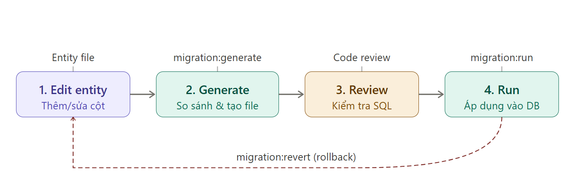

# Lesson 06 - TypeORM Advanced

## Mục Lục
1. [Quan hệ dữ liệu](#1-quan-hệ-dữ-liệu)
2. [Truy vấn nâng cao](#2-truy-vấn-nâng-cao)
3. [Query Builder](#3-query-builder)
4. [Transactions](#4-transactions)
5. [Raw Query](#5-raw-query)
6. [Soft Delete & Auditing](#6-soft-delete--auditing)
7. [Indexes & Performance](#7-indexes--performance)
8. [SQL Stored Procedures](#8-sql-stored-procedures)
9. [Advanced Patterns & Best Practices](#9-advanced-patterns--best-practices)

---

## 1. Quan hệ dữ liệu

### 1.1. One-to-One Relationship

**Khái niệm:** Mối quan hệ 1-1 nghĩa là một bản ghi ở bảng A chỉ liên kết với đúng một bản ghi ở bảng B và ngược lại.

**Ví dụ thực tế:** Một User có một Profile, một Profile thuộc về một User.

**Cấu trúc:**

```typescript
// user.entity.ts
import { Entity, PrimaryGeneratedColumn, Column, OneToOne, JoinColumn } from 'typeorm';
import { Profile } from './profile.entity';

@Entity('users')
export class User {
  @PrimaryGeneratedColumn()
  id: number;

  @Column()
  email: string;

  @Column()
  password: string;

  // Quan hệ One-to-One
  @OneToOne(() => Profile, (profile) => profile.user, {
    cascade: true, // Tự động lưu profile khi lưu user
    eager: false,   // Không tự động load profile
  })
  @JoinColumn() // Bên có @JoinColumn sẽ chứa foreign key
  profile: Profile;
}
```

Entity `User` đại diện cho bảng `users`:

| Column   | Type        | Nullable | Key | Description |
|----------|-------------|----------|-----|-------------|
| id       | INT         | NO       | PK  | ID người dùng (Primary Key, Auto Increment) |
| email    | VARCHAR(255)| NO       |     | Email đăng nhập của người dùng |
| password | VARCHAR(255)| NO       |     | Mật khẩu đã được hash |
| profileId| INT         | YES      | FK  | Khóa ngoại tham chiếu tới bảng `profiles` |


```typescript
// profile.entity.ts
import { Entity, PrimaryGeneratedColumn, Column, OneToOne } from 'typeorm';
import { User } from './user.entity';

@Entity('profiles')
export class Profile {
  @PrimaryGeneratedColumn()
  id: number;

  @Column()
  firstName: string;

  @Column()
  lastName: string;

  @Column({ nullable: true })
  avatar: string;

  // Quan hệ ngược lại
  @OneToOne(() => User, (user) => user.profile)
  user: User;
}
```


Entity `Profile` đại diện cho bảng `profiles` 

| Column     | Type         | Nullable | Key | Description |
|-------------|--------------|----------|-----|-------------|
| id          | INT          | NO       | PK  | ID của profile (Primary Key, Auto Increment) |
| firstName   | VARCHAR(255) | NO       |     | Tên của người dùng |
| lastName    | VARCHAR(255) | NO       |     | Họ của người dùng |
| avatar      | VARCHAR(255) | YES      |     | URL hoặc đường dẫn ảnh đại diện |


**Sử dụng:**

```typescript
// user.service.ts
async createUserWithProfile(userData: any) {
  const user = this.userRepository.create({
    email: userData.email,
    password: userData.password,
    profile: {
      firstName: userData.firstName,
      lastName: userData.lastName,
    }
  });
  
  return await this.userRepository.save(user);
  // Cascade: true sẽ tự động lưu cả profile
}

async getUserWithProfile(id: number) {
  return await this.userRepository.findOne({
    where: { id },
    relations: ['profile'], // Load cả profile
  });
}
```

---

### 1.2. One-to-Many / Many-to-One Relationship

**Khái niệm:** Một bản ghi ở bảng A có thể liên kết với nhiều bản ghi ở bảng B, nhưng mỗi bản ghi ở bảng B chỉ thuộc về một bản ghi ở bảng A.

**Ví dụ thực tế:** Một User có nhiều Posts, mỗi Post thuộc về một User.

```typescript
// user.entity.ts
import { Entity, PrimaryGeneratedColumn, Column, OneToMany } from 'typeorm';
import { Post } from './post.entity';

@Entity('users')
export class User {
  @PrimaryGeneratedColumn()
  id: number;

  @Column()
  email: string;

  // Một user có nhiều posts
  @OneToMany(() => Post, (post) => post.author)
  posts: Post[];
}
```

Entity `User` đại diện cho bảng `users`:

| Column | Type         | Nullable | Key | Description |
|------|--------------|----------|-----|-------------|
| id   | INT          | NO       | PK  | ID người dùng (Primary Key, Auto Increment) |
| email| VARCHAR(255) | NO       |     | Email của người dùng |


```typescript
// post.entity.ts
import { Entity, PrimaryGeneratedColumn, Column, ManyToOne, JoinColumn } from 'typeorm';
import { User } from './user.entity';

@Entity('posts')
export class Post {
  @PrimaryGeneratedColumn()
  id: number;

  @Column()
  title: string;

  @Column('text')
  content: string;

  // Nhiều posts thuộc về một user
  @ManyToOne(() => User, (user) => user.posts, {
    onDelete: 'CASCADE', // Xóa user thì xóa tất cả posts
    onUpdate: 'CASCADE', // Update user id thì update posts
  })
  @JoinColumn({ name: 'author_id' }) // Tên cột foreign key
  author: User;

  @Column({ name: 'author_id' })
  authorId: number; // Có thể dùng trực tiếp ID
}
```

Entity `Post` đại diện cho bảng `posts`:

| Column     | Type         | Nullable | Key | Description |
|-------------|--------------|----------|-----|-------------|
| id          | INT          | NO       | PK  | ID bài viết (Primary Key, Auto Increment) |
| title       | VARCHAR(255) | NO       |     | Tiêu đề bài viết |
| content     | TEXT         | NO       |     | Nội dung bài viết |
| author_id   | INT          | NO       | FK  | ID của user là tác giả bài viết |

**Sử dụng:**

```typescript
// Lấy user với tất cả posts
async getUserWithPosts(userId: number) {
  return await this.userRepository.findOne({
    where: { id: userId },
    relations: ['posts'],
  });
}

// Tạo post cho user
async createPost(userId: number, postData: any) {
  const post = this.postRepository.create({
    ...postData,
    authorId: userId, // Cách 1: Dùng ID trực tiếp
  });
  
  return await this.postRepository.save(post);
}

// Hoặc
async createPost2(userId: number, postData: any) {
  const user = await this.userRepository.findOne({ where: { id: userId } });
  
  const post = this.postRepository.create({
    ...postData,
    author: user, // Cách 2: Gán object
  });
  
  return await this.postRepository.save(post);
}
```

---

### 1.3. Many-to-Many Relationship

**Khái niệm:** Nhiều bản ghi ở bảng A có thể liên kết với nhiều bản ghi ở bảng B và ngược lại. TypeORM tự động tạo bảng trung gian (junction table).

**Ví dụ thực tế:** Một Student có thể học nhiều Courses, một Course có nhiều Students.

```typescript
// student.entity.ts
import { Entity, PrimaryGeneratedColumn, Column, ManyToMany, JoinTable } from 'typeorm';
import { Course } from './course.entity';

@Entity('students')
export class Student {
  @PrimaryGeneratedColumn()
  id: number;

  @Column()
  name: string;

  @Column()
  email: string;

  // Many-to-Many với @JoinTable ở một phía
  @ManyToMany(() => Course, (course) => course.students, {
    cascade: true,
  })
  @JoinTable({
    name: 'student_courses', // Tên bảng trung gian
    joinColumn: {
      name: 'student_id',
      referencedColumnName: 'id',
    },
    inverseJoinColumn: {
      name: 'course_id',
      referencedColumnName: 'id',
    },
  })
  courses: Course[];
}
```

Bảng `students` lưu thông tin sinh viên trong hệ thống.

| Column | Type         | Nullable | Key | Description |
|------|--------------|----------|-----|-------------|
| id   | INT          | NO       | PK  | ID sinh viên (Primary Key, Auto Increment) |
| name | VARCHAR(255) | NO       |     | Tên sinh viên |
| email| VARCHAR(255) | NO       |     | Email của sinh viên |

```typescript
// course.entity.ts
import { Entity, PrimaryGeneratedColumn, Column, ManyToMany } from 'typeorm';
import { Student } from './student.entity';

@Entity('courses')
export class Course {
  @PrimaryGeneratedColumn()
  id: number;

  @Column()
  name: string;

  @Column()
  credits: number;

  // Phía còn lại không cần @JoinTable
  @ManyToMany(() => Student, (student) => student.courses)
  students: Student[];
}
```

Bảng `courses` lưu thông tin các khóa học trong hệ thống.

| Column  | Type         | Nullable | Key | Description |
|---------|--------------|----------|-----|-------------|
| id      | INT          | NO       | PK  | ID khóa học (Primary Key, Auto Increment) |
| name    | VARCHAR(255) | NO       |     | Tên khóa học |
| credits | INT          | NO       |     | Số tín chỉ của khóa học |


**Sử dụng:**

```typescript
// Đăng ký course cho student
async enrollStudent(studentId: number, courseId: number) {
  const student = await this.studentRepository.findOne({
    where: { id: studentId },
    relations: ['courses'],
  });

  const course = await this.courseRepository.findOne({
    where: { id: courseId },
  });

  student.courses.push(course);
  return await this.studentRepository.save(student);
}

// Lấy student với tất cả courses
async getStudentWithCourses(studentId: number) {
  return await this.studentRepository.findOne({
    where: { id: studentId },
    relations: ['courses'],
  });
}

// Hủy đăng ký
async unenrollStudent(studentId: number, courseId: number) {
  const student = await this.studentRepository.findOne({
    where: { id: studentId },
    relations: ['courses'],
  });

  student.courses = student.courses.filter(
    course => course.id !== courseId
  );
  
  return await this.studentRepository.save(student);
}
```

---

### 1.4. Self-referencing Relations

**Khái niệm:** Entity tự tham chiếu đến chính nó. Thường dùng cho cấu trúc cây (tree structure).

**Ví dụ:** Category có thể có sub-categories, Employee có manager là Employee khác.

```typescript
// category.entity.ts
import { Entity, PrimaryGeneratedColumn, Column, ManyToOne, OneToMany, JoinColumn } from 'typeorm';

@Entity('categories')
export class Category {
  @PrimaryGeneratedColumn()
  id: number;

  @Column()
  name: string;

  // Parent category
  @ManyToOne(() => Category, (category) => category.children, {
    nullable: true,
  })
  @JoinColumn({ name: 'parent_id' })
  parent: Category;

  @Column({ name: 'parent_id', nullable: true })
  parentId: number;

  // Children categories
  @OneToMany(() => Category, (category) => category.parent)
  children: Category[];
}
```

Bảng `categories` lưu thông tin danh mục và hỗ trợ cấu trúc **phân cấp (hierarchical / tree structure)**.

| Column     | Type         | Nullable | Key | Description |
|-------------|--------------|----------|-----|-------------|
| id          | INT          | NO       | PK  | ID danh mục (Primary Key, Auto Increment) |
| name        | VARCHAR(255) | NO       |     | Tên danh mục |
| parent_id   | INT          | YES      | FK  | ID danh mục cha |

---

Hoặc với Employee:

```typescript
// employee.entity.ts
import { Entity, PrimaryGeneratedColumn, Column, ManyToOne, OneToMany } from 'typeorm';

@Entity('employees')
export class Employee {
  @PrimaryGeneratedColumn()
  id: number;

  @Column()
  name: string;

  // Manager (cũng là Employee)
  @ManyToOne(() => Employee, (employee) => employee.subordinates, {
    nullable: true,
  })
  manager: Employee;

  // Nhân viên cấp dưới
  @OneToMany(() => Employee, (employee) => employee.manager)
  subordinates: Employee[];
}
```

Bảng `employees` lưu thông tin nhân viên và cấu trúc quản lý trong tổ chức.

| Column      | Type         | Nullable | Key | Description |
|-------------|--------------|----------|-----|-------------|
| id          | INT          | NO       | PK  | ID nhân viên (Primary Key, Auto Increment) |
| name        | VARCHAR(255) | NO       |     | Tên nhân viên |
| manager_id  | INT          | YES      | FK  | ID của manager (cũng là một employee) |

**Sử dụng:**

```typescript
// Tạo category tree
async createCategoryTree() {
  const electronics = this.categoryRepository.create({
    name: 'Electronics',
  });
  await this.categoryRepository.save(electronics);

  const phones = this.categoryRepository.create({
    name: 'Phones',
    parentId: electronics.id,
  });
  await this.categoryRepository.save(phones);

  const laptops = this.categoryRepository.create({
    name: 'Laptops',
    parentId: electronics.id,
  });
  await this.categoryRepository.save(laptops);
}

// Lấy category với children
async getCategoryWithChildren(id: number) {
  return await this.categoryRepository.findOne({
    where: { id },
    relations: ['children', 'children.children'], // Nested relations
  });
}

// Lấy toàn bộ tree bằng TreeRepository
// Cần thêm @Tree("closure-table") vào entity
async getCategoryTree() {
  const categories = await this.categoryRepository.find({
    relations: ['children'],
  });
  
  // Tự build tree structure
  return this.buildTree(categories);
}
```

---

### 1.5. Cascade, Eager, Lazy Loading

Tìm hiểu một số cấu hình quan trọng khi làm việc với relations trong TypeORM.

#### **Cascade Options**

**Khái niệm:** Tự động thực hiện các thao tác (insert, update, remove) trên các entity liên quan.

Khái niệm này hoạt động như cách bạn cấu hình tùy chọn khóa ngoại (foreign key) trong RDBMS với các hành vi như CASCADE, SET NULL, v.v.

```typescript
@Entity()
export class User {
  @OneToOne(() => Profile, {
    cascade: true, // Hoặc ['insert', 'update', 'remove']
  })
  profile: Profile;

  @OneToMany(() => Post, post => post.author, {
    cascade: ['insert', 'update'], // Chỉ cascade khi insert và update
  })
  posts: Post[];
}
```

**Các loại cascade:**
- `insert` / `true`: Tự động lưu entity liên quan khi insert
- `update`: Tự động cập nhật entity liên quan
- `remove`: Tự động xóa entity liên quan khi xóa entity chính
- `soft-remove`: Tự động soft delete
- `recover`: Tự động recover

**Lưu ý:** Cascade có thể gây xóa dữ liệu không mong muốn. Cẩn thận khi dùng `cascade: ['remove']`.

#### **Eager Loading**

**Khái niệm:** Tự động load relations mỗi khi query entity, không cần chỉ định `relations`.

```typescript
@Entity()
export class User {
  @OneToOne(() => Profile, {
    eager: true, // Luôn load profile
  })
  profile: Profile;
}

// Sử dụng
const user = await this.userRepository.findOne({ where: { id: 1 } });
// user.profile đã được load tự động
```

**Ưu điểm:** Tiện lợi, không cần nhớ load relations.

**Nhược điểm:** 
- Luôn query thêm dữ liệu, có thể làm chậm app
- Không hoạt động với QueryBuilder
- Chỉ nên dùng cho relations quan trọng, thường xuyên cần

#### **Lazy Loading**

**Khái niệm:** Relations được load khi truy cập, không phải lúc query chính.

```typescript
@Entity()
export class User {
  @OneToMany(() => Post, post => post.author)
  posts: Promise<Post[]>; // Chú ý: Promise type
}

// Sử dụng
const user = await this.userRepository.findOne({ where: { id: 1 } });
const posts = await user.posts; // Trigger query ở đây
```

**Lưu ý:** 
- Lazy loading có thể gây N+1 problem
- TypeORM cần `"experimentalDecorators": true` trong tsconfig
- Không recommend dùng trong production

---

### 1.6. Bi-directional vs Uni-directional

#### **Bi-directional (Hai chiều)**

Cả hai entity đều biết về nhau.

```typescript
// Bi-directional
@Entity()
export class User {
  @OneToMany(() => Post, post => post.author)
  posts: Post[];
}

@Entity()
export class Post {
  @ManyToOne(() => User, user => user.posts)
  author: User;
}
```

**Ưu điểm:**
- Có thể query từ cả hai phía
- Dễ navigate giữa các entities

#### **Uni-directional (Một chiều)**

Chỉ một entity biết về entity kia.

```typescript
// Uni-directional
@Entity()
export class User {
  // Không có relation field
}

@Entity()
export class Post {
  @ManyToOne(() => User)
  author: User;
}
```

**Khi nào dùng:**
- Uni-directional: Khi chỉ cần query từ một phía
- Bi-directional: Khi cần query từ cả hai phía

---

### 1.7. @JoinColumn và @JoinTable

#### **@JoinColumn**

Dùng cho **One-to-One** và **Many-to-One**, chỉ định cột chứa foreign key.

```typescript
@Entity()
export class Post {
  @ManyToOne(() => User)
  @JoinColumn({ 
    name: 'author_id', // Tên cột trong database
    referencedColumnName: 'id' // Cột tham chiếu (default: 'id')
  })
  author: User;
}
```

Tương ứng ta có:

Bảng `users` lưu thông tin người dùng (tác giả bài viết).

| Column | Type | Nullable | Key | Description |
|------|------|----------|-----|-------------|
| id   | INT  | NO       | PK  | ID người dùng (Primary Key, Auto Increment) |

Bảng `posts` lưu thông tin bài viết.

| Column    | Type | Nullable | Key | Description |
|-----------|------|----------|-----|-------------|
| id        | INT  | NO       | PK  | ID bài viết |
| author_id | INT  | YES      | FK  | ID của user là tác giả bài viết |


**Nếu không dùng @JoinColumn:** TypeORM tự tạo tên cột dạng `authorId`.

#### **@JoinTable**

Dùng cho **Many-to-Many**, chỉ định bảng trung gian.

```typescript
@Entity()
export class Student {
  @ManyToMany(() => Course)
  @JoinTable({
    name: 'student_courses',
    joinColumn: {
      name: 'student_id',
      referencedColumnName: 'id'
    },
    inverseJoinColumn: {
      name: 'course_id',
      referencedColumnName: 'id'
    }
  })
  courses: Course[];
}
```

**Lưu ý:** Chỉ đặt @JoinTable ở một phía của Many-to-Many relation.

---

### 1.8. onDelete, onUpdate Behaviors

**Khái niệm:** Định nghĩa hành vi khi delete/update bản ghi cha.

```typescript
@Entity()
export class Post {
  @ManyToOne(() => User, {
    onDelete: 'CASCADE',  // Xóa user → xóa posts
    onUpdate: 'CASCADE',  // Update user.id → update post.authorId
  })
  author: User;
}
```

**Các option:**

| Option | Ý nghĩa |
|--------|---------|
| `CASCADE` | Xóa/update cha → tự động xóa/update con |
| `SET NULL` | Xóa cha → set foreign key = null |
| `RESTRICT` | Không cho xóa cha nếu còn con |
| `NO ACTION` | Không làm gì (database tự xử lý) |
| `SET DEFAULT` | Set về giá trị default |

**Ví dụ thực tế:**

```typescript
// Comment thuộc Post, xóa post thì xóa comments
@Entity()
export class Comment {
  @ManyToOne(() => Post, {
    onDelete: 'CASCADE',
  })
  post: Post;
}

// Order của User, xóa user không xóa orders (giữ lịch sử)
@Entity()
export class Order {
  @ManyToOne(() => User, {
    onDelete: 'SET NULL',
  })
  user: User;
}
```

**Khi nào thì dùng casscade vs onDelete/onUpdate ?**

- Dùng **cascade** khi muốn tự động thao tác trên entity liên quan trong ứng dụng (insert, update, remove).
- Dùng **onDelete/onUpdate** để thiết lập hành vi ở cấp database, đảm bảo tính toàn vẹn dữ liệu khi thao tác trực tiếp trên database.


---

### 1.9. Circular Dependencies

**Vấn đề:** Khi hai entity import lẫn nhau gây circular dependency error.

```typescript
// ❌ Lỗi: Circular dependency
// user.entity.ts
import { Post } from './post.entity';

@Entity()
export class User {
  @OneToMany(() => Post, post => post.author)
  posts: Post[];
}

// post.entity.ts
import { User } from './user.entity';

@Entity()
export class Post {
  @ManyToOne(() => User, user => user.posts)
  author: User;
}
```

**Giải pháp: Dùng forward reference**

```typescript
import type { Post } from './post.entity'; // type-only import ✅
// ✅ Đúng: Dùng arrow function
// user.entity.ts
@Entity()
export class User {
  @OneToMany(() => Post, post => post.author)
  //        ^^^^^^^^^ Arrow function, không import trực tiếp
  posts: Post[];
}

// post.entity.ts
import type { User } from './user.entity'; // type-only import ✅
@Entity()
export class Post {
  @ManyToOne(() => User, user => user.posts)
  //        ^^^^^^^^^ Arrow function
  author: User;
}
```

---


## 2. Truy vấn nâng cao

### 2.1. FindOptions và Where Operators

#### **Basic FindOptions**

```typescript
// Lấy tất cả users
const users = await this.userRepository.find();

// Lấy một user theo ID
const user = await this.userRepository.findOne({
  where: { id: 1 }
});

// Lấy nhiều users với điều kiện, sắp xếp, phân trang
const users = await this.userRepository.find({
  where: { 
    email: 'test@example.com',
    isActive: true 
  },
  order: { createdAt: 'DESC' },
  skip: 0,
  take: 10,
});
```

#### **Where Operators**

TypeORM cung cấp nhiều operators để query phức tạp:

```typescript
import { 
  Not, 
  LessThan, 
  LessThanOrEqual, 
  MoreThan, 
  MoreThanOrEqual,
  Equal,
  Like,
  ILike,
  Between,
  In,
  Any,
  IsNull,
  Raw
} from 'typeorm';

// Not Equal
const users = await this.userRepository.find({
  where: { role: Not('admin') }
});

// Greater than
const products = await this.productRepository.find({
  where: { price: MoreThan(100) }
});

// Between
const orders = await this.orderRepository.find({
  where: {
    createdAt: Between(
      new Date('2024-01-01'),
      new Date('2024-12-31')
    )
  }
});

// Like (case-sensitive)
const users = await this.userRepository.find({
  where: { email: Like('%@gmail.com') }
});

// ILike (case-insensitive, chỉ Postgres)
const users = await this.userRepository.find({
  where: { name: ILike('%john%') }
});

// In
const users = await this.userRepository.find({
  where: { role: In(['admin', 'moderator']) }
});

// IsNull
const posts = await this.postRepository.find({
  where: { publishedAt: IsNull() }
});

// Raw (SQL tùy chỉnh)
const users = await this.userRepository.find({
  where: {
    createdAt: Raw(alias => `${alias} > NOW() - INTERVAL '7 days'`)
  }
});
```

#### **Multiple Conditions (AND / OR)**

```typescript
// AND: Dùng object
const users = await this.userRepository.find({
  where: {
    isActive: true,
    role: 'admin',
    age: MoreThan(18)
  }
  // WHERE isActive = true AND role = 'admin' AND age > 18
});

// OR: Dùng array
const users = await this.userRepository.find({
  where: [
    { email: 'admin@example.com' },
    { role: 'admin' }
  ]
  // WHERE email = 'admin@example.com' OR role = 'admin'
});

// Complex: Kết hợp AND và OR
const users = await this.userRepository.find({
  where: [
    { email: Like('%@gmail.com'), isActive: true },
    { role: 'admin', isActive: true }
  ]
  // WHERE (email LIKE '%@gmail.com' AND isActive = true) 
  //    OR (role = 'admin' AND isActive = true)
});
```

---

### 2.2. Relations (Eager/Lazy, Select fields)

#### **Load Relations**

```typescript
// Load single relation
const user = await this.userRepository.findOne({
  where: { id: 1 },
  relations: ['profile']
});

// Load multiple relations
const user = await this.userRepository.findOne({
  where: { id: 1 },
  relations: ['profile', 'posts', 'posts.comments']
});

// Load nested relations
const post = await this.postRepository.findOne({
  where: { id: 1 },
  relations: ['author', 'author.profile', 'comments', 'comments.author']
});
```

#### **Select Specific Fields**

```typescript
// Select chỉ một số fields
const users = await this.userRepository.find({
  select: ['id', 'email', 'createdAt']
  // Chỉ lấy 3 fields này, không lấy password, etc.
});

// Select với relations
const users = await this.userRepository.find({
  select: {
    id: true,
    email: true,
    profile: {
      firstName: true,
      lastName: true
    }
  },
  relations: ['profile']
});
```

#### **RelationLoadStrategy**

```typescript
// Trong TypeORM config
TypeOrmModule.forRoot({
  // ...
  relationLoadStrategy: 'join', // hoặc 'query'
});
```

**Sự khác biệt:**
- `join`: Load relations bằng JOIN trong 1 query duy nhất (fast)
- `query`: Load relations bằng separate queries (flexible hơn)

---

### 2.3. Pagination

TypeORM hỗ trợ phân trang qua `skip` và `take` trong FindOptions. Dưới đây là hai cách phổ biến: Offset-based và Cursor-based pagination.

#### **Offset-based Pagination**

```typescript
async getPaginatedUsers(page: number = 1, limit: number = 10) {
  const [users, total] = await this.userRepository.findAndCount({
    skip: (page - 1) * limit,
    take: limit,
    order: { createdAt: 'DESC' }
  });

  return {
    data: users,
    meta: {
      total,
      page,
      limit,
      totalPages: Math.ceil(total / limit)
    }
  };
}
```

**Ưu điểm:** Đơn giản, dễ implement.

**Nhược điểm:** 
- Chậm với offset lớn (phải skip nhiều records). Về bản chất database vẫn phải duyệt qua các bản ghi đã skip.
- Inconsistent khi có insert/delete trong lúc phân trang

#### **Cursor-based Pagination**

```typescript
async getCursorPaginatedUsers(
  cursor?: number,
  limit: number = 10
) {
  const queryBuilder = this.userRepository.createQueryBuilder('user');

  if (cursor) {
    queryBuilder.where('user.id < :cursor', { cursor });
  }

  const users = await queryBuilder
    .orderBy('user.id', 'DESC')
    .take(limit + 1) // Lấy thêm 1 để check hasMore
    .getMany();

  const hasMore = users.length > limit;
  const data = hasMore ? users.slice(0, -1) : users;
  const nextCursor = hasMore ? data[data.length - 1].id : null;

  return {
    data,
    meta: {
      nextCursor,
      hasMore
    }
  };
}
```

**Ưu điểm:** 
- Performance tốt với dataset lớn
- Consistent khi có insert/delete

**Nhược điểm:** 
- Không thể jump đến page cụ thể
- Phức tạp hơn


#### Giải pháp áp dụng Cursor-based Pagination có thể phân trang mượt mà cho các API danh sách lớn.

```typescript
//TODO: Implement cursor-based pagination for products
```

---

### 2.4. Filtering & Search

Dưới đây là ví dụ về cách implement filtering và search nâng cao với TypeORM.

```typescript
async searchUsers(filters: {
  search?: string;
  role?: string;
  isActive?: boolean;
  minAge?: number;
  maxAge?: number;
}) {
  const queryBuilder = this.userRepository.createQueryBuilder('user');

  // Search trong nhiều fields
  if (filters.search) {
    queryBuilder.andWhere(
      '(user.email LIKE :search OR user.name LIKE :search)',
      { search: `%${filters.search}%` }
    );
  }

  // Filter by role
  if (filters.role) {
    queryBuilder.andWhere('user.role = :role', { role: filters.role });
  }

  // Filter by boolean
  if (filters.isActive !== undefined) {
    queryBuilder.andWhere('user.isActive = :isActive', { 
      isActive: filters.isActive 
    });
  }

  // Range filter
  if (filters.minAge) {
    queryBuilder.andWhere('user.age >= :minAge', { minAge: filters.minAge });
  }
  if (filters.maxAge) {
    queryBuilder.andWhere('user.age <= :maxAge', { maxAge: filters.maxAge });
  }

  return await queryBuilder.getMany();
}
```

**Full-text Search (Postgres):**

```typescript
async fullTextSearch(query: string) {
  return await this.productRepository
    .createQueryBuilder('product')
    .where(
      'to_tsvector(product.name || \' \' || product.description) @@ plainto_tsquery(:query)',
      { query }
    )
    .getMany();
}
```

---

### 2.5. Sorting

```typescript
// Simple sort
const users = await this.userRepository.find({
  order: { createdAt: 'DESC' }
});

// Multiple sort
const users = await this.userRepository.find({
  order: {
    role: 'ASC',
    createdAt: 'DESC'
  }
});

// Sort by relation
const posts = await this.postRepository.find({
  relations: ['author'],
  order: {
    'author.name': 'ASC',
    'createdAt': 'DESC'
  }
});

// Dynamic sort
async getUsers(sortBy: string = 'createdAt', order: 'ASC' | 'DESC' = 'DESC') {
  return await this.userRepository.find({
    order: { [sortBy]: order }
  });
}
```

---

### 2.6. Aggregation

```typescript
// Count
const count = await this.userRepository.count({
  where: { isActive: true }
});

// Sum
const totalRevenue = await this.orderRepository
  .createQueryBuilder('order')
  .select('SUM(order.amount)', 'total')
  .getRawOne();

// Average
const avgPrice = await this.productRepository
  .createQueryBuilder('product')
  .select('AVG(product.price)', 'average')
  .getRawOne();

// Min/Max
const stats = await this.productRepository
  .createQueryBuilder('product')
  .select('MIN(product.price)', 'minPrice')
  .addSelect('MAX(product.price)', 'maxPrice')
  .addSelect('AVG(product.price)', 'avgPrice')
  .getRawOne();

console.log(stats);
// { minPrice: 10, maxPrice: 1000, avgPrice: 250.5 }
```

---

### 2.7. GROUP BY và HAVING

```typescript
// Group by với count
async getUserPostCounts() {
  return await this.postRepository
    .createQueryBuilder('post')
    .select('post.authorId', 'authorId')
    .addSelect('COUNT(post.id)', 'postCount')
    .groupBy('post.authorId')
    .getRawMany();
}

// Group by với HAVING
async getActiveAuthors(minPosts: number = 5) {
  return await this.postRepository
    .createQueryBuilder('post')
    .select('post.authorId', 'authorId')
    .addSelect('COUNT(post.id)', 'postCount')
    .groupBy('post.authorId')
    .having('COUNT(post.id) >= :minPosts', { minPosts })
    .getRawMany();
}

// Complex grouping
async getMonthlyRevenue(year: number) {
  return await this.orderRepository
    .createQueryBuilder('order')
    .select('EXTRACT(MONTH FROM order.createdAt)', 'month')
    .addSelect('SUM(order.amount)', 'revenue')
    .addSelect('COUNT(order.id)', 'orderCount')
    .where('EXTRACT(YEAR FROM order.createdAt) = :year', { year })
    .groupBy('EXTRACT(MONTH FROM order.createdAt)')
    .orderBy('month', 'ASC')
    .getRawMany();
}
```

---

### 2.8. Subqueries

```typescript
// Subquery trong WHERE
async getUsersWithManyPosts(minPosts: number = 10) {
  return await this.userRepository
    .createQueryBuilder('user')
    .where(qb => {
      const subQuery = qb
        .subQuery()
        .select('post.authorId')
        .from(Post, 'post')
        .groupBy('post.authorId')
        .having('COUNT(post.id) >= :minPosts')
        .getQuery();
      
      return `user.id IN ${subQuery}`;
    })
    .setParameter('minPosts', minPosts)
    .getMany();
}

// Subquery trong SELECT
async getUsersWithPostCount() {
  return await this.userRepository
    .createQueryBuilder('user')
    .loadRelationCountAndMap('user.postCount', 'user.posts')
    .getMany();
}

// Hoặc dùng subquery
async getUsersWithPostCount2() {
  return await this.userRepository
    .createQueryBuilder('user')
    .select('user.*')
    .addSelect(subQuery => {
      return subQuery
        .select('COUNT(post.id)')
        .from(Post, 'post')
        .where('post.authorId = user.id');
    }, 'postCount')
    .getRawMany();
}
```

---

## 3. Query Builder

### 3.1. Query Builder là gì?

**Khái niệm:** Query Builder là một API của TypeORM cho phép xây dựng SQL queries bằng JavaScript/TypeScript thay vì viết SQL thuần.

**Ưu điểm:**
- Type-safe
- Linh hoạt, tạo dynamic queries
- Dễ debug hơn SQL thuần
- Tránh SQL injection
- Dễ maintain và test

**Nhược điểm:**
- Verbose hơn raw SQL
- Learning curve
- Performance có thể kém hơn raw SQL trong một số trường hợp

---

### 3.2. Khi nào dùng Query Builder

**Nên dùng Query Builder khi:**
- Cần dynamic queries (conditions thay đổi)
- Queries phức tạp với nhiều JOINs
- Cần aggregations, subqueries
- Muốn type-safety

**Dùng find/findOne khi:**
- Queries đơn giản
- Load entity với relations
- CRUD cơ bản

**Dùng Raw Query khi:**
- Queries cực kỳ phức tạp
- Cần optimize performance tối đa
- Sử dụng database-specific features

---

### 3.3. CRUD với Query Builder

#### **Select**

```typescript
// Basic select
const users = await this.userRepository
  .createQueryBuilder('user')
  .getMany();

// Select specific fields
const users = await this.userRepository
  .createQueryBuilder('user')
  .select(['user.id', 'user.email', 'user.name'])
  .getMany();

// With WHERE
const user = await this.userRepository
  .createQueryBuilder('user')
  .where('user.id = :id', { id: 1 })
  .getOne();

// Multiple conditions
const users = await this.userRepository
  .createQueryBuilder('user')
  .where('user.isActive = :isActive', { isActive: true })
  .andWhere('user.role = :role', { role: 'admin' })
  .getMany();

// OR conditions
const users = await this.userRepository
  .createQueryBuilder('user')
  .where('user.email = :email', { email: 'admin@test.com' })
  .orWhere('user.role = :role', { role: 'admin' })
  .getMany();
```

#### **Insert**

```typescript
// Insert single
await this.userRepository
  .createQueryBuilder()
  .insert()
  .into(User)
  .values({
    email: 'test@example.com',
    password: 'hashed_password',
    name: 'John Doe'
  })
  .execute();

// Insert multiple
await this.userRepository
  .createQueryBuilder()
  .insert()
  .into(User)
  .values([
    { email: 'user1@test.com', name: 'User 1' },
    { email: 'user2@test.com', name: 'User 2' }
  ])
  .execute();

// Insert with returning
const result = await this.userRepository
  .createQueryBuilder()
  .insert()
  .into(User)
  .values({ email: 'test@example.com', name: 'Test' })
  .returning('*') // hoặc ['id', 'email']
  .execute();

const insertedUser = result.generatedMaps[0];
```

#### **Update**

```typescript
// Update single
await this.userRepository
  .createQueryBuilder()
  .update(User)
  .set({ name: 'Updated Name', updatedAt: new Date() })
  .where('id = :id', { id: 1 })
  .execute();

// Update multiple với condition
await this.userRepository
  .createQueryBuilder()
  .update(User)
  .set({ isActive: false })
  .where('lastLoginAt < :date', { 
    date: new Date(Date.now() - 90 * 24 * 60 * 60 * 1000) // 90 days ago
  })
  .execute();

// Update với increment
await this.postRepository
  .createQueryBuilder()
  .update(Post)
  .set({ views: () => 'views + 1' })
  .where('id = :id', { id: postId })
  .execute();
```

#### **Delete**

```typescript
// Delete with condition
await this.userRepository
  .createQueryBuilder()
  .delete()
  .from(User)
  .where('id = :id', { id: 1 })
  .execute();

// Delete multiple
await this.userRepository
  .createQueryBuilder()
  .delete()
  .from(User)
  .where('isActive = :isActive', { isActive: false })
  .andWhere('createdAt < :date', { 
    date: new Date(Date.now() - 365 * 24 * 60 * 60 * 1000) 
  })
  .execute();

// Soft delete
await this.userRepository
  .createQueryBuilder()
  .softDelete()
  .where('id = :id', { id: 1 })
  .execute();
```

---

### 3.4. JOIN Operations

```typescript
// INNER JOIN
const posts = await this.postRepository
  .createQueryBuilder('post')
  .innerJoinAndSelect('post.author', 'author')
  .getMany();

// LEFT JOIN
const posts = await this.postRepository
  .createQueryBuilder('post')
  .leftJoinAndSelect('post.author', 'author')
  .leftJoinAndSelect('post.comments', 'comment')
  .getMany();

// JOIN với condition
const posts = await this.postRepository
  .createQueryBuilder('post')
  .leftJoinAndSelect(
    'post.comments', 
    'comment',
    'comment.isApproved = :approved',
    { approved: true }
  )
  .getMany();

// Multiple JOINs
const posts = await this.postRepository
  .createQueryBuilder('post')
  .innerJoinAndSelect('post.author', 'author')
  .leftJoinAndSelect('author.profile', 'profile')
  .leftJoinAndSelect('post.comments', 'comment')
  .leftJoinAndSelect('comment.author', 'commentAuthor')
  .getMany();

// JOIN without select (chỉ dùng cho WHERE)
const posts = await this.postRepository
  .createQueryBuilder('post')
  .innerJoin('post.author', 'author')
  .where('author.role = :role', { role: 'admin' })
  .getMany();
```

---

### 3.5. Subqueries

```typescript
// Subquery trong WHERE
const users = await this.userRepository
  .createQueryBuilder('user')
  .where(qb => {
    const subQuery = qb
      .subQuery()
      .select('post.authorId')
      .from(Post, 'post')
      .where('post.publishedAt IS NOT NULL')
      .groupBy('post.authorId')
      .having('COUNT(post.id) > :count')
      .getQuery();
    
    return `user.id IN ${subQuery}`;
  })
  .setParameter('count', 5)
  .getMany();

// Subquery trong SELECT
const users = await this.userRepository
  .createQueryBuilder('user')
  .select('user.id')
  .addSelect('user.email')
  .addSelect(subQuery => {
    return subQuery
      .select('COUNT(post.id)')
      .from(Post, 'post')
      .where('post.authorId = user.id');
  }, 'postCount')
  .getRawMany();

// Subquery trong FROM
const result = await this.dataSource
  .createQueryBuilder()
  .select('activeUsers.role', 'role')
  .addSelect('COUNT(*)', 'count')
  .from(subQuery => {
    return subQuery
      .select('user.role')
      .from(User, 'user')
      .where('user.isActive = :active', { active: true });
  }, 'activeUsers')
  .groupBy('activeUsers.role')
  .getRawMany();
```

---

### 3.6. Parameters Binding

**Khái niệm:** Bind parameters để tránh SQL injection và tái sử dụng queries.

```typescript
// Named parameters (recommended)
const users = await this.userRepository
  .createQueryBuilder('user')
  .where('user.email = :email', { email: 'test@example.com' })
  .andWhere('user.age > :age', { age: 18 })
  .getMany();

// Array parameters
const users = await this.userRepository
  .createQueryBuilder('user')
  .where('user.role IN (:...roles)', { roles: ['admin', 'moderator'] })
  .getMany();

// Set parameters separately
const qb = this.userRepository.createQueryBuilder('user');
qb.where('user.email = :email');
qb.andWhere('user.age > :age');
qb.setParameters({ email: 'test@example.com', age: 18 });
const users = await qb.getMany();

// Add parameters
qb.setParameter('email', 'test@example.com');
qb.setParameter('age', 18);
```

**Lưu ý:** KHÔNG BAO GIỜ concatenate string trực tiếp vào query → SQL injection!

```typescript
// ❌ NGUY HIỂM - SQL Injection
const email = req.body.email;
const users = await this.userRepository
  .createQueryBuilder('user')
  .where(`user.email = '${email}'`) // VULNERABLE!
  .getMany();

// ✅ AN TOÀN
const users = await this.userRepository
  .createQueryBuilder('user')
  .where('user.email = :email', { email })
  .getMany();
```

---

### 3.7. Conditional Queries

```typescript
async searchUsers(filters: {
  search?: string;
  role?: string;
  isActive?: boolean;
  minAge?: number;
}) {
  const qb = this.userRepository.createQueryBuilder('user');

  // Conditional WHERE
  if (filters.search) {
    qb.andWhere(
      '(user.email LIKE :search OR user.name LIKE :search)',
      { search: `%${filters.search}%` }
    );
  }

  if (filters.role) {
    qb.andWhere('user.role = :role', { role: filters.role });
  }

  if (filters.isActive !== undefined) {
    qb.andWhere('user.isActive = :isActive', { isActive: filters.isActive });
  }

  if (filters.minAge) {
    qb.andWhere('user.age >= :minAge', { minAge: filters.minAge });
  }

  return await qb.getMany();
}

// Dynamic sorting
async getUsers(sortBy?: string, order: 'ASC' | 'DESC' = 'DESC') {
  const qb = this.userRepository.createQueryBuilder('user');

  if (sortBy) {
    qb.orderBy(`user.${sortBy}`, order);
  } else {
    qb.orderBy('user.createdAt', 'DESC');
  }

  return await qb.getMany();
}
```

---

### 3.8. Query Caching

**Khái niệm:** Cache kết quả queries để tăng performance.

```typescript
// Enable caching trong TypeORM config
TypeOrmModule.forRoot({
  // ...
  cache: {
    duration: 30000, // 30 seconds
  },
});

// Cache specific query
const users = await this.userRepository
  .createQueryBuilder('user')
  .where('user.role = :role', { role: 'admin' })
  .cache(60000) // Cache 60 seconds
  .getMany();

// Cache với ID
const users = await this.userRepository
  .createQueryBuilder('user')
  .cache('admin_users', 60000)
  .getMany();

// Clear cache
await this.dataSource.queryResultCache.remove(['admin_users']);

// Sử dụng Redis cho cache (production)
TypeOrmModule.forRoot({
  // ...
  cache: {
    type: 'redis',
    options: {
      host: 'localhost',
      port: 6379,
    },
    duration: 30000,
  },
});
```

**Lưu ý:** 
- Chỉ cache queries ít thay đổi
- Cẩn thận với stale data
- Invalidate cache khi update data

---

## 4. Transactions

### 4.1. Transaction là gì? ACID

**Khái niệm:** Transaction là một nhóm operations được thực thi như một đơn vị. Tất cả thành công hoặc tất cả thất bại (rollback).

**ACID Properties:**

1. **Atomicity (Tính nguyên tử):** Tất cả operations trong transaction phải thành công, nếu một operation fail thì tất cả rollback.

2. **Consistency (Tính nhất quán):** Database luôn chuyển từ trạng thái hợp lệ này sang trạng thái hợp lệ khác.

3. **Isolation (Tính cô lập):** Các transactions đồng thời không ảnh hưởng lẫn nhau.

4. **Durability (Tính bền vững):** Sau khi commit, thay đổi được lưu vĩnh viễn.

**Ví dụ thực tế:** Chuyển tiền từ Account A sang Account B:
```
1. Trừ tiền Account A: -100$
2. Cộng tiền Account B: +100$
```
Nếu bước 1 thành công nhưng bước 2 fail → rollback, không mất tiền.

---

### 4.2. QueryRunner Approach

**Cách sử dụng linh hoạt nhất:**

```typescript
import { DataSource } from 'typeorm';

@Injectable()
export class UserService {
  constructor(private dataSource: DataSource) {}

  async transferMoney(fromId: number, toId: number, amount: number) {
    // Tạo QueryRunner
    const queryRunner = this.dataSource.createQueryRunner();

    // Kết nối database
    await queryRunner.connect();

    // Bắt đầu transaction
    await queryRunner.startTransaction();

    try {
      // Operation 1: Trừ tiền account A
      await queryRunner.manager.decrement(
        Account,
        { id: fromId },
        'balance',
        amount
      );

      // Kiểm tra balance
      const fromAccount = await queryRunner.manager.findOne(Account, {
        where: { id: fromId }
      });

      if (fromAccount.balance < 0) {
        throw new Error('Insufficient balance');
      }

      // Operation 2: Cộng tiền account B
      await queryRunner.manager.increment(
        Account,
        { id: toId },
        'balance',
        amount
      );

      // Operation 3: Tạo transaction log
      const log = queryRunner.manager.create(TransactionLog, {
        fromAccountId: fromId,
        toAccountId: toId,
        amount,
        status: 'completed'
      });
      await queryRunner.manager.save(log);

      // Commit nếu tất cả thành công
      await queryRunner.commitTransaction();

      return { success: true };

    } catch (error) {
      // Rollback nếu có lỗi
      await queryRunner.rollbackTransaction();
      
      throw error;

    } finally {
      // Release QueryRunner
      await queryRunner.release();
    }
  }
}
```

**Ưu điểm:**
- Kiểm soát hoàn toàn transaction flow
- Có thể thêm logic phức tạp giữa các operations

**Nhược điểm:**
- Verbose, dễ quên release
- Phải handle errors manually

---

### 4.3. Transaction Decorator

**Cách đơn giản hơn với @Transaction decorator:**

```typescript
import { Transaction, TransactionManager, EntityManager } from 'typeorm';

@Injectable()
export class OrderService {
  
  @Transaction()
  async createOrder(
    @TransactionManager() manager: EntityManager,
    orderData: CreateOrderDto
  ) {
    // Tất cả operations dùng manager này đều trong transaction
    
    // 1. Tạo order
    const order = manager.create(Order, {
      userId: orderData.userId,
      totalAmount: orderData.totalAmount
    });
    await manager.save(order);

    // 2. Tạo order items
    const items = orderData.items.map(item => 
      manager.create(OrderItem, {
        orderId: order.id,
        productId: item.productId,
        quantity: item.quantity,
        price: item.price
      })
    );
    await manager.save(items);

    // 3. Update product stock
    for (const item of orderData.items) {
      await manager.decrement(
        Product,
        { id: item.productId },
        'stock',
        item.quantity
      );
    }

    // 4. Tạo invoice
    const invoice = manager.create(Invoice, {
      orderId: order.id,
      amount: orderData.totalAmount
    });
    await manager.save(invoice);

    return order;
    
    // Tự động commit nếu không có error
    // Tự động rollback nếu throw error
  }
}
```

**Lưu ý:** Decorator approach không còn được TypeORM recommend ở version mới. Nên dùng QueryRunner.

---

### 4.4. Isolation Levels

**Khái niệm:** Định nghĩa mức độ cô lập giữa các transactions đồng thời.

**Các levels:**

1. **READ UNCOMMITTED:** Đọc được uncommitted data (dirty read) - Ít dùng
2. **READ COMMITTED:** Chỉ đọc committed data - Default của Postgres
3. **REPEATABLE READ:** Đảm bảo đọc cùng data trong suốt transaction - Default của MySQL
4. **SERIALIZABLE:** Cô lập hoàn toàn, chậm nhất

```typescript
await queryRunner.startTransaction('READ COMMITTED');
// hoặc
await queryRunner.startTransaction('REPEATABLE READ');
// hoặc
await queryRunner.startTransaction('SERIALIZABLE');
```

**Ví dụ vấn đề với READ COMMITTED:**

```typescript
// Transaction 1
const price = await manager.findOne(Product, { where: { id: 1 } });
// price = 100

// Transaction 2 (cùng lúc) update price
await manager.update(Product, { id: 1 }, { price: 150 });

// Transaction 1 đọc lại
const newPrice = await manager.findOne(Product, { where: { id: 1 } });
// newPrice = 150 (khác với lần đọc đầu) - Non-repeatable read
```

**Giải pháp:** Dùng REPEATABLE READ hoặc SERIALIZABLE.

---

### 4.5. Error Handling

```typescript
async processOrder(orderData: any) {
  const queryRunner = this.dataSource.createQueryRunner();
  await queryRunner.connect();
  await queryRunner.startTransaction();

  try {
    // Operations...
    await queryRunner.commitTransaction();
    
    return { success: true };

  } catch (error) {
    await queryRunner.rollbackTransaction();
    
    // Log error
    this.logger.error('Transaction failed', error.stack);

    // Xử lý specific errors
    if (error.code === '23505') { // Postgres unique violation
      throw new ConflictException('Duplicate entry');
    }

    if (error.message.includes('Insufficient')) {
      throw new BadRequestException('Insufficient balance');
    }

    // Re-throw generic errors
    throw new InternalServerErrorException('Transaction failed');

  } finally {
    await queryRunner.release();
  }
}
```

---

### 4.6. Best Practices

1. **Keep transactions short:** Transactions càng ngắn càng tốt, giảm lock contention.

```typescript
// ❌ BAD: Transaction quá dài
await queryRunner.startTransaction();
await sendEmail(); // Slow external API
await updateDatabase();
await queryRunner.commitTransaction();

// ✅ GOOD: Chỉ transaction cho database operations
await sendEmail();
await queryRunner.startTransaction();
await updateDatabase();
await queryRunner.commitTransaction();
```

2. **Always release QueryRunner:**

```typescript
// Luôn dùng try-finally
try {
  await queryRunner.startTransaction();
  // ...
  await queryRunner.commitTransaction();
} catch (error) {
  await queryRunner.rollbackTransaction();
  throw error;
} finally {
  await queryRunner.release(); // CRITICAL!
}
```

3. **Avoid nested transactions:** TypeORM không hỗ trợ nested transactions. Dùng savepoints nếu cần.

4. **Use appropriate isolation level:** Default thường đủ, chỉ tăng khi thực sự cần.

5. **Transaction cho write operations:** Không cần transaction cho read-only queries.

---

## 5. Raw Query

### 5.1. Khi nào cần Raw Query

**Nên dùng Raw Query khi:**
- Database-specific features (window functions, CTEs, JSON operators)
- Queries cực kỳ phức tạp, QueryBuilder khó viết
- Performance critical queries
- Migration scripts
- Bulk operations với performance cao

**Không nên dùng khi:**
- CRUD đơn giản
- Có thể dùng QueryBuilder
- Cần type safety

---

### 5.2. Cách sử dụng an toàn

```typescript
// Basic raw query
const users = await this.dataSource.query(
  'SELECT * FROM users WHERE role = $1',
  ['admin']
);

// Query với Entity Manager
const users = await this.userRepository.query(
  'SELECT * FROM users WHERE role = $1',
  ['admin']
);

// Named parameters (Postgres)
const users = await this.dataSource.query(
  'SELECT * FROM users WHERE email = $1 AND age > $2',
  ['test@example.com', 18]
);

// Multiple params
const result = await this.dataSource.query(`
  UPDATE products 
  SET price = price * $1, updated_at = NOW()
  WHERE category_id = $2
  RETURNING *
`, [1.1, categoryId]);
```

---

### 5.3. Parameter Binding

**Postgres style ($1, $2):**

```typescript
await this.dataSource.query(
  'SELECT * FROM users WHERE email = $1 AND role = $2',
  ['admin@test.com', 'admin']
);
```

**MySQL style (?):**

```typescript
await this.dataSource.query(
  'SELECT * FROM users WHERE email = ? AND role = ?',
  ['admin@test.com', 'admin']
);
```

**Array parameters:**

```typescript
const roles = ['admin', 'moderator', 'editor'];
await this.dataSource.query(
  'SELECT * FROM users WHERE role = ANY($1)',
  [roles]
);
```

---

### 5.4. Security Concerns

**SQL Injection - NGUY HIỂM:**

```typescript
// ❌ CỰC KỲ NGUY HIỂM - VULNERABLE TO SQL INJECTION
const email = req.body.email; // Attacker input: "' OR '1'='1"
const users = await this.dataSource.query(
  `SELECT * FROM users WHERE email = '${email}'`
);
// SQL: SELECT * FROM users WHERE email = '' OR '1'='1'
// → Lấy tất cả users!

// ✅ AN TOÀN - Dùng parameterized queries
const users = await this.dataSource.query(
  'SELECT * FROM users WHERE email = $1',
  [email]
);
```

**Best Practices:**

1. **LUÔN LUÔN dùng parameter binding**
2. **KHÔNG BAO GIỜ concatenate user input vào SQL**
3. **Validate input trước khi query**
4. **Use least privilege principle cho database user**

```typescript
// Input validation
async searchUsers(email: string) {
  // Validate input
  if (!email || typeof email !== 'string') {
    throw new BadRequestException('Invalid email');
  }

  // Sanitize if needed
  const sanitizedEmail = email.trim().toLowerCase();

  // Use parameters
  return await this.dataSource.query(
    'SELECT id, email, name FROM users WHERE email = $1',
    [sanitizedEmail]
  );
}
```

---

## 6. Soft Delete & Auditing

### 6.1. Soft Delete Implementation

**Khái niệm:** Không xóa thật dữ liệu khỏi database, mà chỉ đánh dấu là đã xóa.

**Tại sao dùng Soft Delete:**
- Giữ lại dữ liệu cho audit trail
- Có thể restore
- Tránh mất dữ liệu quan trọng
- Compliance requirements

```typescript
import { Entity, Column, DeleteDateColumn } from 'typeorm';

@Entity('users')
export class User {
  @PrimaryGeneratedColumn()
  id: number;

  @Column()
  email: string;

  @Column()
  name: string;

  // Soft delete column
  @DeleteDateColumn()
  deletedAt: Date;
}
```

**Sử dụng:**

```typescript
// Soft delete
await this.userRepository.softDelete({ id: 1 });
// hoặc
const user = await this.userRepository.findOne({ where: { id: 1 } });
await this.userRepository.softRemove(user);

// Query tự động filter soft deleted records
const users = await this.userRepository.find();
// Không bao gồm users đã soft delete

// Query bao gồm soft deleted
const allUsers = await this.userRepository.find({
  withDeleted: true
});

// Query chỉ soft deleted
const deletedUsers = await this.userRepository
  .createQueryBuilder('user')
  .where('user.deletedAt IS NOT NULL')
  .withDeleted()
  .getMany();
```

---

### 6.2. Restore Records

```typescript
// Restore soft deleted record
await this.userRepository.restore({ id: 1 });

// hoặc
const user = await this.userRepository.findOne({
  where: { id: 1 },
  withDeleted: true
});
await this.userRepository.recover(user);

// Bulk restore
await this.userRepository.restore({ role: 'admin' });
```

---

### 6.3. Auditing Columns

**Khái niệm:** Tự động theo dõi ai và khi nào tạo/cập nhật records.

```typescript
import { 
  Entity, 
  CreateDateColumn, 
  UpdateDateColumn,
  DeleteDateColumn,
  Column
} from 'typeorm';

@Entity('posts')
export class Post {
  @PrimaryGeneratedColumn()
  id: number;

  @Column()
  title: string;

  // Audit columns
  @CreateDateColumn()
  createdAt: Date;

  @UpdateDateColumn()
  updatedAt: Date;

  @DeleteDateColumn()
  deletedAt: Date;

  @Column({ nullable: true })
  createdBy: number;

  @Column({ nullable: true })
  updatedBy: number;

  @Column({ nullable: true })
  deletedBy: number;
}
```

**Tự động set createdBy/updatedBy:**

```typescript
// Base entity với auditing
export abstract class AuditEntity {
  @CreateDateColumn()
  createdAt: Date;

  @UpdateDateColumn()
  updatedAt: Date;

  @DeleteDateColumn()
  deletedAt: Date;

  @Column({ nullable: true })
  createdBy: number;

  @Column({ nullable: true })
  updatedBy: number;
}

// Sử dụng
@Entity('posts')
export class Post extends AuditEntity {
  @PrimaryGeneratedColumn()
  id: number;

  @Column()
  title: string;
}

// Service với auto-populate audit fields
@Injectable()
export class PostService {
  constructor(
    @InjectRepository(Post)
    private postRepository: Repository<Post>,
  ) {}

  async create(data: CreatePostDto, userId: number) {
    const post = this.postRepository.create({
      ...data,
      createdBy: userId,
    });
    
    return await this.postRepository.save(post);
  }

  async update(id: number, data: UpdatePostDto, userId: number) {
    await this.postRepository.update(id, {
      ...data,
      updatedBy: userId,
    });
    
    return await this.postRepository.findOne({ where: { id } });
  }
}
```

---

### 6.4. Version Control (Optimistic Locking)

**Khái niệm:** Ngăn chặn concurrent updates bằng cách track version.

```typescript
import { Entity, Column, VersionColumn } from 'typeorm';

@Entity('products')
export class Product {
  @PrimaryGeneratedColumn()
  id: number;

  @Column()
  name: string;

  @Column('decimal')
  price: number;

  @Column('int')
  stock: number;

  @VersionColumn()
  version: number; // Tự động tăng mỗi lần update
}
```

**Sử dụng:**

```typescript
async updateProduct(id: number, data: UpdateProductDto, expectedVersion: number) {
  const result = await this.productRepository.update(
    { 
      id,
      version: expectedVersion // Chỉ update nếu version match
    },
    {
      ...data
    }
  );

  if (result.affected === 0) {
    throw new ConflictException(
      'Product was updated by another user. Please refresh and try again.'
    );
  }

  return await this.productRepository.findOne({ where: { id } });
}
```

**Ví dụ conflict:**

```typescript
// User A load product
const product = await repo.findOne({ where: { id: 1 } });
// product.version = 1

// User B update product
await repo.update({ id: 1 }, { price: 200 });
// product.version = 2

// User A tries to update
await repo.update(
  { id: 1, version: 1 }, // Version mismatch!
  { price: 150 }
);
// affected = 0 → Conflict detected
```

---

## 7. Indexes & Performance

### 7.1. Types of Indexes

**1. Single Column Index:**

```typescript
@Entity('users')
export class User {
  @Index()
  @Column()
  email: string; // CREATE INDEX IDX_... ON users(email)
}
```

**2. Composite Index (Multiple Columns):**

```typescript
@Entity('posts')
@Index(['authorId', 'status']) // Composite index
export class Post {
  @Column()
  authorId: number;

  @Column()
  status: string;
}
```

**3. Unique Index:**

```typescript
@Entity('users')
export class User {
  @Index({ unique: true })
  @Column()
  email: string;
}
```

**4. Full-text Index (MySQL):**

```typescript
@Entity('articles')
export class Article {
  @Index({ fulltext: true })
  @Column('text')
  content: string;
}
```

**5. Spatial Index (cho GIS data):**

```typescript
@Entity('locations')
export class Location {
  @Index({ spatial: true })
  @Column('geometry')
  coordinates: string;
}
```

---

### 7.2. Tạo Indexes

**Declarative (trong Entity):**

```typescript
@Entity('products')
@Index('IDX_PRODUCT_CATEGORY_PRICE', ['categoryId', 'price'])
@Index('IDX_PRODUCT_NAME', ['name'])
export class Product {
  @PrimaryGeneratedColumn()
  id: number;

  @Index()
  @Column()
  sku: string;

  @Column()
  name: string;

  @Column()
  categoryId: number;

  @Column('decimal')
  price: number;
}
```

**Trong Migration:**

```typescript
import { MigrationInterface, QueryRunner, TableIndex } from 'typeorm';

export class CreateProductIndexes1234567890 implements MigrationInterface {
  public async up(queryRunner: QueryRunner): Promise<void> {
    // Single column index
    await queryRunner.createIndex('products', new TableIndex({
      name: 'IDX_PRODUCT_SKU',
      columnNames: ['sku']
    }));

    // Composite index
    await queryRunner.createIndex('products', new TableIndex({
      name: 'IDX_PRODUCT_CATEGORY_PRICE',
      columnNames: ['categoryId', 'price']
    }));

    // Unique index
    await queryRunner.createIndex('products', new TableIndex({
      name: 'IDX_PRODUCT_SKU_UNIQUE',
      columnNames: ['sku'],
      isUnique: true
    }));
  }

  public async down(queryRunner: QueryRunner): Promise<void> {
    await queryRunner.dropIndex('products', 'IDX_PRODUCT_SKU');
    await queryRunner.dropIndex('products', 'IDX_PRODUCT_CATEGORY_PRICE');
    await queryRunner.dropIndex('products', 'IDX_PRODUCT_SKU_UNIQUE');
  }
}
```

---

### 7.3. EXPLAIN Queries

**Khái niệm:** Phân tích query execution plan để tối ưu performance.

```typescript
// Postgres
const result = await this.dataSource.query(`
  EXPLAIN ANALYZE
  SELECT * FROM users 
  WHERE email = 'test@example.com'
`);

console.log(result);
/*
Seq Scan on users  (cost=0.00..18.50 rows=1 width=120) (actual time=0.012..0.156 rows=1 loops=1)
  Filter: ((email)::text = 'test@example.com'::text)
  Rows Removed by Filter: 999
Planning Time: 0.083 ms
Execution Time: 0.172 ms
*/
```

**Key metrics:**
- **Seq Scan:** Full table scan (slow) → Cần index
- **Index Scan:** Sử dụng index (fast)
- **cost:** Estimated cost
- **actual time:** Real execution time
- **rows:** Number of rows processed

**Ví dụ tối ưu:**

```typescript
// BEFORE: Slow query (Seq Scan)
EXPLAIN SELECT * FROM posts WHERE status = 'published';
// Seq Scan on posts (cost=0.00..1234.00 rows=5000)

// Tạo index
@Entity('posts')
export class Post {
  @Index()
  @Column()
  status: string;
}

// AFTER: Fast query (Index Scan)
EXPLAIN SELECT * FROM posts WHERE status = 'published';
// Index Scan using IDX_POST_STATUS (cost=0.42..245.67 rows=5000)
```

---

### 7.4. N+1 Problem

**Khái niệm:** Query 1 lần để lấy parents, rồi query N lần để lấy children → Rất chậm.

**Ví dụ N+1:**

```typescript
// ❌ BAD: N+1 problem
const users = await this.userRepository.find(); // 1 query

for (const user of users) {
  user.posts = await this.postRepository.find({
    where: { authorId: user.id }
  }); // N queries (N = số users)
}
// Total: 1 + N queries
```

**Giải pháp 1: Eager loading với relations:**

```typescript
// ✅ GOOD: 1 query với JOIN
const users = await this.userRepository.find({
  relations: ['posts']
});
// SELECT users.*, posts.* FROM users LEFT JOIN posts ON ...
// Total: 1 query
```

**Giải pháp 2: Query Builder với JOIN:**

```typescript
const users = await this.userRepository
  .createQueryBuilder('user')
  .leftJoinAndSelect('user.posts', 'post')
  .getMany();
```

**Giải pháp 3: DataLoader (advanced):**

```typescript
import DataLoader from 'dataloader';

const postLoader = new DataLoader(async (userIds: number[]) => {
  const posts = await this.postRepository.find({
    where: { authorId: In(userIds) }
  });

  // Group posts by userId
  const postsByUser = userIds.map(id => 
    posts.filter(post => post.authorId === id)
  );

  return postsByUser;
});

// Usage
const users = await this.userRepository.find();
for (const user of users) {
  user.posts = await postLoader.load(user.id); // Batched!
}
```

---

### 7.5. Query Optimization

**1. Select only needed columns:**

```typescript
// ❌ BAD: Select all columns
const users = await this.userRepository.find();

// ✅ GOOD: Select specific columns
const users = await this.userRepository.find({
  select: ['id', 'email', 'name']
});
```

**2. Use pagination:**

```typescript
// ❌ BAD: Load all records
const posts = await this.postRepository.find();

// ✅ GOOD: Paginate
const posts = await this.postRepository.find({
  skip: 0,
  take: 20
});
```

**3. Index frequently queried columns:**

```typescript
@Entity('products')
export class Product {
  @Index() // Frequently queried
  @Column()
  categoryId: number;

  @Index() // Frequently filtered
  @Column()
  status: string;
}
```

**4. Avoid SELECT * with JOINs:**

```typescript
// ❌ BAD: Select all từ tất cả tables
const posts = await this.postRepository
  .createQueryBuilder('post')
  .leftJoinAndSelect('post.author', 'author')
  .leftJoinAndSelect('post.comments', 'comment')
  .getMany();

// ✅ GOOD: Select specific fields
const posts = await this.postRepository
  .createQueryBuilder('post')
  .select(['post.id', 'post.title'])
  .leftJoin('post.author', 'author')
  .addSelect(['author.id', 'author.name'])
  .getMany();
```

**5. Use appropriate indexes:**

```typescript
// Query: WHERE status = 'active' AND createdAt > '2024-01-01'

// ❌ BAD: Separate indexes
@Index(['status'])
@Index(['createdAt'])

// ✅ GOOD: Composite index
@Index(['status', 'createdAt'])
```

---

### 7.6. Performance Monitoring

**1. Enable query logging:**

```typescript
TypeOrmModule.forRoot({
  logging: ['query', 'error', 'slow'],
  maxQueryExecutionTime: 1000, // Log queries > 1s
});
```

**2. Custom query logger:**

```typescript
import { Logger } from 'typeorm';

export class CustomQueryLogger implements Logger {
  logQuery(query: string, parameters?: any[]) {
    console.log('Query:', query);
    console.log('Parameters:', parameters);
  }

  logQueryError(error: string, query: string, parameters?: any[]) {
    console.error('Query Error:', error);
    console.error('Failed Query:', query);
  }

  logQuerySlow(time: number, query: string, parameters?: any[]) {
    console.warn(`Slow Query (${time}ms):`, query);
  }

  logSchemaBuild(message: string) {
    console.log('Schema:', message);
  }

  logMigration(message: string) {
    console.log('Migration:', message);
  }

  log(level: 'log' | 'info' | 'warn', message: any) {
    console[level](message);
  }
}

// Use in config
TypeOrmModule.forRoot({
  logger: new CustomQueryLogger(),
});
```

**3. APM tools integration:**

```typescript
// Example với New Relic, DataDog, etc.
import * as newrelic from 'newrelic';

async findUsers() {
  return await newrelic.startSegment('findUsers', true, async () => {
    return await this.userRepository.find();
  });
}
```

---

## 8. Migration with TypeORM

### 8.1. Migration là gì? Tại sao cần?

**Khái niệm:** Migration là một cách để quản lý và version hóa schema database. Nó cho phép bạn tạo, cập nhật, hoặc xóa bảng, cột, indexes,... một cách có kiểm soát.  Thay vì để TypeORM tự `synchronize`, bạn viết từng bước thay đổi rõ ràng, có thể rollback, và có thể tái tạo ở bất kỳ môi trường nào.

**Tại sao cần Migration:**

- Quản lý schema changes theo version
- Dễ dàng deploy schema changes lên production
- Rollback khi có lỗi
- Đồng bộ schema giữa các môi trường (dev, staging, prod)
- Tích hợp với CI/CD pipelines

### 8.2. Cấu hình sử dụng Migration

**Bước 1: Cấu hình AppModule**

```typescript
TypeOrmModule.forRoot({
  // ...
  synchronize: false, // KHÔNG BAO GIỜ dùng synchronize: true ở production
  migrations: [__dirname + '/migrations/*.ts'], // Đường dẫn đến migration files
  migrationsRun: false, // Tự động chạy migration khi app start (optional)
});
```

**Bước 2: Tạo `dataSource.ts` bắt buộc để chạy CLI**

TypeORM CLI cần một file DataSource riêng, không phụ thuộc vào NestJS container

```typescript
import { DataSource } from 'typeorm';

export const AppDataSource = new DataSource({
  type: 'postgres',
  host: 'localhost',
  port: 5432,
  username: 'test',
  password: 'test',
  database: 'test_db',
  entities: ['src/**/*.entity.ts'],
  migrations: ['src/databases/migrations/*.ts'],
  synchronize: false,
});
```

**Bước 3: Thêm script vào `package.json`**

```json
{
  "scripts": {
    "typeorm": "typeorm-ts-node-commonjs -d src/data-source.ts",
    "migration:generate": "npm run typeorm -- migration:generate",
    "migration:run":      "npm run typeorm -- migration:run",
    "migration:revert":   "npm run typeorm -- migration:revert",
    "migration:show":     "npm run typeorm -- migration:show",
    "migration:create":   "npm run typeorm -- migration:create"
  }
}
```

### 8.3 Workflow tổng quan

Trước khi đi vào chi tiết từng lệnh, đây là luồng làm việc chuẩn:


---

### 8.4. Tạo Migration

#### 8.4.1. Tạo migration tự động với `migration:generate` (Khuyến nghị)

TypeORM so sánh entity hiện tại với database thực tế rồi tạo file migration:

```bash
npm run migration:generate -- src/migrations/CreateUserTable
```

Kết quả: file `src/migrations/1700000000000-CreateUserTable.ts`

> **Lưu ý:** Bạn phải có kết nối database thật khi chạy `generate`. TypeORM cần đọc schema hiện tại để biết cần thay đổi gì.

### 8.4.2. Tạo file trống thủ công

Dùng khi cần viết logic phức tạp như seed data, migrate dữ liệu, tạo stored procedure:

```bash
npm run migration:create -- src/migrations/SeedRolesData
```

### 8.5 Ví dụ code một migration

Ví dụ: Migration tạo bảng `users`

```typescript
// src/migrations/1700000000000-CreateUserTable.ts
import { MigrationInterface, QueryRunner, Table, TableIndex } from 'typeorm';

export class CreateUserTable1700000000000 implements MigrationInterface {

  public async up(queryRunner: QueryRunner): Promise<void> {
    await queryRunner.createTable(
      new Table({
        name: 'users',
        columns: [
          {
            name: 'id',
            type: 'uuid',
            isPrimary: true,
            generationStrategy: 'uuid',
            default: 'uuid_generate_v4()',
          },
          {
            name: 'email',
            type: 'varchar',
            length: '255',
            isUnique: true,
            isNullable: false,
          },
          {
            name: 'username',
            type: 'varchar',
            length: '100',
            isNullable: false,
          },
          {
            name: 'password_hash',
            type: 'varchar',
            length: '255',
            isNullable: false,
          },
          {
            name: 'is_active',
            type: 'boolean',
            default: true,
          },
          {
            name: 'created_at',
            type: 'timestamp',
            default: 'CURRENT_TIMESTAMP',
          },
          {
            name: 'updated_at',
            type: 'timestamp',
            default: 'CURRENT_TIMESTAMP',
          },
        ],
      }),
      true, // ifNotExists
    );

    await queryRunner.createIndex(
      'users',
      new TableIndex({
        name: 'IDX_USERS_EMAIL',
        columnNames: ['email'],
      }),
    );
  }

  public async down(queryRunner: QueryRunner): Promise<void> {
    await queryRunner.dropIndex('users', 'IDX_USERS_EMAIL');
    await queryRunner.dropTable('users');
  }
}
```

## 8.6. Chạy và Rollback Migration

## 8.6.1. Chạy migration

```bash
npm run migration:run
```

TypeORM tự động ghi nhận migration đã chạy vào bảng `migrations` trong database. Chỉ những migration **chưa chạy** mới được thực thi.


### 8.6.2. Rollback migration cuối

```bash
npm run migration:revert
```

Phương thức `down()` của migration gần nhất sẽ được gọi. Mỗi lần chỉ rollback 1 migration.

### 8.6.3. Kiểm tra trạng thái

```bash
npm run migration:show

# Output:
# [X] CreateUserTable1700000000000       ← đã chạy
# [ ] AddProfileColumns1700000001000     ← chưa chạy
```

### 8.7. Các Pattern Nâng Cao cho Migration


### 8.7.1. Thêm cột NOT NULL vào bảng đã có dữ liệu

Không được thêm trực tiếp — cần 3 bước:

```typescript
public async up(queryRunner: QueryRunner): Promise<void> {
  // Bước 1: Thêm cột nullable tạm thời
  await queryRunner.addColumn('users', new TableColumn({
    name: 'full_name',
    type: 'varchar',
    length: '255',
    isNullable: true,
  }));

  // Bước 2: Điền dữ liệu cho các bản ghi hiện có
  await queryRunner.query(`
    UPDATE users SET full_name = username WHERE full_name IS NULL
  `);

  // Bước 3: Đổi thành NOT NULL
  await queryRunner.changeColumn('users', 'full_name', new TableColumn({
    name: 'full_name',
    type: 'varchar',
    length: '255',
    isNullable: false,
  }));
}

public async down(queryRunner: QueryRunner): Promise<void> {
  await queryRunner.dropColumn('users', 'full_name');
}
```

### 8.7.2. Thêm Foreign Key

```typescript
import { TableForeignKey, TableColumn } from 'typeorm';

public async up(queryRunner: QueryRunner): Promise<void> {
  // Thêm cột trước
  await queryRunner.addColumn('posts', new TableColumn({
    name: 'user_id',
    type: 'uuid',
    isNullable: false,
  }));

  // Sau đó thêm FK
  await queryRunner.createForeignKey('posts', new TableForeignKey({
    columnNames: ['user_id'],
    referencedTableName: 'users',
    referencedColumnNames: ['id'],
    onDelete: 'CASCADE',
    onUpdate: 'CASCADE',
  }));
}

public async down(queryRunner: QueryRunner): Promise<void> {
  const table = await queryRunner.getTable('posts');
  const fk = table!.foreignKeys.find(
    fk => fk.columnNames.includes('user_id'),
  );
  if (fk) await queryRunner.dropForeignKey('posts', fk);
  await queryRunner.dropColumn('posts', 'user_id');
}
```

### 8.7.3. Raw SQL cho thao tác phức tạp (PostgreSQL)

```typescript
public async up(queryRunner: QueryRunner): Promise<void> {
  // Tạo ENUM type
  await queryRunner.query(`
    CREATE TYPE user_role AS ENUM ('admin', 'moderator', 'user')
  `);

  await queryRunner.query(`
    ALTER TABLE users ADD COLUMN role user_role NOT NULL DEFAULT 'user'
  `);

  // Tạo trigger tự update updated_at
  await queryRunner.query(`
    CREATE OR REPLACE FUNCTION set_updated_at()
    RETURNS TRIGGER AS $$
    BEGIN
      NEW.updated_at = CURRENT_TIMESTAMP;
      RETURN NEW;
    END;
    $$ LANGUAGE plpgsql
  `);

  await queryRunner.query(`
    CREATE TRIGGER users_set_updated_at
    BEFORE UPDATE ON users
    FOR EACH ROW EXECUTE FUNCTION set_updated_at()
  `);
}

public async down(queryRunner: QueryRunner): Promise<void> {
  await queryRunner.query(`DROP TRIGGER IF EXISTS users_set_updated_at ON users`);
  await queryRunner.query(`DROP FUNCTION IF EXISTS set_updated_at`);
  await queryRunner.query(`ALTER TABLE users DROP COLUMN role`);
  await queryRunner.query(`DROP TYPE IF EXISTS user_role`);
}
```


### 8.8. Seed Data trong Migration

```typescript
// src/migrations/1700000002000-SeedInitialRoles.ts
import { MigrationInterface, QueryRunner } from 'typeorm';

export class SeedInitialRoles1700000002000 implements MigrationInterface {
  public async up(queryRunner: QueryRunner): Promise<void> {
    await queryRunner.query(`
      INSERT INTO roles (name, description, created_at) VALUES
        ('admin',     'Quản trị viên hệ thống',    NOW()),
        ('moderator', 'Kiểm duyệt viên nội dung',  NOW()),
        ('user',      'Người dùng thông thường',    NOW())
      ON CONFLICT (name) DO NOTHING
    `);
  }

  public async down(queryRunner: QueryRunner): Promise<void> {
    await queryRunner.query(`
      DELETE FROM roles WHERE name IN ('admin', 'moderator', 'user')
    `);
  }
}
```

### 8.9. Best Practices cho Migration

1. **Luôn viết `down()` method:** Đảm bảo có thể rollback khi cần.

2. **Kiểm tra migration trên staging trước production:** Luôn test migration trên môi trường staging để phát hiện lỗi sớm.

3. **Không chỉnh sửa migration đã chạy:** Một khi migration đã chạy trên production, không được chỉnh sửa file đó. Nếu cần thay đổi, hãy tạo migration mới.

4. **Sử dụng descriptive names:** Đặt tên migration rõ ràng để dễ hiểu mục đích.

5. **Version control:** Luôn commit migration files vào version control (Git) để theo dõi lịch sử thay đổi.


### 8.10. Chạy Migration tự động trong NestJS

Thay vì dùng CLI, bạn có thể trigger migration từ code khi app khởi động:

```typescript
// src/main.ts
import { NestFactory } from '@nestjs/core';
import { AppModule } from './app.module';
import { AppDataSource } from './data-source';

async function bootstrap() {
  // Chạy migration trước khi start NestJS
  await AppDataSource.initialize();
  await AppDataSource.runMigrations();
  console.log('✅ Migrations ran successfully');

  const app = await NestFactory.create(AppModule);
  await app.listen(3000);
}

bootstrap();
```

Hoặc dùng config `migrationsRun: true` trong `TypeOrmModule.forRoot()` — TypeORM sẽ tự chạy khi kết nối được thiết lập.

---

### 8.11. Cấu trúc thư mục chuẩn

```
src/
├── app.module.ts
├── data-source.ts          ← Dùng cho TypeORM CLI
├── main.ts
├── databases/
|   └──migrations/
    │   ├── 1700000000000-CreateUserTable.ts
    │   ├── 1700000001000-CreatePostTable.ts
    │   └── 1700000002000-SeedInitialRoles.ts
    seeds/
        └── seed-users.ts
└── modules/
    └── users/
        ├── user.entity.ts
        └── ...
```

---

### 8.12. Bảng lệnh tham khảo nhanh

| Lệnh | Mô tả |
|---|---|
| `migration:generate src/migrations/Name` | Tạo migration từ thay đổi entity |
| `migration:create src/migrations/Name` | Tạo file migration trống |
| `migration:run` | Chạy tất cả migration pending |
| `migration:revert` | Rollback migration cuối cùng |
| `migration:show` | Xem trạng thái tất cả migration |

---

### 8.13. Checklist trước khi merge

- [ ] `down()` hoàn tác **đúng và đầy đủ** những gì `up()` đã làm
- [ ] Kiểm tra thứ tự tạo/xóa FK (xóa FK trước, xóa bảng sau)
- [ ] Test chạy `up()` → `down()` → `up()` không có lỗi
- [ ] Không hardcode dữ liệu nhạy cảm vào migration
- [ ] Tên file migration mô tả rõ nội dung thay đổi
- [ ] `synchronize: false` trong tất cả môi trường production/staging

---

> **Nguyên tắc vàng:** Migration là "lịch sử không thể xóa" của database. Một khi đã merge vào `main` và chạy ở production, **đừng bao giờ chỉnh sửa file migration cũ** — hãy tạo migration mới để sửa lại.

### 8.14. Tại sao cần review migration file trước khi chạy?


Vì **`migration:generate` không hoàn hảo** — nó so sánh entity với database và đoán ra SQL cần thiết, nhưng nó không hiểu được *ý định* của bạn, chỉ thấy *sự khác biệt*.

---

#### 8.14.1. Generate có thể tạo ra SQL nguy hiểm

**Ví dụ kinh điển — đổi tên cột:**

Bạn đổi tên cột trong entity:
```typescript
// Trước
@Column()
name: string;

// Sau — bạn chỉ đổi tên
@Column()
fullName: string;
```

TypeORM **không hiểu** đây là rename. Nó thấy cột `name` biến mất và cột `full_name` xuất hiện, nên generate ra:

```sql
-- ❌ TypeORM tự generate — MẤT TOÀN BỘ DỮ LIỆU
ALTER TABLE "users" DROP COLUMN "name";
ALTER TABLE "users" ADD "full_name" varchar NOT NULL;
```

Trong khi bạn thực sự muốn:

```sql
-- ✅ Bạn phải tự sửa lại
ALTER TABLE "users" RENAME COLUMN "name" TO "full_name";
```

---

#### 8.14.2. Các trường hợp generate sai thường gặp

| Tình huống | Generate tạo ra | Thực tế cần |
|---|---|---|
| Đổi tên cột | DROP + ADD (mất data) | RENAME COLUMN |
| Đổi tên bảng | DROP + CREATE (mất data) | RENAME TABLE |
| Đổi kiểu dữ liệu có data | ALTER (có thể lỗi) | Migrate data trước, ALTER sau |
| Thêm cột NOT NULL | ADD NOT NULL (lỗi nếu bảng có data) | ADD nullable → UPDATE → SET NOT NULL |
| Thêm unique constraint | Có thể thất bại nếu data duplicate | Kiểm tra/clean data trước |

---

#### 8.14.3. Generate không biết về data đang có

```typescript
// Bạn thêm cột mới với NOT NULL
@Column()
status: string; // TypeORM mặc định NOT NULL
```

Generate tạo ra:
```sql
-- ❌ Sẽ lỗi ngay nếu bảng đang có 10,000 rows
ALTER TABLE "posts" ADD "status" varchar NOT NULL;
-- ERROR: column "status" contains null values
```

Phải sửa lại thành 3 bước như đã đề cập trong tutorial.

---

#### 8.14.4. Default value có thể không đúng context

```typescript
@Column({ default: () => 'CURRENT_TIMESTAMP' })
createdAt: Date;
```

Generate có thể tạo ra default value dạng string literal thay vì function call, dẫn đến mọi row đều có cùng một timestamp cố định thay vì thời điểm thực tế khi insert.

---

#### 8.14.5. Thứ tự thao tác có thể sai

Khi bạn thay đổi nhiều thứ cùng lúc, generate đôi khi tạo ra thứ tự không hợp lệ — ví dụ tạo foreign key trước khi tạo bảng được tham chiếu, hoặc xóa bảng trước khi xóa FK phụ thuộc vào nó.

---

**Quy trình review đúng**

```bash
# 1. Generate ra file
npm run migration:generate -- src/migrations/SomeChange

# 2. Mở file, đọc kỹ từng dòng SQL trong up() và down()
# 3. Tự hỏi:
#    - SQL này có làm mất data không?
#    - Bảng đang có data không?
#    - down() có hoàn tác đúng không?
#    - Thứ tự các lệnh có hợp lý không?

# 4. Chạy thử trên database dev/staging TRƯỚC
npm run migration:run

# 5. Kiểm tra data vẫn còn nguyên
# 6. Mới merge vào main
```

---

Tóm lại: `migration:generate` là công cụ hỗ trợ, không phải công cụ tự động hoàn toàn. Nó giỏi tạo boilerplate, nhưng **bạn** mới là người hiểu data đang có và ý định thực sự của thay đổi. Review là bước bảo vệ production khỏi những lỗi không thể undo.


---

## Bonus: Advanced SQL Features

- [ SQL Stored Procedures](./typeorm-stored-procedures.md)
- [Advanced Patterns & Best Practices](./advanced-patterns-best-practices.md)