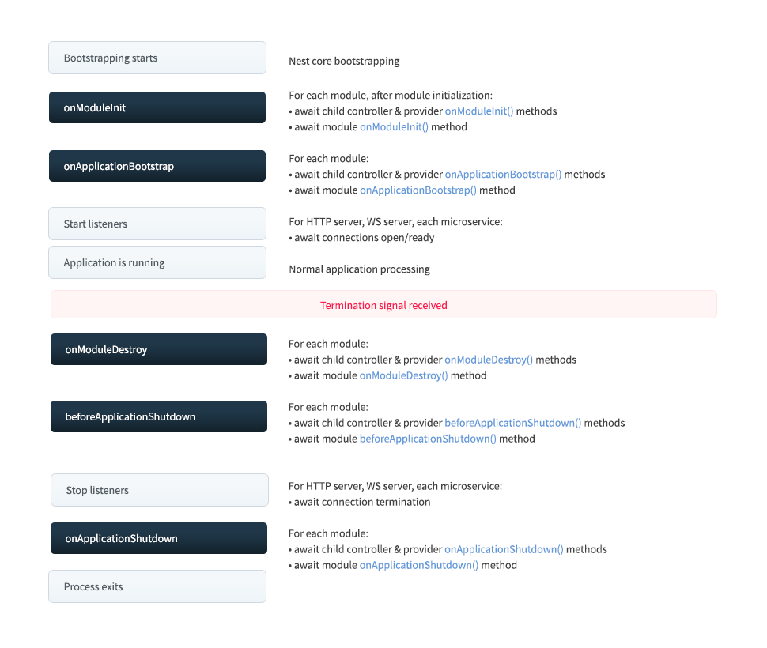

# Bonus 01: Request Lifecycle & NestJS Fundamentals nâng cao

> Tiên quyết: Lesson 05 (Provider & DI), Lesson 06 (Pipe), Lesson 08 (Interceptor, Exception Filter), Lesson 09 (JwtAuthGuard, `@CurrentUser()`), Lesson 10 (RolesGuard, `@Roles()`), Lesson 16 (Middleware, tổng hợp Request Lifecycle).

## Mục tiêu bài học

Sau bài này, học viên:

- **Giải thích được** thứ tự thực thi đầy đủ của một request, kể cả thứ tự giữa các cấp global → controller → route.
- **Giải thích được** DI container của NestJS resolve dependency như thế nào và vì sao lại có lỗi `Nest can't resolve dependencies`.
- **Viết được** custom provider với `useClass`, `useValue`, `useFactory`, `useExisting` và inject bằng token.
- **Chọn được** scope phù hợp (Singleton, Transient, Request) và nêu được chi phí hiệu năng của Request-scoped.
- **Cấu hình được** lifecycle hooks và `enableShutdownHooks()` để app khởi động/tắt an toàn (graceful shutdown).
- **Sử dụng được** `ArgumentsHost`, `ExecutionContext` và `Reflector` để đọc metadata trong guard/interceptor.
- **Viết được** custom pipe có tham số và custom pipe có inject dependency.
- **Thiết kế được** hệ thống exception gồm `BaseException`, mã lỗi chuẩn và nhiều Exception Filter.
- **Viết được** decorator tổng hợp `@Auth()` bằng `applyDecorators`.
- **Chọn đúng** giữa Middleware, Guard, Interceptor và Pipe cho một yêu cầu cụ thể.

## Ôn tập nhanh

Trong khóa chính, các khái niệm core được giới thiệu rải rác đúng lúc cần dùng: Provider và DI qua constructor ở Lesson 05; Pipe (`ParseIntPipe`, `ValidationPipe`) ở Lesson 06; `TransformInterceptor` bọc response thành `{ success, statusCode, data }` và `HttpExceptionFilter` chuẩn hóa lỗi ở Lesson 08; `JwtAuthGuard`, `@Public()` và param decorator `@CurrentUser()` ở Lesson 09; `@Roles()` với `SetMetadata`, `Reflector` và `RolesGuard` ở Lesson 10; cuối cùng Lesson 16 dạy Middleware và ghép tất cả thành một bức tranh Request Lifecycle. Bài này **không dạy lại** những phần đó mà đi vào những câu hỏi "tại sao" và "làm sao cho chuẩn" mà khi làm dự án thật bạn sẽ gặp.

---

## 1. Ôn lại Request Lifecycle (tổng hợp từ Lesson 16)

### 1.1. Bức tranh toàn cảnh

Lesson 16 đã cho thấy thứ tự Middleware → Guard → Interceptor → Pipe → Handler → Interceptor → Exception Filter. Ở mức nâng cao, cần bổ sung thêm một chi tiết: **mỗi loại thành phần có thể được gắn ở nhiều cấp** (global, controller, route, thậm chí từng tham số với Pipe), và NestJS chạy chúng theo một thứ tự cố định.

```text
Request
  │
  ▼
Middleware      app.use() (global)  →  consumer.apply() trong module
  │
  ▼
Guards          global  →  controller  →  route
  │
  ▼
Interceptors    global  →  controller  →  route        (phần "before" next.handle())
  │
  ▼
Pipes           global  →  controller  →  route  →  param
  │
  ▼
Handler         Controller → Service → Repository (TypeORM)
  │
  ▼
Interceptors    route  →  controller  →  global        (phần "after", chạy NGƯỢC lại)
  │
  ▼
Response

Nếu bất kỳ bước nào throw exception:
Exception Filters   route  →  controller  →  global    (chỉ MỘT filter xử lý, không "chảy" tiếp)
```


### 1.2. Hai quy tắc cần nhớ

**Interceptor giống như củ hành**: interceptor nào vào trước thì ra sau. Nếu bạn có `LoggingInterceptor` global và `TransformInterceptor` ở controller, thì khi response đi ra, `TransformInterceptor` bọc dữ liệu trước, rồi `LoggingInterceptor` mới thấy dữ liệu đã bọc.

**Exception Filter đi từ cụ thể đến chung**: NestJS tìm filter ở route trước, rồi controller, rồi global. Filter đầu tiên có `@Catch()` khớp với loại exception sẽ xử lý, các filter còn lại bị bỏ qua. Quy tắc này rất quan trọng khi ta đăng ký nhiều filter ở mục 6.

Giả sử route `GET /books` có đủ các thành phần, console sẽ in theo thứ tự:

```text
[Middleware] GET /books
[Guard]      JwtAuthGuard (global) → RolesGuard (route)
[Interceptor before] LoggingInterceptor (global) → TransformInterceptor (controller)
[Pipe]       ParseSortPipe (param)
[Handler]    BooksController.findAll
[Interceptor after]  TransformInterceptor → LoggingInterceptor
```

---

## 2. Dependency Injection nâng cao

### 2.1. DI container hoạt động thế nào

Ở Lesson 05 ta chỉ cần viết `constructor(private readonly booksService: BooksService)` và "mọi thứ tự chạy". Phía sau, khi gọi `NestFactory.create(AppModule)`, DI container thực hiện các bước:

1. **Quét module tree**: bắt đầu từ `AppModule`, đi theo `imports` để biết ứng dụng có những module nào, mỗi module có `providers`, `controllers`, `exports` gì.
2. **Đọc dependency của từng class**: nhờ `emitDecoratorMetadata` (Lesson 02), TypeScript lưu kiểu tham số constructor vào metadata `design:paramtypes`. Container đọc metadata này để biết `BooksService` cần `Repository<Book>`.
3. **Tìm provider theo token**: mỗi provider được đăng ký dưới một **token** (khóa). Mặc định token chính là class. Container chỉ tìm trong **phạm vi module**: provider của chính module đó + provider được `exports` từ các module mà nó `imports`.
4. **Khởi tạo từ lá lên gốc**: tạo các dependency không phụ thuộc gì trước, rồi đến class cần chúng. Instance được **cache** lại (singleton), lần inject sau dùng lại.

```text
BooksModule
 ├─ imports: TypeOrmModule.forFeature([Book])  ──exports──►  token: getRepositoryToken(Book)
 ├─ providers: [BooksService]                   BooksService cần token getRepositoryToken(Book) ✔
 └─ controllers: [BooksController]              BooksController cần token BooksService ✔

Container (cache):
  getRepositoryToken(Book)  →  Repository<Book> instance   (tạo trước)
  BooksService              →  BooksService instance       (tạo sau)
```

Hiểu được bước 3 là bạn đọc được lỗi kinh điển `Nest can't resolve dependencies of the BooksService (?). Please make sure that the argument at index [0] is available in the BooksModule context`: container không tìm thấy token ở vị trí tham số thứ 0 trong phạm vi `BooksModule`, thường do quên `imports` hoặc module kia quên `exports`.

Một điều thú vị: `@InjectRepository(Book)` mà ta dùng từ Lesson 06 thực chất chỉ là `@Inject(getRepositoryToken(Book))`, tức là inject bằng một token tùy chỉnh. Đó chính là cửa ngõ vào custom providers.

### 2.2. Custom providers: `useClass`, `useValue`, `useFactory`, `useExisting`

Khi viết `providers: [BooksService]`, NestJS hiểu thành dạng đầy đủ `{ provide: BooksService, useClass: BooksService }`. Dạng đầy đủ cho phép ta **tách token khỏi cách tạo instance**, có 4 kiểu:

| Kiểu | Container làm gì | Dùng khi |
|---|---|---|
| `useClass` | Tạo instance từ class được chỉ định | Đổi implementation theo môi trường (local/S3) |
| `useValue` | Dùng nguyên giá trị có sẵn | Hằng số, config tĩnh, mock khi test (Lesson 15) |
| `useFactory` | Gọi hàm, lấy giá trị trả về (hỗ trợ `async`) | Giá trị phụ thuộc provider khác, ví dụ `ConfigService` |
| `useExisting` | Tạo alias trỏ tới provider đã có | Một instance, nhiều tên gọi |

Với token không phải class (string/symbol), ta phải dùng `@Inject(TOKEN)` vì TypeScript không có kiểu runtime nào để container dựa vào. Nên dùng `Symbol` hoặc hằng số đặt trong file riêng để tránh gõ sai chuỗi.

```typescript
// src/modules/books/books.constants.ts
export const BOOKS_CONFIG = Symbol('BOOKS_CONFIG');
export const BOOKS_GENRES = Symbol('BOOKS_GENRES');

export interface BooksConfig {
  defaultPageSize: number;
  maxPageSize: number;
}
```

```typescript
// src/modules/storage/storage.service.ts
// Dùng abstract class làm token: interface bị xóa khi compile (Lesson 02), abstract class thì không
export abstract class StorageService {
  abstract upload(file: Express.Multer.File): Promise<string>; // trả về URL file
}
// LocalStorageService và S3StorageService (Lesson 14) đều extends StorageService
```

```typescript
// src/modules/books/books.module.ts
import { Module } from '@nestjs/common';
import { ConfigService } from '@nestjs/config';
import { TypeOrmModule } from '@nestjs/typeorm';
import { Book } from './entities/book.entity';
import { BooksController } from './books.controller';
import { BooksService } from './books.service';
import { BOOKS_CONFIG, BOOKS_GENRES, BooksConfig } from './books.constants';
import { StorageService } from '../storage/storage.service';
import { LocalStorageService } from '../storage/local-storage.service';
import { S3StorageService } from '../storage/s3-storage.service';

@Module({
  imports: [TypeOrmModule.forFeature([Book])],
  controllers: [BooksController],
  providers: [
    BooksService,

    // useValue: giá trị tĩnh
    { provide: BOOKS_GENRES, useValue: ['Programming', 'Novel', 'Science'] },

    // useFactory: giá trị tính từ provider khác, khai báo dependency trong `inject`
    {
      provide: BOOKS_CONFIG,
      useFactory: (config: ConfigService): BooksConfig => ({
        defaultPageSize: config.get<number>('BOOKS_DEFAULT_PAGE_SIZE', 10),
        maxPageSize: config.get<number>('BOOKS_MAX_PAGE_SIZE', 50),
      }),
      inject: [ConfigService],
    },

    // useClass: cùng token StorageService, implementation đổi theo môi trường
    {
      provide: StorageService,
      useClass: process.env.NODE_ENV === 'production' ? S3StorageService : LocalStorageService,
    },

    // useExisting: 'FILE_STORAGE' là alias, trỏ tới CÙNG instance với StorageService
    { provide: 'FILE_STORAGE', useExisting: StorageService },
  ],
})
export class BooksModule {}
```

```typescript
// src/modules/books/books.service.ts
import { Inject, Injectable } from '@nestjs/common';
import { InjectRepository } from '@nestjs/typeorm';
import { Repository } from 'typeorm';
import { Book } from './entities/book.entity';
import { BOOKS_CONFIG, BOOKS_GENRES, BooksConfig } from './books.constants';
import { StorageService } from '../storage/storage.service';

@Injectable()
export class BooksService {
  constructor(
    @InjectRepository(Book) private readonly booksRepository: Repository<Book>,
    @Inject(BOOKS_CONFIG) private readonly config: BooksConfig, // token symbol → bắt buộc @Inject
    @Inject(BOOKS_GENRES) private readonly genres: string[],
    private readonly storage: StorageService, // token là abstract class → không cần @Inject
  ) {}

  getPageSize(requested?: number): number {
    return Math.min(requested ?? this.config.defaultPageSize, this.config.maxPageSize);
  }
}
```

`useFactory` còn có thể là hàm `async`: container sẽ `await` kết quả trước khi khởi tạo các class phụ thuộc. Đây chính là cơ chế đứng sau `TypeOrmModule.forRootAsync({ useFactory, inject: [ConfigService] })` bạn đã dùng ở Lesson 06.

### 2.3. Scope của Providers: Singleton, Transient, Request-scoped

| Scope | Số instance | Ghi chú |
|---|---|---|
| `Scope.DEFAULT` (Singleton) | 1 cho cả ứng dụng | Mặc định, nhanh nhất, dùng cho 95% trường hợp |
| `Scope.TRANSIENT` | 1 cho **mỗi nơi inject** | Mỗi consumer có bản riêng, được tạo 1 lần khi consumer được tạo |
| `Scope.REQUEST` | 1 cho **mỗi request** | Bị hủy sau khi request xong, inject được `REQUEST` |

Ví dụ Transient điển hình là logger: mỗi service muốn một logger có context riêng.

```typescript
// src/common/logger/app-logger.service.ts
import { ConsoleLogger, Injectable, Scope } from '@nestjs/common';

@Injectable({ scope: Scope.TRANSIENT }) // BooksService và UsersService mỗi bên nhận một instance riêng
export class AppLogger extends ConsoleLogger {}

// Trong BooksService: constructor(private readonly logger: AppLogger) { this.logger.setContext(BooksService.name); }
```

Ví dụ Request-scoped: một service giữ thông tin riêng của request hiện tại.

```typescript
// src/common/context/request-context.service.ts
import { Inject, Injectable, Scope } from '@nestjs/common';
import { REQUEST } from '@nestjs/core';
import { Request } from 'express';

@Injectable({ scope: Scope.REQUEST })
export class RequestContextService {
  constructor(@Inject(REQUEST) private readonly request: Request) {}

  get requestId(): string {
    return String(this.request.headers['x-request-id'] ?? 'unknown'); // header do middleware Lesson 16 gắn
  }
}
```

**Cảnh báo quan trọng — scope "lan ngược" lên chuỗi inject.** Nếu `BooksService` inject `RequestContextService` (Request-scoped), thì `BooksService` cũng **trở thành Request-scoped**, và `BooksController` inject `BooksService` cũng thành Request-scoped theo:

```text
RequestContextService (REQUEST)
      ▲ inject
BooksService           → bị ép thành REQUEST
      ▲ inject
BooksController        → bị ép thành REQUEST
=> Mỗi request NestJS phải tạo mới cả chuỗi 3 instance, rồi để GC dọn
```

Hệ quả: tốn CPU/bộ nhớ cho mỗi request, throughput giảm, và **lifecycle hooks (mục 3) không được gọi** với provider Request-scoped. Transient thì không lan ngược như vậy. Lời khuyên: giữ Singleton; khi chỉ cần truyền vài giá trị theo request (userId, requestId), hãy truyền qua tham số hàm, hoặc dùng `AsyncLocalStorage` (package `nestjs-cls` là cách phổ biến) thay vì Request scope.

---

## 3. Lifecycle Events (lifecycle hooks)

Ngoài vòng đời của **request**, bản thân **ứng dụng** cũng có vòng đời: khởi động, chạy, tắt. NestJS cho phép gắn logic vào từng mốc bằng cách implement các interface tương ứng. Xem thêm giải thích chi tiết từng hook: [Lifecycle Events](./lifecycle-event.md).



```text
KHỞI ĐỘNG  (NestFactory.create + app.listen)
  constructor()               ← chỉ để nhận dependency, không async
  onModuleInit()              ← từng module, module được import chạy trước
  onApplicationBootstrap()    ← khi MỌI module đã init xong
  app.listen()                ← bắt đầu nhận request

TẮT  (SIGTERM / SIGINT / app.close())
  onModuleDestroy()
  beforeApplicationShutdown(signal)
  (đóng HTTP server, connection)
  onApplicationShutdown(signal)
```

Mọi hook đều có thể là `async`, NestJS sẽ `await` xong mới sang bước tiếp theo.

### 3.1. `OnModuleInit`, `OnApplicationBootstrap`

- `onModuleInit()`: dependency của module đã sẵn sàng. Phù hợp để kiểm tra config, chuẩn bị tài nguyên riêng của module.
- `onApplicationBootstrap()`: toàn bộ app đã init, sắp nhận request. Phù hợp để warm cache, khởi động job nền.

Vì sao không làm trong `constructor`? Constructor không thể `await`, và lúc đó chưa chắc các module khác đã sẵn sàng.

```typescript
// src/modules/books/books-cache-warmer.service.ts
import { Inject, Injectable, Logger, OnApplicationBootstrap, OnModuleInit } from '@nestjs/common';
import { CACHE_MANAGER } from '@nestjs/cache-manager';
import { Cache } from 'cache-manager';
import { InjectRepository } from '@nestjs/typeorm';
import { Repository } from 'typeorm';
import { Book } from './entities/book.entity';
import { BOOKS_CONFIG, BooksConfig } from './books.constants';

@Injectable()
export class BooksCacheWarmer implements OnModuleInit, OnApplicationBootstrap {
  private readonly logger = new Logger(BooksCacheWarmer.name);

  constructor(
    @Inject(BOOKS_CONFIG) private readonly config: BooksConfig,
    @Inject(CACHE_MANAGER) private readonly cache: Cache, // Redis store từ Lesson 13
    @InjectRepository(Book) private readonly booksRepository: Repository<Book>,
  ) {}

  onModuleInit(): void {
    // Fail fast: config sai thì dừng app ngay lúc khởi động, không đợi tới lúc có request
    if (this.config.maxPageSize < this.config.defaultPageSize) {
      throw new Error('BOOKS_MAX_PAGE_SIZE phải >= BOOKS_DEFAULT_PAGE_SIZE');
    }
  }

  async onApplicationBootstrap(): Promise<void> {
    // Warm cache: request đầu tiên không phải chờ query DB
    const total = await this.booksRepository.count();
    await this.cache.set('books:count', total, 60_000);
    this.logger.log(`Warmed cache books:count = ${total}`);
  }
}
```

### 3.2. `OnModuleDestroy`, `BeforeApplicationShutdown`, `OnApplicationShutdown`

Khi app tắt (deploy bản mới, `docker stop`, PM2 restart ở Lesson 16), ta cần **graceful shutdown**: xử lý nốt việc dang dở, đóng kết nối gọn gàng. Ví dụ: một service gom audit log trong bộ nhớ và ghi xuống PostgreSQL theo lô mỗi 5 giây. Nếu app tắt đột ngột, log trong bộ nhớ sẽ mất.

- `onModuleDestroy()`: dừng nhận việc mới (clear timer, unsubscribe).
- `beforeApplicationShutdown(signal)`: xử lý nốt việc còn lại, lúc này kết nối DB **vẫn còn mở**.
- `onApplicationShutdown(signal)`: connection đã đóng, chỉ nên log hoặc dọn tài nguyên ngoài.

```typescript
// src/modules/audit/audit-log.service.ts
import {
  BeforeApplicationShutdown, Injectable, Logger, OnApplicationShutdown, OnModuleDestroy, OnModuleInit,
} from '@nestjs/common';
import { InjectRepository } from '@nestjs/typeorm';
import { Repository } from 'typeorm';
import { AuditLog } from './entities/audit-log.entity';

@Injectable()
export class AuditLogService
  implements OnModuleInit, OnModuleDestroy, BeforeApplicationShutdown, OnApplicationShutdown
{
  private readonly logger = new Logger(AuditLogService.name);
  private buffer: Pick<AuditLog, 'action' | 'userId'>[] = [];
  private timer?: NodeJS.Timeout;

  constructor(@InjectRepository(AuditLog) private readonly auditRepository: Repository<AuditLog>) {}

  record(action: string, userId: number): void {
    this.buffer.push({ action, userId }); // chỉ đẩy vào bộ nhớ, rất nhanh
  }

  onModuleInit(): void {
    this.timer = setInterval(() => void this.flush(), 5_000);
  }

  onModuleDestroy(): void {
    clearInterval(this.timer); // 1. ngừng lịch flush định kỳ
  }

  async beforeApplicationShutdown(signal?: string): Promise<void> {
    this.logger.log(`Nhận ${signal ?? 'app.close()'}, flush ${this.buffer.length} log còn lại`);
    await this.flush(); // 2. DB vẫn còn kết nối, ghi nốt
  }

  onApplicationShutdown(): void {
    this.logger.log('Audit log đã tắt an toàn'); // 3. connection đã đóng
  }

  private async flush(): Promise<void> {
    if (this.buffer.length === 0) return;
    const batch = this.buffer;
    this.buffer = [];
    await this.auditRepository.insert(batch);
  }
}
```

### 3.3. `enableShutdownHooks()`

Ba hook tắt ở trên **mặc định không chạy khi process nhận tín hiệu hệ điều hành**. Chúng chỉ chạy khi bạn tự gọi `app.close()`, hoặc khi bật lắng nghe tín hiệu:

```typescript
// src/main.ts
async function bootstrap(): Promise<void> {
  const app = await NestFactory.create(AppModule);
  app.enableShutdownHooks(); // lắng nghe SIGTERM, SIGINT... để gọi các hook tắt
  await app.listen(process.env.PORT ?? 3000);
}
void bootstrap();
```

Lưu ý: tính năng này tốn thêm listener nên mặc định tắt; `docker stop` gửi `SIGTERM` rồi chờ khoảng 10 giây trước khi kill cứng, vì vậy hook tắt nên hoàn thành nhanh; trên Windows, `SIGTERM` gần như không dùng được, khi dev hãy test bằng `Ctrl+C` (`SIGINT`). Kết nối TypeORM do `TypeOrmModule` tự đóng trong hook của nó, bạn không cần tự đóng.

---

## 4. ExecutionContext

### 4.1. `ArgumentsHost` vs `ExecutionContext`

NestJS chạy được trên nhiều loại transport: HTTP, WebSocket, microservice (RPC), GraphQL. Để guard, interceptor, filter viết một lần mà dùng được nhiều nơi, NestJS không đưa thẳng `req`/`res` của Express mà bọc chúng trong một object trừu tượng.

- **`ArgumentsHost`**: bọc **các tham số** của handler. Với HTTP là `[req, res, next]`. Có `getArgs()`, `getArgByIndex()`, `getType()` và các hàm `switchToHttp()`, `switchToWs()`, `switchToRpc()`. **Exception Filter** nhận `ArgumentsHost`.
- **`ExecutionContext`**: kế thừa `ArgumentsHost` và thêm 2 hàm `getClass()` (controller class) và `getHandler()` (method sắp chạy). **Guard, Interceptor, `createParamDecorator`** nhận `ExecutionContext`.

Tại sao filter chỉ có `ArgumentsHost`? Vì exception có thể xảy ra ở nơi chưa xác định được handler; filter chỉ cần biết request/response để trả lỗi.

### 4.2. HTTP context và switching context

`getType()` trả về `'http'`, `'ws'` hoặc `'rpc'`, giúp code xử lý đúng từng loại. `switchToHttp()` trả về object có `getRequest<T>()`, `getResponse<T>()`, `getNext()`. Nên truyền kiểu generic để TypeScript strict hiểu đúng kiểu. Ví dụ interceptor log cả tên handler, điều mà middleware không làm được:

```typescript
// src/common/interceptors/logging.interceptor.ts
import { CallHandler, ExecutionContext, Injectable, Logger, NestInterceptor } from '@nestjs/common';
import { Request } from 'express';
import { Observable, tap } from 'rxjs';

@Injectable()
export class LoggingInterceptor implements NestInterceptor {
  private readonly logger = new Logger('HTTP');

  intercept(context: ExecutionContext, next: CallHandler): Observable<unknown> {
    if (context.getType() !== 'http') return next.handle(); // WebSocket/RPC: bỏ qua

    const req = context.switchToHttp().getRequest<Request>();
    // getClass()/getHandler() trả về class và function thật → lấy được tên
    const handler = `${context.getClass().name}.${context.getHandler().name}`; // "BooksController.findAll"
    const start = Date.now();

    return next.handle().pipe(
      tap(() => this.logger.log(`${req.method} ${req.url} → ${handler} (${Date.now() - start}ms)`)),
    );
  }
}
```

### 4.3. `getHandler()` / `getClass()` kết hợp `Reflector`

Sức mạnh thật sự của `getHandler()`/`getClass()` là dùng làm **target để đọc metadata** mà decorator đã gắn. Lesson 10 đã dùng `reflector.getAllAndOverride()` trong `RolesGuard`. `Reflector` có 3 cách đọc:

| Hàm | Hành vi | Ví dụ dùng |
|---|---|---|
| `get(key, target)` | Đọc ở đúng 1 target | Chỉ quan tâm metadata trên method |
| `getAllAndOverride(key, [handler, class])` | Lấy giá trị đầu tiên tìm thấy, method **ghi đè** class | `@Public()`, `@Roles()` |
| `getAllAndMerge(key, [handler, class])` | **Gộp** mảng/object ở cả 2 cấp | Class yêu cầu `admin`, method thêm `moderator` |

Không chỉ guard, **interceptor cũng đọc được metadata**. Ví dụ: `TransformInterceptor` của Lesson 08 bọc mọi response, nhưng route tải file hay health check thì không nên bọc. Ta tạo `@SkipTransform()`:

```typescript
// src/common/decorators/skip-transform.decorator.ts
import { SetMetadata } from '@nestjs/common';

export const SKIP_TRANSFORM_KEY = 'skipTransform';
export const SkipTransform = () => SetMetadata(SKIP_TRANSFORM_KEY, true);
```

```typescript
// src/common/interceptors/transform.interceptor.ts
import { CallHandler, ExecutionContext, Injectable, NestInterceptor } from '@nestjs/common';
import { Reflector } from '@nestjs/core';
import { Response } from 'express';
import { Observable, map } from 'rxjs';
import { SKIP_TRANSFORM_KEY } from '../decorators/skip-transform.decorator';

export interface SuccessResponse<T> {
  success: true;
  statusCode: number;
  data: T;
}

@Injectable()
export class TransformInterceptor<T> implements NestInterceptor<T, SuccessResponse<T> | T> {
  constructor(private readonly reflector: Reflector) {}

  intercept(context: ExecutionContext, next: CallHandler<T>): Observable<SuccessResponse<T> | T> {
    const skip = this.reflector.getAllAndOverride<boolean>(SKIP_TRANSFORM_KEY, [
      context.getHandler(),
      context.getClass(),
    ]);
    if (skip) return next.handle(); // trả nguyên dữ liệu

    return next.handle().pipe(
      map((data) => ({
        success: true as const,
        statusCode: context.switchToHttp().getResponse<Response>().statusCode,
        data,
      })),
    );
  }
}
```

```typescript
// src/main.ts (trích)
// Interceptor giờ cần Reflector → lấy từ container thay vì new không tham số
app.useGlobalInterceptors(new TransformInterceptor(app.get(Reflector)));
```

---

## 5. Custom Pipe

Lesson 06 đã dùng pipe có sẵn. Một custom pipe chỉ cần implement `PipeTransform<In, Out>` với hàm `transform(value, metadata)`. Tham số `metadata: ArgumentMetadata` cho biết giá trị đến từ đâu: `type` (`'body' | 'query' | 'param' | 'custom'`), `data` (tên field, ví dụ `'id'` trong `@Param('id')`) và `metatype` (class/kiểu khai báo của tham số). Pipe **trả về giá trị mới** (transform) hoặc **throw exception** (validation). Các ví dụ cơ bản như `TrimPipe`, tự viết `ParseIntPipe` và custom validator `@IsISBN()`: xem chi tiết tại [Custom Pipe](./custom-pipe.md). Ở đây ta xem hai dạng nâng cao.

### 5.1. Pipe có tham số cấu hình

Query `?sort=title:desc` cần được kiểm tra field hợp lệ (tránh sort theo cột không có index hoặc cột nhạy cảm) và chuyển thành object cho TypeORM. Danh sách field hợp lệ khác nhau theo từng route, nên truyền qua constructor và khởi tạo bằng `new`:

```typescript
// src/common/pipes/parse-sort.pipe.ts
import { ArgumentMetadata, BadRequestException, PipeTransform } from '@nestjs/common';

export type SortOrder = 'ASC' | 'DESC';
export interface SortOption {
  field: string;
  order: SortOrder;
}

const isSortOrder = (value: string): value is SortOrder => value === 'ASC' || value === 'DESC';

// Không cần @Injectable: pipe này luôn được tạo bằng `new`, không nhờ DI
export class ParseSortPipe implements PipeTransform<string | undefined, SortOption | undefined> {
  constructor(private readonly allowedFields: readonly string[]) {}

  transform(value: string | undefined, metadata: ArgumentMetadata): SortOption | undefined {
    if (!value) return undefined; // không truyền sort → để service dùng mặc định

    const [field, rawOrder = 'asc'] = value.split(':');
    if (!this.allowedFields.includes(field)) {
      throw new BadRequestException(
        `Query "${metadata.data}" chỉ cho phép: ${this.allowedFields.join(', ')}`,
      );
    }
    const order = rawOrder.toUpperCase();
    if (!isSortOrder(order)) {
      throw new BadRequestException('Thứ tự sort phải là asc hoặc desc');
    }
    return { field, order };
  }
}
```

### 5.2. Pipe có inject dependency

Nhiều route `GET/PATCH/DELETE /books/:id` đều lặp lại đoạn "tìm sách theo id, không có thì 404". Pipe có thể inject `Repository<Book>` để biến `id` thành entity. Điểm mấu chốt: truyền **class** (không phải `new`) để NestJS tạo pipe qua DI container, trong phạm vi `BooksModule` (đã import `TypeOrmModule.forFeature([Book])`).

```typescript
// src/modules/books/pipes/book-by-id.pipe.ts
import { Injectable, PipeTransform } from '@nestjs/common';
import { InjectRepository } from '@nestjs/typeorm';
import { Repository } from 'typeorm';
import { Book } from '../entities/book.entity';
import { BookNotFoundException } from '../exceptions/book-not-found.exception';

@Injectable()
export class BookByIdPipe implements PipeTransform<number, Promise<Book>> {
  constructor(@InjectRepository(Book) private readonly booksRepository: Repository<Book>) {}

  async transform(id: number): Promise<Book> {
    const book = await this.booksRepository.findOneBy({ id });
    if (!book) throw new BookNotFoundException(id); // custom exception ở mục 6
    return book;
  }
}
```

```typescript
// src/modules/books/books.controller.ts (trích)
@Get()
findAll(
  @Query('sort', new ParseSortPipe(['title', 'pages', 'publishedYear', 'createdAt'])) sort?: SortOption,
) {
  return this.booksService.findAll(sort);
}

@Patch(':id')
update(
  // Pipe chạy lần lượt: ParseIntPipe ("5" → 5) rồi BookByIdPipe (5 → Book)
  @Param('id', ParseIntPipe, BookByIdPipe) book: Book,
  @Body() dto: UpdateBookDto,
) {
  return this.booksService.update(book, dto);
}
```

Chỉ nên dùng pipe truy vấn DB cho việc tra cứu đơn giản; logic nghiệp vụ (kiểm tra quyền sở hữu, trạng thái...) vẫn thuộc về service.

---

## 6. Custom Exception

Lesson 08 có một `HttpExceptionFilter` với `@Catch()` bắt tất cả. Khi dự án lớn dần, cách này có ba hạn chế: frontend chỉ có `statusCode` và `message` (một chuỗi tiếng Việt, không nên dùng để `if/else`), lỗi PostgreSQL rơi vào 500 kèm câu SQL thô, và lỗi JWT không phân biệt được "hết hạn" với "sai". Giải pháp là thêm **mã lỗi chuẩn** (`errorCode`) và tách thành nhiều filter chuyên biệt. Bộ code đầy đủ theo hướng tiếp cận khác có tại [Custom Exception](./custom-exception.md).

### 6.1. Thiết kế BaseException và mã lỗi chuẩn

`errorCode` là chuỗi ổn định, không đổi theo ngôn ngữ, frontend dựa vào đó để hiển thị thông báo hoặc xử lý (ví dụ nhận `TOKEN_EXPIRED` thì tự gọi refresh token như Lesson 09). Response lỗi mở rộng từ format của Lesson 08:

```json
{
  "success": false,
  "statusCode": 404,
  "errorCode": "BOOK_NOT_FOUND",
  "message": "Không tìm thấy sách với ID 99",
  "path": "/books/99",
  "timestamp": "2026-09-25T03:00:00.000Z"
}
```

```typescript
// src/common/exceptions/error-code.enum.ts
export enum ErrorCode {
  // Chung
  INTERNAL_ERROR = 'INTERNAL_ERROR',
  HTTP_ERROR = 'HTTP_ERROR',
  BAD_REQUEST = 'BAD_REQUEST',
  VALIDATION_FAILED = 'VALIDATION_FAILED',
  UNAUTHORIZED = 'UNAUTHORIZED',
  FORBIDDEN = 'FORBIDDEN',
  NOT_FOUND = 'NOT_FOUND',
  CONFLICT = 'CONFLICT',
  TOO_MANY_REQUESTS = 'TOO_MANY_REQUESTS',
  // Auth
  TOKEN_EXPIRED = 'TOKEN_EXPIRED',
  TOKEN_INVALID = 'TOKEN_INVALID',
  // Database
  DUPLICATE_RESOURCE = 'DUPLICATE_RESOURCE',
  FOREIGN_KEY_VIOLATION = 'FOREIGN_KEY_VIOLATION',
  DATABASE_ERROR = 'DATABASE_ERROR',
  // Books
  BOOK_NOT_FOUND = 'BOOK_NOT_FOUND',
  BOOK_ISBN_DUPLICATED = 'BOOK_ISBN_DUPLICATED',
}
```

```typescript
// src/common/exceptions/base.exception.ts
import { HttpException, HttpStatus } from '@nestjs/common';
import { ErrorCode } from './error-code.enum';

// Kế thừa HttpException → vẫn tương thích mọi cơ chế sẵn có của NestJS
export class BaseException extends HttpException {
  constructor(
    public readonly errorCode: ErrorCode,
    message: string,
    status: HttpStatus = HttpStatus.BAD_REQUEST,
    public readonly details?: unknown, // thông tin thêm, ví dụ danh sách field lỗi
  ) {
    super({ errorCode, message, details }, status);
  }
}
```

```typescript
// src/modules/books/exceptions/book-not-found.exception.ts
import { HttpStatus } from '@nestjs/common';
import { BaseException } from '../../../common/exceptions/base.exception';
import { ErrorCode } from '../../../common/exceptions/error-code.enum';

export class BookNotFoundException extends BaseException {
  constructor(id: number) {
    super(ErrorCode.BOOK_NOT_FOUND, `Không tìm thấy sách với ID ${id}`, HttpStatus.NOT_FOUND);
  }
}
```

Để 4 filter không lặp code, gom phần tạo response vào một hàm dùng chung:

```typescript
// src/common/filters/error-response.util.ts
import { ArgumentsHost } from '@nestjs/common';
import { Request, Response } from 'express';
import { ErrorCode } from '../exceptions/error-code.enum';

export interface ErrorResponse {
  success: false;
  statusCode: number;
  errorCode: ErrorCode;
  message: string;
  errors?: unknown;
  path: string;
  timestamp: string;
}

type ErrorBody = Pick<ErrorResponse, 'statusCode' | 'errorCode' | 'message' | 'errors'>;

export function sendError(host: ArgumentsHost, body: ErrorBody): void {
  const ctx = host.switchToHttp();
  const req = ctx.getRequest<Request>();
  const res = ctx.getResponse<Response>();
  const payload: ErrorResponse = { success: false, ...body, path: req.url, timestamp: new Date().toISOString() };
  res.status(body.statusCode).json(payload);
}
```

### 6.2. Nhiều Exception Filter: AllExceptions, Database, JWT

Mỗi filter chỉ `@Catch()` đúng loại lỗi của mình:

```text
Exception bị throw
   │
   ├─ JsonWebTokenError (jwtService.verifyAsync thất bại)  → JwtExceptionFilter      → 401 TOKEN_EXPIRED / TOKEN_INVALID
   ├─ QueryFailedError (lỗi PostgreSQL từ TypeORM)          → DatabaseExceptionFilter → 409 DUPLICATE_RESOURCE ...
   ├─ HttpException (BaseException, NotFound, Validation)   → HttpExceptionFilter     → giữ status, thêm errorCode
   └─ Mọi thứ còn lại (bug, TypeError...)                    → AllExceptionsFilter     → 500 INTERNAL_ERROR
```

```typescript
// src/common/filters/http-exception.filter.ts
import { ArgumentsHost, Catch, ExceptionFilter, HttpException, HttpStatus } from '@nestjs/common';
import { BaseException } from '../exceptions/base.exception';
import { ErrorCode } from '../exceptions/error-code.enum';
import { sendError } from './error-response.util';

const STATUS_TO_CODE: Partial<Record<number, ErrorCode>> = {
  [HttpStatus.BAD_REQUEST]: ErrorCode.BAD_REQUEST,
  [HttpStatus.UNAUTHORIZED]: ErrorCode.UNAUTHORIZED,
  [HttpStatus.FORBIDDEN]: ErrorCode.FORBIDDEN,
  [HttpStatus.NOT_FOUND]: ErrorCode.NOT_FOUND,
  [HttpStatus.CONFLICT]: ErrorCode.CONFLICT,
  [HttpStatus.TOO_MANY_REQUESTS]: ErrorCode.TOO_MANY_REQUESTS,
};

@Catch(HttpException)
export class HttpExceptionFilter implements ExceptionFilter {
  catch(exception: HttpException, host: ArgumentsHost): void {
    const statusCode = exception.getStatus();

    // 1. Exception của chính mình: đã có errorCode
    if (exception instanceof BaseException) {
      return sendError(host, {
        statusCode,
        errorCode: exception.errorCode,
        message: exception.message,
        errors: exception.details,
      });
    }

    // 2. Lỗi từ ValidationPipe: message là mảng string
    const body = exception.getResponse(); // string | object
    const message = typeof body === 'string' ? body : (body as { message?: string | string[] }).message;
    if (Array.isArray(message)) {
      return sendError(host, {
        statusCode,
        errorCode: ErrorCode.VALIDATION_FAILED,
        message: 'Dữ liệu đầu vào không hợp lệ',
        errors: message,
      });
    }

    // 3. Built-in exception khác (NotFoundException, ForbiddenException từ RolesGuard...)
    sendError(host, {
      statusCode,
      errorCode: STATUS_TO_CODE[statusCode] ?? ErrorCode.HTTP_ERROR,
      message: message ?? exception.message,
    });
  }
}
```

```typescript
// src/common/filters/database-exception.filter.ts
import { ArgumentsHost, Catch, ExceptionFilter, HttpStatus, Logger } from '@nestjs/common';
import { QueryFailedError } from 'typeorm';
import { ErrorCode } from '../exceptions/error-code.enum';
import { sendError } from './error-response.util';

// Mã lỗi của PostgreSQL: https://www.postgresql.org/docs/current/errcodes-appendix.html
const PG_UNIQUE_VIOLATION = '23505';
const PG_FOREIGN_KEY_VIOLATION = '23503';

@Catch(QueryFailedError)
export class DatabaseExceptionFilter implements ExceptionFilter {
  private readonly logger = new Logger(DatabaseExceptionFilter.name);

  catch(exception: QueryFailedError, host: ArgumentsHost): void {
    const pgError = exception.driverError as Error & { code?: string };

    switch (pgError.code) {
      case PG_UNIQUE_VIOLATION: // ví dụ: trùng cột isbn (unique) của bảng books
        return sendError(host, {
          statusCode: HttpStatus.CONFLICT,
          errorCode: ErrorCode.DUPLICATE_RESOURCE,
          message: 'Dữ liệu đã tồn tại',
        });
      case PG_FOREIGN_KEY_VIOLATION:
        return sendError(host, {
          statusCode: HttpStatus.CONFLICT,
          errorCode: ErrorCode.FOREIGN_KEY_VIOLATION,
          message: 'Dữ liệu đang được tham chiếu hoặc tham chiếu tới bản ghi không tồn tại',
        });
      default:
        this.logger.error(exception.message, exception.stack); // log đầy đủ ở server
        sendError(host, {
          statusCode: HttpStatus.INTERNAL_SERVER_ERROR,
          errorCode: ErrorCode.DATABASE_ERROR,
          message: 'Lỗi cơ sở dữ liệu', // KHÔNG trả câu SQL cho client
        });
    }
  }
}
```

Với JWT có hai tình huống. Khi route được bảo vệ bằng `JwtAuthGuard`, Passport tự chuyển lỗi thành `UnauthorizedException` chung chung, nên ta override `handleRequest()` để throw `BaseException` có mã rõ ràng. Còn khi bạn tự gọi `jwtService.verifyAsync()` (luồng refresh token ở Lesson 09), lỗi `TokenExpiredError`/`JsonWebTokenError` của thư viện `jsonwebtoken` (được cài kèm `@nestjs/jwt`) không phải `HttpException`, nếu không có filter riêng sẽ thành 500.

```typescript
// src/modules/auth/guards/jwt-auth.guard.ts (bổ sung vào guard của Lesson 09)
import { HttpStatus, Injectable } from '@nestjs/common';
import { AuthGuard } from '@nestjs/passport';
import { TokenExpiredError } from 'jsonwebtoken';
import { BaseException } from '../../../common/exceptions/base.exception';
import { ErrorCode } from '../../../common/exceptions/error-code.enum';

@Injectable()
export class JwtAuthGuard extends AuthGuard('jwt') {
  // ... canActivate() kiểm tra @Public() giữ nguyên như Lesson 09

  handleRequest<TUser = unknown>(err: unknown, user: TUser | false, info: unknown): TUser {
    if (info instanceof TokenExpiredError) {
      throw new BaseException(ErrorCode.TOKEN_EXPIRED, 'Token đã hết hạn', HttpStatus.UNAUTHORIZED);
    }
    if (err || !user) {
      throw new BaseException(ErrorCode.TOKEN_INVALID, 'Token không hợp lệ hoặc bị thiếu', HttpStatus.UNAUTHORIZED);
    }
    return user;
  }
}
```

```typescript
// src/common/filters/jwt-exception.filter.ts
import { ArgumentsHost, Catch, ExceptionFilter, HttpStatus } from '@nestjs/common';
import { JsonWebTokenError, TokenExpiredError } from 'jsonwebtoken';
import { ErrorCode } from '../exceptions/error-code.enum';
import { sendError } from './error-response.util';

@Catch(JsonWebTokenError) // TokenExpiredError kế thừa JsonWebTokenError → bắt được cả hai
export class JwtExceptionFilter implements ExceptionFilter {
  catch(exception: JsonWebTokenError, host: ArgumentsHost): void {
    const expired = exception instanceof TokenExpiredError;
    sendError(host, {
      statusCode: HttpStatus.UNAUTHORIZED,
      errorCode: expired ? ErrorCode.TOKEN_EXPIRED : ErrorCode.TOKEN_INVALID,
      message: expired ? 'Token đã hết hạn' : 'Token không hợp lệ',
    });
  }
}
```

```typescript
// src/common/filters/all-exceptions.filter.ts
import { ArgumentsHost, Catch, ExceptionFilter, HttpStatus, Logger } from '@nestjs/common';
import { ErrorCode } from '../exceptions/error-code.enum';
import { sendError } from './error-response.util';

@Catch() // không tham số = lưới an toàn cuối cùng cho mọi lỗi chưa filter nào nhận
export class AllExceptionsFilter implements ExceptionFilter {
  private readonly logger = new Logger(AllExceptionsFilter.name);

  catch(exception: unknown, host: ArgumentsHost): void {
    this.logger.error(exception instanceof Error ? exception.stack : String(exception));

    const isProduction = process.env.NODE_ENV === 'production';
    sendError(host, {
      statusCode: HttpStatus.INTERNAL_SERVER_ERROR,
      errorCode: ErrorCode.INTERNAL_ERROR,
      // Production: giấu chi tiết lỗi nội bộ; development: hiện message để debug
      message: !isProduction && exception instanceof Error ? exception.message : 'Internal server error',
    });
  }
}
```

### 6.3. Đăng ký và thứ tự filter

Với filter global, NestJS kiểm tra **từ filter đăng ký sau cùng ngược về đầu**, filter nào có `@Catch()` khớp trước thì xử lý. Vì vậy filter "bắt tất cả" phải đặt **đầu tiên**, filter cụ thể đặt sau:

```typescript
// src/main.ts (trích)
app.useGlobalFilters(
  new AllExceptionsFilter(),     // chung nhất → đặt ĐẦU (được kiểm tra CUỐI)
  new HttpExceptionFilter(),
  new DatabaseExceptionFilter(),
  new JwtExceptionFilter(),      // cụ thể → đặt sau (được kiểm tra trước)
);
```

Nếu đặt `AllExceptionsFilter` ở cuối danh sách, nó sẽ được kiểm tra đầu tiên và "nuốt" mọi lỗi, kể cả 404, thành 500. Lưu ý file [custom-exception.md](./custom-exception.md) đặt `AllExceptionsFilter` cuối danh sách, khi áp dụng hãy đổi lại theo thứ tự ở trên. Nếu filter cần inject dependency (ví dụ `ConfigService`), có thể đăng ký qua provider `{ provide: APP_FILTER, useClass: ... }` trong `AppModule` thay vì `new`.

---

## 7. Custom Decorators nâng cao

Hai loại decorator đã quen thuộc: decorator gắn metadata (`@Roles()`, `@Public()` bằng `SetMetadata`) và param decorator (`@CurrentUser()` bằng `createParamDecorator`). Có thể nâng cấp `@CurrentUser()` để nhận tên field có kiểm tra kiểu:

```typescript
// src/modules/auth/decorators/current-user.decorator.ts
import { createParamDecorator, ExecutionContext } from '@nestjs/common';
import { Request } from 'express';
import { Role } from '../types/role.enum';

export interface JwtUser {
  userId: number;
  email: string;
  role: Role; // đúng với object JwtStrategy.validate() trả về ở Lesson 09
}

export const CurrentUser = createParamDecorator(
  (field: keyof JwtUser | undefined, ctx: ExecutionContext) => {
    const user = ctx.switchToHttp().getRequest<Request & { user?: JwtUser }>().user;
    return field ? user?.[field] : user;
  },
);
// Dùng: @CurrentUser() user: JwtUser   hoặc   @CurrentUser('userId') userId: number
// Gõ sai @CurrentUser('userid') → TypeScript báo lỗi ngay
```

NestJS còn có `Reflector.createDecorator<T>()` để tạo decorator metadata có kiểu mà không cần tự khai báo key, ví dụ `export const Roles = Reflector.createDecorator<Role[]>()` rồi đọc bằng `this.reflector.get(Roles, context.getHandler())`. Cách `SetMetadata` của Lesson 10 vẫn hoàn toàn đúng, bạn chọn một kiểu và dùng thống nhất.

### 7.1. Kết hợp nhiều decorator với `applyDecorators`

Trong `BooksController`, mỗi route cần quyền admin phải viết lặp lại ba bốn decorator:

```typescript
@UseGuards(JwtAuthGuard, RolesGuard)
@Roles(Role.ADMIN)
@ApiBearerAuth()
@Delete(':id')
```

`applyDecorators()` gộp nhiều decorator thành một. Ta tạo `@Auth(...roles)`:

```typescript
// src/modules/auth/decorators/auth.decorator.ts
import { applyDecorators, UseGuards } from '@nestjs/common';
import { ApiBearerAuth } from '@nestjs/swagger'; // học ở Bonus 02, bỏ dòng này nếu chưa cài Swagger
import { JwtAuthGuard } from '../guards/jwt-auth.guard';
import { RolesGuard } from '../guards/roles.guard';
import { Roles } from './roles.decorator';
import { Role } from '../types/role.enum';

export function Auth(...roles: Role[]) {
  const decorators: Array<ClassDecorator | MethodDecorator> = [
    UseGuards(JwtAuthGuard, RolesGuard), // thứ tự quan trọng: xác thực trước, phân quyền sau
    ApiBearerAuth(),                     // Swagger hiện ổ khóa cho route này
  ];
  // Chỉ gắn @Roles khi có truyền role. Nếu gắn Roles() rỗng → metadata là []
  // → RolesGuard thấy mảng rỗng là "có yêu cầu", [].some() = false → chặn mọi người
  if (roles.length > 0) decorators.push(Roles(...roles));
  return applyDecorators(...decorators);
}
```

```typescript
// src/modules/books/books.controller.ts (trích)
@Controller('books')
export class BooksController {
  @Get()
  findAll() { /* public */ }

  @Post()
  @Auth(Role.ADMIN, Role.MODERATOR) // chỉ admin/moderator tạo sách
  create(@Body() dto: CreateBookDto, @CurrentUser('userId') userId: number) {
    return this.booksService.create(dto, userId);
  }

  @Get('me/favorites')
  @Auth() // chỉ cần đăng nhập, không yêu cầu role
  myFavorites(@CurrentUser() user: JwtUser) {
    return this.booksService.findFavorites(user.userId);
  }
}
```

Lưu ý: nếu project đã đăng ký `JwtAuthGuard` và `RolesGuard` là `APP_GUARD` toàn cục (Lesson 10), **đừng** đưa `UseGuards` vào `@Auth()` nữa, vì guard sẽ chạy hai lần. Khi đó `@Auth()` chỉ nên gộp `Roles(...)` và `ApiBearerAuth()`.

---

## 8. Middleware vs Guard vs Interceptor vs Pipe: khi nào dùng cái nào?

Cả bốn đều "chen vào" luồng request, nên người mới hay chọn nhầm. Khác biệt cốt lõi nằm ở **thời điểm chạy** và **thông tin mà mỗi loại biết được**:

| | Middleware | Guard | Interceptor | Pipe |
|---|---|---|---|---|
| Chạy lúc | Sớm nhất, trước khi route được xác định | Sau middleware, trước handler | Bao quanh handler (trước + sau) | Ngay trước handler, cho từng tham số |
| Biết handler nào sẽ chạy? | Không (không có `ExecutionContext`) | Có | Có | Không cần, chỉ biết `ArgumentMetadata` |
| Đọc metadata decorator? | Không | Có (`Reflector`) | Có (`Reflector`) | Không |
| DI | Có (class middleware) | Có | Có | Có (khi truyền class) |
| Chặn request | Không gọi `next()` / trả response | Trả `false` / throw | Throw hoặc không gọi `next.handle()` | Throw |
| Sửa response | Hạn chế | Không | **Có** (`map`, `tap`) | Không |
| Ví dụ điển hình | request-id, log thô, helmet, cors | JWT, roles, API key | Bọc response, đo thời gian, cache, timeout | Parse/validate/transform input |

Mẹo chọn nhanh bằng cách tự hỏi:

1. **Việc này áp dụng cho mọi request, không quan tâm route nào?** → Middleware.
2. **Việc này quyết định request có được đi tiếp không, dựa trên danh tính/quyền?** → Guard.
3. **Việc này cần làm cả trước và sau handler, hoặc thay đổi kết quả trả về?** → Interceptor.
4. **Việc này chỉ liên quan đến một giá trị đầu vào cụ thể (param, query, body)?** → Pipe.
5. **Việc này là "định dạng lỗi trả về"?** → Exception Filter.

Ví dụ: "chặn user bị khóa tài khoản" là Guard (cần biết `request.user`, quyết định cho qua hay không); "đo thời gian xử lý từng handler" là Interceptor (cần tên handler và cả thời điểm trước/sau); "chuyển `?tags=a,b` thành mảng" là Pipe.

---

## Common mistakes

1. **Nhầm token hoặc quên export provider → `Nest can't resolve dependencies`.**
   Vì sao: container chỉ tìm token trong phạm vi module (provider của chính nó + exports của module được import). Với token `Symbol`/string mà quên `@Inject(TOKEN)`, TypeScript chỉ ghi kiểu `Object`, container không biết cần gì.
   Cách sửa: đọc kỹ thông báo lỗi (tên class + index tham số), kiểm tra `imports`/`exports`, và luôn dùng `@Inject()` cho token không phải class.

2. **Dùng `Scope.REQUEST` tùy tiện.**
   Vì sao: scope lan ngược lên mọi class inject nó, cả chuỗi controller/service bị tạo lại mỗi request, giảm hiệu năng và lifecycle hooks không chạy.
   Cách sửa: mặc định dùng Singleton; truyền dữ liệu theo request qua tham số hoặc `AsyncLocalStorage` (`nestjs-cls`).

3. **Đăng ký `AllExceptionsFilter` sai thứ tự.**
   Vì sao: filter global được kiểm tra từ cuối lên đầu; filter `@Catch()` đặt cuối sẽ bắt mọi thứ, 404/400 đều thành 500.
   Cách sửa: đặt filter bắt tất cả **đầu tiên** trong `useGlobalFilters()`, filter cụ thể phía sau.

4. **Viết logic async trong `constructor` hoặc quên `enableShutdownHooks()`.**
   Vì sao: constructor không `await` được, lỗi xảy ra không kiểm soát; không bật shutdown hooks thì khi `docker stop` các hook tắt không chạy, dữ liệu trong buffer bị mất.
   Cách sửa: constructor chỉ nhận dependency; logic khởi tạo đặt ở `onModuleInit`/`onApplicationBootstrap`; gọi `app.enableShutdownHooks()` trong `main.ts`.

5. **Tạo pipe/guard có dependency bằng `new`, hoặc gắn guard hai lần.**
   Vì sao: `new BookByIdPipe(...)` bỏ qua DI container, bạn phải tự truyền repository; còn `@Auth()` có `UseGuards` trong khi guard đã là `APP_GUARD` thì guard chạy lặp lại.
   Cách sửa: truyền **class** (`@Param('id', ParseIntPipe, BookByIdPipe)`); chọn một chiến lược guard duy nhất (global + `@Public()` hoặc theo route với `@Auth()`).

---

## Bài tập thực hành trên lớp

**Đề bài:** Trên project `books` API (PostgreSQL + TypeORM, đã có JWT từ Lesson 09 và RBAC từ Lesson 10), hãy:

1. Tạo `ErrorCode`, `BaseException`, `BookNotFoundException`, `sendError()` và 4 filter (`AllExceptions`, `HttpException`, `Database`, `Jwt`), đăng ký global đúng thứ tự.
2. Viết `BookByIdPipe` và áp dụng cho `GET`, `PATCH`, `DELETE /books/:id`.
3. Viết decorator `@Auth(...roles)` và áp dụng: `POST`, `PATCH` cho `admin`/`moderator`, `DELETE` chỉ `admin`.
4. Dùng Postman kiểm tra 5 kịch bản, mỗi kịch bản phải trả đúng `errorCode`:
   - `GET /books/9999` → 404 `BOOK_NOT_FOUND`
   - `POST /books` body thiếu `title` → 400 `VALIDATION_FAILED` kèm `errors`
   - `POST /books` hai lần cùng `isbn` → 409 `DUPLICATE_RESOURCE`
   - `DELETE /books/1` với token đã hết hạn → 401 `TOKEN_EXPIRED`
   - `DELETE /books/1` với token role `user` → 403 `FORBIDDEN`

**Gợi ý hướng giải:**

- Để test token hết hạn nhanh, tạm đặt `expiresIn: '10s'` trong `JwtModule.register()`.
- Làm từng filter một và test ngay, bắt đầu từ `HttpExceptionFilter` (dễ thấy kết quả nhất), cuối cùng mới thêm `AllExceptionsFilter`.
- Kịch bản 409 xảy ra vì cột `isbn` trong entity `Book` (Lesson 06) có `unique: true`; nếu service đã tự kiểm tra trùng ISBN thì hãy tạm comment đoạn đó để thấy lỗi đi từ PostgreSQL lên.
- Nếu `BookByIdPipe` báo không resolve được `BookRepository`, kiểm tra `BooksModule` đã `imports: [TypeOrmModule.forFeature([Book])]` chưa.

---

## Homework

- [ ] Viết `ParseSortPipe` như mục 5.1, áp dụng cho `GET /books`, và kết hợp với pagination của Lesson 07 (`order: { [sort.field]: sort.order }`).
- [ ] Chuyển `TransformInterceptor` sang dùng `Reflector`, tạo `@SkipTransform()` và áp dụng cho endpoint health check (Lesson 16).
- [ ] Tạo `AuditLogService` với đủ các hook ở mục 3.2, ghi log mỗi khi tạo/xóa sách; bật `enableShutdownHooks()`, bấm `Ctrl+C` và xác nhận log trong buffer vẫn được ghi xuống DB.
- [ ] Dùng `useClass` để chọn `LocalStorageService` hoặc `S3StorageService` (Lesson 14) theo biến môi trường `STORAGE_DRIVER`, dùng `useFactory` + `ConfigService` thay cho `process.env`.
- [ ] Viết `LoggingInterceptor` (mục 4.2) và giải thích bằng lời vì sao không thể lấy tên handler trong middleware.
- [ ] (Nâng cao) Gắn `requestId` vào mọi response lỗi: trước tiên làm bằng `RequestContextService` với `Scope.REQUEST`, đo throughput bằng `autocannon`; sau đó chuyển sang `nestjs-cls` (AsyncLocalStorage), đo lại và ghi nhận xét so sánh hai cách.

---

## Câu hỏi ôn tập

1. DI container dựa vào đâu để biết constructor của `BooksService` cần những gì? Vì sao với token dạng `Symbol` ta bắt buộc phải dùng `@Inject()`?
2. Phân biệt `useClass`, `useValue`, `useFactory`, `useExisting`, mỗi loại cho một ví dụ thực tế trong project `books`.
3. Điều gì xảy ra với `BooksController` nếu `BooksService` inject một provider `Scope.REQUEST`? Nêu hai hệ quả.
4. `ArgumentsHost` và `ExecutionContext` khác nhau thế nào? Vì sao Exception Filter chỉ nhận `ArgumentsHost`?
5. Có 4 global filter như mục 6.3. Một request ném `QueryFailedError` do trùng ISBN: filter nào xử lý, và vì sao `AllExceptionsFilter` không "nuốt" mất lỗi này?
